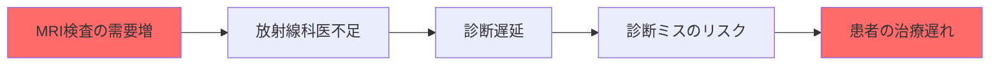
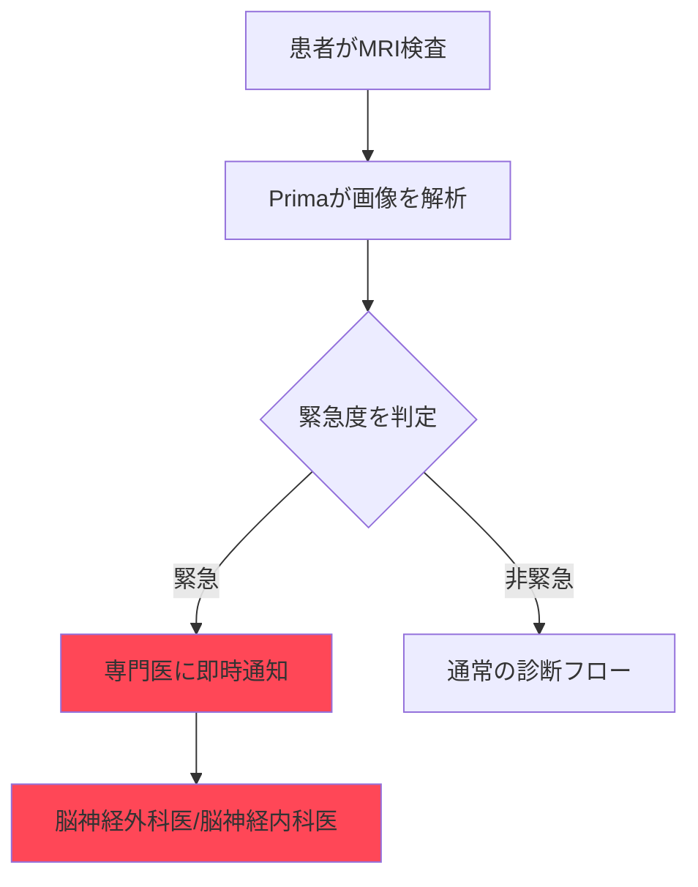
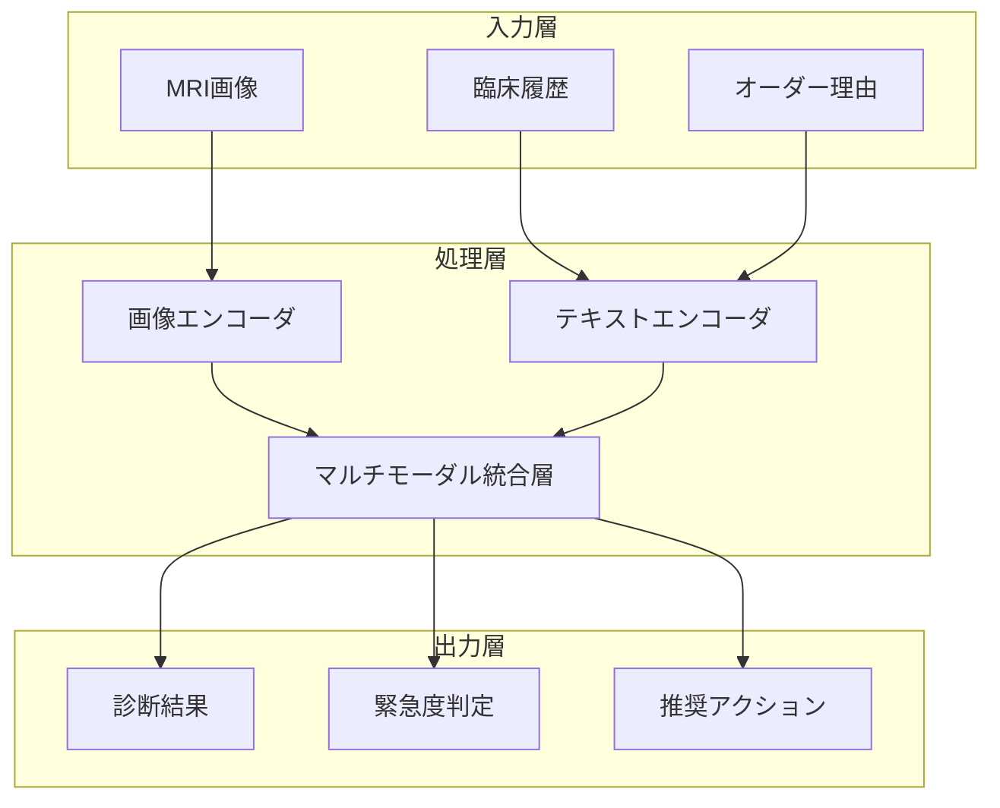

# Prima: 脳MRIを数秒で診断する革新AI

## 📌 3行でわかるこの記事

- **ミシガン大学が「Prima」というAIモデルを開発** - 脳MRIを数秒で解析・診断
- **97.5%の精度**で50種類以上の神経学的疾患を識別し、緊急度も自動判定
- 脳卒中や脳出血などの緊急症例を即座に通知し、医療従事者の負担を軽減

---

## 背景：MRI診断の課題

世界中で毎年何百万ものMRI検査が行われていますが、**画像診断の需要が放射線科医の供給を上回る**という深刻な問題が発生しています。



特に地方の病院では、診断結果が出るまで数日〜数週間かかることも珍しくありません。この問題を解決するために開発されたのが、**Prima**です。

---

## Primaとは？

**Prima**は、ミシガン大学の研究チームが開発した**Vision Language Model（VLM）**ベースのAIシステムです。

### 技術的な特徴

Primaは従来の医用画像AIとは異なるアプローチを採用しています：

| 特徴 | 従来の医用画像AI | Prima |
|------|------------------|-------|
| 訓練データ | 選別された狭いデータセット | **20万件以上のMRI研究** |
| 対象タスク | 単一タスク（病変検出など） | **50種類以上の診断に対応** |
| 入力情報 | 画像のみ | 画像 + 臨床履歴 + オーダー理由 |
| 処理速度 | 分単位 | **数秒** |

### 圧倒的なデータ規模

```python
# Primaの訓練データ規模
training_data = {
    "MRI_studies": 200000,      # 20万件のMRI研究
    "imaging_sequences": 5600000,  # 560万の画像シーケンス
    "source": "全てのデジタル化された放射線科記録"
}
```

> 「Primaは放射線科医のように、患者の病歴と画像データを統合して健康状態を包括的に理解します」
> — Samir Harake, データサイエンティスト

---

## 驚異的な精度と性能

### 診断精度

研究チームは**1年間で3万件以上のMRI研究**を使用してPrimaを評価しました。


**結果は驚異的でした：**

- **最大97.5%の診断精度**
- 50種類以上の神経学的疾患を識別
- 脳卒中、脳出血などの緊急症例を自動検出

### 緊急度判定システム

Primaは単に病気を特定するだけでなく、**治療の緊急度も判定**します：



脳卒中や脳出血など、即座の医療介入が必要な症例に対しては、**適切な専門医（脳神経外科医や脳神経内科医）に自動的にアラートを送信**します。

---

## なぜこれほど高い精度を実現できたのか？

### 1. 包括的な訓練データ

ミシガン大学健康システムで**デジタル化された全てのMRI記録**を使用：

- 画像データだけでなく、患者の臨床履歴も統合
- 検査オーダーの理由も考慮

### 2. Vision Language Model（VLM）の活用

Primaは画像、ビデオ、テキストを**リアルタイムで統合処理**できるVLMアーキテクチャを採用：

```
[入力] → [画像エンコーダ] → [特徴抽出]
                           ↓
[臨床履歴] → [テキストエンコーダ] → [統合] → [診断出力]
```

### 3. 実臨床を想識した設計

> 「ChatGPTがメールの下書きや推奨を提供するように、Primaは医療画像解釈の**コパイロット**を目指しています」
> — Todd Hollon, 神経外科医

---

## 医療現場への影響

### 解決できる課題

1. **診断の遅延解消** - 数日かかっていた診断が数秒に
2. **放射線科医不足の緩和** - AIが一次スクリーニングを担当
3. **診断ミスの削減** - 高精度な自動診断で見逃しを防止
4. **地域格差の是正** - 地方病院でも高度な診断支援を利用可能

### 今後の展望

研究チームは現在、**評価の初期段階**であることを強調しています。今後の研究では：

- より詳細な患者情報の統合
- 電子カルテデータの活用
- 乳房X線写真、胸部X線、超音波検査への拡張

---

## 技術的な詳細

### アーキテクチャ概要



### 研究成果

この研究は**Nature Biomedical Engineering**に掲載されました：

- 研究期間：1年間
- 評価件数：30,000件以上のMRI研究
- 対象疾患：50種類以上の神経学的疾患
- 資金提供：NIH、Chan Zuckerberg Initiativeなど

---

## まとめ

Primaは、医療画像診断における**画期的なブレイクスルー**です。

**主なポイント：**

- ✅ 脳MRIを数秒で解析・診断
- ✅ 97.5%の高精度
- ✅ 50種類以上の神経学的疾患に対応
- ✅ 緊急度の自動判定と専門医への通知
- ✅ 医療従事者の負担軽減

「ChatGPT for medical imaging」と評されるこの技術は、放射線科医の**コパイロット**として、医療現場の変革を担う可能性を秘めています。

---

## 参考リンク

1. [AI reads brain MRIs in seconds and flags emergencies - ScienceDaily](https://www.sciencedaily.com/releases/2026/02/260210005419.htm)
2. [AI Model Can Read and Diagnose a Brain MRI in Seconds - Newswise](https://www.newswise.com/articles/ai-model-can-read-and-diagnose-a-brain-mri-in-seconds)
3. [AI Model Reads Brain MRI in Seconds - EMJ Reviews](https://www.emjreviews.com/radiology/news/new-ai-model-reads-brain-mri-in-seconds/)
4. [Nature Biomedical Engineering - Research Publication](https://www.nature.com/articles/s41551-026-00000-0)

---

*この記事は2026年2月19日時点の情報に基づいています。*
