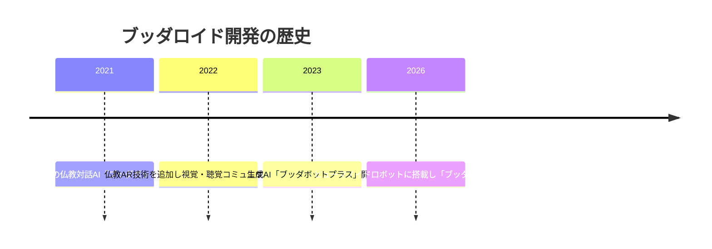
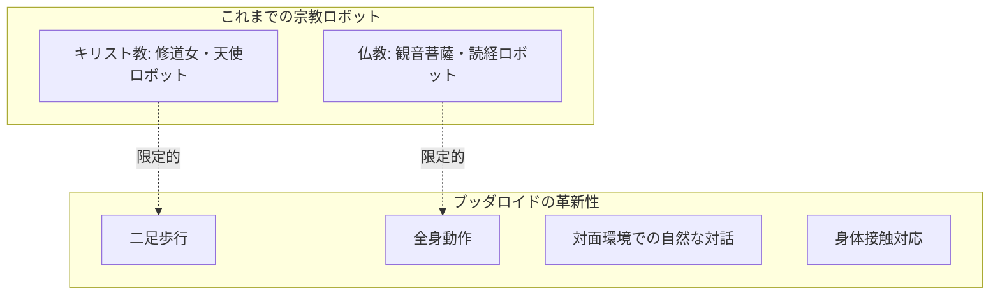
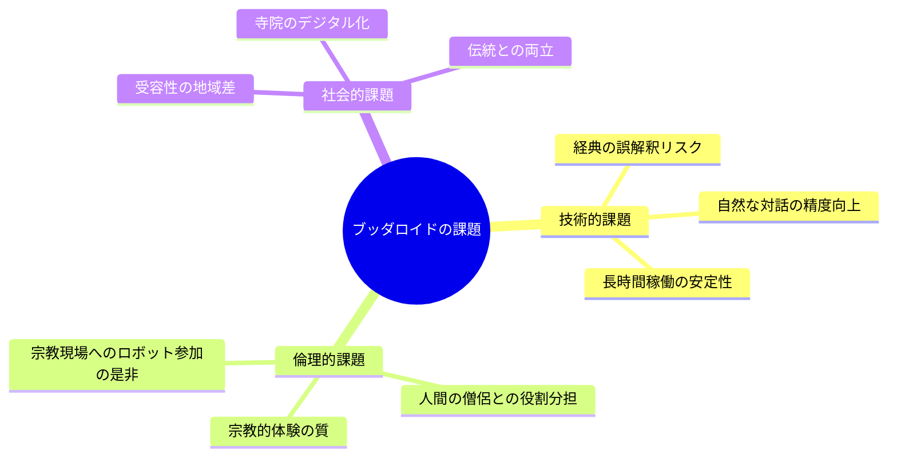

## 📌 3行でわかるこの記事

- 京都大学が仏教経典を学習したAI搭載ヒューマノイドロボット「ブッダロイド」を公開
- 二足歩行で合掌・礼拝などの宗教的動作を自然に実現し、悩み相談に回答
- 僧侶の人手不足解消や宗教儀礼の補佐役としての実用化が期待される

---

## はじめに

2026年2月24日、京都大学の熊谷誠慈教授らの研究グループが、仏教の経典を学習したAIを搭載したヒューマノイドロボット「ブッダロイド」を発表しました。この革新的な技術は、宗教とテクノロジーの融合として大きな注目を集めています。

本記事では、ブッダロイドの技術的な特徴や開発背景、今後の展望について詳しく解説します。

## ブッダロイドとは

「ブッダロイド」は、京都大学「人と社会の未来研究院」の熊谷誠慈教授とAIスタートアップ「テラバース」が共同で開発した、仏教対話特化型のヒューマノイドロボットです。

### 開発の経緯



研究グループは2021年から段階的に開発を進めており、今回「身体性」を加えることで、言葉と身体が調和した音声対話を実現しました。

### 主な特徴

ブッダロイドには以下のような特徴があります：

| 特徴 | 説明 |
|------|------|
| **経典学習** | スッタニパータ、ダンマパダなどの原始仏教経典を学習 |
| **二足歩行** | 人間に近い全身動作を実現 |
| **宗教的所作** | 合掌、礼拝などの動作を自然に実行 |
| **対話機能** | 悩み相談に対し経典に基づいた回答を生成 |

## 技術的な仕組み

### AIシステム構成


### 搭載AI「ブッダボットプラス」

ブッダロイドの脳となるのが、ChatGPTの最新版を応用した「ブッダボットプラス」です。

```python
# ブッダボットプラスの処理フロー（概念）
def generate_response(user_question: str) -> dict:
    """
    ユーザーの質問に対して経典に基づいた回答を生成
    """
    # 1. 経典の文言で回答
    sutra_answer = search_sutra_text(user_question)
    
    # 2. 解釈・追加説明を提供
    interpretation = explain_meaning(sutra_answer)
    
    # 3. 身体動作の選択
    gesture = select_appropriate_gesture(user_question)
    
    return {
        "sutra_quote": sutra_answer,
        "explanation": interpretation,
        "gesture": gesture,
        "voice_tone": "serene"
    }
```

### ベースロボット

ベースとなるヒューマノイドロボットは、中国・杭州市のユニツリー・ロボティクス製です。以下の動作を学習しています：

- ゆるやかで荘厳な速度での歩行
- 相手に敬意を表する礼拝所作
- 仏や菩薩、高僧らに対する合掌

## 実際の対話例

報道陣への公開時には、実際に以下のような対話が行われました：

> **質問**: 「人間関係がうまくいかない時はどうしたらいいでしょうか」
> 
> **ブッダロイド**: 「仏教では好ましく思ったり憎く思ったりせず、程よい距離感で接することが大切と説かれています」

このように、質問に対して経典の教えを引用しつつ、現代的なアドバイスとして噛み砕いて回答する能力を持っています。

### 宗教的配慮

ブッダロイドは以下のような宗教的な配慮も実装されています：

- 仏像に尻を向けないよう姿勢制御
- 宗教空間にふさわしい荘厳な動作
- 経典の解釈の説明機能

## 他の宗教AIロボットとの違い



キリスト教では修道女や天使を模したロボット、仏教では観音菩薩や読経する僧侶を模したロボットの開発事例はありました。しかし、二足歩行が可能で人間に近い全身動作を実現し、身体接触を伴う対面環境で自然な口頭対話ができる宗教AIヒューマノイドロボットは**初の可能性**があるとのことです。

## 期待される用途と課題

### 期待される用途

| 用途 | 説明 |
|------|------|
| **悩み相談** | 生身の僧侶には話しにくい相談の相手 |
| **宗教儀礼の補佐** | 法要や法話のサポート |
| **人手不足の解消** | 僧侶不足の一部解消 |
| **仏教教育** | 経典や教えの学習支援 |

### 技術的・倫理的課題



熊谷教授は「間違った解釈をしないかどうかなども検証する」としており、実用化に向けて慎重なアプローチを取っています。

## 今後の展望

熊谷教授は以下のように述べています：

> 「仏教AI開発を、身体性・対面性を含む新たな段階に発展させた。今後もさまざまな宗教や哲学とテクノロジーを融合し、より豊かなデジタル文化を提供していきたい」

将来は宗教儀礼の補佐役としての実用化や、他の宗教への応用も期待されています。

## まとめ

ブッダロイドは、AI技術と宗教文化が融合した画期的な取り組みです。二足歩行ヒューマノイドロボットに仏教経典を学習させたAIを搭載することで、これまでにない「身体性を持った宗教AI」を実現しました。

技術的には興味深い一方で、宗教とロボットの関わり方については社会的・倫理的な議論も必要です。開発チームは慎重に検証を進めており、今後の発展が注目されます。

## 参考リンク

- [仏教AI搭載ヒト型ロボット、対面で悩み相談 京都大学が公開 - 日本経済新聞](https://www.nikkei.com/article/DGXZQOUF241OF0U6A220C2000000/)
- [仏教対話できる生成AIロボット「ブッダロイド」 京大教授ら発表 - 毎日新聞](https://mainichi.jp/articles/20260224/k00/00m/040/020000c)
- [仏教経典学習のAI搭載 悩み相談にこたえるヒト型ロボット開発 - NHKニュース](https://news.web.nhk/newsweb/na/na-k10015059701000)
