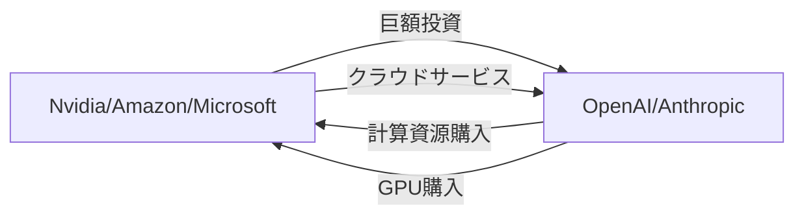
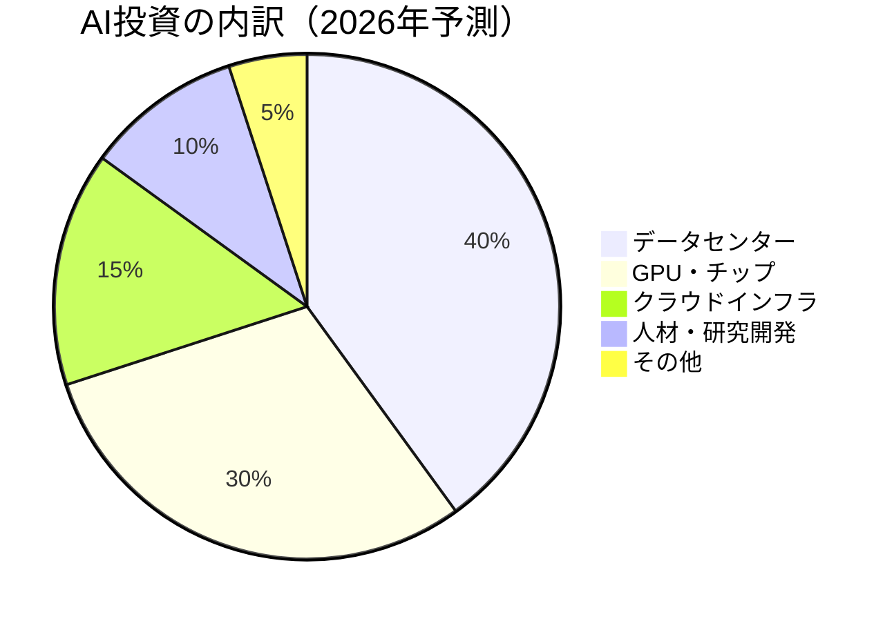

# OpenAIが1100億ドル調達〜AI業界の巨額投資ラッシュを解説

## 📌 3行でわかるこの記事

1. **OpenAIが史上最大級の1100億ドル（約16.5兆円）を調達、企業価値は7300億ドル（約110兆円）に**
2. **Amazonが新規投資家として500億ドル、NvidiaとSoftBankが各300億ドルを出資**
3. **Big Tech全体で2026年に6500億ドルのAI投資を計画、業界構造が大きく変化中**

---

## はじめに

2026年2月27日、OpenAIが**1100億ドル（約16.5兆円）**の資金調達を完了したと発表しました。これは史上最大級のスタートアップ調達であり、AI業界の熱狂がまだ終わっていないことを世界中に知らしめる出来事です。

本記事では、この歴史的な資金調達の背景、主要プレイヤーの思惑、そしてAI業界全体への影響を詳しく解説します。


---

## 1. OpenAIの大型資金調達の概要

### 1.1 調達金額と評価額

| 項目 | 数値 |
|------|------|
| 調達金額 | 1100億ドル（約16.5兆円） |
| 企業価値 | 7300億ドル（約110兆円） |
| 前回評価額（2025年10月） | 5000億ドル |
| 週間アクティブユーザー | 9億人以上 |
| 有料サブスクライバー | 5000万人以上 |

OpenAIは2025年10月の時点で5000億ドルの評価を受けていましたが、わずか4ヶ月で**7300億ドル**へと急上昇しました。これはSpaceXやByteDanceと並ぶ、世界で最も価値のある非上場企業の地位を確立したことを意味します。

### 1.2 出資者の内訳

```
┌─────────────────────────────────────────────────────────┐
│                  OpenAI 資金調達 1100億ドル               │
├─────────────────────────────────────────────────────────┤
│  Amazon（新規）     ████████████████████████████  500億  │
│  Nvidia（既存）     ████████████████            300億  │
│  SoftBank（既存）   ████████████████            300億  │
└─────────────────────────────────────────────────────────┘
```

- **Amazon（新規投資家）**: 500億ドルを出資。これが初のOpenAI投資となります
- **Nvidia**: 300億ドルを追加投資。GPUの主要サプライヤーとして関係を強化
- **SoftBank**: 300億ドルを追加投資。既存の投資枠を拡大

## 2. 循環取引のエコシステム

### 2.1 「投資 → 支出」の好循環

AIブームの特徴的な側面として、**投資家と顧客が同一**という構造が挙げられます。



この「循環取引」は以下のような流れで機能しています：

1. ビッグテック企業がAIスタートアップに巨額を投資
2. AIスタートアップはその資金で計算資源・GPUを購入
3. 購入先は投資したビッグテック企業（Nvidia、AWS、Azure）
4. 投資した資金が再び投資家の売上として戻る

### 2.2 なぜこの構造が成り立つのか

この一見矛盾した構造が成り立つ理由：

- **AI開発には莫大な計算資源が必要**: 大規模言語モデルのトレーニングには数千億のパラメータを処理するGPUクラスターが必須
- **早期投資による優先アクセス**: 投資家は最新AI技術へのアクセス権を確保
- **プラットフォーム効果**: AIアプリケーションが自社クラウド上で動作することで、エコシステムを構築

---

## 3. Nvidiaの爆発的成長

### 3.1 四半期利益430億ドル

OpenAIの資金調達と同じ週、Nvidiaは驚異的な決算を発表しました。

| 指標 | 今四半期 | 前年同期比 |
|------|----------|-----------|
| 売上高 | 681億ドル | +78% |
| 四半期利益 | 430億ドル | +93% |
| 年間利益 | 1200億ドル | - |
| AIデータセンター売上 | 617億ドル | +71% |

### 3.2 3年間の成長軌道

```
年間利益の推移（単位：億ドル）

2023年:   ▓ 44
2024年:   ▓▓▓▓▓▓▓▓▓▓▓▓▓▓▓▓▓▓ 300+
2026年:   ▓▓▓▓▓▓▓▓▓▓▓▓▓▓▓▓▓▓▓▓▓▓▓▓▓▓▓▓▓ 1200
```

**わずか3年で利益が約27倍**に拡大。Apple、Microsoft、Alphabetといった巨大テック企業の四半期利益を初めて上回りました。

### 3.3 シェア独占の現実

Nvidiaは**AI向けGPU市場の約90%**を支配しています。Google、Amazon、Microsoft、Metaが2026年に計画している**5000億ドル以上のデータセンター投資**の主な受益者となるのは間違いありません。

---

## 4. 2026年のAI投資見通し

### 4.1 6500億ドルの投資計画

ブリッジウォーター・アソシエーツの分析によると、ビッグテック企業は2026年に**約6500億ドル（約97兆円）**をAI関連インフラに投資する見込みです。

これは以下を含みます：

- データセンター建設
- GPU・AIチップ購入
- 電力インフラ
- 冷却システム
- AI人材の獲得

### 4.2 GDP比2%の意味

この投資額は**米国GDPの約2%**に相当します。歴史的に見ても、単一技術への投資としては異例の規模です。



### 4.3 2800のデータセンター建設計画

米国だけで**約2800のデータセンター**が建設計画中とされています。これは：

- 既存のデータセンター数の約3倍
- 各データセンターの消費電力は小規模都市並み
- 冷却用水と電力確保が課題

---

## 5. この投資ラッシュが意味するもの

### 5.1 OpenAIの収益性

OpenAIは依然として**赤字**です。2025年の収益は130億ドルでしたが、今後4年間で1150億ドルの支出を見込んでいます。

| 項目 | 2025年実績 |
|------|-----------|
| 売上高 | 130億ドル |
| 今後4年の支出計画 | 1150億ドル |
| 週間アクティブユーザー | 9億人以上 |
| 有料サブスクライバー | 5000万人以上 |

### 5.2 中東ソブリン・ウエルス・ファンドの動向

OpenAIはさらなる資金調達を続けており、中東のソブリン・ウエルス・ファンドとの交渉が進行中です。UAEのMGXは既に出資済みで、今後も資金流入が期待されています。

---

## まとめ

2026年のAI業界は、史上最大規模の投資ラッシュの最中にあります。OpenAIの1100億ドル調達、Nvidiaの1200億ドル年間利益、そしてビッグテック全体で6500億ドルの投資計画——これらは全て、AIが「過去のバブル」とは異なる構造的変化をもたらしていることを示しています。

### この記事の要点

1. OpenAIが1100億ドルを調達、企業価値は7300億ドルに
2. Amazon（500億ドル）、Nvidia・SoftBank（各300億ドル）が主要投資家
3. Nvidiaは四半期430億ドルの利益、年間1200億ドルを記録
4. 2026年のAI投資は6500億ドルに達する見込み
5. 「投資家＝顧客」の循環エコシステムが確立

---

## 参考リンク

- [OpenAI Raises $110 Billion Led by Amazon, Nvidia and SoftBank - The New York Times](https://www.nytimes.com/2026/02/27/business/openai-funding.html)
- [Nvidia's Quarterly Profit Hits $43 Billion on Strong A.I. Chip Sales - The New York Times](https://www.nytimes.com/2026/02/25/technology/nvidia-earnings.html)
- [Big Tech to invest about $650 billion in AI in 2026, Bridgewater says - Reuters](https://www.reuters.com/business/big-tech-invest-about-650-billion-ai-2026-bridgewater-says-2026-02-23/)
