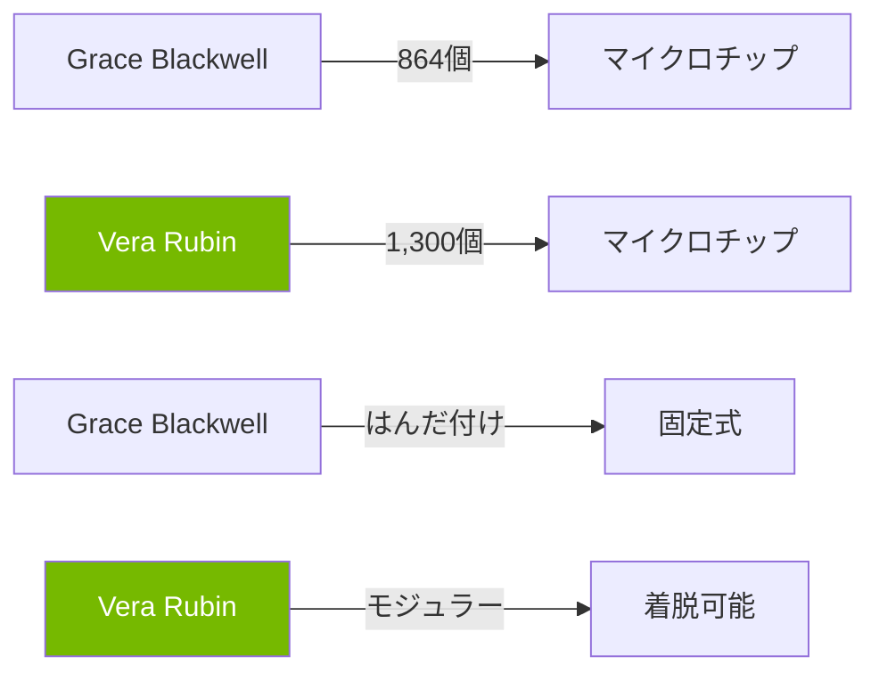
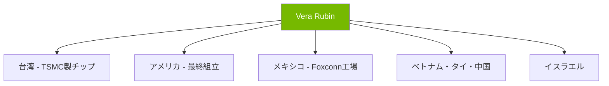

# Nvidiaの新AIシステム「Vera Rubin」が革命を起こす理由

📌 **3行でわかるこの記事**
- Nvidiaの次世代AIシステム「Vera Rubin」は前任者より**10倍のワットパフォーマンス**を実現
- 130万個のコンポーネントで構成され、2026年後半に shipments 開始予定
- Meta、OpenAI、Googleなど主要テック企業が既に採用を発表

---

## はじめに

2026年2月、Nvidiaは革新的なAIシステム「Vera Rubin」を発表しました。このシステムは、現在のGrace Blackwellシステムを大幅に上回る性能を誇り、AIデータセンターのあり方を根本から変える可能性を秘めています。

本記事では、Vera Rubinの技術的特徴、市場への影響、そして競合他社の動向について詳しく解説します。


## Vera Rubinの概要

### 基本仕様

Vera Rubinは、Nvidiaが開発した次世代ラックスケールAIシステムです。主な特徴は以下の通りです：

| 項目 | 仕様 |
|------|------|
| GPU数 | 72個のRubin GPU |
| CPU数 | 36個のVera CPU |
| 総コンポーネント数 | 約130万個 |
| 重量 | 約2トン |
| 冷却方式 | 100%液体冷却 |

### Grace Blackwellとの比較



Vera Rubinの最大の進化は、**ワットパフォーマンスが10倍**になったことです。これは、同じ電力消費で10倍の計算能力を発揮できることを意味します。

## 技術的革新

### 1. 究極のエネルギー効率

AIデータセンター最大の課題の一つはエネルギー消費です。Vera Rubinは、前任者の約2倍の電力を消費しながらも、**ワットあたりの性能は10倍**を達成しました。

Mizuho Securitiesのアナリスト、Jordan Klein氏は次のように述べています：

> 「最も重要なのは、消費電力あたり何トークンを処理できるかだ。これを最適化できれば、投資対効果は向上する。」

### 2. 100%液体冷却

Vera RubinはNvidia初の**完全液体冷却システム**を採用しています。これにより：

- 従来の蒸発冷却と比較して水の消費を大幅に削減
- データセンターの冷却効率が向上
- 環境負荷の軽減

### 3. モジュラー設計

Grace Blackwellでは基板にはんだ付けされていたコンポーネントが、Vera Rubinでは**モジュラー式**になりました：

```python
# 従来のBlackwellシステム
component = {
    "type": "soldered",
    "repair": "困難",
    "replacement": "基板全体を交換"
}

# 新しいVera Rubin
component = {
    "type": "modular",
    "repair": "簡単",
    "replacement": "数秒で着脱可能"
}
```

各スーパーチップは18個のコンピュートトレイからスライドして取り出し可能で、メンテナンスが大幅に簡素化されました。

## サプライチェーンと製造

### グローバルな調達ネットワーク

Vera Rubinは20カ国以上、80以上のサプライヤーから部品を調達しています：



### アメリカでの製造拡大

Nvidiaは2029年までに**5,000億ドル**相当のAIインフラをアメリカ国内で製造する計画を発表しています。これには、TSMCのアリゾナ新工場でのBlackwell GPU製造も含まれます。

## 市場への影響

### 四半期利益430億ドル

2026年2月の決算で、Nvidiaは驚異的な数字を発表しました：

- **四半期利益：430億ドル**（前年比ほぼ倍増）
- **年間利益：1,200億ドル**（3年前は44億ドル）
- **データセンター売上：617億ドル**（前年比71%増）


### 主要顧客

Vera Rubinの主要な顧客リストには、AI業界の主要企業が名を連ねています：

| 企業 | 用途 |
|------|------|
| Meta | 2027年までにデータセンターで採用予定 |
| OpenAI | GPTモデルのトレーニング |
| Anthropic | Claudeモデルの推論 |
| Amazon | AWS AIサービス |
| Google | Gemini開発 |
| Microsoft | Azure AI |

### 価格帯

Futurum Groupの推定によると、Vera Rubinの価格は：
- Grace Blackwellから約25%上昇
- **350万〜400万ドル**（約5〜6億円）

## 競合状況

### AMD Helios

AMDは2026年後半に初のラックスケールシステム「Helios」を出荷予定です。Metaは既に**6GW相当**のHelios採用を約束しています。

### カスタムシリコン

各社が独自のAIチップを開発中：

- **Amazon**: Trainium 2チップ
- **Google**: TPU（Tensor Processing Unit）
- **Meta**: MTIA

MizuhoのKlein氏：

> 「顧客はより多くのキャパシティを求めているが、Nvidiaをチェックするための第二ソースも欲している。」

## 課題と展望

### メモリ不足

世界的なHBM（High Bandwidth Memory）の不足が課題です。Nvidiaは詳細な予測をサプライヤーに提供し、供給チェーンの整合性を確保しようとしています。

### 競争の激化

NvidiaのAIプロセッサ市場シェアは約90%ですが、競合からの圧力が高まっています。NvidiaのDion Harris氏は次のように述べています：

> 「挑戦しようとする人には敬意を表する。しかし、これは決して単純な取り組みではない。」

## まとめ

Vera Rubinは、AIデータセンターの次世代を定義するシステムとなるでしょう：

1. **10倍のエネルギー効率** - 持続可能なAIインフラへの道
2. **モジュラー設計** - メンテナンスと拡張の容易さ
3. **グローバルサプライチェーン** - 製造リスクの分散
4. **強力な顧客基盤** - 主要テック企業の支持

AIの進化はまだ加速し続けており、Vera Rubinはその中心的な役割を果たすことになりそうです。

---

## 参考リンク

1. [CNBC - First look at Nvidia's AI system Vera Rubin](https://www.cnbc.com/2026/02/25/first-look-at-nvidias-ai-system-vera-rubin-and-how-it-beats-blackwell.html)
2. [New York Times - Nvidia's Quarterly Profit Hits $43 Billion](https://www.nytimes.com/2026/02/25/technology/nvidia-earnings.html)
3. [Nvidia Official - Vera Rubin Architecture](https://www.nvidia.com/en-us/data-center/vera-rubin/)
4. [Reuters - Big Tech to invest $650 billion in AI](https://www.reuters.com/business/big-tech-invest-about-650-billion-ai-2026-bridgewater-says-2026-02-23/)
