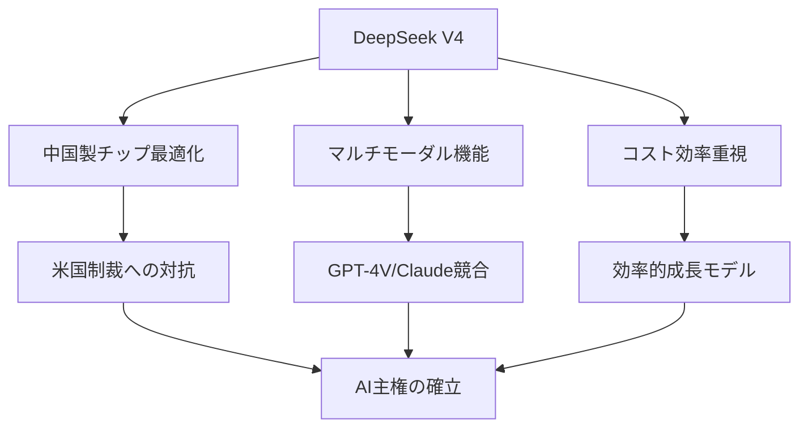
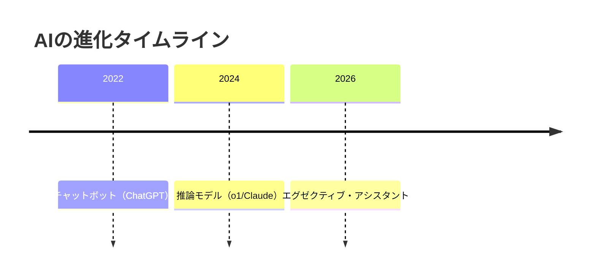
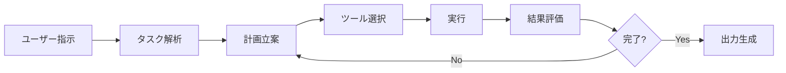

# 2026年3月AI最新ニュース〜DeepSeek V4、ベトナムAI法、エージェント革命

## 📌 3行でわかるこの記事
1. **中国DeepSeekがマルチモーダル新モデル「V4」を発表、华为・寒武紀のチップで最適化**
2. **ベトナムが東南アジア初の包括的AI法を施行、EU型のリスク分類規制を導入**
3. **AIが「チャットボット」から「エグゼクティブ・アシスタント」へ進化、ガードレールが消失中**

---

## はじめに

2026年3月、AI業界は大きく動いています。中国のDeepSeekが新モデルV4をリリースし、米中AI競争が激化。ベトナムは東南アジア初の包括的AI法を施行し、規制の波が広がっています。また、生成AIは「チャットボット」から「自律的にタスクを実行するエージェント」へと進化を遂げています。

本記事では、2026年3月初旬の主要AIニュースを網羅的に解説します。


---

## 1. DeepSeek V4発表〜中国AIの新たな挑戦

### 1.1 DeepSeek V4の概要

中国のAI企業DeepSeekが、最新の大規模言語モデル「V4」を発表しました。Financial Timesの報道によると、V4は以下の特徴を持つマルチモーダルモデルです：

- 画像・動画・テキスト生成機能を統合
- 华为（Huawei）および寒武紀（Cambricon）の中国製AIチップで最適化
- 中国の年次議会「両会」（3月4日開始）に合わせてタイミングを調整

### 1.2 DeepSeekの戦略的意義



DeepSeekは2025年1月に「R1」推論モデルを発表した際、アメリカのテック業界に衝撃を与えました。当時、トップクラスのアメリカ製モデルと同等の性能を、はるかに少ない計算リソースで実現したのです。

### 1.3 産業への影響

SAPコンサルタントのGokul Naidu氏は当時、次のように述べました：

> 「DeepSeekはシリコンバレーのAIアプローチを変える可能性がある。歴史的にテックの中心地は『成長なら何でも』を優先し、効率性の問題を無視してきた。しかしDeepSeekは再考を迫る。劇的に低いコスト構造により、ビジネスも開発者も優先順位を見直し、効率主導の成長に焦点を当てている」

---

## 2. ベトナムAI法〜東南アジア初の包括的規制

### 2.1 法の概要

2026年3月2日、ベトナムで「AI法（Law on Artificial Intelligence）」が施行されました。これは**東南アジアで初めての包括的AI規制フレームワーク**です。

| 項目 | 内容 |
|------|------|
| 施行日 | 2026年3月2日 |
| モデル | EU AI法をベース |
| 管轄 | 科学技術省 |
| 新設 | 国家AI開発基金 |

### 2.2 リスク分類システム

ベトナムのAI法は、EUと同様の層別リスク分類を採用しています：

```
┌─────────────────────────────────────────────────────────────┐
│                    AIリスク分類（ベトナム）                   │
├─────────────────────────────────────────────────────────────┤
│ 【禁止】（最も高リスク）                                      │
│  • 国家安全保障への体系的脅威                                 │
│  • 人間の尊厳への脅威                                         │
│  • 同意なき顔認識                                            │
│  • 悪意あるディープフェイク                                  │
├─────────────────────────────────────────────────────────────┤
│ 【高リスク】                                                  │
│  • 医療機器                                                  │
│  • 採用・雇用システム                                        │
│  • 金融サービス                                              │
├─────────────────────────────────────────────────────────────┤
│ 【低リスク】                                                  │
│  • スパムフィルター                                          │
│  • コンテンツ推薦                                            │
└─────────────────────────────────────────────────────────────┘
```

### 2.3 デジタル主権の強調

EU法との主な違いは、**デジタル主権と国家AI能力の強化**に重点を置いている点です。ベトナムはAI・半導体生産を、新規市場参入と地域技術リーダー化の中核戦略として位置づけています。


---

## 3. AIエージェントの台頭〜ガードレール消失の危機

### 3.1 第三の転換点

Nvidia CEO Jensen Huang氏は、AIが「第三の転換点」を迎えたと述べています：

> 「今、これらのエージェントシステムにより、エージェントは推論し、タスクを受け取り、実際に仕事をこなすことができる」

2026年の最初の2ヶ月で、生成AIは以下の進化を遂げました：



### 3.2 ガードレールの消失

しかし、AIの能力向上と同時に、安全策が急速に取り払われています：

| 企業 | 変化 |
|------|------|
| Anthropic | 安全誓約を撤回、非拘束的な目標に変更 |
| OpenAI | 「最後の手段」としていた広告を開始 |
| 研究者 | 数週間で複数が辞職、リスクを警告 |

### 3.3 政治的な緊張

Anthropicはペンタゴンとの契約交渉が決裂し、トランプ政権からブラックリスト入りしました。AI安全規制をめぐる対立は、2026年中間選挙の重要議題となる可能性があります。

---

## 4. 技術的なポイント解説

### 4.1 マルチモーダルモデルの意義

DeepSeek V4のようなマルチモーダルモデルは、テキストだけでなく画像・動画も理解・生成できます：

```python
# マルチモーダルモデルの概念例
class MultimodalModel:
    def __init__(self):
        self.text_encoder = TextEncoder()
        self.image_encoder = ImageEncoder()
        self.video_encoder = VideoEncoder()
        self.decoder = UnifiedDecoder()
    
    def generate(self, input_data, modality="text"):
        if modality == "image":
            encoded = self.image_encoder(input_data)
        elif modality == "video":
            encoded = self.video_encoder(input_data)
        else:
            encoded = self.text_encoder(input_data)
        
        return self.decoder(encoded)
```

### 4.2 エージェントシステムのアーキテクチャ



---

## 5. まとめ

2026年3月のAI業界は以下の動きが注目されます：

1. **DeepSeek V4** - 中国製チップで最適化されたマルチモーダルモデル
2. **ベトナムAI法** - 東南アジア初の包括的規制フレームワーク
3. **エージェント革命** - AIが「チャットボット」から「実行するアシスタント」へ
4. **安全規制の後退** - 競争激化によりガードレールが消失

AI技術の進化は加速し続けています。同時に、規制・倫理・安全の議論も重要性を増しています。これからの展開を注視していきましょう。

---

## 参考リンク

1. [DeepSeek Poised to Unveil Latest AI Model - PYMNTS](https://www.pymnts.com/artificial-intelligence-2/2026/deepseek-poised-to-unveil-latest-ai-model/)
2. [Vietnam implements sweeping AI law - JURIST](https://www.jurist.org/news/2026/03/vietnam-implements-sweeping-ai-law/)
3. [AI just leveled up and there are no guardrails anymore - CNBC](https://www.cnbc.com/2026/02/28/ai-selloff-politics-agents.html)
4. [OpenAI Raises $110 Billion - NYT](https://www.nytimes.com/2026/02/27/business/openai-funding.html)
5. [UN Chief tells AI experts - UN News](https://news.un.org/en/story/2026/03/1167074)
