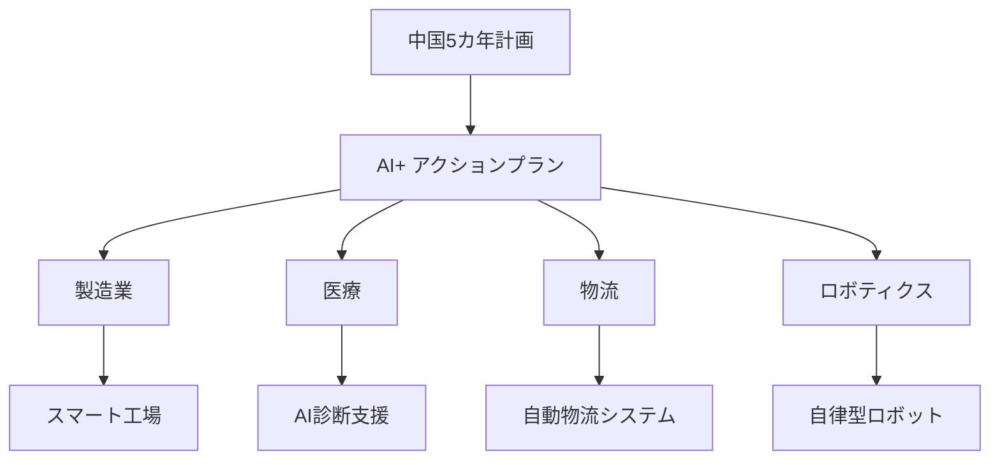
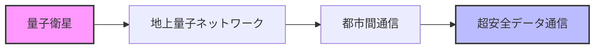
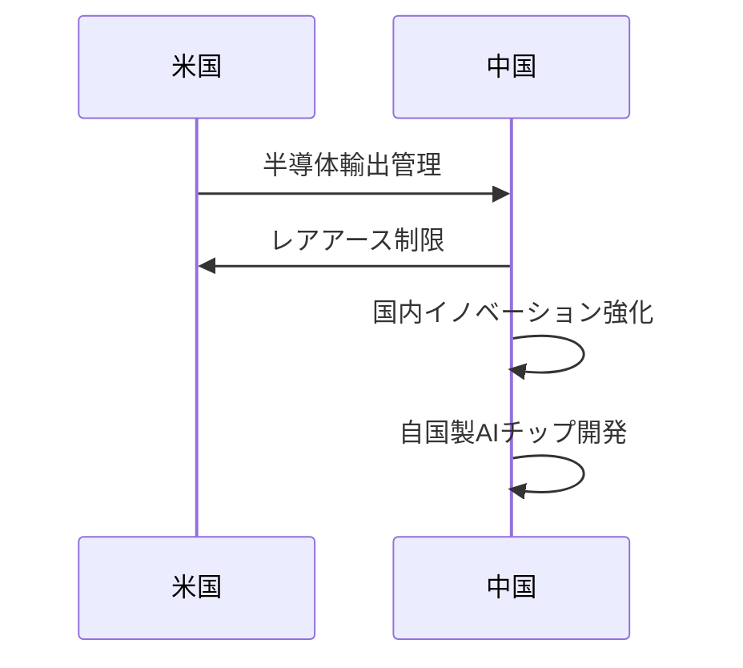

# 📌 3行でわかるこの記事

- 中国が2026年からの新5カ年計画で「AI+」アクションプランを発表、50回以上AIに言及
- 量子コンピューティング、ヒューマノイドロボット、6G、脳マシンインターフェースを重点分野に指定
- 米中技術対立の中、国内イノベーション強化と「自給自足」の技術開発を目指す戦略的転換点

---

## はじめに

2026年3月5日、中国の全国人民代表大会で新たな5カ年計画が発表されました。この計画は、中国の経済・産業の方向性を決定づける重要な文書ですが、今回は例年以上に**AI（人工知能）と量子技術**への言及が目立っています。

本記事では、この歴史的な計画の内容を技術的観点から解説し、世界中の技術コミュニティにどのような影響を与える可能性があるかを考察します。

*出典: The Quantum Insider*

---

## 新5カ年計画の核心：「AI+」アクションプラン

### AIへの言及回数が過去最多

今回の5カ年計画において、**AIへの言及は50回を超え**、過去最多となっています。これは単なる数字ではなく、中国政府がAIを国家戦略の最優先事項として位置づけていることを明確に示しています。

### 「新質生産力」という概念

中国政府は今回、**「新質生産力（New Quality Productive Forces）」**という新たな概念を導入しました。これは、先端産業が今後数十年間の経済成長を牽引することを指す用語で、以下の技術が含まれます：

| 技術分野 | 投資優先度 | 期待される効果 |
|---------|-----------|---------------|
| AI | 最高 | 産業全体の効率化 |
| 量子コンピューティング | 高 | 国家安全保障 |
| ヒューマノイドロボット | 高 | 労働力不足解消 |
| 6G通信 | 中 | データインフラ |
| 脳マシンインターフェース | 中 | 医療・医療応用 |

---

## 量子技術への大規模投資

### スケーラブル量子コンピュータの開発

計画では、**スケーラブル量子コンピュータ**への投資拡大が明記されています。中国は既に量子通信ネットワークと衛星ベースの実験で多額の投資を行っており、今回の計画でさらに加速させる姿勢を示しています。

### 宇宙・地上統合量子通信ネットワーク

最も野心的な目標の一つが、**宇宙・地上統合量子通信ネットワーク**の構築です。これは以下の要素から成ります：

このネットワークが完成すれば、**理論上ハッキング不可能な通信**が可能になり、国家安全保障や金融取引におけるデータ保護に革命をもたらす可能性があります。

---

## 「超大型」コンピューティングクラスタ

### AIモデルトレーニング向けインフラ

AIの発展には膨大な計算リソースが必要です。計画では、**「超大型（hyper-scale）コンピューティングクラスタ」**の建設が謳われています。これらは：

- 大規模な電力供給を必要とする
- データセンター型施設として建設
- 先進AIモデルのトレーニングに必要な計算能力を提供

### 電力消費の課題

AIデータセンターは**小都市1つ分の電力を消費する**とも言われています。この課題に対処するため、中国は再可能エネルギーとの連携も検討しています。

---

## オープンソースAIコミュニティへの支援

### 技術自立を目指す戦略

興味深いことに、中国政府は**オープンソースAIコミュニティへの支援**も表明しています。これは以下の目的があります：

1. **幅広い参加を促進**: 多様な開発者がツールやアルゴリズムに貢献
2. **国内技術の成熟**: 外国技術への依存度を低下
3. **グローバルな影響力**: オープンソースを通じて技術標準を形成

### DeepSeek等の国内企業の台頭

近年、**DeepSeek**のような中国企業が先進AIモデル開発で重要な役割を果たしています。これらの企業の成功は、北京の「外国技術依存度低下」という目標に貢献しています。

---

## 米中技術対立の文脈

### 輸出管理と報復措置

この5カ年計画は、米中間の技術緊張関係を背景にしています：

- **米国**: 先進半導体技術の輸出管理を実施
- **中国**: 重要鉱物・レアアースの輸出制限で対抗

### 技術自給自足への決意

地政学的圧力は、中国が**コンピューティング、半導体、その他戦略的技術**における自国製能力開発を決意させる要因となっています。

---

## その他の科学イニシアチブ

5カ年計画には、AI・量子以外にも野心的な科学プロジェクトが含まれています：

### 核融合技術のブレイクスルー

クリーンエネルギーの究極の目標である核融合発電の実用化に向けた研究加速

### 再利用型大型ロケット

宇宙開発競争での優位性確保

### 月面研究ステーション

国際月面探査でのプレゼンス強化

---

## 世界の技術コミュニティへの影響

### 量子技術の商業化加速

中国の投資は、量子技術の商業化タイムラインを大幅に前倒しする可能性があります。

### AI倫理・ガバナンスへの影響

AIを積極的に経済に統合する中国のアプローチは、AI倫理・ガバナンスに関する国際議論に新たな視点をもたらすでしょう。

### 技術標準争い

量子通信や6Gなどの新技術において、中国が標準設定で大きな影響力を持つ可能性があります。

---

## まとめ

中国の新5カ年計画は、単なる経済政策を超え、**21世紀の技術覇権争いにおける重要なマイルストーン**となる可能性があります。特に：

- **AI統合**: 産業全体へのAI導入を加速
- **量子技術**: 宇宙規模の量子通信ネットワークを目指す
- **技術自立**: 米国との対立の中、国内イノベーションを強化

私たち開発者は、この変化を注視し、技術の発展が人類全体の利益になるよう貢献していく必要があります。

---

## 参考リンク

1. [China's new five-year plan calls for AI throughout its economy | Reuters](https://www.reuters.com/world/asia-pacific/china-vows-accelerate-technological-self-reliance-ai-push-2026-03-05/)
2. [China's New Five-Year Plan Specifically Targets Quantum Leadership And AI Expansion | The Quantum Insider](https://thequantuminsider.com/2026/03/05/chinas-new-five-year-plan-specifically-targets-quantum-leadership-and-ai-expansion/)
3. [Trump Announces A.I. Industry Pledge to Pay for Power | The New York Times](https://www.nytimes.com/2026/03/04/technology/ai-energy-pledge-white-house-trump.html)
4. [How AI is already reshaping working conditions | UN News](https://news.un.org/en/story/2026/03/1167075)
