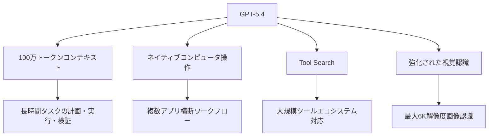
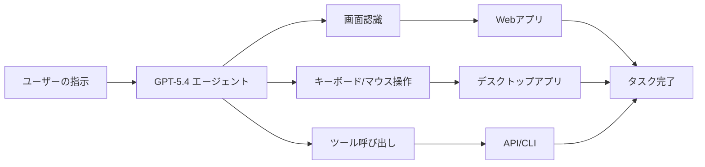
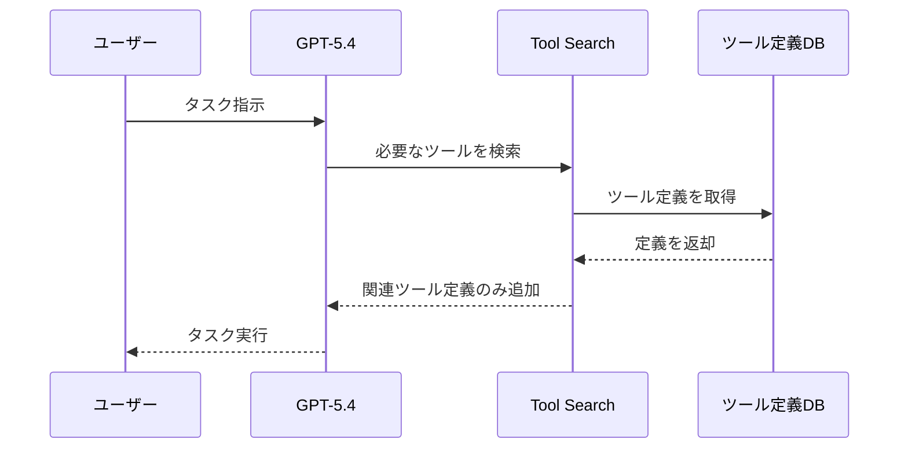
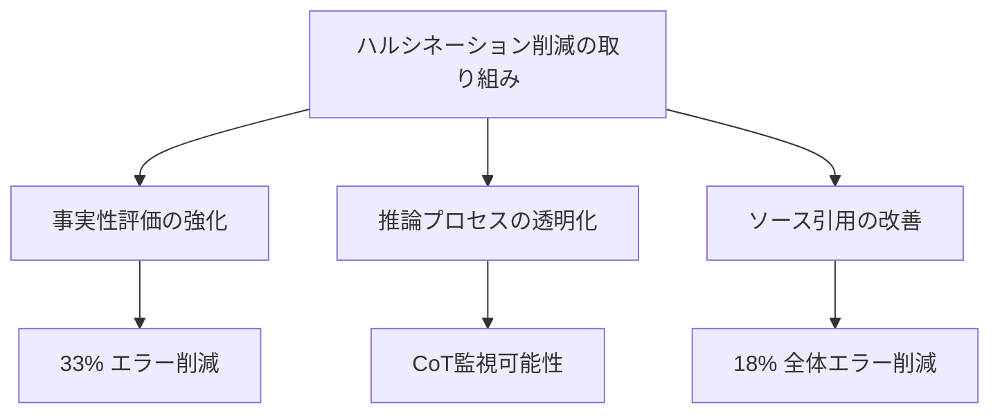

# OpenAI GPT-5.4が登場：100万トークンコンテキストとネイティブコンピュータ操作でエージェント時代が本格化

## 📌 3行でわかるこの記事

- OpenAIがGPT-5.4をリリース、最大100万トークンのコンテキストウィンドウをサポート
- ネイティブコンピュータ操作能力で、エージェントが複数アプリを横断するワークフローを実現
- 知識業務ベンチマークGDPvalで83.0%を達成、人間の専門家レベルを超える性能を実証

---

## はじめに

2026年3月5日、OpenAIが最新のフロンティアモデル「GPT-5.4」をリリースしました。このモデルは単なる性能向上にとどまらず、AIエージェントの実用化における重要なマイルストーンとなる機能を多数搭載しています。

本記事では、GPT-5.4の主な新機能と、それがもたらす開発・業務への影響について解説します。


## GPT-5.4の概要

GPT-5.4は、OpenAIが「業務用途向けに設計された最も高性能かつ効率的なフロンティアモデル」と位置づけています。ChatGPT、API、Codexの全プラットフォームで利用可能で、以下の3つのバージョンが提供されています：

| モデル | 用途 | 特徴 |
|--------|------|------|
| GPT-5.4 | 汎用 | 推論・コーディング・ツール利用の統合 |
| GPT-5.4 Thinking | 複雑なタスク | 思考の計画を事前提示、長時間の推論対応 |
| GPT-5.4 Pro | 最も複雑なタスク | 最大限のパフォーマンス |

### 主な新機能の全体像



## 100万トークンコンテキストウィンドウ

### 従来との比較

GPT-5.4の最大の特徴の一つは、最大100万トークンのコンテキストウィンドウです。これにより、エージェントは長い時間軸にわたるタスクを計画、実行、検証できるようになりました。

| 項目 | GPT-5.2 | GPT-5.4 |
|------|---------|---------|
| 最大コンテキスト | 約20万トークン | 100万トークン |
| 処理可能な文書量 | 中規模コードベース | 大規模プロジェクト全体 |

### 実務での活用シナリオ

100万トークンのコンテキストは、以下のような実務シーンで特に威力を発揮します：

1. **大規模コードベースの理解**：複数のリポジトリ全体を文脈に含めた分析・修正
2. **長期プロジェクトの管理**：数日〜数週間にわたるタスクの継続的な追跡
3. **包括的なドキュメント処理**：数百ページの技術文書を一度に処理

```python
# APIでの利用例
from openai import OpenAI

client = OpenAI()

response = client.chat.completions.create(
    model="gpt-5.4",
    messages=[
        {"role": "system", "content": "あなたは経験豊富なソフトウェアアーキテクトです。"},
        {"role": "user", "content": f"{large_codebase_content}について分析してください。"}
    ],
    # reasoning_effort="xhigh"  # 複雑なタスク向け
)
```

## ネイティブコンピュータ操作能力

### エージェントの新しい可能性

GPT-5.4は、OpenAI初の「ネイティブコンピュータ操作能力」を備えた汎用モデルです。これにより、エージェントがコンピュータを直接操作し、複数のアプリケーションにまたがる複雑なワークフローを実行できるようになりました。

### ベンチマークでの性能

OSWorld-Verified（デスクトップ環境の操作能力を測定）では、GPT-5.4は**75.0%**の成功率を達成し、GPT-5.2の47.3%を大きく上回り、人間の成績（72.4%）をも超えています。



### コンピュータ操作の実装例

```python
# CodexでのPlaywright連携例
from openai import OpenAI

client = OpenAI()

# コンピュータ操作ツールを使用
response = client.chat.completions.create(
    model="gpt-5.4",
    messages=[
        {"role": "user", "content": "メールを確認し、添付ファイルをダウンロードしてスプレッドシートに記録してください"}
    ],
    tools=[{"type": "computer_use"}]  # コンピュータ操作ツール
)
```

## 知識業務における飛躍的な向上

### GDPvalベンチマークでの成果

GDPvalは、44職種にわたる知識業務タスクを評価するベンチマークです。GPT-5.4は**83.0%**の比較で業界の専門職と同等以上の結果を達成し、GPT-5.2の71.0%を大きく上回りました。

### スプレッドシート・プレゼンテーション能力

初級投資銀行アナリストレベルのスプレッドシートモデリングでは、GPT-5.4の平均スコアは**87.5%**に達し、GPT-5.2の68.4%を大きく上回りました。

| タスク | GPT-5.2 | GPT-5.4 | 向上率 |
|--------|---------|---------|--------|
| スプレッドシートモデリング | 68.4% | 87.5% | +27.9% |
| プレゼンテーション作成 | - | 68.0%* | *人間がGPT-5.4を優先 |

## Tool Search：大規模ツールエコシステムへの対応

### 従来の課題

これまで、多数のツールをエージェントに与えると、すべてのツール定義がプロンプトに含まれ、数千〜数万トークンが追加されていました。これにより、コスト増、応答速度低下、コンテキストの無駄遣いが発生していました。

### Tool Searchの仕組み

Tool Searchでは、モデルは利用可能なツールの簡易一覧とtool search機能のみを受け取ります。必要なツールの定義をその場で検索し、会話に動的に追加できます。



### 効果

MCP Atlasベンチマーク（36のMCPサーバー、250タスク）での評価では、同じ精度を維持しながら**総トークン使用量を47%削減**しました。

## 強化された視覚認識能力

### 新しい画像入力ディテールレベル

GPT-5.4では、新たに`original`の画像入力ディテールレベルを導入しました：

| レベル | 最大解像度 | 用途 |
|--------|------------|------|
| `low` | 512px | 高速処理向け |
| `high` | 2048px / 256万画素 | 通常の詳細認識 |
| `original` | 6K / 1000万画素 | 高密度・高解像度画像の精密分析 |

### 文書解析能力の向上

OmniDocBenchでは、GPT-5.4の平均誤差が**0.109**となり、GPT-5.2の0.140から改善しました。

## ハルシネーションの大幅削減

GPT-5.4は「これまでで最も事実性の高いモデル」とされています：

- 個々の主張が誤っている確率：GPT-5.2比で**33%低い**
- 回答全体に誤りが含まれる確率：GPT-5.2比で**18%低い**



## API料金

GPT-5.4のAPI料金は以下の通りです：

| モデル | 入力料金 | キャッシュ入力 | 出力料金 |
|--------|----------|----------------|----------|
| gpt-5.2 | $1.75/100万トークン | $0.175/100万トークン | $14/100万トークン |
| gpt-5.4 | $2.50/100万トークン | $0.25/100万トークン | $15/100万トークン |
| gpt-5.4-pro | $30/100万トークン | - | $180/100万トークン |

※ Batch/Flexは半額、優先処理は2倍の料金

## まとめ

GPT-5.4は、以下の点でAIエージェントの実用化における重要な転換点となります：

1. **100万トークンコンテキスト**：長時間・大規模タスクへの対応
2. **ネイティブコンピュータ操作**：複数アプリ横断の自動化
3. **Tool Search**：大規模ツールエコシステムでの効率的な運用
4. **ハルシネーション削減**：実務での信頼性向上

これらの機能により、AIエージェントは単なるプロトタイプから、実際の業務で信頼して使用できるツールへと進化しています。

---

## 参考リンク

- [GPT-5.4 公式発表ページ](https://openai.com/index/introducing-gpt-5-4/)
- [OpenAI API Documentation](https://platform.openai.com/docs/)
- [OSWorld Benchmark](https://arxiv.org/abs/2404.07972)
- [Anthropic Labor Market Research](https://www.anthropic.com/research/labor-market-impacts)

---

*この記事は2026年3月10日に作成されました。最新情報については公式ソースをご確認ください。*
