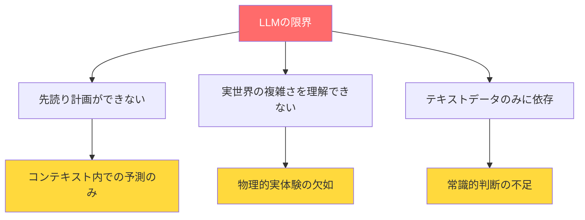
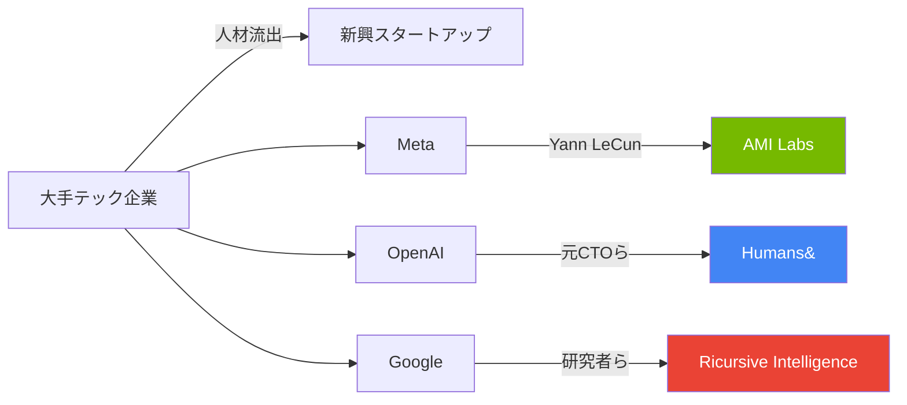
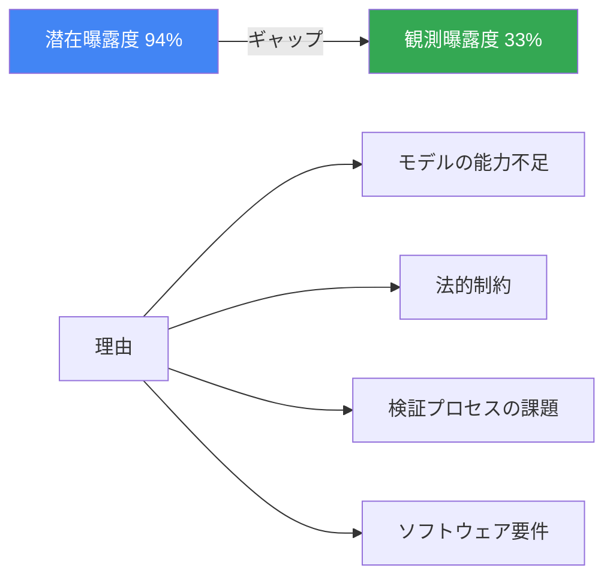

# AIの父Yann LeCunが新スタートアップ「AMI Labs」を設立ーLLMの限界を超える

📌 **3行でわかるこの記事**
- チューリング賞受賞者Yann LeCun氏がMetaを離れ、新スタートアップ「AMI Labs」を設立
- 同社はわずか1ヶ月で**10億ドル以上の資金調達**に成功、評価額は35億ドル
- LLMの「先を読んで計画する能力」の欠如を解決し、真の機械知能を目指す

---

## はじめに

2026年3月10日、AI研究の世界的権威である**Yann LeCun氏**が、MetaのチーフAIサイエンティストを退職し、新たに設立したスタートアップ「**Advanced Machine Intelligence Labs（AMI Labs）**」が10億ドル以上のシード資金を調達したことが発表されました。

LeCun氏は「現在のLLM（大規模言語モデル）のアプローチでは真の知能には到達できない」と主張し、MetaやOpenAIなどの大手企業とは異なるアプローチで機械知能の構築を目指しています。


## Yann LeCun氏とは

### チューリング賞受賞の実績

Yann LeCun氏は、2018年にGeoffrey Hinton氏、Yoshua Bengio氏と共に**チューリング賞**（コンピュータ科学界のノーベル賞）を受賞しました。彼らの研究は、現代のAIの基盤となる**ディープラーニング技術**を確立しました。

```
主な功績：
- 畳み込みニューラルネットワーク（CNN）の開発
- バックプロパゲーションアルゴリズムの実用化
- 現代LLMの技術的基盤の確立
```

### Metaでの業績

Meta（旧Facebook）では2013年からチーフAIサイエンティストとして、AI研究部門FAIR（Fundamental AI Research）を牽引。画像認識、自然言語処理、そして初期の大規模言語モデルの研究に大きく貢献しました。

## AMI Labsの概要

### 会社基本情報

| 項目 | 内容 |
|------|------|
| 会社名 | Advanced Machine Intelligence Labs（AMI Labs） |
| 設立 | 2026年2月 |
| 創業者 | Yann LeCun、Alex LeBrun（CEO）他 |
| 従業員数 | 約12名 |
| 本社 | 米国 |

### 資金調達の詳細

```
調達額：10億ドル以上
評価額：35億ドル
投資家：Jeff Bezos（Amazon創業者）、Mark Cuban他
```

わずか1ヶ月のスタートアップがこの評価額を得たことは、投資家が**経験豊富なAI研究者への信頼**を示しています。

## LLMの限界とAMI Labsの解決策

### LeCun氏が指摘するLLMの問題点

LeCun氏は長年、現在のLLMのアプローチには根本的な問題があると主張してきました：



### AMI Labsのアプローチ

AMI Labsは、LLMにはない「**先を見通して計画する能力**」を持つシステムの構築を目指しています。

> 「現在の技術では、ロボットを家庭や路上といった開放的な環境に連れて行っても役に立たない。我々は、新しい状況により多くの常識で対応できるようにしたい」
> — Alex LeBrun（AMI Labs CEO）

#### 具体的な技術的目標

- **世界モデル（World Models）**の構築：物理的実世界を理解・予測できるシステム
- **計画能力の実装**：単なるテキスト生成ではなく、目的を持った行動計画
- **自己学習能力**：人間のように環境から学習できるアーキテクチャ

## 類似スタートアップとの比較

### AI人材流出の背景

最近、大手テック企業から独立してスタートアップを設立する著名AI研究者が増えています：

| スタートアップ | 創業者 | 評価額 | 特徴 |
|---------------|--------|--------|------|
| AMI Labs | Yann LeCun（Meta） | 35億ドル | LLMを超える機械知能 |
| Project Prometheus | - | 62億ドル | Bezos氏らが投資 |
| Humans& | 元OpenAI/Anthropic | 40億ドル以上 | 詳細非公開 |
| Ricursive Intelligence | 元Google | 40億ドル以上 | 詳細非公開 |



## Anthropic研究：AIと雇用への影響

同時期、AnthropicはAIが労働市場に与える影響に関する重要な研究を発表しました。この研究は、AMI Labsの方向性がなぜ重要かを理解するヒントになります。

### AI曝露度の分析

Anthropicの研究では、各職業がAIにどの程度影響を受けるかを分析：

- **潜在曝露度**：AIが理論上自動化できるタスクの割合
- **観測曝露度**：実際にAIで自動化されているタスクの割合

```
職業別 観測曝露度（上位）：
- コンピュータプログラマー：75%
- カスタマーサービス：70%
- データ入力：67%
- 医療記録専門職：67%
```

### 重要な発見

現在のLLMベースのAIでは、理論的な自動化可能性と実際の自動化率の間に大きなギャップがあります：



この研究結果は、**現在のLLMでは実現できない能力**が必要とされていることを示唆しており、AMI Labsのアプローチの意義を裏付けています。

## 技術的な課題と展望

### 「計画する能力」とは

LLMは次のトークンを予測するだけのシステムです。一方、人間は：

1. 目標を設定
2. 複数の選択肢を検討
3. 結果を予測
4. 最適な行動を選択

この「計画」プロセスをAIに組み込むことが、AMI Labsの技術的課題です。

### 応用分野

AMI Labsの技術が実現すれば、以下の分野で革新が期待できます：

- **医療診断**：複雑な症状を統合的に分析
- **ロボティクス**：家庭内での柔軟な対応
- **科学研究**：仮説生成と実験計画

## 市場への影響

### AI投資競争の激化

AMI Labsの巨額調達は、AI分野への投資熱が続いていることを示しています：

> 「多くの金融アナリストや業界関係者がAIバブルを警告する中、投資家は経験豊富なAI研究者への巨額のベットを続けている」
> — The New York Times

### Nvidiaとの連携

同じ時期、Mira Murati氏（元OpenAI CTO）のスタートアップ「Thinking Machines」がNvidiaからチップ供給契約を締結したことも発表されました。NvidiaのVera Rubinシステムを2027年初頭から導入予定です。

## まとめ

Yann LeCun氏のAMI Labs設立は、AI分野に重要な転換点をもたらす可能性があります：

1. **パラダイムシフト**：LLMから「真の機械知能」への移行を目指す
2. **巨額投資**：10億ドル超の調達で、長期的な研究開発が可能に
3. **実用的応用**：ロボティクスや医療での革新が期待

現在のAIブームの中で、LeCun氏のような重鎮が「異なる道」を模索することは、業界全体にとって健全な発展をもたらすでしょう。

---

## 参考リンク

1. [Former Meta A.I. Chief's Start-Up Is Valued at $3.5 Billion - The New York Times](https://www.nytimes.com/2026/03/10/technology/ami-labs-yann-lecun-funding.html)
2. [Labor market impacts of AI - Anthropic Research](https://www.anthropic.com/research/labor-market-impacts)
3. [AI startup Thinking Machines clinches capital and a major chip supply deal from Nvidia - Reuters](https://www.reuters.com/business/ai-startup-thinking-machines-clinches-capital-major-chip-supply-deal-nvidia-2026-03-10/)
