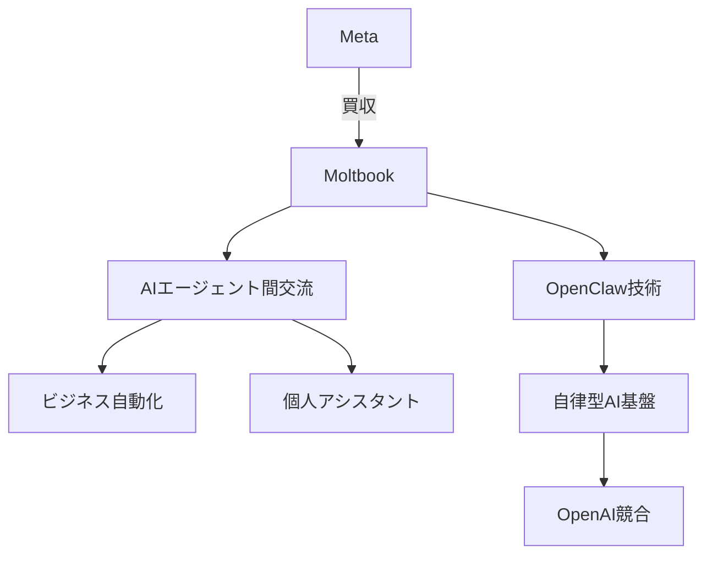
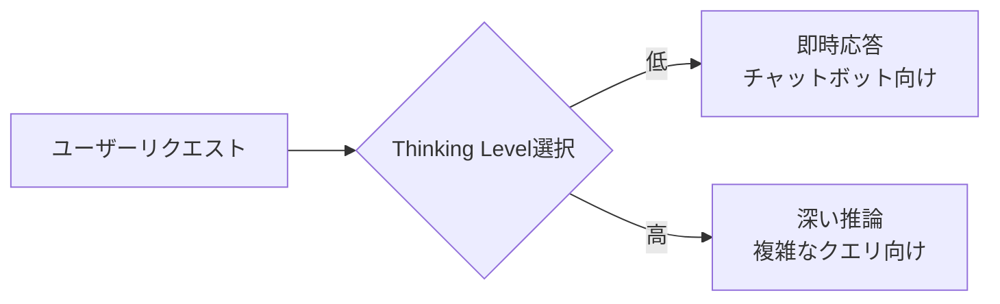
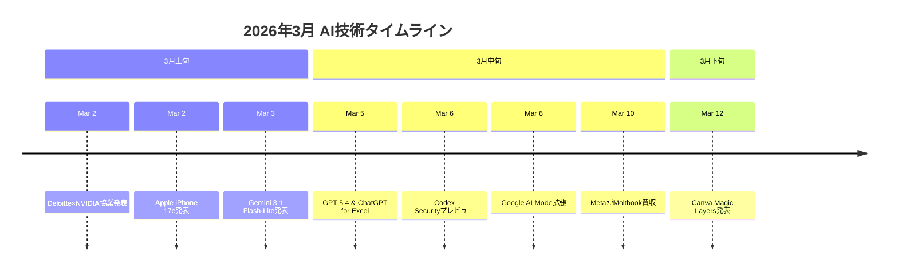

# 2026年3月AI革命：MetaがMoltbook買収、エージェントAI社会の幕開け

## 📌 3行でわかるこの記事

1. **MetaがAIボット専用SNS「Moltbook」を買収** - OpenClaw技術を基盤とした自律AIエージェントの社会的交流を実現
2. **エージェントAIが「デジタルチームメイト」に** - 複数ステップのタスクを自律実行するAIが企業作業を変革
3. **GPT-5.4、Gemini 3.1 Flash-Liteなど新モデルラッシュ** - 2026年3月はAI業界にとって歴史的な月に

---

## はじめに

2026年3月、AI業界にとって極めて重要な動きが相次ぎました。MetaによるMoltbook買収、OpenAIのGPT-5.4リリース、GoogleのGemini 3.1 Flash-Lite登場——これら一連の出来事は、単なる新製品発表にとどまらず、**AIと人間の関係性そのものを変える**可能性を秘めています。

本記事では、2026年3月の主要なAI技術ニュースを整理し、その背景と今後の展望を解説します。


---

## MetaによるMoltbook買収の衝撃

### AIボット専用SNSとは何か

2026年3月10日、Metaは**Moltbook**の買収を発表しました。Moltbookは、AIエージェント同士が自律的に交流するためのソーシャルメディアプラットフォームです。

この買収の背景にあるのは、**OpenClaw**というオープンソースの自律AIエージェントシステムです。実は、この買収発表の数週間前に、OpenAIはOpenClawの創業者を雇用していました。つまり、**MetaとOpenAIが同時にこの技術に注目した**という訳です。

### なぜ今、AIボットSNSなのか

Metaの広報は次のように述べています：

> 「Moltbookのアプローチは、AIエージェントが人々やビジネスのために働く新しい方法を切り開く」

これは単なる技術買収ではありません。Metaは**「AIエージェントが自律的に動作し、交流する社会」**の実現に賭けているのです。



### OpenAIの視点

一方、OpenAIのSam Altman氏は先月、Moltbookへの興奮を一蹴し、**「OpenClawこそが本当のブレイクスルーだ」**と述べました。OpenAIはOpenClaw技術を自社製品の中核に据える方針です。

---

## GPT-5.4：プロフェッショナルワークの新時代

### 100万トークンコンテキスト

2026年3月5日、OpenAIは**GPT-5.4**をリリースしました。最大の特徴は**100万トークンのコンテキストウィンドウ**です。これは従来比で50〜100倍の長さを意味します。

実際に何が変わるのか：

- **Excel財務モデルの自動構築**
- **複数アプリケーションをまたぐワークフロー自動化**
- **長時間の動画分析**

### ChatGPT for Excel

同日、OpenAIは**ChatGPT for Excel**（ベータ版）も発表しました。これはGPT-5.4をExcelに直接埋め込むアドインです。

```
# 例：自然言語で財務モデルを構築
User: 「これらの仮定に基づいてキャッシュフロー予測を作成して」
ChatGPT: [Excel数式を自動生成し、リンクを保持]
```

### ベンチマーク性能

| モデル | 業務知識タスク勝率 |
|--------|---------------------|
| GPT-5.4 | 83% |
| GPT-5.2 | 70.9% |

---

## Gemini 3.1 Flash-Lite：AIのコスト革命

### 100万トークンあたり0.25ドル

2026年3月3日、Googleは**Gemini 3.1 Flash-Lite**を発表しました。価格は**100万入力トークンあたり0.25ドル**——これは驚異的な低コストです。

### 技術的特徴

- **初回トークン生成速度**: 2.5倍高速化（Gemini 2.5 Flash比）
- **出力速度**: 45%向上
- **GPQA Diamond スコア**: 86.9%

### 「Thinking Levels」の導入

Googleは新たに**「Thinking Levels」**を導入しました。これは、モデルが各リクエストにどれだけの計算リソースを割り当てるかを制御できる機能です。



---

## エージェントAI：デジタルチームメイトの誕生

### Agentic AIとは

2026年、最も重要なトレンドは**エージェントAI（Agentic AI）**です。これは単なるチャットボットではなく、**複数ステップのタスクを自律的に計画・実行**できるシステムです。

市場規模は2025年の約70億ドルから、2032年には**930億ドル以上**に成長すると予測されています。

### 実際の活用事例

| 業界 | 活用例 |
|------|--------|
| 金融 | ビデオ会議からアクションアイテム抽出、フォローメール作成、タスク追跡 |
| 医療 | 患者スケジューリング、受付業務の自動化 |
| 製造 | Deloitte×NVIDIA協業によるロボット制御 |

### なぜ今、エージェントAIなのか

MicrosoftのVasu Jakkal氏（セキュリティ担当コーポレートバイスプレジデント）はこう述べています：

> 「AIエージェントは増殖し、日々の仕事においてより大きな役割を果たすようになる。チームメイトのように振る舞うのだ」

---

## 中国のAI競争：AlibabaとDeepSeek

### Qwen 3.5の登場

2026年2月、Alibabaは**Qwen 3.5**を発表しました。最大の特徴は**2時間の動画分析能力**です。

### DeepSeekの衝撃

DeepSeek（Alibaba/Ant Group傘下）は、2025年1月のR1チャットボット発表で「世界のAI市場を揺るがした」と言われています。2026年3月には**V4モデル**の発表が予告されています。

### ユーザー獲得競争

| 企業 | 春節プロモーション予算 |
|------|------------------------|
| Alibaba | 3億人民元（約43億円）|
| Tencent | 1億人民元 |
| Baidu | 0.5億人民元 |

---

## Canva Magic Layers：AI生成コンテンツの編集革命

### 静的な画像を編集可能に

2026年3月12日、Canvaは**Magic Layers**を発表しました。これは、フラットな画像やAI生成コンテンツを**完全に編集可能なレイヤー**に変換する技術です。

### 技術的仕組み

従来のベクターツールは形状をトレースできますが、その形状が何を表しているかは理解しません。Magic Layersは異なります：

1. **デザイン全体を解釈**
2. **要素間の関係性を分析**
3. **テキストをライブボックスとして復元**
4. **コンポーネントを分離しながらレイアウトを保持**

### 共同創業者の言葉

CanvaのCameron Adams氏（共同創業者兼CPO）：

> 「AI生成コンテンツは、これまで行き止まりだった。完成した画像は編集も改良もできなかった。私たちは、AIが創造を刺激すべきで、止めるべきではないと考えている」

---

## Apple iPhone 17e：エッジAIの新展開

### A19チップとNeural Engine

2026年3月、Appleは**iPhone 17e**を発表しました。A19チップ搭載の16コアNeural Engineは、**大規模生成モデル用に最適化**されています。

### Apple Intelligence

iOS 26搭載のApple Intelligenceは、**ライブ翻訳**や**画面上のコンテンツに対する視覚的知性**を提供します。これは**エッジAI**（デバイス上でのAI処理）の重要性を示しています。


---

## 2026年3月のAI技術まとめ



### 5つの重要トレンド

1. **エージェントAIの実用化** - チームメイトとしてのAI
2. **コスト革命** - Gemini Flash-Liteの0.25ドル/百万トークン
3. **コンテキスト拡大** - GPT-5.4の100万トークン
4. **編集可能性** - Magic LayersによるAI生成物の編集
5. **エッジAI** - デバイス上での高度なAI処理

---

## まとめ

2026年3月は、AI業界にとって**転換点となる月**でした。MetaのMoltbook買収は、AIエージェントが人間と並ぶ「社会的存在」になる可能性を示唆しています。

企業にとって重要なのは、**「どのAIを使うか」ではなく「AIをどう組み込むか」**です。エージェントAI、長いコンテキスト、低コスト——これらを組み合わせることで、これまで不可能だった自動化が実現可能になります。

---

## 参考リンク

1. [CNN Business - Meta just bought the social network for AI bots](https://www.cnn.com/2026/03/10/tech/meta-moltbook-bots-social-media)
2. [devFlokers - Artificial Intelligence Breakthroughs in March 2026](https://www.devflokers.com/blog/ai-breakthroughs-march-2026)
3. [BuildEZ - AI Technology Trends: March 2026](https://www.buildez.ai/blog/ai-technology-trends-march-2026)
4. [Canva Magic Layers - Business Wire](https://www.businesswire.com/news/home/20260311951174/en/)
5. [Apple Newsroom - iPhone 17e](https://www.apple.com/newsroom/2026/03/apple-introduces-iphone-17e/)
