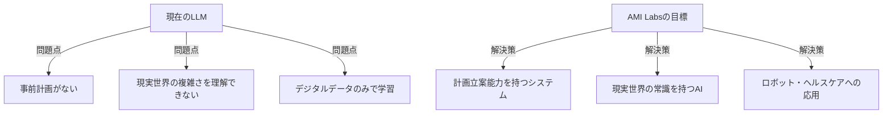
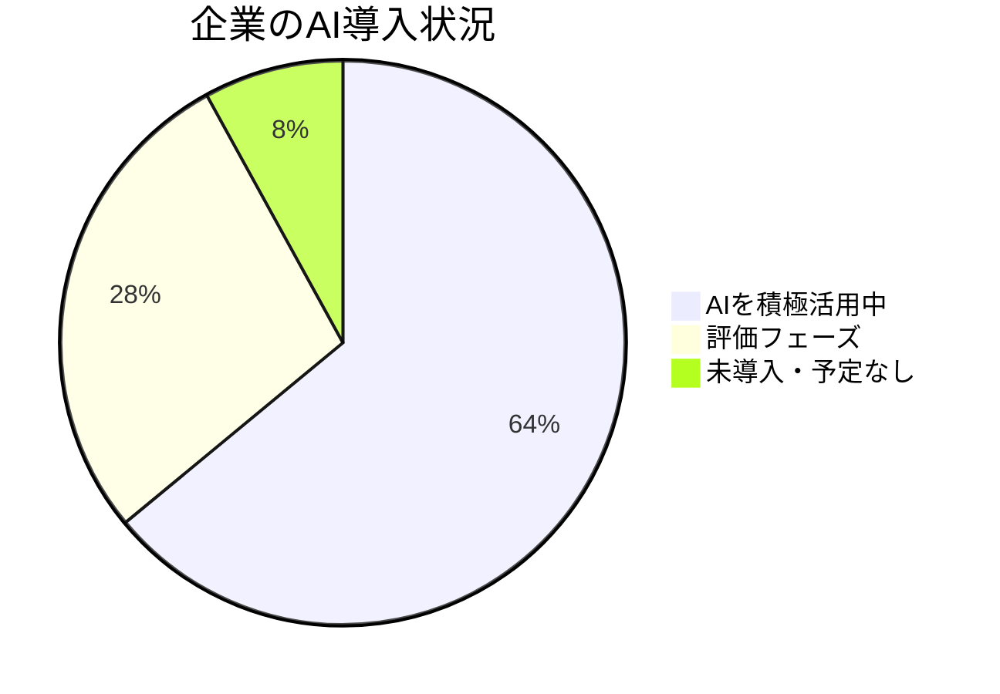
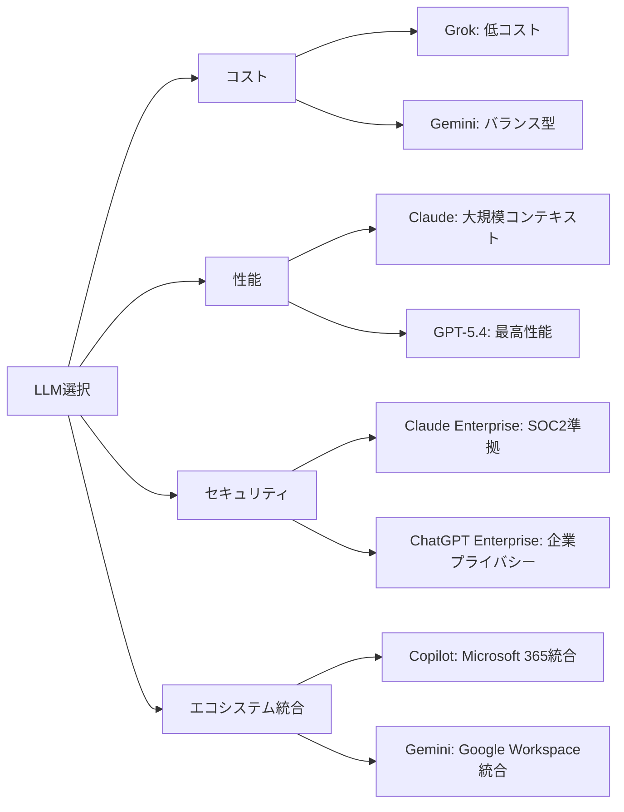

# 📌 3行でわかるこの記事

1. **Yann LeCunがMeta退職後に創業したAMI Labsが評価額35億ドルで10億ドル以上の資金調達を完了**
2. **AnthropicがAIの雇用への影響を追跡する早期警告システムを構築、プログラマーなど10職種が高リスク**
3. **NVIDIA調査で64%の企業がAIを運用中、88%が収益増加を報告、AI導入が本格化**

---

## はじめに

2026年3月、AI業界は劇的な動きを見せています。チューリング賞受賞者であるYann LeCun氏が新たに立ち上げたスタートアップが瞬く間に巨大な評価額を得た一方、AIの社会的影響に対する懸念も高まっています。

本記事では、今週最も重要な3つのAIニュースを詳しく解説します。

---

## 1. Yann LeCunのAMI Labsが評価額35億ドルで資金調達

### 元Meta AIチーフが挑む「真の知能」


2025年末、Yann LeCun氏はMetaのチーフAIサイエンティストを退職し、新たなスタートアップ「**Advanced Machine Intelligence Labs（AMI Labs）**」を立ち上げました。

#### 📊 AMI Labsの概要

| 項目 | 内容 |
|------|------|
| 創業者 | Yann LeCun（チューリング賞受賞者） |
| 評価額 | **35億ドル（約5,200億円）** |
| 調達額 | **10億ドル以上（約1,500億円）** |
| 従業員数 | 12名（創業1ヶ月） |
| 投資家 | Jeff Bezos、Mark Cuban他 |

### LLMの限界と新しいアプローチ

LeCun氏は長年、**大規模言語モデル（LLM）のアプローチには限界がある**と主張してきました。



> "If you try to take robots into open environments — into households or into the street — they will not be useful with current technology. We want to help them reach to new situations with more common sense."
> — Alex LeBrun, AMI Labs CEO

### 投資家が注目する理由

AIバブルの懸念がある中でも、**経験豊富なAI研究者への投資は続いています**：

- **Project Prometheus**: 62億ドル調達
- **Humans&**: 評価額40億ドル以上
- **Ricursive Intelligence**: 評価額40億ドル以上

---

## 2. AnthropicがAI雇用影響の早期警告システムを構築

### AIに最も曝される職業トップ10


Anthropic（Claudeの開発元）は、**AIがどの職業に最も影響を与える可能性があるか**を追跡する早期警告システムを構築しました。

#### 🏆 AI曝露度が高い職業トップ10

| 順位 | 職業 | AI曝露度 |
|------|------|----------|
| 1 | コンピュータプログラマー | **75%** |
| 2 | カスタマーサービス担当 | **70%** |
| 3 | データ入力作業員 | **67%** |
| 4 | 医療記録専門家 | **67%** |
| 5 | 市場調査アナリスト | **65%** |
| 6 | 営業担当 | **63%** |
| 7 | 金融・投資アナリスト | **57%** |
| 8 | ソフトウェア品質保証 | **52%** |
| 9 | 情報セキュリティアナリスト | **49%** |
| 10 | コンピュータサポート専門家 | **47%** |

### 重要な発見

```python
# AI曝露度の計算方法（概念）
def calculate_ai_exposure(job):
    """
    職業のAI曝露度を計算
    
    考慮事項:
    - AIで自動化可能なタスクの割合
    - 各タスクの頻度
    - AIの現在の能力とのギャップ
    """
    tasks = get_job_tasks(job)
    ai_capable_tasks = [
        t for t in tasks 
        if can_ai_perform(t)
    ]
    return len(ai_capable_tasks) / len(tasks)
```

#### 📈 主な洞察

- **高曝露職業の特徴**: 年齢層が高い、女性が多い、学歴が高い、給与が高い
- **現時点での雇用への影響**: 「限定的な証拠」のみ
- **将来の予測**: AI曝露度が高い職業は2034年までに成長が鈍化する可能性

### 若者の意識の変化

**Gen Zの77%**が「将来の仕事が自動化されにくいことが重要」と回答。大工、配管工、電気工事士といった**熟練労働への関心が高まっています**。

---

## 3. 企業のAI導入が本格化：NVIDIA「State of AI 2026」レポート

### AI導入の現状


NVIDIAが発表した年次「State of AI」レポート（3,200以上の回答）から、企業のAI導入が本格化していることが明らかになりました。

#### 📊 AI導入の数字で見る現状



### 地域別のAI導入率

| 地域 | AI導入率 | 評価中 | 未導入 |
|------|----------|--------|--------|
| 北米 | **70%** | 27% | 3% |
| EMEA | **65%** | - | - |
| APAC | **63%** | - | 15% |

### AIのビジネスインパクト

#### 💰 収益への影響

- **88%**の企業が「AIは年間収益の増加に貢献」と回答
- **30%**が「収益が10%以上増加」と報告
- **33%**が「5-10%の収益増加」

#### ⚡ 生産性への影響

- **53%**が「従業員の生産性向上」が最大のインパクト
- テレコミュニケーション業界では**99%**が生産性向上を報告
- **42%**が運用効率の改善を報告

### 具体的な活用事例：PepsiCoのケース

PepsiCoはSiemensとNVIDIAと協力し、**デジタルツイン**を活用：

- **処理能力20%向上**
- **設計サイクルの短縮**
- **設計検証率ほぼ100%**
- **資本支出10-15%削減**

```python
# デジタルツインの活用イメージ
class DigitalTwin:
    def __init__(self, factory):
        self.physical_factory = factory
        self.virtual_model = self.create_3d_model()
        
    def simulate_change(self, modification):
        """
        物理的な変更前に仮想環境でシミュレート
        90%の潜在的問題を事前に特定可能
        """
        results = self.run_simulation(modification)
        return self.analyze_impact(results)
```

---

## 4. 2026年のLLM状況：主要モデル比較

### 最新モデル一覧（2026年3月時点）

| プロバイダー | モデル | 特徴 |
|--------------|--------|------|
| OpenAI | GPT-5.4 | 最高の汎用性 |
| Anthropic | Claude Opus 4.6 | 100万トークンコンテキスト（実験的） |
| Google | Gemini 3.1 Pro | 100万トークン、マルチモーダル |
| xAI | Grok | コスト効率最高 |
| DeepSeek | V3.2 | 685Bパラメータ |

### 企業向けLLM比較のポイント



---

## まとめ：2026年3月のAI業界の動向

### 今月のキーテイクアウト

1. **「真の知能」への挑戦**: LLMの限界を超える新しいアプローチが投資を集めている
2. **雇用への影響の可視化**: AIの影響を受けやすい職業が明確になり、対策が始まっている
3. **企業導入の成熟**: パイロットから本格運用へ、ROIが実証されつつある

### 今後注目すべき動向

- AMI Labsの「計画型AI」の具体的な成果
- AI曝露度が高い職業の雇用統計の変化
- 企業のAI ROIの推移

---

## 参考リンク

1. [NVIDIA State of AI Report 2026](https://blogs.nvidia.com/blog/state-of-ai-report-2026/)
2. [Anthropic Labor Market Impacts Research](https://www.anthropic.com/research/labor-market-impacts)
3. [NYTimes: Former Meta A.I. Chief's Start-Up Is Valued at $3.5 Billion](https://www.nytimes.com/2026/03/10/technology/ami-labs-yann-lecun-funding.html)
4. [LLM Stats - Latest AI Updates](https://llm-stats.com/llm-updates)
5. [CBS News: Anthropic AI Jobs Exposure](https://www.cbsnews.com/news/anthropic-ai-jobs-most-exposed-risk/)
