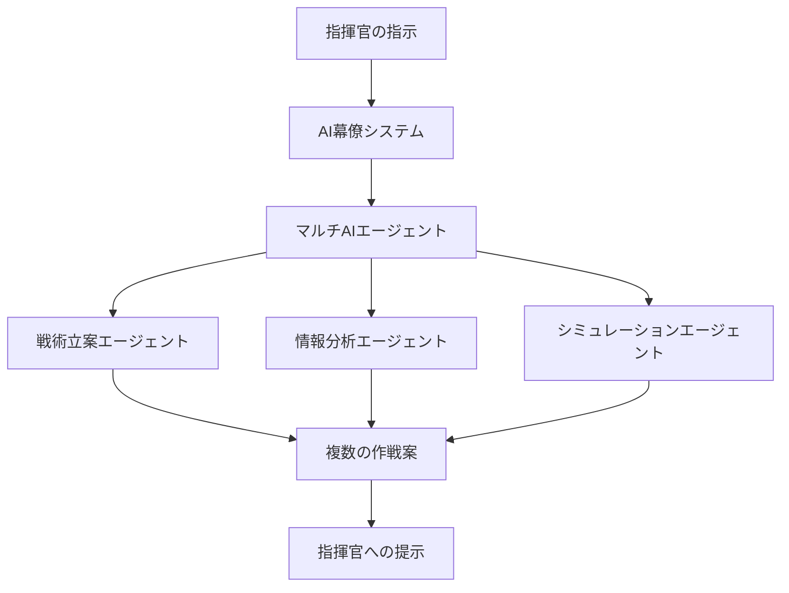
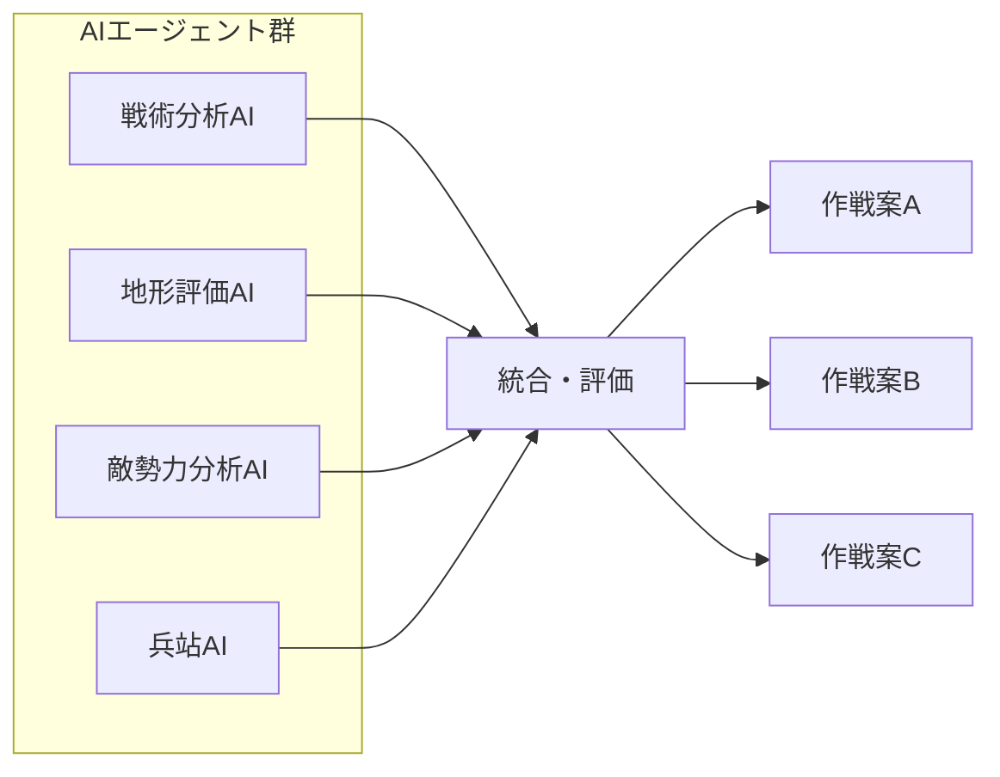
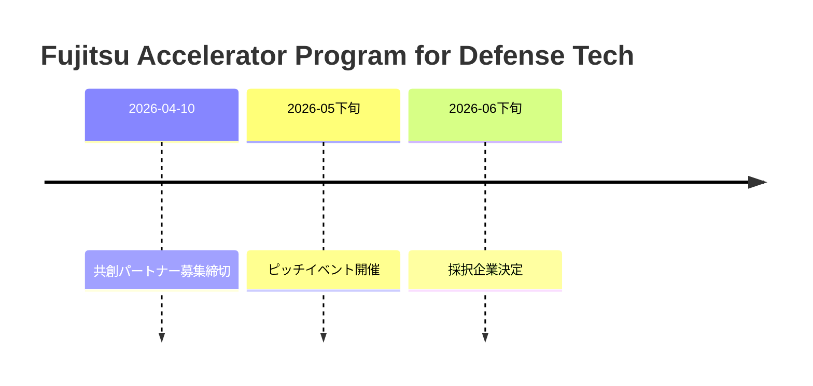

# 📌 3行でわかるこの記事

1. 富士通が防衛装備庁から「AI幕僚」開発の委託研究を受託
2. 複数のAIが協調して自律的に結論を導き出す「防衛用マルチAIエージェント」を開発
3. 独自の特化型LLM「Takane」を採用し、エッジデバイスでの運用を実現

---


## はじめに

2026年3月10日、富士通は防衛装備庁から自衛隊の指揮官の意思決定を支援するAIエージェントの開発に向けた委託研究を受注したことを発表しました。これは、**複数のAIが協調して自律的に結論を導き出す「防衛用マルチAIエージェント」**の研究開発を通じ、指揮官を補佐する「AI幕僚能力」の獲得を目指す画期的なプロジェクトです。

本記事では、この「AI幕僚」システムの技術的特徴と、その社会的影響について詳しく解説します。

## AI幕僚とは何か

### 概要

「AI幕僚」とは、自衛隊の指揮官の意思決定を支援するAIエージェントシステムです。以下の3つの目的が設定されています：

1. **意思決定の迅速化**
2. **情報収集および分析能力における優位性の確保**
3. **隊員の負担軽減と省人化**



### マルチAIエージェントの仕組み

このシステムでは、**目標を指示すると達成に必要な作業を自律的に考案し実行するAIエージェント**を活用します。人間の認知能力を超える膨大な戦場データや複雑化する作戦展開に対応するために、複数の専門性を持つAIエージェントが協調して動作します。

## 技術的特徴

### 1. 戦い方を創出する技術

多様な専門性を持つ複数のAIエージェントをデジタル空間上に再現し、多面的な議論を行わせることで、指揮官に**複数の作戦案を提示**します。



### 2. シミュレーション言語への変換技術

AIが自然言語で生成した作戦案を、計算機上のシミュレーション環境で即座に検証できるよう、**特定のシミュレーションコードへ自動変換**する仕組みを構築します。

```python
# 概念例：自然言語からシミュレーションコードへの変換
natural_language_plan = """
部隊Aは北側から接近し、部隊Bは東側から支援を行う。
"""

# AIが生成するシミュレーションコード（イメージ）
simulation_code = {
    "units": [
        {"id": "A", "approach": "north", "action": "main_assault"},
        {"id": "B", "approach": "east", "action": "support"}
    ],
    "timing": "simultaneous",
    "terrain_factors": ["visibility", "mobility"]
}
```

## Takane：独自LLMの採用

技術基盤には、富士通が開発した**特化型大規模言語モデル「Takane」**を採用しています。

### Takaneの特徴

| 特徴 | 説明 |
|------|------|
| **1ビット量子化技術** | モデルのパラメータ情報を圧縮 |
| **メモリ消費削減** | 最大94%削減 |
| **精度維持** | 圧縮しても精度を保持 |
| **エッジ運用** | ローエンドGPU1基で稼働可能 |


この技術により、**ハイエンドGPUを複数必要としていた大規模な生成AIモデルをローエンドGPU1基で稼働**させることが可能になり、クラウド環境に依存しないエッジデバイスや過酷な現場での運用が実現します。

## オープンイノベーションプログラム

富士通は自社単独での開発にとどまらず、**日本初の防衛テック・オープンイノベーションプログラム**と位置づける「Fujitsu Accelerator Program for Defense Tech」を立ち上げました。

### プログラムの概要



- 民生品やサービスを手掛ける**非防衛産業分野のスタートアップ企業**からテクノロジーやアイデアを公募
- 採折企業には**開発費用が提供**される
- 防衛省への導入実績を積む機会が与えられる

## 他のAI技術動向との関連

### Morgan Stanleyの警告

同時期、Morgan Stanleyは「2026年前半に**大規模なAIのブレイクスルー**が来る」と警告しています。OpenAIのGPT-5.4「Thinking」モデルは、経済的に価値のあるタスクにおいて**人間の専門家レベル以上の83.0%**をGDPValベンチマークで記録しました。


### MetaのAIエージェント買収

MetaもAIエージェント分野で活発で、**AIボット向けソーシャルネットワーク「Moltbook」を買収**しました。OpenClawというオープンソースの自律AIエージェント技術が注目されています。

## 考察と今後の展望

### 軍事分野におけるAIの意義

AI幕僚システムは、以下のような変革をもたらす可能性があります：

1. **意思決定の高速化**: 人間では処理できない膨大なデータを瞬時に分析
2. **リスクの可視化**: 複数のシナリオを自動シミュレーション
3. **人的リソースの最適化**: 繰り返し作業の自動化

### 技術的課題

- **説明可能性**: AIの判断根拠を人間が理解できる形で提示する必要性
- **セキュリティ**: 敵対的攻撃に対する耐性
- **倫理的配慮**: 自動化による誤判断の防止

## まとめ

富士通の「AI幕僚」開発は、日本の防衛技術における重要なマイルストーンです。独自LLM「Takane」を活用したエッジ運用可能なシステムは、過酷な現場環境での実用性を考慮した設計となっています。

また、オープンイノベーションプログラムを通じて、スタートアップ企業の技術を取り込む姿勢は、日本の防衛産業のあり方を変える可能性を秘めています。

---

## 参考リンク

1. [富士通、防衛装備庁から「AI幕僚」開発を受託 - ビジネス+IT](https://www.sbbit.jp/article/cont1/182613)
2. [Morgan Stanley warns an AI breakthrough Is coming in 2026 - Fortune](https://fortune.com/2026/03/13/elon-musk-morgan-stanley-ai-leap-2026/)
3. [Meta just bought the social network for AI bots - CNN Business](https://edition.cnn.com/2026/03/10/tech/meta-moltbook-bots-social-media)
4. [富士通公式プレスリリース](https://www.fujitsu.com/jp/)
