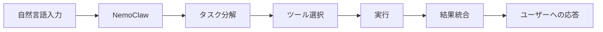
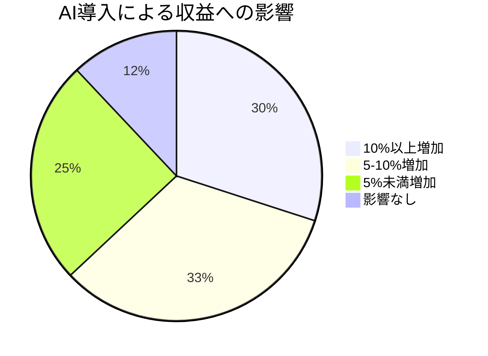
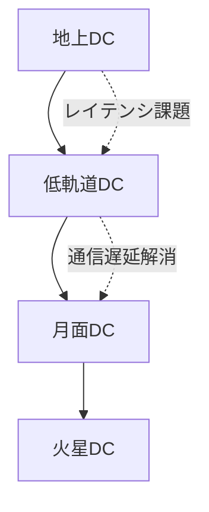

# 📌 3行でわかるこの記事

1. **NVIDIA GTC 2026**でJensen HuangCEOが約3時間の基調講演を行い、AI推論の転換点を宣言
2. **Disneyとの協業**でOlafドロイドを披露し、**NemoClaw**という新エージェントAIプラットフォームを発表
3. 企業のAI導入が加速し、**88%が収益増加**、生産性向上を実現していることがState of AI Reportで明らかに

---

## はじめに

2026年3月、サンノゼで開催されたNVIDIA GTC（GPU Technology Conference）は、AI業界にとって重要な転換点となりました。世界で最も価値の高い企業（時価総額5兆ドル）のCEO、Jensen Huang氏が約3時間にわたり、AIの現在地と未来を語り尽くしました。


本記事では、この歴史的なイベントのハイライトを技術的な観点から解説します。

---

## NVIDIA GTC 2026の主要発表

### Disney × NVIDIA：物理AIとロボティクスの融合

最も注目を集めた発表の一つは、**Disneyとのパートナーシップ**です。Frozenの人気キャラクター「Olaf」のAI搭載ドロイドが登場し、物理AIとロボティクスの統合を実演しました。

```
物理AIの構成要素：
├── センサーデータのリアルタイム処理
├── 自然言語による制御インターフェース
├── 物理シミュレーションとの連携
└── 自律的な意思決定エンジン
```

この技術は、エンターテインメントだけでなく、産業用ロボットや医療機器への応用も期待されています。

### NemoClaw：エージェントAIプラットフォーム

NVIDIAは新しいエージェントAIプラットフォーム「**NemoClaw**」を発表しました。これは、バイラルなAIエージェント「OpenClaw」に着想を得た開発者向けツールです。



エージェントAIの特徴：
- マルチモーダル入力対応
- 自律的なタスク分解と実行
- ツール連携の自動化
- リアルタイム推論

### 推論の転換点

HuangCEOは「**AI推論の転換点が到来した**」と宣言しました。

> "Finally, AI is able to do productive work, and therefore the inflection point of inference has arrived. AI now has to think. In order to think, it has to inference."

これは、AIモデルの「訓練」から「推論」への重心移動を意味します。エージェントAIが実用化されることで、AIは「考える」「実行する」「読む」という活動を通じて、継続的に推論を行う必要があります。

---

## State of AI Report 2026：企業導入の現状

NVIDIAが発表した「State of AI Report 2026」から、興味深いデータが示されました。


### 企業AI導入率

| 地域 | AI導入率 | 評価段階 | 未導入 |
|------|---------|---------|--------|
| 北米 | 70% | 27% | 3% |
| EMEA | 65% | - | - |
| APAC | 63% | - | 15% |

**大企業（1,000名以上）では76%がAIを活用**しており、わずか2%のみが未導入です。

### AIがもたらすビジネス効果



- **88%の企業が収益増加**を報告
- **53%が従業員の生産性向上**を回答
- **42%が運用効率化**を実現
- テレコム業界では**99%が生産性向上**と回答

### AI導入の主な目的

1. 運用効率化（34%）
2. 従業員の生産性向上（33%）
3. 新規ビジネス機会の創出（23%）

---

## 技術的な注目ポイント

### オンデバイスAIの重要性

Project G Assistに代表されるオンデバイスAIは、クラウドに依存しないAI利用を可能にします。

```python
# オンデバイスAIの利点（概念）
class OnDeviceAI:
    def __init__(self):
        self.latency = "低遅延"  # ネットワーク不要
        self.privacy = "高プライバシー"  # データが外部に出ない
        self.cost = "低コスト"  # API課金なし
    
    def run_inference(self, input_data):
        # ローカルで推論実行
        return self.model.predict(input_data)
```

### 新チップ「N1」「N1X」の噂

NVIDIAはMediaTekと協業し、Windows PC向けArmベースのSoCを開発中との報道があります。

| チップ | 用途 | アーキテクチャ |
|-------|------|---------------|
| N1 | モバイル/薄型ノート | Arm SoC |
| N1X | ハイエンドノート | Arm SoC + GPU |

Apple M系列やQualicon Snapdragon Xに追随する動きとして注目されています。

---

## 宇宙データセンターへの挑戦

 keynoteでは、**宇宙でのデータセンター構築**に関するティーザーも披露されました。地球外での計算インフラ構築は、将来的な火星探索や月面基地でのAI活用を見据えた長期ビジョンです。



---

## AI業界への影響と今後の展望

### エージェントAIの実用化

OpenClawのバイラル現象から派生したエコシステムは、2026年のAI業界を大きく変えました：

- OpenClaw → OpenAIに買収
- Moltbook（AIエージェント向けSNS） → Metaに買収
- Nanoclaw → Dockerと提携

この動きは、エージェントAIが次世代のUI/UXになることを示唆しています。

### セキュリティの課題

エージェントAIには**プロンプトインジェクション攻撃**のリスクがあります：

> "It is just an agent sitting with a bunch of credentials on a box connected to everything — your email, your messaging platform, everything you use"
> — Ian Ahl, CTO at Permiso Security

セキュリティ対策は、エージェントAI普及の重要な課題です。

---

## まとめ

NVIDIA GTC 2026は、AIが「訓練の時代」から「推論の時代」へ移行したことを宣言するイベントでした。企業でのAI導入が加速し、収益と生産性の向上が実証されています。

**要点：**
- Disneyとの協業で物理AIの可能性を示した
- NemoClawでエージェントAI開発を民主化
- 88%の企業がAIで収益増加
- オンデバイスAIと宇宙DCが次世代の方向性を示す

---

## 参考リンク

1. [NVIDIA GTC 2026 Keynote Recap - CNET](https://www.cnet.com/news-live/nvidia-gtc-2026-live-blog-updates/)
2. [State of AI Report 2026 - NVIDIA Blog](https://blogs.nvidia.com/blog/state-of-ai-report-2026/)
3. [The biggest AI stories of the year - TechCrunch](https://techcrunch.com/2026/03/13/the-biggest-ai-stories-of-the-year-so-far/)
4. [NVIDIA GTC Official](https://www.nvidia.com/gtc/)
