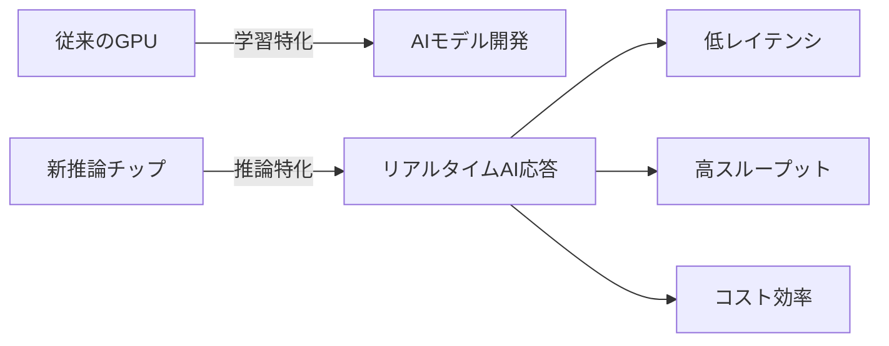
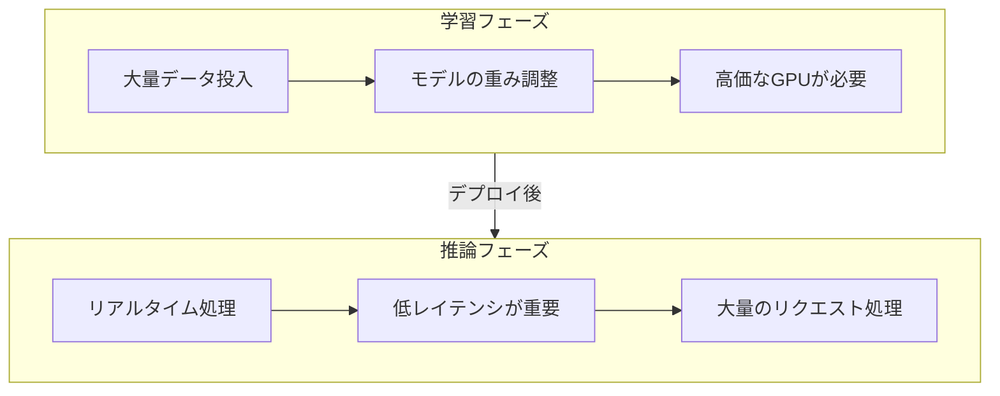
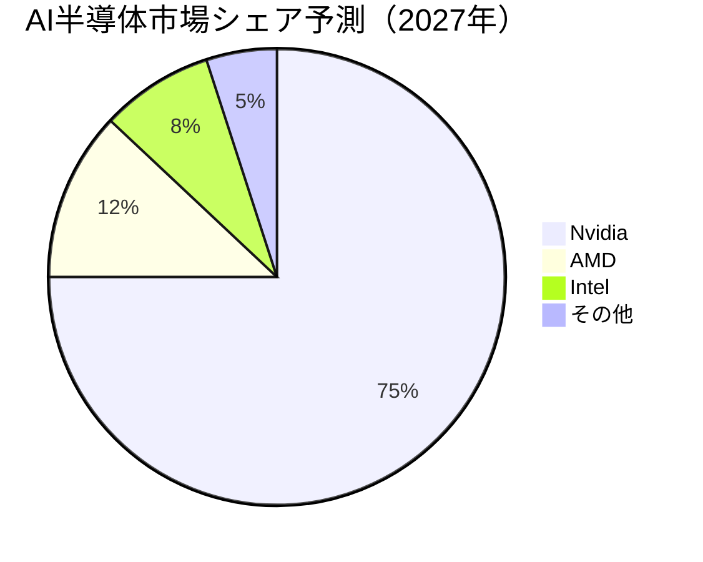
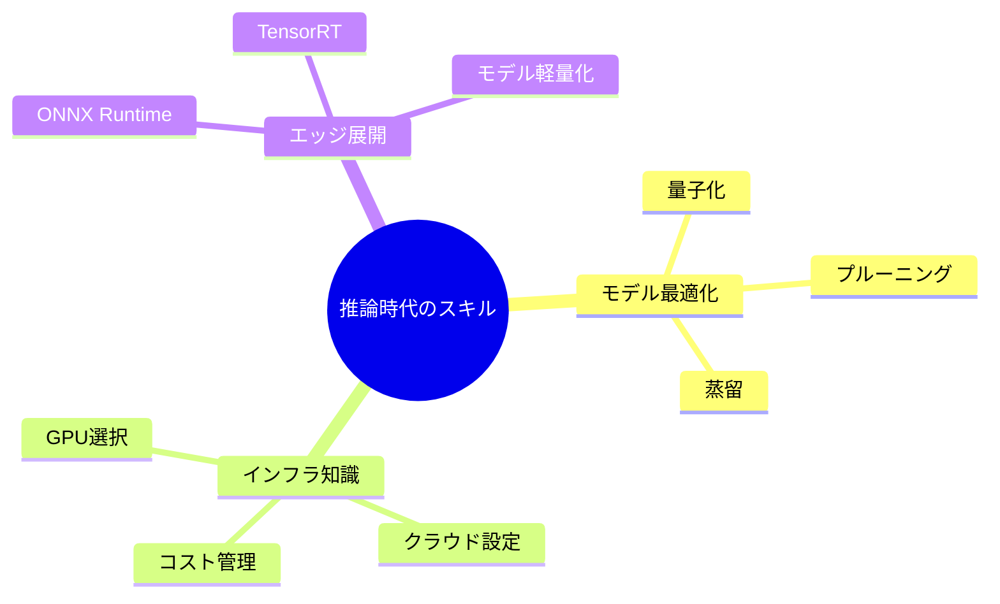

# 📌 3行でわかるこの記事

1. **Nvidia GTC 2026**でCEOイエン・スン氏がAI推論に焦点を当てた新チップ・システムを発表
2. AI半導体の収益機会は**2027年末までに1兆ドル**に達するという衝撃的な予測
3. Groq技術をベースにした新しいAI推論システムが**インファレンス市場**を本格化させる

---


## はじめに

2026年3月16日から開催された**Nvidia GTC 2026**（GPU Technology Conference）は、AI業界に衝撃を与える発表の連続でした。特に注目すべきは、従来の「学習（Training）」から「推論（Inference）」への戦略転換です。

本記事では、GTC 2026で発表された重要な内容と、それが業界にどのような影響を与えるかを解説します。

## GTC 2026の主要発表

### 1. AI推論特化型の新チップ

Nvidiaは今回、**Groqの技術をベースにした新しいAI推論システム**を発表しました。これは従来のGPUアーキテクチャとは異なる、推論専用に最適化されたアプローチです。



### 2. 1兆ドル市場の予測

イエン・スンCEOは、BlackwellおよびRubin AIチップの収益機会について以下のように述べました：

> 「2027年末までに、AI半導体の収益機会は**1兆ドル**を超える可能性がある」

これは2026年時点での5000億ドル予測から**倍増**した数字です。

### 3. CPUとAIシステムの統合

Nvidiaは新しいCPUも発表し、AIシステム全体の統合を進めています：

- **Grace CPU**: Armベースのサーバー向けプロセッサ
- **Blackwell**: 第2世代のAI向けGPU
- **Rubin**: 次世代AIチップ

## なぜ「推論」が重要なのか

### 学習 vs 推論の違い



### 推論市場が拡大する理由

1. **エッジAIの普及**: データセンターだけでなく、端末側でもAI処理が必要
2. **エージェントAI台頭**: Claude Cowork、GPT-5.4 Codexなどが自律的なタスク実行
3. **コスト最適化**: 学習よりも推論の方が、継続的なコストがかかる

## 競合他社の動向

### AMD
- **Ryzen AI 400シリーズ**: オンデバイスAI処理の強化
- 自社GPUでのAI推論市場への参入

### Intel
- Gaudi プロセッサによるAI市場への挑戦
- 推論特化型チップの開発継続

### Groq
- 独自の推論エンジンで先行
- Nvidiaとの提携で市場拡大



## 実際の影響：開発者はどう変わるか

### コード例：PyTorchでの推論最適化

```python
import torch
from transformers import AutoModelForCausalLM, AutoTokenizer

# 推論モードでの最適化
model = AutoModelForCausalLM.from_pretrained("model-name")
model.eval()  # 推論モードに切り替え

# CUDAメモリの最適化
with torch.inference_mode():
    with torch.cuda.amp.autocast():
        outputs = model(input_ids)
```

### 推論時のベストプラクティス

```python
# バッチ処理による効率化
def batch_inference(model, inputs, batch_size=32):
    """推論効率を最大化するバッチ処理"""
    results = []
    for i in range(0, len(inputs), batch_size):
        batch = inputs[i:i+batch_size]
        with torch.inference_mode():
            outputs = model(batch)
        results.extend(outputs)
    return results
```

## 産業別の影響

| 産業 | 学習段階 | 推論段階 | 影響度 |
|------|----------|----------|--------|
| ヘルスケア | 画像診断モデル | リアルタイム診断支援 | 高 |
| 金融 | リスクモデル開発 | 不正検知・価格設定 | 高 |
| 小売 | レコメンドモデル | パーソナライゼーション | 中 |
| 製造 | 品質検査モデル | 予知保全・異常検知 | 高 |

## 今後の展望

### 2027年までの予測

1. **エッジ推論の本格化**: 端末側でのAI処理が標準化
2. **コスト競争の激化**: 推論コストの削減が差別化ポイントに
3. **新規参入の加速**: 推論特化型スタートアップの増加

### 開発者が知っておくべきこと



## まとめ

Nvidia GTC 2026は、AI産業が「学習の時代」から「推論の時代」へ移行するターニングポイントとなりました。1兆ドル市場の予測は、単なる数字ではなく、この転換がどれほど大きな変化をもたらすかを示しています。

開発者として、以下を意識しておくことが重要です：

- **推論コストの最適化**: 学習だけでなく、運用コストを考慮する
- **エッジ展開**: クラウドだけでなく、オンデバイス処理の選択肢を持つ
- **継続的な学習**: 新しいチップ・フレームワークの登場に対応する

---

## 参考リンク

1. [Nvidia GTC 2026 - Official Site](https://www.nvidia.com/gtc/)
2. [Reuters - Nvidia bets on AI inference](https://www.reuters.com/world/asia-pacific/nvidia-ceo-set-reveal-new-chips-software-ai-megaconference-gtc-2026-03-16/)
3. [Latest AI & Technology News Roundup – March 2026](https://www.vtnetzwelt.com/ai-development/latest-ai-technology-news-roundup-march-2026/)
4. [AI Funding Tracker - Latest Deals](https://aifundingtracker.com/ai-startup-funding-news-today/)
