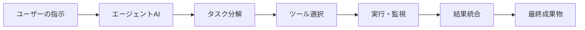
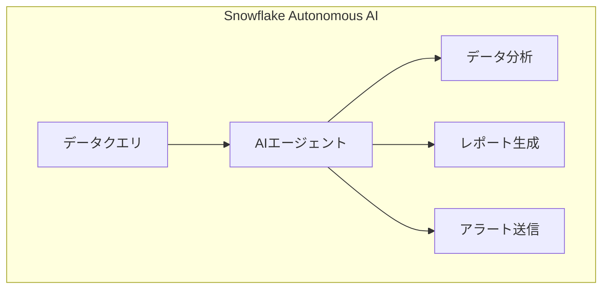

# 📌 3行でわかるこの記事

- **NVIDIA GTC 2026で「エージェントAI」がヘルスケア分野の重要な転換点に到達**
- **自律的にタスクを実行するAIが、医療診断から創薬まで幅広く活用開始**
- **IBM、Snowflake、Mistralなど主要企業が続々とエージェントAI製品を発表**

---

## はじめに

2026年3月、NVIDIAの年次カンファレンス「GTC 2026」で、**エージェントAI（Agentic AI）**がヘルスケアとライフサイエンス分野における重要な転換点に達したことが発表されました。本記事では、この技術がもたらす変革と、主要企業の最新動向を解説します。

## エージェントAIとは何か

### 従来のAIとの違い

従来の生成AIは、ユーザーの質問に対して回答を生成する「チャットボット型」が主流でした。一方、エージェントAIは**自律的にタスクを実行**し、複数のツールを連携させて目的を達成する能力を持っています。



### ヘルスケア分野での活用例

エージェントAIは、以下のようなヘルスケア領域で実用化が進んでいます：

- **医療画像診断**: 異常を自動検出し、医師に報告
- **創薬プロセス**: 化合物のスクリーニングを自律的に実行
- **臨床試験管理**: 患者データを分析し、試験設計を最適化

---

## 主要企業の動向

### NVIDIA：AIブームの次のフェーズ

NVIDIAのCEOは、AIブームの次のフェーズとして**年末までに1兆ドル規模の注文**を見込んでいると発表しました。これは、単なるGPU需要を超え、エージェントAIを含む包括的なソリューションへの需要を反映しています。

> 「エージェントAIは、単に質問に答えるだけでなく、実際に仕事をこなす能力を持つ。これは企業の生産性を根本から変革する」

### IBM：NVIDIAとの提携拡大

IBMはNVIDIAとの提携を拡大し、エンタープライズ向けAIソリューションの強化を発表しました。IBMのWatsonxとNVIDIAのAIプラットフォームを統合し、企業が独自のエージェントAIを構築できる環境を提供します。

### Snowflake：自律型AIレイヤー

Snowflakeは「自律型」AIレイヤーを発表し、**単に質問に答えるだけでなく、実際に仕事を行う**能力をデータ分析分野に導入しました。これにより、データエンジニアの作業負担が大幅に軽減されます。



### Mistral：Forgeで企業向けAIモデル構築

Mistralは「Forge」を発表し、企業が独自のAIモデルを構築・カスタマイズできるプラットフォームを提供開始しました。これにより、オープンソースモデルをベースに、社内データでファインチューニングしたエージェントAIを構築可能になります。

---

## ビッグテックのAI投資額

2026年、主要テック企業のAI投資額は**約7200億ドル（約110兆円）**に達すると見込まれています。これは2025年比で約40%の増加です。

| 企業 | 投資額（推定） | 主な投資分野 |
|------|---------------|-------------|
| Microsoft | $1,940億 | インフラ、OpenAI連携 |
| Meta | $270億 | LLM、AIエージェント |
| Amazon | $650億 | AWS AI、Bedrock |
| Google | $500億 | Gemini、研究開発 |

---

## エンジニアにとっての意味

### 必要なスキルの変化

エージェントAIの台頭により、エンジニアに求められるスキルも変化しています：

1. **プロンプトエンジニアリング**から**エージェント設計**へ
2. **単一モデル活用**から**マルチエージェントシステム**へ
3. **回答生成**から**タスク自動化**へ

### 実装例：LangGraphを使ったエージェント構築

```python
from langgraph.graph import StateGraph, END
from langchain_openai import ChatOpenAI

# エージェントの状態定義
class AgentState(TypedDict):
    task: str
    next_action: str
    output: str

# タスク分解ノード
def decompose_task(state: AgentState) -> AgentState:
    llm = ChatOpenAI(model="gpt-4")
    # タスクをサブタスクに分解
    ...

# エージェントグラフの構築
workflow = StateGraph(AgentState)
workflow.add_node("decompose", decompose_task)
workflow.add_node("execute", execute_task)
workflow.add_edge("decompose", "execute")
```

---

## 今後の展望

### 2026年後半の予測

- **医療AI認可の加速**: FDAがエージェントAIを用いた診断支援ツールを続々と承認
- **創薬コストの削減**: AI主導の創薬により、開発期間が50%短縮
- **臨床現場での実用化**: 自律型AIアシスタントが医師の診療をサポート

### 課題とリスク

エージェントAIの普及には以下の課題も存在します：

- **セキュリティリスク**: 自律的な動作による予期せぬデータアクセス
- **説明責任**: AIの判断根拠の説明が困難
- **規制の整備**: 医療分野でのAI利用に関する法整備が追いついていない

---

## まとめ

NVIDIA GTC 2026で示されたエージェントAIの進展は、ヘルスケアとライフサイエンス分野に根本的な変革をもたらす可能性を秘めています。主要企業が続々と製品を発表しており、2026年は「エージェントAI元年」となるでしょう。

エンジニアの方は、単一モデルの活用だけでなく、**マルチエージェントシステムの設計・実装**スキルを身につけることが重要です。

---

## 参考リンク

1. [NVIDIA GTC 2026 - Genetic Engineering and Biotechnology News](https://www.genengnews.com)
2. [IBM Announces Expanded Collaboration with NVIDIA - IBM Newsroom](https://newsroom.ibm.com)
3. [Snowflake's New Autonomous AI Layer - InfoWorld](https://www.infoworld.com)
4. [Mistral Forge - Computerworld](https://www.computerworld.com)
5. [Big Tech AI Investment 2026 - The Motley Fool](https://www.fool.com)

---

*この記事は2026年3月19日時点の情報に基づいています。*
