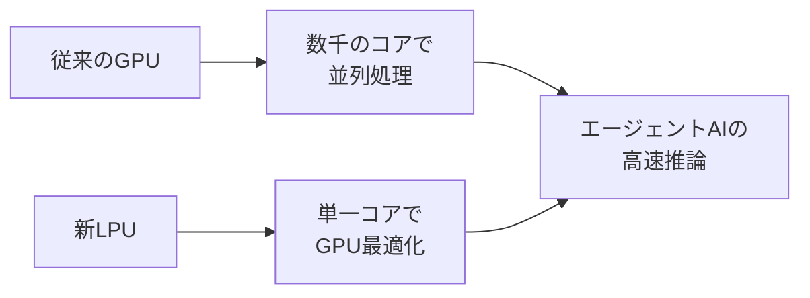
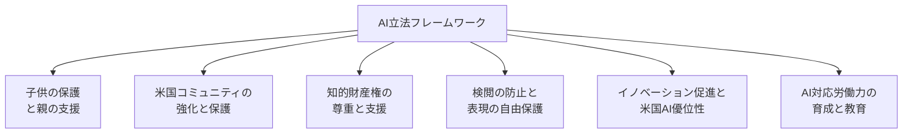
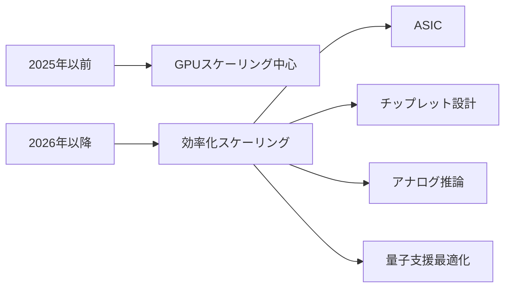

📌 **3行でわかるこの記事**

1. **Nvidia GTC 2026**で新チップ「LPU」と「Vera CPU」が発表、エージェントAI対応が本格化
2. **米国がAI規制フレームワーク**を発表、6つの重点分野で包括的な立法指針を提示
3. **2026年のAIトレンド**はエージェントAI、量子コンピューティング、ハードウェア効率化が中心に


---

## はじめに

2026年3月、AI業界は大きな転換点を迎えています。世界で最も価値のある企業となったNvidiaが年次カンファレンス「GTC 2026」を開催し、一方で米国政府は包括的なAI規制フレームワークを発表しました。

本記事では、これら最新動向を詳しく解説し、2026年のAI業界の方向性を整理します。

---

## Nvidia GTC 2026：エージェントAIの祭典

### 「AIのスーパーボウル」と呼ばれる理由

Nvidiaの年次展示会GTC（GPU Technology Conference）は、今や「AIのスーパーボウル」と呼ばれるまでになりました。2026年のイベントは、2019年の初参加時とは比べ物にならないほどの熱気に包まれていたそうです。

CNBCのKatie Tarasov氏は、CEOのJensen Huang氏が記者会見の後もセルフィーを求める群衆に囲まれる「セレブ状態」を目撃したと報告しています。

### 2つの重要なチップ発表

#### 1. Language Processing Unit (LPU)



Nvidiaが2025年12月に200億ドルで買収したGroqの技術を活用した、全く新しいタイプのチップです。

- **特徴**: GPUの処理を最適化する単一コア設計
- **目的**: エージェントAIに必要な高速推論を実現
- **背景**: 2025年12月の200億ドル規模の買収（Nvidia史上最大）

#### 2. Vera CPUラック

```python
# エージェントAIの処理フロー例
class AgenticAI:
    def __init__(self):
        self.cpu = "Vera CPU"  # 汎用計算・データ転送
        self.gpu = "Blackwell GPU"  # AI推論
        self.lpu = "Groq LPU"  # 高速推論最適化
    
    def process_task(self, task):
        # CPU: タスクの調整とデータ転送
        orchestrated_task = self.cpu.orchestrate(task)
        # GPU: AIモデルの推論
        inference = self.gpu.infer(orchestrated_task)
        # LPU: 高速レスポンス
        return self.lpu.optimize(inference)
```

Vera CPUは、エージェントAIで必要となる大量のデータ転送と汎用計算を処理するためのソリューションです。

### エージェントAIがインフレクションポイントに

Huang氏は「エージェントAIがインフレクションポイントに達した」と強調しています。

> エージェントAIは、チャットボットのような呼び応答から、タスク指向のAIエージェントへとシフトしています。これには、エージェントが他のエージェントを生成し、すべてのオーケストレーションとデータ転送を必要とするため、より高速な推論が必要です。

### Nvidiaの戦略シフト

| 従来のアプローチ | 新しいアプローチ |
|-----------------|-----------------|
| GPU中心の製品戦略 | 「スープからナッツまで」包括的戦略 |
| 単一チップ志向 | LPU、CPU、GPUを統合したラックスケール |
| チャットボット対応 | エージェントAI対応 |

---

## 米国AI規制フレームワーク：包括的な立法指針

### 6つの重点目標

2026年3月20日、トランプ政権は「National AI Legislative Framework（国家AI立法フレームワーク）」を発表しました。



#### 1. 子供の保護と親の支援

- 親が子供のデジタル環境を管理するツールの提供
- AIプラットフォームは未成年者による性搾取や自傷行為の防止機能を実装

#### 2. 米国コミュニティの強化と保護

- データセンターのオンサイト発電を許可する許認可の簡素化
- AI詐欺対策の強化
- 国家安全保障上の懸念への対処

#### 3. 知的財産権の尊重と支援

- クリエイターの権利を尊重しつつ、AIのフェアユースも認めるバランスの取れたアプローチ

#### 4. 検閲の防止と表現の自由保護

- AIシステムによる政治的表現の抑制を防止
- AIが「正しい思考」を強制する手段とならないよう監視

#### 5. イノベーション促進と米国AI優位性

- 古く不要な規制の撤廃
- AIの産業別展開の加速
- ワールドクラスのAIシステム構築に必要なテスト環境へのアクセス促進

#### 6. AI対応労働力の育成と教育

- 労働力開発とスキルトレーニングプログラムの拡大
- AI経済における新規雇用の創出

### 州法のパッチワーク回避

フレームワークの重要なポイントは、州ごとに異なる規制の乱立を避けることです。

> 統一性のない州法のパッチワークは、米国のイノベーションを損ない、グローバルなAI競争でのリーダーシップを弱めることになります。

---

## 2026年のAIトレンド：IBM専門家の予測

IBMが公開した「2026年のAIとテクノロジートレンド」レポートから、主要な予測をまとめます。

### 量子コンピューティングの実用化

> 2026年は、量子コンピュータが初めて古典コンピュータを上回る年になります。

— Jamie Garcia, IBM

- **マイルストーン**: 量子計算が古典計算を上回る問題を解決
- **応用分野**: 創薬、材料科学、金融最適化

### ハードウェア効率化が新たなスケーリング戦略に



### エージェントシステムへの移行

- **モデル単体**から**システム全体**への競争軸の移行
- マルチエージェントシステムの本格導入
- エージェント間通信プロトコル（MCP、A2A）の標準化

### オープンソースの多様化

- 中国発の多言語・推論特化モデルの台頭
- セキュリティ監査済みリリースと透明なデータパイプライン
- PyTorchなどのフレームワークが、エージェントAIの共通基盤として深化

---

## まとめ

2026年3月のAI業界は、以下の重要な転換点を迎えています：

1. **ハードウェア革新**: NvidiaがLPUとVera CPUでエージェントAI専用のインフラを構築
2. **規制の明確化**: 米国が包括的なAI立法フレームワークを提示
3. **技術の成熟**: 量子コンピューティング、エージェントAI、オープンソースが実用段階へ

エンジニアや企業にとって、これらの変化に対応する準備が重要です。特に、エージェントAIの開発スキルや、規制動向への理解は、今後の競争力を左右する要素となるでしょう。

---

## 参考リンク

1. [Nvidia GTC 2026: Agentic AI takes center stage - CNBC](https://www.cnbc.com/2026/03/20/nvidia-gtc-2026-agentic-ai-chips-tech-download.html)
2. [President Trump Unveils National AI Legislative Framework - White House](https://www.whitehouse.gov/articles/2026/03/president-donald-j-trump-unveils-national-ai-legislative-framework/)
3. [The trends that will shape AI and tech in 2026 - IBM Think](https://www.ibm.com/think/news/ai-tech-trends-predictions-2026)
