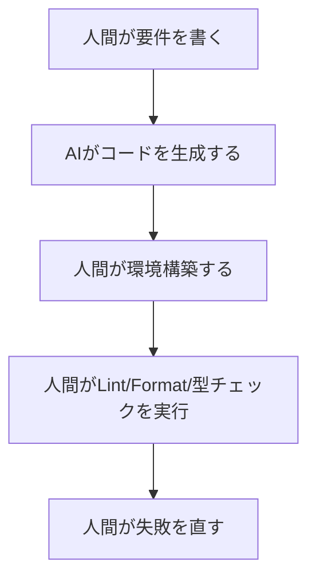
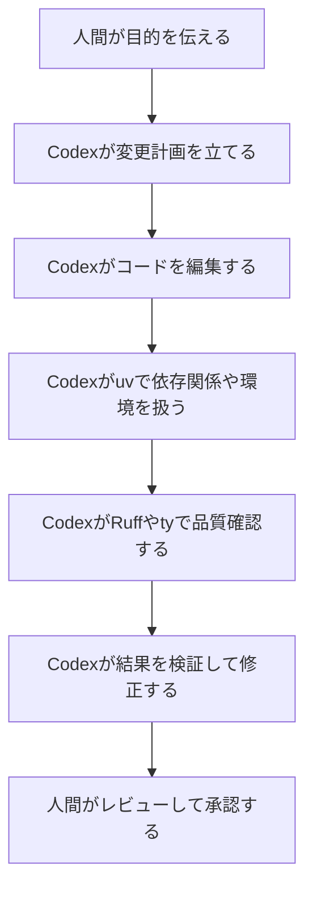

## 📌 3行でわかるこの記事

- OpenAIは2026年3月、Pythonツール群で知られるAstralを買収すると発表し、Codex強化を明言しました。
- 対象は単なるコード生成ではなく、依存関係管理・Lint・Format・型検査まで含む**開発ワークフロー全体**です。
- これは「AIがコードを書く」段階から、「AIが既存ツールと協調して開発工程に参加する」段階への移行を示しています。

---

## はじめに

2026年3月のAI技術ニュースの中でも、開発者目線でかなり重要だと感じたのが、**OpenAIによるAstral買収発表**です。

Astralは、Python開発者なら一度は名前を見たことがあるであろう **uv / Ruff / ty** を手がける会社です。OpenAIは今回の発表で、Astralのツールとエンジニアリング知見をCodexエコシステムに取り込むことで、AIがソフトウェア開発ライフサイクル全体により深く関われるようにしたいと説明しています。

派手なモデル性能競争のニュースではありませんが、実務への影響でいえばかなり大きい話です。本記事では、一次情報に基づいてこの発表を整理し、**なぜPython開発者とAIエージェントの両方にとって重要なのか**を解説します。


*出典: Astral*

## OpenAIは何を発表したのか

### 発表の要点

OpenAIは2026年3月、**Astralを買収する契約を締結した**と発表しました。OpenAIによると、買収の狙いは次の通りです。

- Astralのオープンソース開発ツールをCodexエコシステムに取り込む
- AIがコード生成だけでなく、計画・変更・ツール実行・検証・保守まで担えるようにする
- Python開発で広く使われる既存ツールとの接続を強化する

OpenAIの発表文では、Codexについて次の方向性が明示されています。

> Our goal with Codex is to move beyond AI that simply generates code and toward systems that can participate in the entire development workflow.

要するに、OpenAIは**「コード補完AI」から「開発工程に参加するAI」へ軸足を移している**わけです。

### Astral側の発表で確認できること

Astral側も同日、「OpenAIのCodexチームに加わる」と公表しています。Astralの創業者 Charlie Marsh 氏は、今後もオープンソースでの開発を継続しつつ、Codexとより自然に連携する形を探ると述べています。

ここで重要なのは、両社とも**オープンソースツールの継続支援**を明言している点です。uv や Ruff を日常的に使っている現場にとって、これはかなり大事な安心材料です。

## なぜAstralが重要なのか

### Python開発のボトルネックに直結しているから

Astralの主力ツールは、どれもPython開発の「面倒だけど外せない部分」を高速化してきました。

#### uv

uv はAstral自身の説明では、Rust製の高速なPythonパッケージマネージャーであり、後には**プロジェクト管理、ツール管理、Python自体の導入、単一ファイルスクリプト実行**まで広げた統合ツールチェーンとして位置づけられています。

#### Ruff

Ruff はLintとFormatを高速にこなすツールとして普及しました。Astralの説明では、Ruff formatter は **Black互換性99.9%以上を目指しつつ、30倍超高速** とされています。

#### ty

ty は型チェックと言語サーバーの領域を担うツールです。OpenAIの発表でも、uv・Ruff・ty がPython開発基盤として並列に紹介されていました。

### つまり、AIがつながる先として都合がいい

AIコーディングエージェントが実務で本当に役立つには、単にソースコードを吐くだけでは足りません。少なくとも以下が必要です。

- 依存関係を解決する
- 仮想環境を扱う
- LintやFormatをかける
- 型エラーを確認する
- 実行して結果を確かめる

Astralのツール群は、まさにこの一連の工程に刺さっています。

## 何が変わるのか：Codex × Astralの構図

### これまでのAIコーディング支援

これまでの多くのAIコーディング支援は、ざっくり言えば次の流れでした。



AIは便利でも、**最後の整備作業は人間がかなり担う**ことが多かったわけです。

### これからのAIコーディング支援

OpenAIの発表内容を素直に読むと、目指しているのは次の形です。



ここでのポイントは、AIが「生成」だけでなく、**既存の開発ツールを呼び出しながら反復する主体**になっていることです。

### 技術的に見ると何がうれしいか

#### 開発環境との差分が減る

AIがローカルやCIで実際に使われているツールに直接寄れるほど、
「AIが出したコードは動かない」「Lintで大量に落ちる」といった事故は減ります。

#### Pythonプロジェクトでの再現性が上がる

特にuvのようなツールと連携できるなら、依存関係や環境差分の扱いが改善しやすい。AIが変更提案だけでなく、**その変更が成立する実行環境まで意識できる**ようになる可能性があります。

#### 品質確認の自動ループが短くなる

Ruffやtyのような高速ツールは、AIエージェントとの相性がかなりいいです。実行コストが低いほど、
「生成 → 検査 → 修正」の反復回数を増やせるからです。

## 実務で起きそうな変化

### Pythonチームが受ける恩恵

#### 小さな修正の自動化が進む

たとえば以下のような作業は、AIとAstral系ツールの組み合わせでかなり自動化しやすくなります。

```bash
uv sync
ruff check . --fix
ruff format .
ty .
```

依存解決、整形、静的検査、型確認を短時間で回せるなら、AIは「1回コードを書く」だけでなく、**通るところまで持っていく**役割を持ちやすくなります。

#### レビューの重心が変わる

人間のレビューも、文法ミスや整形ズレを見る時間より、
「この設計でよいか」「仕様理解は正しいか」を見る時間に寄っていくはずです。

### ただし過大評価は禁物

OpenAIの発表は、あくまで**買収予定の発表**であり、クロージング前は両社が別会社として存在すると明記されています。つまり、現時点で深い製品統合がすぐ完了しているわけではありません。

また、次の点はまだ不確実です。

- CodexとAstralツールがどの粒度で統合されるのか
- OSS版と商用体験の差がどう設計されるのか
- CI/CDやIDEまで含めてどう広がるのか

ここは期待しつつも、**現時点では方向性が見えた段階**として受け止めるのが妥当です。

## このニュースが「最新AI技術ニュース」として面白い理由

### モデル性能ではなく、開発インフラの話だから

最近のAIニュースは、どうしてもベンチマークや新モデル名に注目が集まりがちです。でも現場に効くのは、むしろこういう**インフラ統合のニュース**だったりします。

AIエージェントが仕事を引き受けるには、基盤ツールとの接続が必須です。Astral買収は、その現実路線をかなりわかりやすく示しています。

### 「AIネイティブ開発環境」への布石に見えるから

今回の発表が示しているのは、IDEの中にチャットが載る話ではありません。もっと大きく、
**パッケージ管理・品質チェック・型検査・実行検証まで含めた開発環境そのものがAI前提で再設計される**可能性です。

個人的には、こちらのほうがよほど長期的インパクトがあります。

## まとめ

### いま押さえるべきポイント

- OpenAIはAstral買収により、Codexを開発ワークフロー全体へ広げようとしている
- Astralのuv / Ruff / ty は、Python実務の中心にあるツール群である
- 重要なのはコード生成能力そのものより、**既存ツールと連携した反復実行能力**である

#### 開発者にとっての意味

この発表は、「AIがもっと賢くなる」という話だけではありません。
**AIが、すでに現場で使われているツールチェーンに入り込み、開発フローの一部になる**という話です。

Python開発者にとっては見逃しにくいニュースですし、AIエージェント時代のソフトウェア開発を考える上でも、かなり象徴的な一手だと思います。

## 参考リンク

1. OpenAI: OpenAI to acquire Astral  
   https://openai.com/index/openai-to-acquire-astral/
2. Astral: Astral to join OpenAI  
   https://astral.sh/blog/openai
3. Astral: uv: Unified Python packaging  
   https://astral.sh/blog/uv-unified-python-packaging
4. Astral: An extremely fast, Black-compatible Python formatter  
   https://astral.sh/blog/the-ruff-formatter
