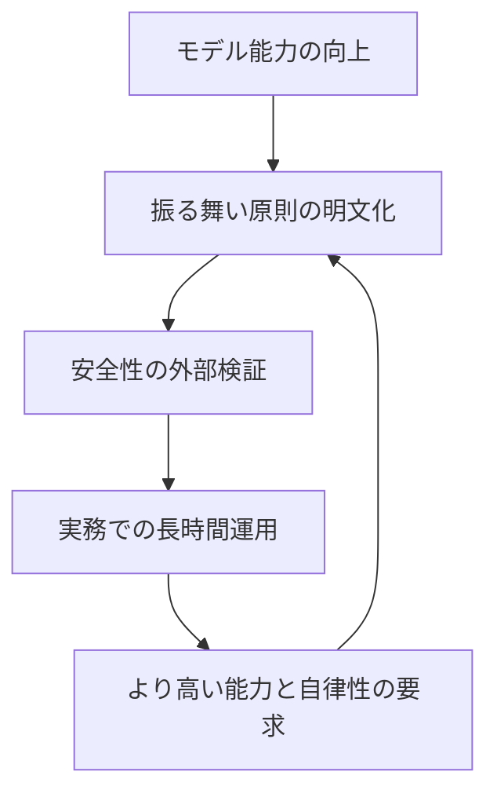
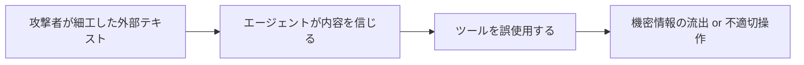
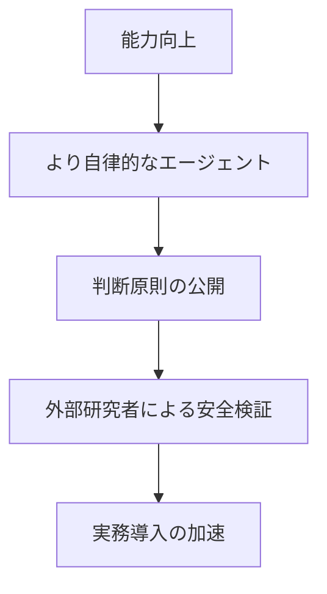

*出典: Anthropic 「Claude Opus 4.6」*

## 📌 3行でわかるこの記事

- 2026年3月下旬のAIニュースは、単なるモデル性能競争ではなく、**モデルの振る舞い設計・安全運用・長時間エージェント実行**へ焦点が移っています。
- OpenAIはModel Specの設計思想を公開し、さらにSafety Bug Bountyを始めることで、**AIの挙動を公開しつつ外部検証も受ける**姿勢を明確にしました。
- AnthropicはClaude Opus 4.6で、**長いコンテキスト・エージェント的なコーディング・業務自動化**を前面に出し、実務投入をさらに強めています。

---

## はじめに

2026年3月26日時点のAI技術ニュースを追うと、最近の競争軸がかなりはっきり見えてきます。

少し前までは「どのモデルが何点上がったか」が主役でしたが、ここ数日の一次情報を見ると、各社が本気で競っているのはむしろ次の3点です。

### いま競争になっている3つのテーマ

- モデルは**どんな原則で振る舞うのか**
- そのモデルを**どう安全に運用・監査するのか**
- そして実際に**長い仕事をどこまで任せられるのか**

今回はこの観点から、以下の3本を整理します。

1. OpenAI「Inside our approach to the Model Spec」
2. OpenAI「Introducing the OpenAI Safety Bug Bounty program」
3. Anthropic「Introducing Claude Opus 4.6」

## まず全体像：3つのニュースはどうつながるのか

### 単発ニュースではなく、1本の流れで見るべき

3本は別々の発表に見えますが、実際にはかなりきれいにつながっています。



このループが回り始めると、AI企業はもう「賢いモデルを出すだけ」では足りません。

### 競争軸は性能から運用へ

#### これまで

- ベンチマーク
- 推論性能
- コーディング性能

#### これから

- モデルの判断原則の透明性
- 外部からの安全性評価
- 長時間タスクに耐えるエージェント運用

この変化が、今回の3本にはかなり濃く出ています。

## OpenAIのModel Spec解説で見えたこと

### Model Specは「ルールブック」ではなく「公開された運用思想」

OpenAIは3月25日公開の「Inside our approach to the Model Spec」で、Model Specを単なる内部ルールではなく、**モデルがどう指示を解釈し、どう衝突を解決し、どこに安全境界を置くかを公開する枠組み**として説明しています。

記事中では、Model Specの役割として次の点が強調されていました。

- ユーザー・開発者・OpenAI由来の指示が衝突したときの優先順位を明確にする
- モデルの挙動を、訓練内部だけでなく外部からも読める形にする
- 公平性・安全性・説明可能性を高める

### 特に重要なのはChain of Command

OpenAIはModel Specの中核として、**Chain of Command** を挙げています。要するに、モデルに来る指示はすべて同格ではなく、優先度の階層があるという考え方です。

#### 何が実務的に重要か

この考え方が重要なのは、AIがエージェント化するほど「曖昧な指示をどう解釈したか」が事故原因になりやすいからです。

たとえば、次のような状況です。

- ユーザーは速く終わらせたい
- 開発者は一定の制約を守らせたい
- システムは安全境界を越えさせたくない

このとき、優先順位が公開されていないと、モデルの判断はブラックボックス化しやすくなります。

#### OpenAIのメッセージ

今回の解説記事から読み取れるのは、OpenAIが「モデルの正しさ」だけでなく、**モデルがどう判断したかを外部に説明できる状態**を重視し始めていることです。

### これは性能競争と別の話ではない

ここは誤解しやすいですが、Model Specは安全寄りの地味な話ではありません。むしろ、高性能モデルを本格運用するための前提条件です。

#### なぜ前提条件になるのか

- 能力が高いほど、実行できる行動の幅が広がる
- 行動の幅が広がるほど、判断の透明性が必要になる
- 透明性がないと、企業導入や規制対応が難しくなる

つまり、Model Specは**高性能化のブレーキ**ではなく、**高性能化を社会実装するための足場**と見るのが自然です。

## OpenAIのSafety Bug Bounty開始が意味すること

### セキュリティバグではなく「AI特有の危険」を報奨対象にした

同じくOpenAIは3月25日、Safety Bug Bountyプログラムの開始を発表しました。ここで面白いのは、対象が通常のセキュリティ脆弱性だけではない点です。

記事では、報奨対象として次のようなAI固有のリスクが挙げられています。

- エージェント製品に対する第三者プロンプトインジェクションやデータ流出
- OpenAIのエージェント製品が有害な行動を実行するケース
- 推論に関するOpenAIの proprietary information の露出
- アカウント信頼性やプラットフォーム整合性を崩す問題

### ここで注目すべきは「Agentic Risks including MCP」

OpenAIは安全バグ報奨の対象として、**Agentic Risks including MCP** を明示しています。

#### これは何を意味するか

MCPのようなツール接続やエージェント連携が広がると、モデル単体の誤答よりも、**外部ツールと組み合わさったときの実害**が問題になります。

たとえば、以下のようなリスクです。



この図の通り、問題は「変な文章を出した」では終わりません。**読んだ・信じた・実行した**までつながると、被害が現実になります。

### なぜ今これを始めたのか

#### 背景にあるのはエージェント化

AIがチャット応答だけなら、危険は主に内容レベルに留まります。ですが、ブラウザ・ファイル・アプリ操作を伴うエージェントになると、リスクは行動レベルに移ります。

そのため、OpenAIが外部研究者に対し、通常のセキュリティ脆弱性ではない**安全上の失敗モード**まで報告対象として開いたのは、かなり重要です。

#### 実務者にとっての示唆

- エージェントは便利だが、プロンプトインジェクション耐性が必須
- 監査対象は「モデル出力」だけでなく「ツール呼び出し結果」まで広がる
- 今後の評価軸は、賢さだけでなく**壊れ方の把握しやすさ**になる

## AnthropicのClaude Opus 4.6は何を示したか

### Anthropicは「長く働けるAI」を押し出した

Anthropicは2月5日にClaude Opus 4.6を発表していましたが、3月後半のニュース群と並べて読むと意味がより鮮明です。

発表文では、Opus 4.6について次の特徴が強調されています。

- コーディング能力の向上
- 大規模コードベースでの信頼性向上
- より長いエージェント作業の継続
- 1M token context window のベータ提供
- Cowork、Claude Code、表計算・資料作成まで含む実務タスク対応

### 重要なのは「1回賢く答える」より「長く破綻しない」こと

Anthropicの説明を読むと、焦点は単発回答の賢さより、**長時間の作業をどれだけ継続できるか**にあります。

#### なぜここが大事か

実務の現場では、AIに任せたいのは1ターンの雑談ではありません。むしろ次のような仕事です。

- 大きなコードベースを探索する
- 複数ファイルをまたいで修正する
- 調査しながら文書や表を作る
- 長い途中経過でも一貫性を保つ

この種のタスクでは、IQ的な賢さだけでは足りず、**途中で方針を見失わないこと**が非常に重要です。

### Opus 4.6の発表から見える方向性

#### 1. 長コンテキストは「読む量」より「仕事の持続時間」へ

1Mトークンという数字は派手ですが、本質は大量入力そのものより、**長い作業文脈を保てること**にあります。

#### 2. エージェントチーム化が前提になっている

AnthropicはClaude Codeでagent teamsを組める点にも触れています。これは、1つの万能モデルで全部やるのではなく、**役割分担した複数エージェント運用**が実務前提になりつつあることを示しています。

#### 3. everyday work に踏み込んでいる

財務分析、調査、ドキュメント、スプレッドシート、プレゼンまで含めている点からも、Anthropicがコーディング専用ではなく、**知的労働全体の自動化基盤**を狙っていることがわかります。

## 3本まとめて読むと見える「次の競争軸」

### 競争は3層構造になった

3つの発表をまとめると、AI企業の競争は次の3層で進んでいると整理できます。

#### 第1層：能力

- より強い推論
- より強いコーディング
- より長いコンテキスト

#### 第2層：挙動設計

- 何を優先して従うのか
- 安全境界をどこに置くのか
- 曖昧な状況でどう判断するのか

#### 第3層：運用安全性

- 外部からどう検証するのか
- エージェントの失敗をどう見つけるのか
- 実害につながる誤作動をどう減らすのか

### 図にするとこうなる



この流れはかなり重要です。モデル能力だけ上がっても、判断原則と安全検証が追いつかなければ、企業導入は頭打ちになります。

## 開発者・運用者は何を押さえるべきか

### いま見るべきポイント

#### 1. モデル選定はベンチマークだけで決めない

今後は、単なる性能ではなく以下も見るべきです。

- 指示衝突をどう扱うか
- ツール利用時の安全設計があるか
- 長時間タスクで安定するか

#### 2. エージェント運用では監査設計が必須

ブラウザ操作やツール実行を伴うなら、ログ・権限制御・レビュー導線がないまま使うのは危険です。

#### 3. 「賢さ」と「壊れにくさ」を分けて考える

高性能モデルほど便利ですが、同時に失敗時の影響も大きくなります。

#### 4. これからの差は運用ノウハウで開く

モデル自体の差だけでなく、以下の実装力が成果差になります。

```bash
# 例: エージェント運用で最低限ほしい観点
- 権限の分離
- ツール呼び出しログの保存
- 外部テキストの信頼境界の明示
- 人間承認ポイントの設置
```

## まとめ

今回の3本は、いずれも「モデルがさらに賢くなった」という話に見えます。しかし本質はそこだけではありません。

### 重要ポイントの再整理

- OpenAIのModel Spec解説は、**モデルの判断原則を公開して説明可能にする流れ**を示した
- OpenAIのSafety Bug Bountyは、**AI特有の失敗モードを外部検証に開く流れ**を示した
- AnthropicのClaude Opus 4.6は、**長時間の実務タスクを担うエージェント競争**を加速させた

### 結論

2026年3月下旬のAIニュースをひとことで言うなら、競争の中心が**性能比較そのもの**から、**どれだけ安全に・説明可能に・長く仕事を任せられるか**へ移ってきた、ということです。

今後AIを使う側も、単に「どのモデルが強いか」ではなく、**どのモデルがどんな原則で動き、どんな失敗に備え、どこまで仕事を任せられるか**を見る必要があります。

## 参考リンク

1. OpenAI: Inside our approach to the Model Spec  
   https://openai.com/index/our-approach-to-the-model-spec/
2. OpenAI: Introducing the OpenAI Safety Bug Bounty program  
   https://openai.com/index/safety-bug-bounty/
3. Anthropic: Claude Opus 4.6  
   https://www.anthropic.com/news/claude-opus-4-6
4. OpenAI Model Spec  
   https://model-spec.openai.com/
