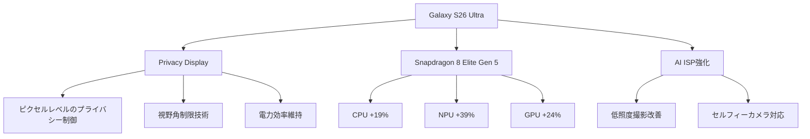
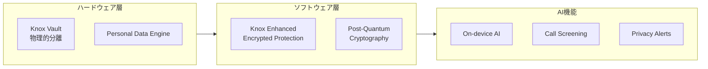
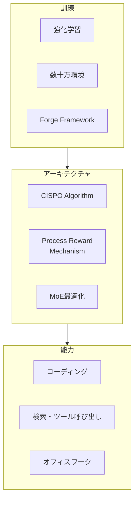
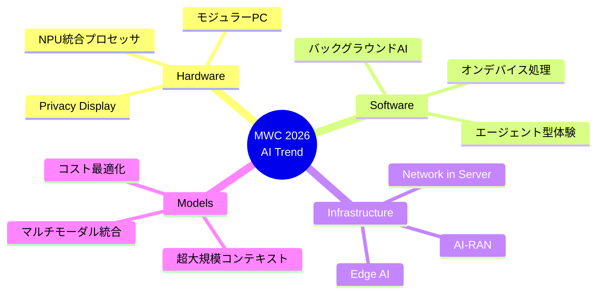

# MWC 2026で見える次世代AIの潮流：Samsung、Lenovo、MiniMaxの最新動向を総整理

## 📌 3行でわかるこの記事

- **MWC 2026**で各社が「AIが背景で動く」体験を発表、Samsungは世界初のPrivacy Display搭載Galaxy S26シリーズを投入
- 中国の**MiniMax M2.5**がClaude Opus 4.6と同等性能を10分の1のコストで実現、エージェント型AIの実用化が加速
- ネットワークインフラにもAIが統合され、**AI-RAN**や**Network in a Server**などエッジAIの新展開が進行中

---

## はじめに

2026年3月2日から5日まで、スペイン・バルセロナで**Mobile World Congress (MWC) 2026**が開催されています。今年のテーマは「AIが背景で動く（AI that works in the background）」体験の実現です。


本記事では、MWC 2026で発表された主要なAI技術の動向と、同時期にリリースされた中国発の新世代LLM「MiniMax M2.5」について、技術的な観点から解説します。

---

## 1. Samsung Galaxy S26シリーズ：世界初のPrivacy Display

### 1.1 ハードウェアの進化

SamsungはGalaxy S26シリーズ（S26、S26+、S26 Ultra）を発表しました。最大の注目点は、**世界初のモバイル向け組み込みPrivacy Display**です。



#### Privacy Displayの仕組み

従来のプライバシーフィルムとは異なり、**ディスプレイのピクセル自体が光の散乱を制御**する技術です：

- **オフ時**: 通常のディスプレイと同じ視認性
- **オン時**: 正面からの視認性を維持しつつ、横からの視認性を制限
- **部分的プライバシー**: 通知ポップアップのみ制限可能
- **最大プライバシー保護**: より強力な側面視野角制限

### 1.2 Galaxy AIの進化

**第3世代Galaxy AI**では、以下の体験が強化されました：

| 機能 | 概要 | 技術的特徴 |
|------|------|-----------|
| **Now Nudge** | 文脈に基づく自動提案 | Personal Data Engine (PDE) |
| **Now Brief** | 予定・旅行情報の自動サマリー | コンテキスト認識 |
| **Circle to Search** | 複数オブジェクト同時認識 | 強化されたマルチオブジェクト認識 |
| **Photo Assist** | 自然言語での写真編集 | ジェネレーティブAI |

### 1.3 セキュリティアーキテクチャ



**耐量子計算機暗号（PQC）**が、ファームウェア保護やソフトウェア検証など重要なシステムプロセスに拡張適用されています。

---

## 2. Lenovo：モジュラーAI PCとPersonal Ambient Intelligence

### 2.1 ThinkBook Modular AI PC Concept

Lenovoは「**carry small, use big**」のコンセプトで、モジュラー型AI PCを展示しました：

- 14インチ薄型ベースシステム
- 交換可能なディスプレイ構成
- 着脱可能な入力コンポーネント
- ワークスペース拡張（約19インチまで）


### 2.2 Lenovo Qira：Personal Ambient Intelligence

**Lenovo Qira**は、単なるアプリではなく**システムレベルで統合**されたAI体験です：

```
対応デバイス: PC、タブレット、スマートフォン、ウェアラブル
展開予定: 20機種以上（Yoga、IdeaPad、Legion、ThinkPad）
言語対応: 9地域6言語
```

**特徴**:
- タスクとデバイス間の継続性維持
- ユーザーの意図に基づく支援
- 2026年中にMotorolaスマートフォンにも展開

---

## 3. MiniMax M2.5：1/10のコストでClaude Opus級の性能

### 3.1 概要と性能指標

中国のMiniMax社が2026年2月12日にリリースした**M2.5**は、業界に衝撃を与えました。


#### 主要ベンチマークスコア

| ベンチマーク | M2.5 スコア | 比較 |
|-------------|------------|------|
| SWE-Bench Verified | **80.2%** | Claude Opus 4.6相当 |
| Multi-SWE-Bench | **51.3%** | 業界トップクラス |
| BrowseComp | **76.3%** | エージェントタスク最强 |

### 3.2 技術的特徴



#### Forge：Agent-Native RLフレームワーク

MiniMaxは社内で**Forge**という強化学習フレームワークを構築しました：

- 基盤エンジンとエージェントの完全分離
- 任意のエージェント・ツール統合対応
- ツリー構造マージング戦略で約**40倍の訓練高速化**

### 3.3 コストパフォーマンス

**M2.5-Lightning**の価格設定：

```python
# コスト比較（100万トークンあたり）
# 入力: $0.3 / 出力: $2.4
# 100 TPSで継続稼働時、1時間あたり $1

# Claude Opus 4.6との比較
# M2.5は約1/10〜1/20のコスト
```

| モデル | 入力価格 | 出力価格 | コスト比 |
|--------|---------|---------|----------|
| M2.5-Lightning | $0.3/M | $2.4/M | **1x** |
| Claude Opus 4.6 | ~$15/M | ~$75/M | ~30x |

### 3.4 実際の活用状況

MiniMax社内での活用実績：
- **全タスクの30%**がM2.5による自動完了
- 新規コミットコードの**80%**がM2.5生成
- 対象領域：R&D、製品、営業、HR、財務

---

## 4. ネットワークインフラへのAI統合

### 4.1 Samsung Networks：AI-RANの展開

Samsungは2027年までに**完全自律ネットワーク**を目指しています：

- **CognitiV Network Operations Suite (NOS)**
- **Agent Fabric**: 複数の専門AIエージェントが連携
- **Network in a Server**: ソフトウェア定義型エッジAIソリューション

### 4.2 AMDとの協業

AMD EPYCプロセッサを活用したAI-RAN実装：
- 5G Core、仮想RAN、プライベートネットワーク
- 動画解析、センサー検出サービスのローカル処理
- ハイパーコネクティビティの実現

---

## 5. 技術トレンドのまとめ



### 5.1 共通する方向性

1. **「AIが背景で動く」体験**: ユーザーがAIを意識せず恩恵を受ける
2. **プライバシー・セキュリティ重視**: PQC、オンデバイス処理の強化
3. **コスト効率化**: M2.5に見る「安くて強い」モデルの登場
4. **エッジ統合**: ネットワークインフラへのAI組み込み

---

## 参考リンク

1. [Samsung Galaxy S26 Series Press Release](https://news.samsung.com/global/samsung-unveils-galaxy-s26-series-the-most-intuitive-galaxy-ai-phone-yet)
2. [Samsung MWC 2026 Galaxy AI](https://news.samsung.com/global/samsung-advances-galaxy-ai-and-its-connected-ecosystem-at-mwc-2026)
3. [Lenovo MWC 2026 Press Release](https://news.lenovo.com/pressroom/press-releases/adaptive-ai-pcs-modular-concepts-qira-rollout-mwc-2026/)
4. [MiniMax M2.5 Technical Blog](https://www.minimax.io/news/minimax-m25)
5. [AI Model Releases News March 2026](https://blog.mean.ceo/new-ai-model-releases-news-march-2026/)

---

## まとめ

MWC 2026は、「AIの民主化」と「ユーザー体験の最適化」が同時に進行している場でした。Samsungはハードウェアレベルでのプライバシー保護を実現し、Lenovoはシステム統合型AIを提示し、MiniMaxは劇的なコスト削減を実現しています。

これらの動向は、AIが単なる「機能」から「インフラ」へと変化していることを示しています。2026年後半は、これらの技術が実際の製品・サービスとしてどのように定着するかが注目されます。
