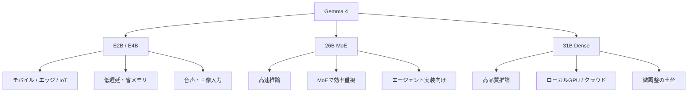
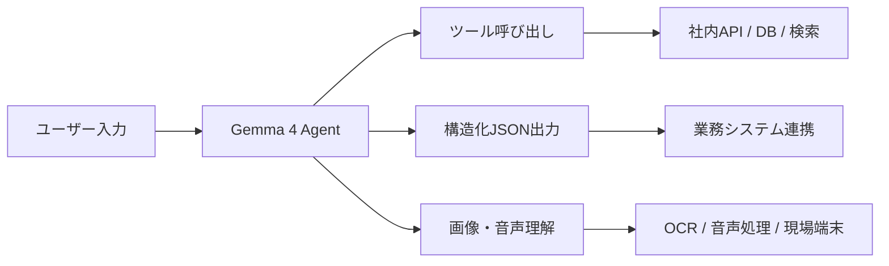

*出典: Google Blog「Gemma 4: Byte for byte, the most capable open models」*

## 📌 3行でわかるこの記事

- Googleが2026年4月に公開した**Gemma 4**は、単なる軽量オープンモデルの更新ではなく、**推論・エージェント・ローカル実行**を本気で狙ったモデル群です。
- 公式発表では、**最大256Kコンテキスト、画像・音声対応、140以上の言語、Apache 2.0ライセンス**が打ち出されました。
- いちばん重要なのは、性能そのものよりも、**「ローカルでも企業環境でも回せる実運用モデル」へ近づいたこと**です。

---

## はじめに

2026年4月前半のAIニュースで、開発者目線でかなり重要だったのがGoogleの**Gemma 4**です。

最近のモデル発表はどうしても「ベンチマーク何位か」に注目が集まりがちですが、Gemma 4の面白さはそこだけではありません。GoogleはGemma 4を、**オープンに使えるのに、推論・マルチモーダル・エージェント実装まで視野に入ったモデル群**として位置づけています。

つまりこれは「オープンモデル版の便利な選択肢が増えた」という話ではなく、**オープンモデルが本格的に実務導入の土俵へ上がってきた**というニュースです。

## Gemma 4とは何か

### Googleが打ち出した位置づけ

Google Blogの発表では、Gemma 4は次のように説明されています。

- Google DeepMindの研究をベースにしたオープンモデル
- 高度な推論とエージェントワークフロー向け
- Apache 2.0ライセンスで公開
- ローカル端末からクラウドまで幅広い実行を想定

特に印象的なのは、Googleが「**intelligence-per-parameter**」を強く押し出している点です。つまり、単純に巨大化するのではなく、**少ない計算資源でどこまで賢くできるか**を勝負軸にしています。

### 提供される4つのサイズ

Google公式発表で案内されているGemma 4の構成は次の4種類です。

- E2B
- E4B
- 26B MoE
- 31B Dense

小型モデルはエッジやモバイル寄り、大型モデルはローカルGPUやクラウド推論寄り、という役割分担がかなり明確です。

## まず全体像：Gemma 4はどこを狙っているのか

### 1つのチャットモデルではなく、実行環境ごとの設計

Gemma 4のポイントは、単一モデルで全部解決しようとしていないことです。



この構成から見えるのは、GoogleがGemma 4を**「ただ公開するモデル」ではなく、用途別に組み込むための部品群**として出していることです。

## Gemma 4の技術的な見どころ

## 推論・エージェント実装を強く意識している

Google Blogでは、Gemma 4の強みとして次の点が挙げられています。

### 高度な推論

Gemma 4は、複数ステップの計画や深いロジックを要するタスクを意識して設計されています。発表文でも、数学や命令追従の改善が強調されています。

### エージェントワークフロー対応

GoogleはGemma 4について、以下の機能を明示しています。

- function calling
- structured JSON output
- native system instructions

この3点が揃うと、単なるチャット応答ではなく、**ツール呼び出しを伴うワークフロー実装**がかなりやりやすくなります。

### コード生成

Google Blogでは、Gemma 4を**ローカルファーストのコードアシスタント**として使える点も押し出しています。クラウドAPI前提ではなく、ワークステーション上でコード補助を回したい人にはかなり相性がよさそうです。

## マルチモーダル対応が実用寄り

### 画像・動画・音声を処理できる

公式発表では、Gemma 4は全モデルで**画像や動画**をネイティブに扱えるとされています。加えて、E2B/E4Bでは**音声入力**にも対応します。

ここで大事なのは、「マルチモーダル対応」と言っても派手なデモ用途だけではないことです。Googleは具体例として次のような用途を挙げています。

- OCR
- チャート理解
- 音声認識
- 音声理解

つまり、Gemma 4は見た目の派手さより、**業務で混ざりがちな非テキスト入力をさばく実用モデル**として捉えた方が実態に近いです。

## 長いコンテキストが“実装向け”に効く

Googleの公式説明では、Gemma 4は以下のコンテキスト長を持ちます。

- E2B / E4B: 最大128K
- 26B / 31B: 最大256K

この数字の意味は、単に長文が入るというだけではありません。

### 何が嬉しいのか

- 大きめのリポジトリ断片をまとめて渡せる
- 長い設計書や議事録を1回で参照しやすい
- エージェントが途中で文脈を落としにくい

特にエージェント実装では、コンテキスト長は派手さよりも**破綻しにくさ**に効きます。Gemma 4はここをかなり意識している印象です。

## 小型モデルがちゃんと重要

### E2B / E4Bは“モバイル対応のおまけ”ではない

Gemma 4で個人的に面白いのは、小型モデルが単なる廉価版ではないことです。

Google Blogでは、E2B / E4Bについて次のように説明しています。

- 低メモリ・低消費電力を重視
- 低遅延で完全オフライン実行を想定
- スマホ、Raspberry Pi、Jetson Orin Nanoなどで動作可能

この方向性はかなり重要です。2025年までの流れでは「高性能モデルはクラウド、大幅に小さいモデルは妥協」と見られがちでしたが、Gemma 4はそこを少し変えにきています。

### オフラインAIの現実味が増した

たとえば次のような用途では、小型でもローカル実行できる価値が大きいです。

- 端末内のプライベート補助
- 工場・現場での低遅延推論
- 通信が不安定な環境でのAI利用
- コスト制約が強い組み込み用途

## 企業導入目線で見るGemma 4

### Google Cloud側の説明はかなり現実的

Cloud Blogでは、Gemma 4をGoogle Cloud上でどう使うかが整理されています。要点は次の通りです。

- Vertex AIでのデプロイやファインチューニング
- ADKによるAIエージェント構築
- Cloud RunでのGPU推論
- GKE + vLLMによる大規模サービング
- Sovereign Cloudでの展開

ここで見えてくるのは、GoogleがGemma 4を**研究モデルではなく企業導入可能なオープンモデル**として売り出していることです。

### なぜ企業に刺さるのか

Cloud Blogでは、Gemma 4の価値を次のように説明しています。

- 複雑なロジックを実行できる
- データをセキュアな境界内に置きやすい
- 主権クラウドやコンプライアンス要件に対応しやすい

要するに、Gemma 4は「性能が高い」だけでなく、**データを外へ出しにくい構成を取りたい企業**にとって都合がいいわけです。

## オープンモデル競争の中で何が変わったのか

### 競争軸が“公開されているか”から“運用できるか”へ移った

ここ1年ほど、オープンモデル界隈では次のような競争が続いていました。

- 何Bパラメータか
- ベンチマーク順位は何位か
- どのライセンスで配るか

Gemma 4はそこに対して、もう一段実務寄りの問いを出しています。

### いま問われていること

- 手元で動くか
- エージェント実装に組み込めるか
- JSONや関数呼び出しに素直か
- 長文や非テキスト入力に耐えるか
- 企業のセキュリティ条件に乗るか

この観点で見ると、Gemma 4はかなりバランスがいいです。最強一点突破というより、**現場で困るポイントを広く潰している**のが強みです。

## 開発者はどう使い分けるべきか

### 個人開発なら

- ローカル実験や軽いエージェント試作: E2B / E4B
- 手元GPUでの本格推論やコード補助: 26B / 31B

### プロダクト開発なら

- まずCloud上でPoC
- その後、用途に応じてオンプレや主権環境へ寄せる
- データ要件が厳しい部分だけGemma 4に切り出す

### 構成イメージ



## 実装イメージ

以下は、ローカルまたはサービング環境でGemma系モデルを呼び出すときの概念例です。

```bash
curl http://localhost:8000/v1/chat/completions \
  -H "Content-Type: application/json" \
  -d '{
    "model": "gemma-4-31b-it",
    "messages": [
      {"role": "system", "content": "あなたは技術アシスタントです。"},
      {"role": "user", "content": "Gemma 4の強みを3点で説明してください。"}
    ]
  }'
```

実運用では、この上に

- 関数呼び出し
- 構造化出力
- 監査ログ
- RAG

を積んでいく形になるはずです。

## まとめ

Gemma 4の発表をひとことで言うなら、**オープンモデルが“研究寄りの面白い選択肢”から“実運用の候補”へ一段進んだ**、ということだと思います。

### ポイントを整理すると

- Gemma 4は推論・エージェント・マルチモーダルを強く意識したオープンモデル群
- 最大256Kコンテキスト、140以上の言語、画像・音声対応を公式に打ち出している
- Apache 2.0ライセンスで、商用・企業導入の柔軟性が高い
- Google CloudやSovereign Cloudまで含め、実装と運用の導線がかなり整っている

派手な“最強モデル”というより、**ちゃんと使えるオープンモデル**。Gemma 4は、そこに価値がある発表でした。

## 参考リンク

1. [Gemma 4: Byte for byte, the most capable open models | Google Blog](https://blog.google/innovation-and-ai/technology/developers-tools/gemma-4/)
2. [Gemma 4 available on Google Cloud | Google Cloud Blog](https://cloud.google.com/blog/products/ai-machine-learning/gemma-4-available-on-google-cloud)
3. [Gemma 4 model overview | Google AI for Developers](https://ai.google.dev/gemma/docs/core)
4. [Gemma 4 | Google DeepMind](https://deepmind.google/models/gemma/gemma-4/)
