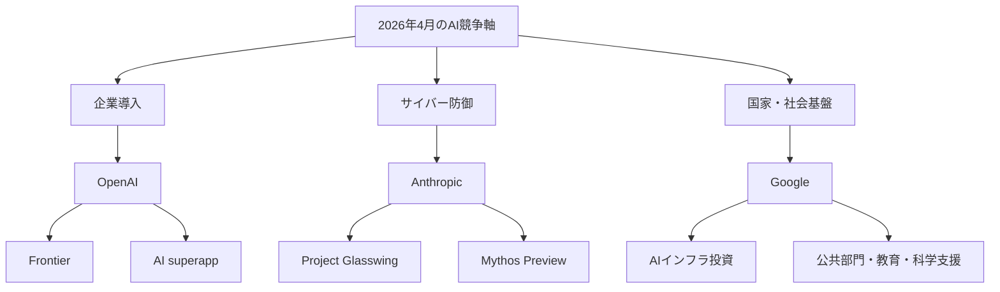
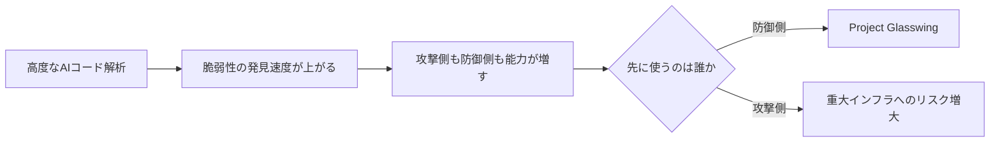
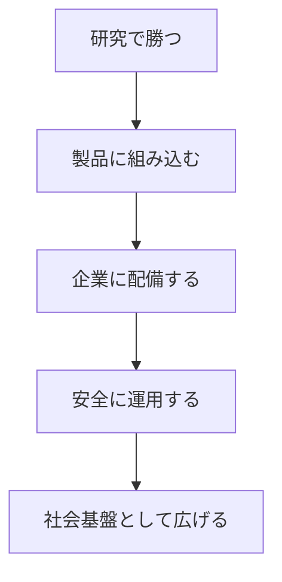

*出典: Anthropic「Project Glasswing」*

*出典: Google「AI Impact Summit 2026: How we’re partnering to make AI work for everyone」*

## 📌 3行でわかるこの記事

- 2026年4月前半のAIニュースでは、**モデル性能そのもの**よりも、**企業導入・サイバー防御・国家レベルの基盤整備**が主戦場になってきました。
- OpenAIは企業向けAIを“全社共通の運用レイヤー”として押し出し、Anthropicは**AIを攻撃ではなく防御へ先に回す**動きを強め、Googleは**インフラ・公共部門・教育**まで含めてAI普及を進めています。
- つまり今のAI競争は、単なるモデル比較ではなく、**誰が実運用の土台を握るか**の戦いに入っています。

---

## はじめに

2026年4月10日時点で一次情報を追うと、AI業界の景色がかなり変わってきたのが分かります。

少し前までは「どのモデルが何点伸びたか」がニュースの中心でした。しかし直近の各社発表を見ると、いま本当に重要なのはそこではありません。焦点はむしろ、**AIをどう企業の現場に入れるか、どう安全に使うか、そして社会インフラとしてどう広げるか**に移っています。

今回は、次の3本をまとめて整理します。

### 今回取り上げる3つのニュース

- OpenAI: **The next phase of enterprise AI**（2026年4月8日）
- Anthropic: **Project Glasswing**（2026年4月7日）
- Google: **AI Impact Summit 2026** 関連発表

## 全体像：3本のニュースはどうつながるのか

### 競争軸は「賢さ」から「配備力」へ

この3本を並べると、各社が見ている先がかなり共通していると分かります。

要するに、各社はもう「モデル単体の性能」だけで戦っていません。

- OpenAIは**会社全体をまたぐAI運用**
- Anthropicは**AI時代の防御インフラ**
- Googleは**AIを社会実装するための基盤**

を前に出しています。

## OpenAI：企業AIは“個別ツール”から“統合レイヤー”へ

### OpenAIが何を打ち出したのか

OpenAIは4月8日の発表で、企業向けAIについてかなり踏み込んだ見方を示しました。記事内では、企業収益が全体の40%以上を占め、2026年末には消費者向けと同水準に達する見通しだと説明しています。

さらに、次のような数字も挙げています。

#### 公式発表で示されたポイント

- enterprise revenue が全体の40%以上
- Codex の週間アクティブユーザーが300万人
- API が毎分150億トークン超を処理
- GPT‑5.4 が agentic workflows で高い利用を牽引

この発表で印象的なのは、OpenAIが企業向けAIを「便利な社内アシスタント」としてではなく、**会社全体を横断する知能レイヤー**として説明していることです。

### キーワードはOpenAI FrontierとAI superapp

OpenAIは企業向け戦略の中心に、次の2つを置いています。

#### 1. OpenAI Frontier

記事では、Frontierを「company-wide に agent を構築・配備・管理する基盤」として位置づけています。単一SaaSの中だけで動くAIではなく、**複数の社内システムとデータをまたいで働くAI**を想定しています。

#### 2. unified AI superapp

もう1つが、社員が日常業務で使う“入口”としてのAI superappです。ChatGPT、Codex、agentic browsing などを統合し、AIが日々の業務を支えるインターフェースになる、という考え方です。

### なぜこれは重要か

ここでOpenAIが言っているのは、企業がもうAIを「PoCの対象」ではなく、**業務OSに近いもの**として見始めているということです。

#### 企業側の変化

- 部署ごとに別々のAIツールを入れる段階が終わりつつある
- AIを全社共通の権限・文脈・データ接続で扱いたい
- 社員一人ひとりが“作業者”から“エージェントの管理者”へ寄っていく

この流れはかなり現実的です。現場で困るのは、モデル精度が1%足りないことより、**ツール同士がつながらないこと**のほうだからです。

## Anthropic：Project Glasswingは「AIが脆弱性発見を人間超えし始めた」前提の防御策

### 発表の中身

Anthropicは4月7日、**Project Glasswing**を発表しました。これはAmazon Web Services、Apple、Broadcom、Cisco、Google、Microsoft、NVIDIAなどを含む複数企業・団体と連携し、重要ソフトウェアの防御にAIを使う取り組みです。

発表文では、未公開のフロンティアモデル **Claude Mythos Preview** について、かなり強い表現が使われています。

#### 公式発表の核心

- きわめて高いコード理解・脆弱性発見能力を持つ
- 人間の熟練研究者に迫る、あるいは一部で上回る水準に到達した
- 主要OSやブラウザを含む幅広いソフトウェアで高深刻度の脆弱性を見つけた
- 防御側が先に使わないと、攻撃側に回ったときの影響が大きい

Anthropicはさらに、最大1億ドル相当の利用クレジットと、オープンソースセキュリティ組織への寄付も表明しています。

### 何がそんなに大きいのか

大事なのは、Anthropicが単に「AIでセキュリティ研究を支援できます」と言っているのではない点です。

**AIがソフトウェア脆弱性の発見・悪用のコストを大きく下げ始めた**という前提で、先に防御側へ配備しようとしているわけです。

#### 記事から読み取れる構図

### 開発者・企業にとっての意味

この話はセキュリティ企業だけのものではありません。ソフトウェアを作る側の発想も変わります。

#### これから重要になること

- 脆弱性診断を年1回の監査ではなく継続運用に寄せる
- AIにコードレビューや異常候補検出を任せる前提で開発体制を組む
- OSSや基盤ソフトの保守コストをAI前提で再設計する

Anthropicの発表は、AIセキュリティを“安全性ポリシー”の話から、**現実の防御オペレーション**に引き戻した点でかなり重要です。

## Google：AI普及の勝負は、モデルより先にインフラを押さえること

### AI Impact Summit 2026でGoogleが示した方向性

GoogleはAI Impact Summit 2026に合わせて、AIを社会全体へ広げるための複数施策を発表しました。内容はかなり幅広く、単一モデルのアップデートというより、**普及のための地ならし**に近いです。

#### 発表の主なポイント

- インドでの150億ドル規模のAI基盤投資
- 米国とインドを結ぶ新しい光ファイバー接続構想
- Google.org による政府向けAI支援・科学研究支援
- 公共部門のAI活用や教育・スキリング施策
- 検索、翻訳、Geminiアプリなど実利用機能の強化

### ここでのGoogleの狙い

Googleの今回の動きは、モデル性能の直接比較というより、**AI利用を増やすためのボトルネックを上流から潰す**ことにあります。

#### 潰しにいっているボトルネック

- 計算基盤が足りない
- 回線や接続性が弱い
- 公共部門で使える人材が足りない
- 多言語環境で使いにくい
- 安全性や信頼性への懸念が残る

### つまり何が見えるか

Googleは、AIの勝ち筋を「最強モデルを出すこと」だけに置いていません。むしろ、**AIを実際に使う人口と環境を増やすこと**を重視しています。

これはGoogleらしい戦い方です。検索、Android、クラウド、教育、翻訳といった既存アセットを持っている会社なので、AIでも同じく**土台を広く押さえる戦略**が効きます。

## 3社を並べると、いま何が起きているのか

### それぞれの役割はかなり違う

ここまでを見ると、3社は似た市場にいながら、打ち出している主戦場が違います。

#### OpenAI

- 企業の業務レイヤーを握りにいく
- AIを全社運用の基盤にする
- 社員がAIエージェントを使う前提のUIを作る

#### Anthropic

- フロンティアAIの危険側面を先に防御へ転換する
- ソフトウェア安全保障の文脈で存在感を強める
- 企業・インフラ保護の協調モデルを作る

#### Google

- AI普及に必要な回線・教育・公共部門・多言語対応まで押さえる
- ユーザー数と利用機会を増やす
- AIを国家・地域スケールで広げる

### 一言で言うなら

AI業界は今、**研究競争の次のフェーズ**に入っています。

2026年4月のニュースは、まさにこの C〜E が本格化していることを示しています。

## まとめ

2026年4月前半のAIニュースをまとめると、見えてくるのはかなり明快です。

### 重要ポイント

- OpenAIは、企業AIを**全社運用レイヤー**として押し出し始めた
- Anthropicは、AIの高度な脆弱性発見能力を**防御の先手**に変えようとしている
- Googleは、AIを広く使わせるための**基盤投資・公共活用・教育**まで手を広げている

つまり、次の勝負は「一番賢いモデルを出した会社」だけが勝つわけではありません。

**企業に入るか、安全に回るか、社会に広がるか。**
この3つをまとめて設計できる会社が、次のAI時代の主導権を握りそうです。

## 参考リンク

1. [OpenAI: The next phase of enterprise AI](https://openai.com/index/next-phase-of-enterprise-ai/)
2. [Anthropic: Project Glasswing](https://www.anthropic.com/glasswing)
3. [Google: AI Impact Summit 2026](https://blog.google/innovation-and-ai/technology/ai/ai-impact-summit-2026-india/)
4. [OpenAI Frontier](https://openai.com/index/introducing-openai-frontier/)
