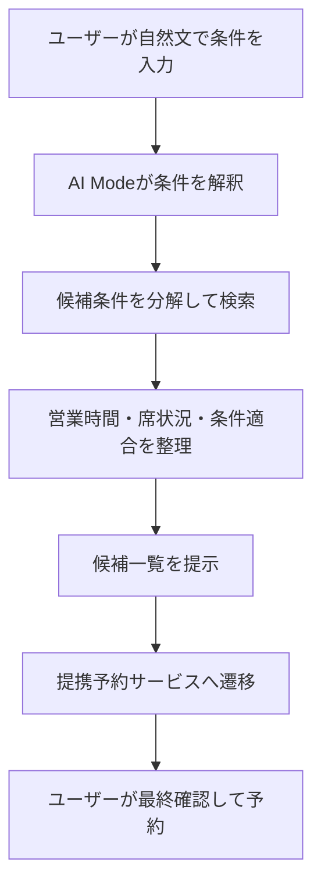
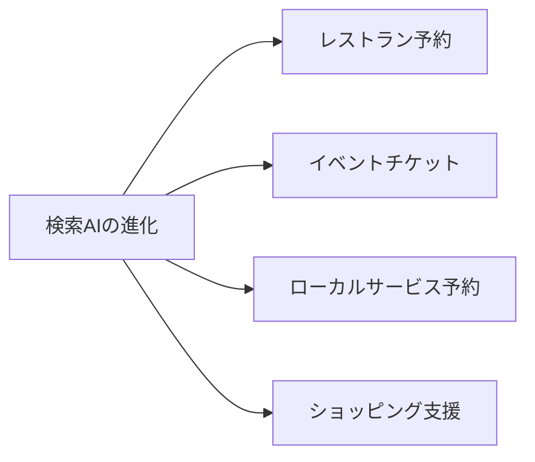

# Google検索のAI Modeが一歩前進：英国でレストラン予約のエージェント機能が始動

## 📌 3行でわかるこの記事

- Googleは2026年4月10日、英国でAI Mode in Searchのレストラン予約支援機能を提供開始しました。
- 自然文で条件を伝えると、AIが候補を整理し、提携サービスへの予約導線まで案内します。
- 2025年に発表されたAI Modeの「agentic capabilities」が、実利用に近い形で地域展開し始めた動きとして注目できます。


---

## はじめに

検索AIの進化は、単なる「答えを返す検索」から「作業を前に進める検索」へ移りつつあります。

その具体例として、Googleは2026年4月10日に**英国向けのAI Mode in Searchで、レストラン予約を支援するエージェント機能**を提供開始しました。ユーザーは「犬同伴可のイタリアンを土曜19時に2人で予約したい」といった自然文で条件を伝えるだけで、AIが候補を絞り込み、予約パートナーへの導線まで提示します。

本記事では、この発表内容を事実ベースで整理しつつ、検索プロダクトが“実行支援”へ進化している意味を考えます。

## 今回の発表の要点

### 英国で始まった「予約までつなぐ検索」

Google Blogの2026年4月10日付記事によると、英国のAI Modeでは、ユーザーの細かな条件や好みに応じてレストラン候補を提示し、**TheFork、SevenRooms、ResDiary、Mozrest、Foodhub、Dojo、DesignMyNight、OpenTable**などの提携先経由で予約完了へ進める仕組みが導入されました。[^source1]

記事中では、次のような利用例が示されています。

- 「Shoreditchで土曜19時に、犬同伴可のイタリアンを2人分探して」
- 「近くの寿司店で4人席、しかもヴィーガン天ぷらがある店を探して」

要するに、検索クエリがキーワード列ではなく、**制約条件を含んだ依頼文**になっているわけです。

### なぜ重要なのか

今回の発表そのものは英国向けの地域展開ですが、意味はそれ以上に大きいです。2025年5月にGoogleが説明していたAI Modeの将来像、つまり**Project Mariner系のagentic capabilitiesをSearchに持ち込む構想**が、実サービスとして少しずつ具体化しているからです。[^source2]

Googleは2025年時点で、AI Modeについて次の方向性を示していました。

- 複雑な質問をサブトピックに分解する「query fan-out」
- 検索結果の比較・整理
- フォーム入力のような面倒な作業の肩代わり
- チケット、レストラン予約、ローカル予約などへの拡張

今回の英国展開は、そのうち**レストラン予約**が先行して実装された形と見られます。

## どう動くのか

### 検索から実行支援までの流れ

Googleが公開している説明をもとに、処理の流れを整理すると次のイメージです。



この構造のポイントは、AIが予約を完全自動で勝手に確定するのではなく、**候補整理と導線設計を担い、最終決定はユーザー側に残している**ことです。Googleの2025年発表でも、「時間を節約しつつ、ユーザーがコントロールを維持する」と説明されていました。[^source2]

### 擬似コードで見る処理イメージ

実装詳細は公開されていませんが、概念的には次のように理解できます。

```python
request = {
    "party_size": 2,
    "area": "Shoreditch",
    "time": "Saturday 19:00",
    "cuisine": "Italian",
    "constraints": ["dog-friendly"]
}

results = ai_mode.search_and_rank(request)
booking_options = partners.link(results)

return {
    "recommendations": results,
    "booking_links": booking_options
}
```

これはもちろん説明用の擬似コードですが、今回の発表内容をかなり素直に表しています。つまり、AI Modeは「回答生成」よりも、**条件解釈・候補比較・次アクション提示**に価値を置いているわけです。

## 何が新しいのか

### 従来の検索との違い

従来の検索でも「イタリアン レストラン Shoreditch 犬同伴可」のような検索はできました。ただ、その場合はユーザーが以下を自力でこなす必要がありました。

- 条件をキーワードに分解する
- 複数サイトを開く
- 営業時間や空席情報を確認する
- 予約ページに移動する

AI Modeでは、この中間作業がかなり圧縮されます。

#### 比較表

| 項目 | 従来の検索 | AI Modeの予約支援 |
|---|---|---|
| 入力方法 | キーワード中心 | 自然文中心 |
| 候補整理 | ユーザーが自力で比較 | AIが条件に沿って整理 |
| 予約導線 | 各サービスを個別に探索 | 提携先リンクをまとめて提示 |
| 検索体験 | 情報取得で終わることが多い | 実行に近いところまで進む |

### 「AI検索」から「作業エージェント」への移行

今回のニュースは、派手な新モデル発表ではありません。しかし、プロダクトの進化としてはかなり本質的です。

なぜなら、生成AIの価値が「文章をうまく書ける」ことだけではなく、**現実のタスクをどこまで前に進められるか**に移っているからです。

Google自身も2025年のAI Mode発表で、Searchを「informationからintelligenceへ」と位置付けていました。[^source2]
今回の予約機能は、そのスローガンがやっと具体的なUXになってきた例と言えます。

## 実務・プロダクト視点で見たインパクト

### 1. ローカル検索SEOの評価軸が変わる可能性

レストランや予約サービスにとって重要なのは、単に検索結果で見つかることだけではなく、**AIが解釈しやすい構造化情報を提供できるか**になっていきます。

具体的には、以下の重要度が増しそうです。

- 営業時間や空席情報の最新性
- 食事制限、ペット可否、席種などの属性データ
- 予約導線の明確さ
- パートナー連携の有無

### 2. 「比較コストの削減」がUXの中心になる

ユーザーが欲しいのは、候補が100件並ぶことではなく、**条件に合う数件まで比較コストを下げてもらうこと**です。

生成AIと検索の相性がよいのは、文章生成よりむしろこの部分かもしれません。

### 3. エージェント機能は一気に来るより、用途ごとに広がる

今回の展開を見る限り、汎用エージェントが突然すべての作業を代行するというより、まずは次のような狭い領域から実装される可能性が高そうです。



これは安全面でも自然です。金銭や個人情報が絡む操作は、いきなり完全自動化するより、**候補提示 + 最終確認を人間が行う設計**のほうが現実的だからです。

## 今後の注目点

### 日本展開はあるのか

現時点で、今回確認できたのは**英国向け提供開始**です。日本展開の明示は今回のソースでは確認できません。したがって、「近いうちに日本でも必ず使える」と断定するのは避けるべきです。

一方で、Googleは2025年時点でAI Modeを段階的に拡張する方針を示しており、地域やパートナーが揃えば、同種の体験が他国へ広がる可能性は十分あります。[^source2]

### 競争軸は「モデル性能」だけではない

この手の機能で本当に強いのは、モデルの賢さだけではありません。

- 検索インデックス
- リアルタイム情報
- パートナー連携
- 決済や予約の導線
- UI上の信頼感

こうした要素が全部つながって、初めて「使われるエージェント」になります。今回のGoogleの動きは、その総合戦の一例として見ると理解しやすいです。

## まとめ

英国で始まったGoogle AI Modeのレストラン予約支援は、見た目以上に重要なニュースです。

これは単なる機能追加ではなく、**検索が“答える道具”から“行動を前に進める道具”へ変わる流れ**を示しています。しかも、予約という現実の行動に近いところまで踏み込んでいるため、エージェントAIの社会実装としても分かりやすい事例です。

今後は、どの国で、どのカテゴリに、どのパートナー網で展開されるのかが大きな観測ポイントになりそうです。

## 参考リンク

1. Google Blog: Booking restaurants in the UK just got easier with AI in Search  
   <https://blog.google/company-news/inside-google/around-the-globe/google-europe/united-kingdom/ai-mode-restaurants-uk/>
2. Google Blog: AI in Search: Going beyond information to intelligence  
   <https://blog.google/products-and-platforms/products/search/google-search-ai-mode-update/>
3. Google Blog: Official Google AI news and updates  
   <https://blog.google/innovation-and-ai/technology/ai/>

---

[^source1]: Google Blog, “Booking restaurants in the UK just got easier with AI in Search”, published Apr 10, 2026.
[^source2]: Google Blog, “AI in Search: Going beyond information to intelligence”, published May 20, 2025.
