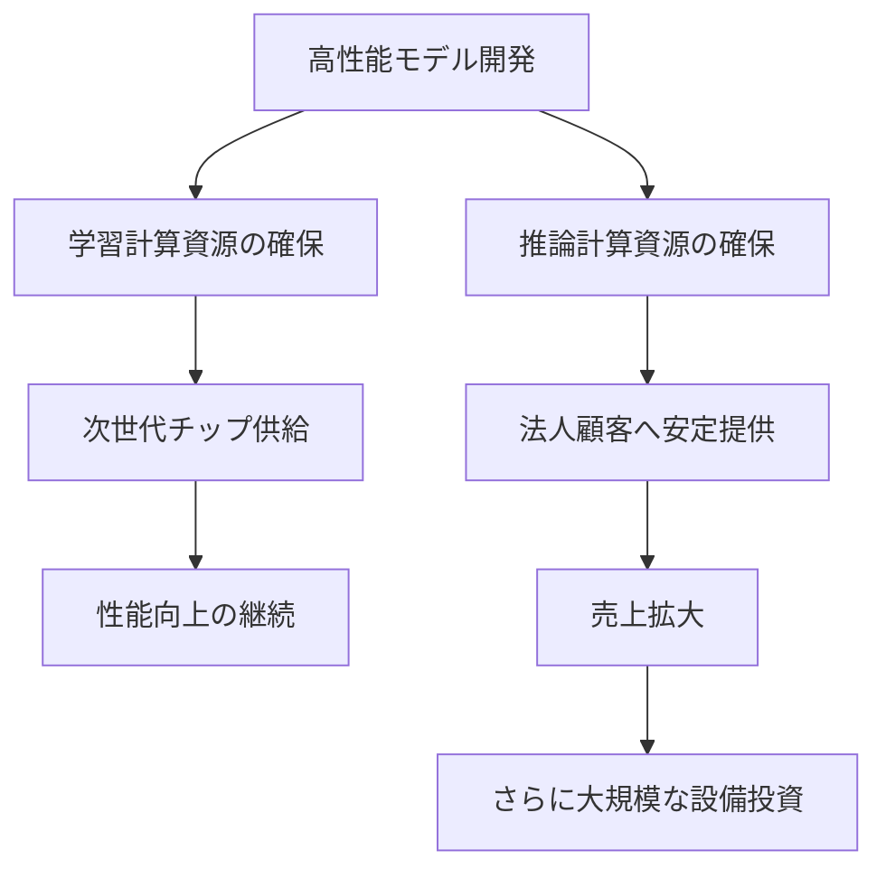
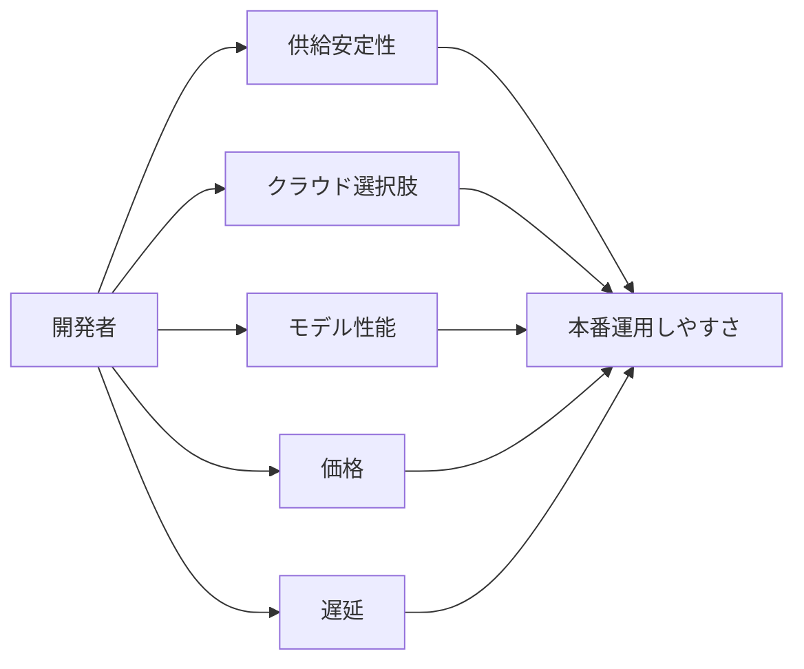

*出典: Anthropic「Anthropic expands partnership with Google and Broadcom for multiple gigawatts of next-generation compute」*

## 📌 3行でわかるこの記事

- Anthropicは2026年4月、**GoogleとBroadcomから複数ギガワット規模の次世代TPU計算資源を確保する契約**を発表しました。
- これは単なる設備増強ではなく、**Claude需要の急増に対して“モデル性能”ではなく“供給能力”で勝ちにいく動き**です。
- 開発者目線では、今後のAI競争はモデル比較だけでなく、**誰が安定して大規模推論を回せるか**がさらに重要になります。

---

## はじめに

最近のAIニュースはモデル名のアップデートばかりが目立ちますが、実際には**計算資源の確保**こそが勝敗を左右し始めています。

その象徴が、Anthropicによる今回の発表です。2026年4月6日、AnthropicはGoogleおよびBroadcomとの新しい契約により、**2027年から稼働予定の複数ギガワット規模の次世代TPU容量**を確保すると発表しました。

数字のインパクトも大きいですが、もっと重要なのはこのニュースが示す構造です。AI企業はもう「良いモデルを作る」だけでは不十分で、**それを世界中の顧客に安定供給できるか**が問われています。

## 今回の発表で何が明らかになったのか

### 発表内容の要点

Anthropicの公式発表で確認できる事実は、主に次のとおりです。

- GoogleとBroadcomと新たな契約を締結
- 複数ギガワット規模の次世代TPU計算資源を確保
- 稼働開始は2027年を想定
- 大半の設備は米国内に設置予定
- Claudeの需要増に対応するための大規模投資

Anthropicは発表文の中で、2026年の需要加速にも触れています。特に目を引くのは以下の数字です。

- 年換算売上ランレートが**300億ドル超**
- 年換算100万ドル以上を使う法人顧客が**500社超 → 1,000社超**へ、2か月足らずで倍増

この2点だけでも、今回の契約が「将来の夢」ではなく、**すでに足元で起きている需給逼迫への対応**だと分かります。

### 供給網として見るとかなり大きい話

今回の発表で面白いのは、Anthropicが1社依存ではなく、複数の計算基盤を使い分けていると明言している点です。

Anthropicは公式に、以下のAIハードウェアを用途に応じて使っていると説明しています。

- AWS Trainium
- Google TPU
- NVIDIA GPU

つまり、モデル企業でありながら、実態としては**巨大なマルチクラウド・マルチチップ運用企業**になっているわけです。

## なぜこのニュースが重要なのか

### モデル競争が「頭脳戦」から「供給戦」に移った

2024〜2025年までは、AI競争は比較的シンプルでした。

- どのモデルが賢いか
- ベンチマークで勝っているか
- コード生成や推論で優れているか

もちろん今でもそれは重要です。ただ、2026年の段階ではそれに加えて、**賢いモデルを大量の顧客に落ちずに届けられるか**が同じくらい重要になっています。

以下の図で見ると分かりやすいです。



要するに、**モデル性能 → 顧客増 → 計算資源不足 → さらに設備投資**というループが回っています。今回のAnthropicの動きは、このループを先回りして押さえにいったものです。

### 「複数ギガワット」は何を意味するのか

ギガワットという表現は、IT業界よりむしろ電力インフラでよく使われます。そこから逆算すると、今回のニュースは「GPUやTPUを少し増やした」程度ではありません。

これは、**電力・データセンター・半導体・クラウド契約をまとめて長期固定するレベルの意思決定**です。

つまりAnthropicは、

- モデルの研究開発
- 推論基盤の供給
- クラウド経由の商用提供

を別々に考えるのではなく、最初から一体で設計していることになります。

## GoogleとBroadcomの役割をどう見るべきか

### Googleは“クラウド”ではなく“計算供給者”として前面に出てきた

今回の発表ではGoogle Cloudとの既存関係深化が明言されています。さらにAnthropicは、Claudeが

- Amazon Bedrock
- Google Cloud Vertex AI
- Microsoft Azure Foundry

の3大クラウドで利用可能だと説明しています。

ここで重要なのは、Googleが単なる販売チャネルではなく、**TPU供給元としての存在感を強めている**ことです。

近年のAI基盤競争はNVIDIA中心に見られがちですが、今回の契約は、GoogleのTPU路線が依然として大きな武器であることを示しています。

### Broadcomは“裏方”だが、かなり重要

Broadcomは一般向けには目立ちにくいですが、AI時代ではカスタムアクセラレータやネットワーク周辺で極めて重要なポジションにいます。

今回の契約は、Broadcomが単なる部品供給ではなく、**大規模AIインフラのコアプレイヤー**になっていることを改めて示しました。

## 開発者・企業ユーザーにとっての意味

### 1. Claude系サービスの供給安定性が上がる可能性

計算資源不足が起きると、ユーザー側では次の問題が発生しがちです。

- レイテンシ悪化
- 利用制限の強化
- APIコストの上昇
- 新機能公開の遅延

今回のように先回りで巨大契約を結ぶのは、こうした問題を抑える狙いがあると考えるのが自然です。

### 2. エンタープライズ案件では“モデル性能”以上に重要

企業導入では、単に賢いだけでは採用されません。重要なのは次のような運用品質です。

#### 企業が本当に見ている項目

- 需要急増時に落ちないか
- 長期契約で供給を維持できるか
- 特定クラウドだけに縛られないか
- 規制やデータ所在地に対応できるか

今回の発表は、この観点でかなり強いです。特に「大半を米国内に設置」と明言した点は、**インフラ主権や規制対応**の文脈でも意味があります。

### 3. 今後はアプリ開発側も“どの土台に乗るか”を選ぶ時代

これからのAIアプリ開発では、モデルAPIの精度比較だけでなく、基盤の信頼性まで見た方がいいです。



この図の通り、2026年以降は**推論基盤の安定性そのものが開発体験**に直結します。

## 技術的にどう捉えるべきか

### TPU回帰ではなく、マルチアクセラレータ時代の本格化

今回のニュースを「TPUがGPUに勝つのか」という単純な話にすると、少しズレます。

Anthropic自身が明言しているように、同社は

- AWS Trainium
- Google TPU
- NVIDIA GPU

を併用しています。

つまり今起きているのは、単一チップへの回帰ではなく、**ワークロードごとに最適な計算資源を割り当てる設計**の本格化です。

#### 実装イメージ

たとえば概念的には、次のような運用が考えられます。

```bash
# 例: サービス要件ごとに推論先を切り替える概念
curl https://api.example.ai/router \
  -H "Content-Type: application/json" \
  -d '{
    "task": "enterprise_agent",
    "priority": "high_availability",
    "preferred_backend": ["tpu", "gpu", "trainium"]
  }'
```

実際の内部実装はもっと複雑ですが、発想としてはこうです。AI企業は今後、モデル会社であると同時に、**巨大な推論オーケストレーション企業**にもなっていきます。

## このニュースから見える今後の展開

### 2027年に向けて何が起こりそうか

今回の契約は2027年から順次稼働予定です。ここから考えると、今後は次の流れが濃厚です。

### 1. より大きいモデル、より長いコンテキスト

供給が増えれば、より重いモデルや長文処理機能を商用提供しやすくなります。

### 2. エージェント機能の拡張

長時間・高頻度の推論が必要なエージェント運用では、計算資源の余裕がそのまま機能拡張につながります。

### 3. クラウド横断提供の強化

3大クラウドで使えるという位置づけは、今後さらにエンタープライズ案件で強みになります。

## まとめ

今回のAnthropicの発表は、表面的には「GoogleとBroadcomと大型契約を結んだ」というニュースです。

ただ本質はもっと大きいです。これは、AI競争が**モデルの知能競争から、知能を安定供給するインフラ競争へ移った**ことを示しています。

### 押さえておきたいポイント

- AnthropicはGoogleとBroadcomから、2027年以降に稼働する複数ギガワット規模の次世代TPU容量を確保した
- 2026年のClaude需要は急増しており、年換算売上ランレートは300億ドル超に達した
- 年100万ドル以上を使う法人顧客は2か月足らずで500社超から1,000社超へ増加した
- AnthropicはAWS Trainium、Google TPU、NVIDIA GPUを併用するマルチ基盤戦略を明示している
- 今後のAI競争では、モデル性能だけでなく供給能力と運用品質がますます重要になる

個人的には、今回のニュースはかなり本質的です。派手な新モデル発表よりも、**「そのモデルを誰が安定して回せるのか」**という現実をはっきり見せたからです。

## 参考リンク

1. [Anthropic expands partnership with Google and Broadcom for multiple gigawatts of next-generation compute](https://www.anthropic.com/news/google-broadcom-partnership-compute)
2. [Anthropic raises $30 billion Series G funding at $380 billion post-money valuation](https://www.anthropic.com/news/anthropic-raises-30-billion-series-g-funding-380-billion-post-money-valuation)
3. [Anthropic invests $50 billion in American AI infrastructure](https://www.anthropic.com/news/anthropic-invests-50-billion-in-american-ai-infrastructure)
4. [Expanding our use of Google Cloud TPUs and services](https://www.anthropic.com/news/expanding-our-use-of-google-cloud-tpus-and-services)
5. [Claude on Google Cloud Vertex AI](https://claude.com/partners/google-cloud-vertex-ai)
