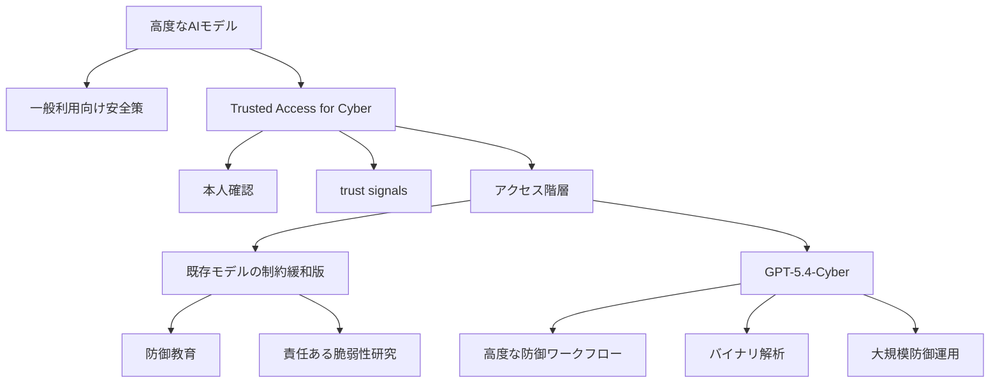
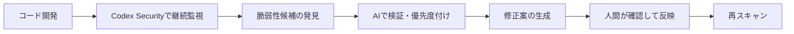
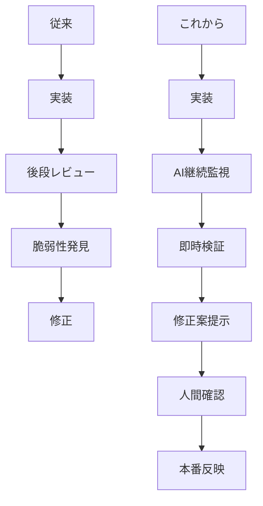

*出典: OpenAI「Trusted access for the next era of cyber defense」*

## 📌 3行でわかるこの記事

- OpenAIは2026年4月14日、Trusted Access for Cyber（TAC）を拡大し、**防御用途向けに調整したGPT-5.4-Cyber**の提供方針を発表しました。
- 本件の焦点は「強いモデルが出た」ことではなく、**高度なサイバー能力をどう本人確認・信頼シグナル付きで防御側に広げるか**にあります。
- 生成AIのサイバー分野は、単なる支援ツールから、**脆弱性発見・検証・修正を常時回す運用基盤**へ移り始めています。

---

## はじめに

AIのニュースというと、新モデルの性能比較やマルチモーダル機能の話に目が向きがちです。

ただ、2026年4月14日にOpenAIが公開した **Trusted access for the next era of cyber defense** は、少し性質が違います。これは「より賢いAI」の話というより、**強いAIを誰に、どういう条件で、どこまで使わせるか**という配備設計の話です。

発表では、OpenAIが Trusted Access for Cyber（TAC）プログラムを拡大し、**GPT-5.4 をベースにサイバー防御用途向けへ調整した GPT-5.4-Cyber** を、より厳格に認証された防御担当者向けに段階提供すると説明しています。さらに、Codex Security や既存のサイバー安全策とも一体で運用していく姿勢が示されました。

この記事では、公開情報に基づいてこの発表の中身を整理しつつ、なぜ今これが重要なのかを開発者・運用者目線で見ていきます。

## 今回の発表で何が明らかになったのか

### OpenAIが打ち出した3つの柱

OpenAIの4月14日付記事を読むと、今回の取り組みは次の3本柱で整理できます。

#### 1. Democratized access

OpenAIは、防御目的の正当な利用者に対しては、できるだけ広く高度な能力へアクセスできるようにしたいと説明しています。

ただし、無制限に開放するのではなく、

- 強いKYCや本人確認
- trust signals（信頼シグナル）
- 利用者属性に応じたアクセス階層

を使って、**「誰が使うか」を条件に配備する**という考え方です。

#### 2. Iterative deployment

いきなり完全開放するのではなく、限定的な配備から学習しながら改善する方針も明確です。

これはサイバー領域では特に重要です。なぜなら、同じ能力が

- 防御支援
- 脆弱性検証
- exploit 開発

のように、かなり近い領域をまたぐからです。

#### 3. Ecosystem resilience

OpenAIはモデル提供だけでなく、

- Cybersecurity Grant Program
- オープンソース向け支援
- Codex Security
- 防御側向けの trusted access

を組み合わせて、**エコシステム全体の防御力を上げる**としています。

## GPT-5.4-Cyberとは何か

### 単なる“高性能モデル”ではなく、防御運用向けの調整版

今回の発表で最も目を引くのが **GPT-5.4-Cyber** です。

OpenAIによると、このモデルは GPT-5.4 の一種であり、**正当なサイバー防御ワークフロー向けに refusal boundary を下げた、より permissive な構成**になっています。記事では特に、以下のような用途が挙げられています。

- defensive programming
- responsible vulnerability research
- binary reverse engineering
- compiled software の malware potential / vulnerabilities / security robustness の分析

つまり、ここでの本質は「能力を強くした」ことだけではありません。**防御の現場で実際に詰まりやすいリクエストを、より通しやすくした**ことにあります。

### 何が新しいのか

従来の安全策では、正当な防御用途であっても、攻撃と近い文脈の依頼は拒否されやすいという課題がありました。

たとえば実務では、

- バイナリの挙動を調べたい
- 脆弱性の再現条件を確認したい
- exploitability の有無を評価したい
- パッチ候補の妥当性を見たい

といった要求が日常的に出ます。ところが、一般向けモデルではこの境界が厳しすぎると、現場では使いにくくなります。

今回の発表は、その摩擦を**本人確認済みの防御側に限定して減らす**というアプローチだと理解できます。

## 全体像を図で整理する

### OpenAIの考えるサイバー防御の配備モデル

この図のポイントは、OpenAIが「1つのモデルを全員に同じ条件で配る」発想ではなく、**能力と利用者の信頼性を組み合わせて段階配備する**設計を前面に出していることです。

## 既存施策とのつながり

### TACは単発施策ではなく、ここ数年の流れの延長線上にある

OpenAIは記事の中で、今回の発表を突然の新方針としてではなく、2023年以降のサイバー施策の積み上げとして位置づけています。

#### これまでの流れ

- 2023年: Cybersecurity Grant Program を開始
- 2025年: モデル配備に cyber-specific safeguards を組み込み始めた
- 2026年初頭: Codex Security を研究プレビューとして展開
- 2026年4月: TAC を拡大し、GPT-5.4-Cyber を高信頼利用者へ段階提供

この流れを見ると、OpenAIは「サイバーは危険だから一律で厳しく止める」というより、**危険性を認めたうえで、防御側に有効な形で能力を再配分する**方向へ進んでいます。

### Codex Securityとの関係も重要

OpenAIは同記事で、Codex Security が

- codebase を自動監視し
- issue を検証し
- fix を提案し
- 既に 3,000件超の critical / high fixed vulnerabilities に寄与した

と説明しています。

ここで見えてくるのは、GPT-5.4-Cyber が単独製品というより、**セキュリティ運用スタックの上位レイヤー**だということです。

この方向性は、セキュリティ対応を「年に数回の監査イベント」から、**開発と同時進行で回る常時運用**へ寄せるものです。

## なぜ今このニュースが重要なのか

### 問題は“AIが危険か”ではなく、“誰が先に使うか”になった

サイバー分野では、モデル能力が上がるほど、防御と攻撃の距離が縮みます。

だから議論が単純に「もっと厳しく止めるべきか」だけだと、半分しか見えていません。実際には、攻撃者もAIを使い始めており、Microsoftも2026年4月のMSRC記事で、**AIによって脆弱性発見と対応の速度を引き上げる必要性**を明確に書いています。

つまり今の論点は、

- AIの利用をゼロにするか

ではなく、

- 高度なAIを防御側へどう先行配備するか
- どのレベルの本人確認と監査を付けるか
- どこまで permissive にするか

へ移っています。

### AIセキュリティは“補助”から“運用基盤”へ

個人的に今回の発表で大きいのは、AIが補助員の位置を超え始めていることです。

従来のイメージは、せいぜい

- ドキュメント要約
- ログの説明
- 軽いコードレビュー補助

くらいでした。

しかし今は、

- 脆弱性候補の探索
- バイナリ解析
- 修正案の生成
- 大量案件の優先度付け

まで踏み込みつつあります。これは、サイバー防御が**人手中心の専門業務**から、**AIを前提にした高速運用**へ移る兆候としてかなり重いです。

## 開発者・企業にとっての実務的な意味

### 1. 防御ツール選定の基準が変わる

これからは、単に「精度が高いモデル」だけでは足りません。

重要になるのは次のような点です。

#### 見るべき項目

- 正当な防御タスクで過剰拒否しないか
- 本人確認や監査設計が現実的か
- コードスキャンや修正提案までつながるか
- 継続運用のワークフローに乗せられるか
- OSSやエンタープライズ開発の現場で使いやすいか

### 2. セキュリティチームの仕事の重心が変わる

AIが見つける件数が増えるほど、人間側の価値は「最初に見つけること」だけではなく、

- 本当に危険かを判断すること
- 修正優先度を決めること
- 誤検知を減らすこと
- 開発フローへ落とし込むこと

へ移ります。

### 3. 開発フローそのものにセキュリティが埋め込まれていく

今後は、後段監査よりも、書いている最中に危険を潰す流れが強まりそうです。

#### 従来とこれから

この差はかなり大きいです。特に、人手不足のセキュリティ組織ではインパクトが出やすいはずです。

## 注意して見るべき点

### まだ限定配備であり、万能ではない

今回の発表をそのまま楽観的に読むのは危険です。

#### 押さえておきたい注意点

- GPT-5.4-Cyber は現時点で vetted security vendors / organizations / researchers 向けの限定的な iterative deployment
- permissive なモデルほど、アクセス管理や可視性が重要になる
- Zero-Data Retention のような no-visibility use には制約が付く可能性がある
- 第三者プラットフォーム経由では、OpenAIの直接可視性が下がるため条件が厳しくなりうる

要するに、OpenAI自身も「強い能力を安全に出すのは難しい」と認めたうえで、かなり慎重に配備しているということです。

## まとめ

OpenAIの2026年4月14日の発表は、単なる新モデルニュースではありません。

### この記事の結論

- OpenAIはTACを拡大し、防御用途向けに調整した **GPT-5.4-Cyber** を段階提供する方針を示した
- 本質は、サイバー能力を一律に閉じるのではなく、**本人確認と信頼シグナル付きで防御側へ広げる設計**にある
- Codex Security など既存施策と組み合わせることで、AIは脆弱性発見・検証・修正の常時運用基盤へ近づいている
- 今後の競争軸は「モデルが賢いか」だけでなく、**誰に、どこまで、どの安全策で配備できるか**になる

派手さでは大型モデル発表に負けますが、実務インパクトで見ると今回のニュースはかなり本質的です。AIのサイバー活用は、もう実験段階ではなく、**防御オペレーションの設計問題**に入っています。

## 参考リンク

1. [OpenAI: Trusted access for the next era of cyber defense](https://openai.com/index/scaling-trusted-access-for-cyber-defense/)
2. [OpenAI: Trusted Access for Cyber](https://openai.com/index/trusted-access-for-cyber/)
3. [OpenAI: Codex Security now in research preview](https://openai.com/index/codex-security-now-in-research-preview/)
4. [Microsoft MSRC: Strengthening secure software at global scale: How MSRC is evolving with AI](https://www.microsoft.com/en-us/msrc/blog/2026/04/strengthening-secure-software-global-scale-how-msrc-is-evolving-with-ai)
5. [OpenAI: Cybersecurity Grant Program](https://openai.com/index/openai-cybersecurity-grant-program/)
