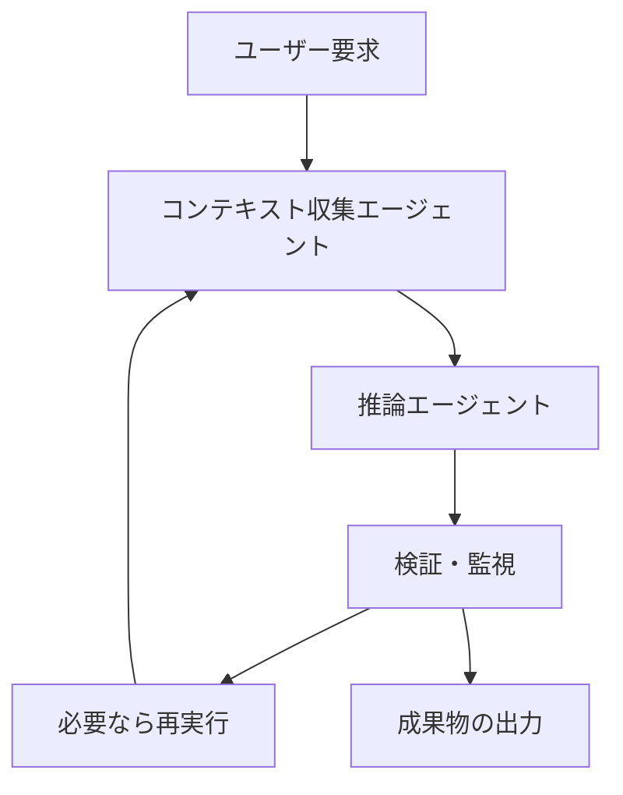
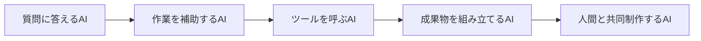

*出典: OpenAI Developers「From prompts to products: One year of Responses」*

## 📌 3行でわかるこの記事

- OpenAIは**Responses API 1周年**で、エージェント実装が「実験」から「運用」へ進んだことを示しました。
- Perplexityの事例からは、**音声AIの勝負どころがモデル性能だけでなくコンテキスト管理と音声パイプライン設計**にあると分かります。
- Anthropicの**Claude Design**は、生成AIがテキスト中心から“成果物をそのまま作る”方向へ進んでいる流れを象徴しています。

---

## はじめに

ここ1〜2か月のAIニュースを見ていると、単なるモデル更新よりも、**開発者が実際に何を作れて、どこで詰まるのか**に踏み込んだ発表が増えてきました。

今回はその中でも、開発者目線で特に重要だと感じた3つを取り上げます。

- OpenAI: Responses API 1周年
- OpenAI × Perplexity: Realtime APIを使った音声UXの実践知
- Anthropic: Claude Designの発表

## 2026年春の注目ニュース3選

### 1. OpenAI Responses APIが「ユースケースの層」に入った

OpenAIは2026年3月11日、**Responses APIの1周年まとめ**を公開しました。

この発表の重要な点は、API仕様の更新そのものより、**実運用の事例がかなり具体化してきた**ことです。

公式記事では、少なくとも次のような実装パターンが紹介されています。

- AIエージェントの障害検知と監視
- 深い推論とコンテキスト分離を組み合わせた分析ワークフロー
- コレクションデータを会話UI化するプロダクト
- 画面録画からインタラクティブなデモを生成する仕組み
- AI出力上のブランド露出を測定する分析基盤

つまり、Responses APIは「チャットっぽいUIを作るAPI」ではなく、**ツール呼び出し・長時間ジョブ・状態管理を含むエージェント基盤**として位置づけが固まってきました。

### 事例から見える共通パターン

記事を読むと、成功している実装には共通点があります。

#### 共通点1: 収集と推論を分けている

たとえばRepo Promptの事例では、

- まず別エージェントが必要な文脈を集める
- その後に推論モデルが分析に集中する

という分離が強調されています。

これはかなり重要で、何でも1回のプロンプトで解決しようとするより、**コンテキスト構築フェーズと推論フェーズを分離した方が安定する**という流れが見えます。

#### 共通点2: 長時間実行を前提にしている

監視、分析、調査、デモ生成のようなユースケースでは、1回の即時応答では終わりません。

そのため、Responses APIの価値は単発応答よりも、むしろ**バックグラウンドジョブやエージェントオーケストレーション**にあります。



この形は、今後のAIアプリ設計でかなり標準化していきそうです。

### 2. Perplexity事例が示した「音声AIの本当の難所」

2026年3月25日にOpenAI Developersで公開されたPerplexityの事例も、かなり示唆的でした。


*出典: OpenAI Developers「How Perplexity Brought Voice Search to Millions Using the Realtime API」*

Perplexityは、CometやPerplexity Computerでの音声体験にRealtime APIを使い、**毎月数百万件規模の音声セッション**を扱っていると説明しています。

ここで面白いのは、「音声AIはモデルが賢ければ勝てる」という話ではなかったことです。

### 実務で効く学び

#### コンテキストは大きく入れればいいわけではない

Perplexityは長いポッドキャスト文字起こしなどを扱う中で、巨大な塊を一気に投入すると、**ウィンドウ超過時に文脈がまとめて壊れる**問題に直面したと述べています。

そのため、最終的には**2,000トークン程度の小さなチャンクへ分割して段階的に投入**する方針へ切り替えたとのことです。

これは音声系に限らず、長文処理全般でかなり再利用できる知見です。

#### 文脈の「役割付け」が重要

同記事では、追加する情報を `system` `user` `assistant` のどれとして渡すかで挙動が変わる点も強調されています。

たとえばブラウジング中のページ断片を全部 `user` として入れると、モデルが「ユーザーがその段落を全部話した」と誤解しやすい、という話です。

つまり重要なのは文脈量だけでなく、**会話意味論としてどう位置づけるか**です。

#### 音声UXは推論より前に音声処理がある

Perplexityは複数クライアントで音声フォーマットがぶれる問題に対し、Rust製SDKで音声前処理を共通化したと説明しています。

記事中では、少なくとも次のような処理が挙げられています。

- 48kHz monoへのリサンプリング
- Opus/WebRTC前提の音声契約統一
- エコーキャンセル
- 自動ゲイン調整
- ノイズ低減
- ハイパスフィルタ

#### 実装イメージ

```json
{
  "audio_pipeline": {
    "sample_rate": 48000,
    "channels": 1,
    "codec": "opus",
    "preprocess": [
      "echo_cancellation",
      "auto_gain_control",
      "noise_reduction",
      "high_pass_filter"
    ]
  }
}
```

要するに、音声AIはLLMだけ見ていても足りず、**ASR/TTS以前のI/O品質設計が体験を大きく左右する**ということです。

### 3. AnthropicのClaude Designは「成果物生成」への一歩

Anthropicのニュースページでは、2026年4月17日付で**Claude Design**が公開されました。


*出典: Anthropic News*

公開された説明では、Claude DesignはClaudeと協調しながら次のような成果物を作れる新製品とされています。

- デザイン
- プロトタイプ
- スライド
- ワンページ資料

まだ詳細仕様が全面公開された段階ではありませんが、この発表の意味はかなり大きいです。

### なぜ重要なのか

従来の生成AIは、

- テキストを書く
- コードを書く
- 画像を生成する

という個別機能で語られがちでした。

一方、Claude Designの方向性は、**人が最後に欲しい成果物そのものをAIと共同制作する**ものです。

つまり、今後の競争軸は「賢い応答」からさらに進んで、

#### これから強くなる問い

- どこまで完成度の高い成果物を一発で出せるか
- 人間の編集ループをどれだけ短くできるか
- デザイン・文章・構成をまたいで一貫した品質を出せるか

という方向に移っていきます。



## 3つのニュースを並べると何が見えるか

### 単なるモデル競争ではなくなった

今回の3本は別々のニュースに見えますが、並べると同じ流れが見えます。

### 共通する変化

#### 1. AIが長い処理を前提にし始めた

Responses APIの事例群は、監視・分析・生成を含む長いワークフローが中心でした。

#### 2. UXの差が「周辺設計」で決まるようになった

Perplexityの音声事例では、体験の差分がプロンプトよりも、文脈分割・VAD調整・音声前処理に出ています。

#### 3. 出力の単位が“返答”から“成果物”へ変わってきた

Claude Designは、この方向をかなり分かりやすく示しています。

## 開発者として押さえたいポイント

### 小さくても取り入れやすい実践

#### 1. 1エージェント万能主義をやめる

情報収集・推論・検証を分離した方が、長い処理では安定しやすいです。

#### 2. 音声はモデル選定だけで決めない

Realtime系の体験は、オーディオ前処理とターン制御で大きく差が出ます。

#### 3. UI生成や資料生成は“完成物の品質管理”が主戦場になる

今後は単に生成できるかより、**どれだけ編集しやすく・崩れにくく・そのまま使えるか**が重要です。

## まとめ

2026年春のAIニュースで印象的なのは、AIがさらに賢くなったこと以上に、**実務の設計論がはっきりしてきた**ことです。

今回の3本を一言でまとめると、こうです。

- Responses API: エージェントは本番運用の設計フェーズに入った
- Realtime API × Perplexity: 音声AIは周辺アーキテクチャが勝負を分ける
- Claude Design: AIは返答生成から成果物生成へ進んでいる

個人的には、いちばん大きい変化は「AIをどう呼ぶか」ではなく、**AIをどうワークフローに埋め込むか**が主戦場になったことだと感じます。

## 参考リンク

1. [From prompts to products: One year of Responses](https://developers.openai.com/blog/one-year-of-responses)
2. [How Perplexity Brought Voice Search to Millions Using the Realtime API](https://developers.openai.com/blog/realtime-perplexity-computer)
3. [OpenAI Developer Blog](https://developers.openai.com/blog)
4. [Anthropic News](https://www.anthropic.com/news)
5. [Introducing Claude Design by Anthropic Labs](https://www.anthropic.com/news)
