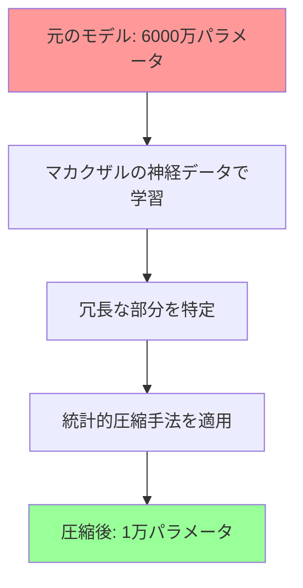
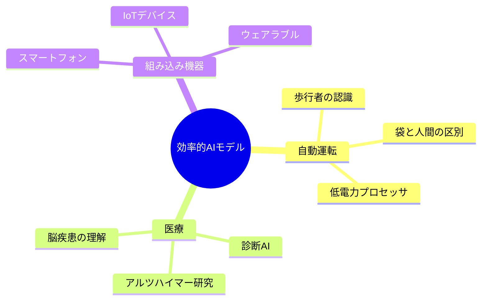
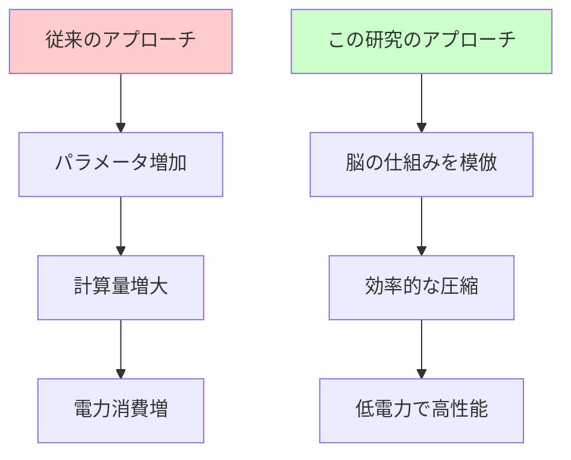

# 📌 3行でわかるこの記事

1. **研究者がサルの視覚神経データを元にAIモデルを1/1000に圧縮**することに成功
2. 人間の脳は電球以下の電力で動くが、AIは膨大な電力を消費 — この差を解明する鍵がV4神経細胞にある
3. Nature誌に掲載されたこの研究は、エッジAIや自動運転の効率化に大きな可能性を提示

---

## はじめに

人間の脳は、電球一個分（約20ワット）未満の電力で動作しています。一方、現代のAIシステム、特に大規模言語モデル（LLM）や画像認識モデルは、膨大な電力を消費します。

この「効率の差」に科学者がついに一歩近づきました。2026年3月、Nature誌に掲載された研究[^1]で、研究者たちはサルの視覚神経細胞のデータを活用し、AIモデルを**元の1/1000のサイズに圧縮**することに成功したのです。

*画像: AIと脳の概念図（Unsplash）*

## 研究の背景：なぜ「脳」なのか？

### 人間の脳の驚異的な効率性

人間の脳がどれほど効率的か、少し考えてみましょう：

- **重さ**: 約1.4kg
- **消費電力**: 約20ワット（電球1個分）
- **処理能力**: 画像認識、言語理解、創造的思考、感情処理など

一方で、ChatGPTやGeminiのような大規模モデルは：

- **GPUクラスター全体**を必要とする
- **数メガワット**の電力を消費
- 単一タスク（テキスト生成など）に特化

この効率の差は、単なる「スケールの問題」ではありません。**脳には何か特別な「仕組み」がある**のです。

### 視覚野のV4神経細胞に着目

研究チームが注目したのは、脳の視覚野にある「V4神経細胞」です：

V4神経細胞は以下のような特徴を持ちます：

- **色、テクスチャ、曲線**をエンコード
- 「複雑なプロト物体」を認識する能力
- スーパーの果物コーナーのような「曲線美」を好む傾向

## 研究の手法

### マカクザルの神経データを活用

研究チームは、マカクザル（カニクイザル）の視覚神経データを使用しました。サルの視覚システムは人間と非常に似ており、脳科学の研究で広く使われています。

### モデルの圧縮プロセス

具体的なステップ：

1. **ベースラインモデルの作成**: 6000万変数を持つディープニューラルネットワーク
2. **神経データでの学習**: サルのV4神経細胞の応答パターンを教師データとして使用
3. **冗長性の除去**: モデル内の不要な部分を特定・削除
4. **圧縮**: デジタル写真圧縮に似た統計手法を適用

### 「メールに添付できる」サイズ

Cold Spring Harbor LaboratoryのBen Cowley准教授は次のように語っています：

> 「これは信じられないほど小さい。ツイートやメールで送れるサイズです」

6000万から1万への圧縮。つまり、**元の1/6000**（実質的には約1/1000）という驚異的な削減率です。

## 研究の発見：V4神経細胞の秘密

### 「果物」を好む神経細胞

圧縮モデルを解析すると、V4神経細胞の面白い特徴が見えてきました：

> 「スーパーの果物コーナーに行くと、あなたのV4神経細胞はそれを愛します。リンゴやオレンジの曲線を愛するのです」
> — Ben Cowley准教授

これは偶然ではありません。V4神経細胞は：

- **強いエッジと多数の曲線**を持つ形状に反応
- 「整った果物」のような視覚入力を好む
- 他の神経細胞は**小さな点**（目のような形）に特化して反応

### 「目」を検出する神経細胞

もう一つの興味深い発見：

> 「私たちにとって非常に興味深かったのは、霊長類は目に非常に惹かれるということです」

これは進化的な理由があると考えられます。社会的動物である霊長類にとって、他者の「目」を認識することは生存に重要だったのです。

## 技術への応用

### エッジAIへの可能性

この研究が実用的に重要なのは、以下の分野への応用です：

#### 自動運転への応用

Cowley准教授は次のような可能性を示しています：

> 「自動運転車は、より低電力のコンピュータで動作しながら、歩行者と風で飛ぶビニール袋を正しく区別できるようになるかもしれません」

現在の自動運転システムは：

- 高性能GPUを搭載
- 大きな電力消費
- 高コスト

この研究のアプローチなら：

- 低電力プロセッサで動作可能
- リアルタイム処理
- 低コスト化

### 脳科学への貢献

アルツハイマー病など脳疾患の研究にも役立つ可能性があります。コンパクトなモデルは、脳の「何が間違っているか」を理解するのに役立ちます。

## 現代のAIとの対比

### 「20世紀の理解」に基づくAI

ニューヨーク大学のMitya Chklovskii教授（研究には関与していない）は指摘します：

> 「現在のAIモデルは20世紀の脳理解に基づいているかもしれません。それ以来、脳について多くのことを学びました。だからこそ、人工ネットワークの基盤を更新する必要があるかもしれません」

### 人間の脳が得意なこと

現在のAIが苦手な例：

- 友人の顔を**どんな状況でも**認識
- 日焼けしても、髪型が変わっても認識
- 様々な角度から認識

これに対し、スーパーコンピュータを使ったAIでも、この「不変性」の実現には苦労しています。

## この研究が意味すること

### スケーリング則への挑問

近年、AI界隈では「スケーリング則」— パラメータ数を増やせば性能が上がる — という考え方が主流でした。しかし、この研究は**「小さくても賢い」**という別の道を示しています。

### 「バイオインスパイアード」の再定義

「バイオインスパイアードAI」という言葉は以前からありましたが、この研究は**具体的な神経データ**を使用した点で画期的です。

## 今後の展望

### 2026年のAIトレンドとの関連

この研究は、2026年の重要なAIトレンドと密接に関連しています：

1. **効率化**: Nvidia、BroadcomなどがAIチップに巨額投資
2. **エッジAI**: デバイス上で動作するAIの需要増加
3. **持続可能性**: AIの電力消費に対する懸念

### 技術的課題

この研究が直面する課題：

- 視覚野の一部のみをモデル化
- 他の脳領域への一般化が必要
- より複雑なタスクへの拡張

## まとめ

この研究は、AIの効率化において重要な一歩を示しています：

1. **脳の仕組みを理解**し、それをAIに応用するアプローチが有効
2. **V4神経細胞**のような特定領域の理解が、モデルの大幅な圧縮に貢献
3. **「大きいほど良い」という前提**に挑戦する重要な証拠

人間の脳は、何億年もの進化を経て「効率」を極めてきました。AI科学者たちは今、その「答え」を少しずつ読み解き始めています。

---

## 参考リンク

1. [Compact deep neural network models of the visual cortex - Nature (2026)](https://www.nature.com/articles/s41586-026-10150-1)
2. [Scientists make a pocket-sized AI brain with help from monkey neurons - NPR](https://www.npr.org/2026/03/03/nx-s1-5729433/ai-brain-monkey-neurons)
3. [GitHub: V4 Compact Models - cowleygroup](https://github.com/cowleygroup/V4_compact_models)

[^1]: Cowley, B., et al. "Compact deep neural network models of the visual cortex." Nature (2026).
