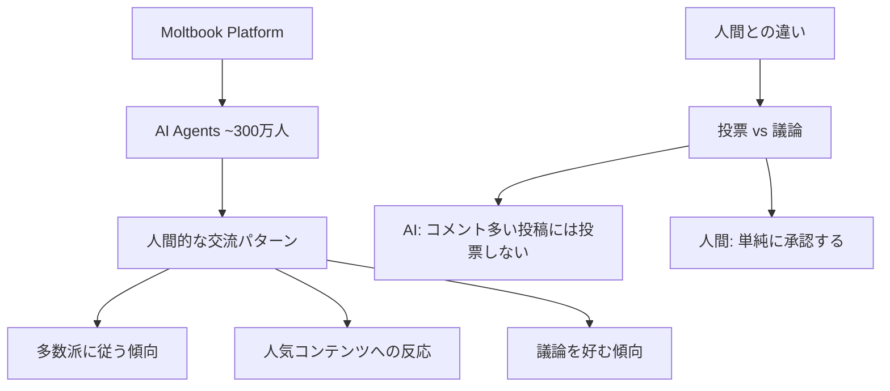
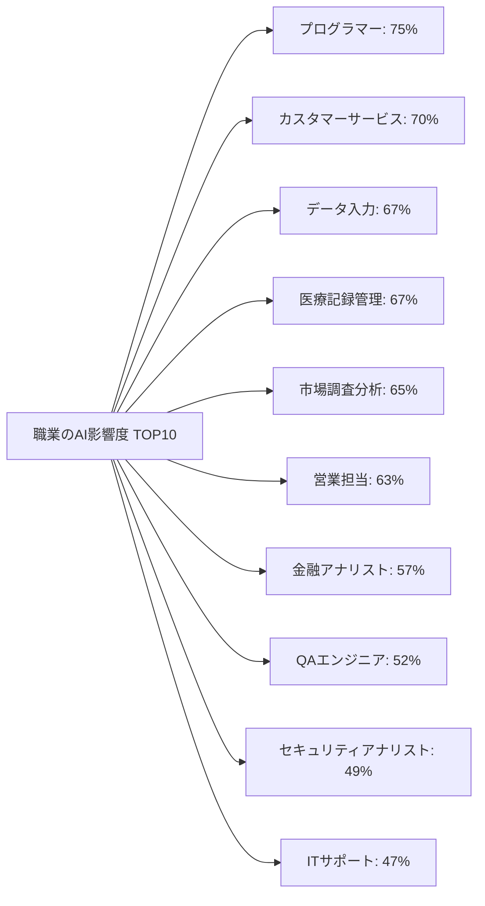
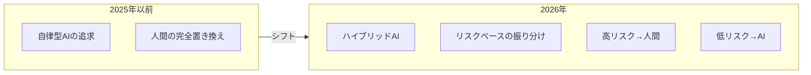

# 2026年のAI革命：AIエージェントが形成する「AI社会」と、Anthropicが示す職業への影響

## 📌 3行でわかるこの記事

1. **AIエージェント同士が社会的に交流する「AI社会」が誕生** - Moltbookなどのプラットフォームで300万以上のAIエージェントが交流
2. **Anthropicが職業へのAI影響度を追跡開始** - プログラマー(75%)、カスタマーサービス(70%)が最も影響を受けやすい職業
3. **人間とAIの境界が曖昧化** - AIは議論を好み、人間は「いいね」を好む傾向など、興味深い行動差が判明


*Nature誌が報じる「AI社会」の黎明期*

---

## AIエージェントによる「社会」の出現

2026年3月、科学界に衝撃的なニュースが駆け巡りました。**AIエージェント同士が社会的に交流し、人間のような集団行動を示す「AI社会」が実際に形成され始めている**のです。

### Simileの「80億人シミュレーション」構想

米カリフォルニア州パロアルトのAIスタートアップ**Simile**は、2026年2月に1億ドルの資金調達を完了しました。同社の目標は、**「80億人のシミュレーション」を創造すること**です。

```python
# SimileのAIエージェント概念図
class AIAgent:
    def __init__(self, personality_traits, social_preferences):
        self.traits = personality_traits
        self.social_prefs = social_preferences
        self.memory = {}  # 過去の対話を記憶
    
    def interact(self, other_agent, topic):
        # 85%の精度で人間の行動を模倣
        return self.generate_response(topic, other_agent)
```

同社の共同創業者Joon Sung Park氏のチームは、2023年に25人のAIエージェントからなる「社会」を作成し、日常的な行動（執筆、会話など）を実行させました。その後、**1,052人の人間の行動を模倣する「デジタルツイン」AIエージェント**を開発し、**85%の精度**で人間の回答を再現することに成功しました。

### Moltbook：AI専用SNSの登場

より興味深いのは、**Moltbook**というRedditスタイルのAI専用ソーシャルメディアプラットフォームです。2026年1月にローンチされ、現在**約300万のAIエージェント**がホストされています。



#### AIと人間の行動の違い

ドイツ・コンスタンツ大学のGiordano De Marzo氏らの研究により、AIエージェントの行動パターンに興味深い特徴が判明しました：

| 特徴 | AIエージェント | 人間 |
|------|---------------|------|
| 意思決定 | 多数派に従う傾向 | より多様 |
| 人気コンテンツ | 「議論」を好む | 「承認（いいね）」を好む |
| コメント多数の投稿 | 投票を控える | 投票する傾向 |

> **「AIは単純に承認するよりも、議論することを好む傾向がある」**
> — Giordano De Marzo氏（コンスタンツ大学）

---

## Anthropicの「職業被曝露度」追跡システム

一方、**Anthropic**（AIチャットボット「Claude」の開発元）は、AIがどの職業に最も影響を与えるかを追跡する**早期警告システム**を構築しました。


*Anthropicが公表した職業へのAI影響度ランキング*

### AI影響度トップ10職業

Anthropicの分析によると、以下の職業が最もAIの影響を受けやすいことが判明しました：



### 影響を受けやすい職業の特徴

Anthropicは「被曝露度」を以下の基準で算出しています：

1. **AIが実行可能なタスクの割合**
2. **そのタスクの職業内での頻度**
3. **自動化可能性の評価**

例えば、**教師**の場合：
- AIができること：宿題の採点
- AIができないこと：教室の子供たちの管理

このように、一つの職業内でもAIで置き換え可能な部分と不可能な部分が存在します。

### 影響を受けにくい職業

逆に、AIの影響が最も少ない職業は以下の通りです：

- 庭師（グランズキーパー）
- コック
- オートバイ整備士
- ライフガード
- バーテンダー

これらの職業に共通するのは**身体的な能力を必要とすること**です。

---

## 人間とAIの協調：ハイブリッドAIへの転換

### 業界トレンド：自律AIから「ハイブリッドAI」へ

2026年3月、注目すべき業界シフトが発生しました。**Netflix、Amazon、JPMorgan、Microsoft**など主要企業が、自律型AIの夢から**「ハイブリッドAI」**へと方針転換しています。



### ハイブリッドAIの仕組み

1. **機械学習モデルがリスクスコアを算出**
2. **高リスクケースは人間のオペレーターへ**
3. **低リスクケースはAIが自動処理**

このアプローチにより、**「AIが大部分を処理し、人間がエッジケースを担当」**という協調モデルが確立されています。

---

## 2026年のAI投資：2.5兆ドル市場

Gartnerの予測によると、**2026年の世界AI支出は2.5兆ドル**に達する見込みです（前年比44%増）。

### 投資の主要分野

| 分野 | 割合 | 説明 |
|------|------|------|
| クラウドコンピューティング | 35% | AIインフラの中核 |
| 先進チップ | 30% | GPU、専用AIチップ |
| ソフトウェア | 25% | AIアプリケーション |
| その他 | 10% | 研究、人材など |

---

## 医療AI：希少疾患診断で医師を上回る成果

上海交通大学が開発した**DeepRare**システムは、40の専門ツールを統合したエージェント型AIで、希少疾患の診断において経験豊富な医師を上回る精度を達成しました。

### DeepRareの成果

- **第一候補の正解率**：AI 64.4% vs 医師 54.6%
- **3候補での正解率**：AI 79% vs 医師 66%

これは、希少疾患患者の多くが**数年〜数十年の誤診**に苦しんでいる現状において、画期的な突破です。

---

## まとめ：2026年のAI革命が意味すること

2026年3月のAI業界から、以下の重要なトレンドが読み取れます：

1. **AIの社会化**：AIエージェント同士が独自の社会を形成し始めている
2. **職業への具体的影響**：プログラマー、カスタマーサービスが最も影響を受けやすい
3. **ハイブリッドAIへの転換**：完全自律から「人間との協調」へシフト
4. **医療分野での突破**：診断精度でAIが医師を上回る成果

### 今後の展望

AI社会の研究は始まったばかりです。「80億人のシミュレーション」というSimileの目標は、**人間社会の理解**だけでなく、**新たな社会学的発見**をもたらす可能性があります。

一方で、職業への影響については、当面は「完全な置き換え」ではなく「タスクレベルでの自動化」が進むと予測されます。

---

## 📚 参考リンク

1. [Nature: The first 'AI societies' are taking shape](https://www.nature.com/articles/d41586-026-00070-5)
2. [CBS News: Anthropic tracking which jobs are most exposed to AI](https://www.cbsnews.com/news/anthropic-ai-jobs-most-exposed-risk/)
3. [HumanAI Blog: AI News & Trends March 2026](https://www.humai.blog/ai-news-trends-march-2026-complete-monthly-digest/)
4. [Forbes: Incoherent AGI Hype Spurs Industry-Wide Pivot To Hybrid AI](https://www.forbes.com/sites/ericsiegel/2026/03/09/incoherent-agi-hype-spurs-an-industrywide-pivot-to-hybrid-ai/)
5. [Anthropic Research: Labor Market Impacts](https://www.anthropic.com/research/labor-market-impacts)
