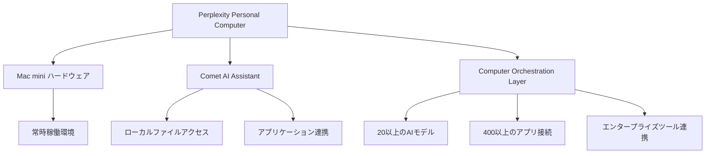
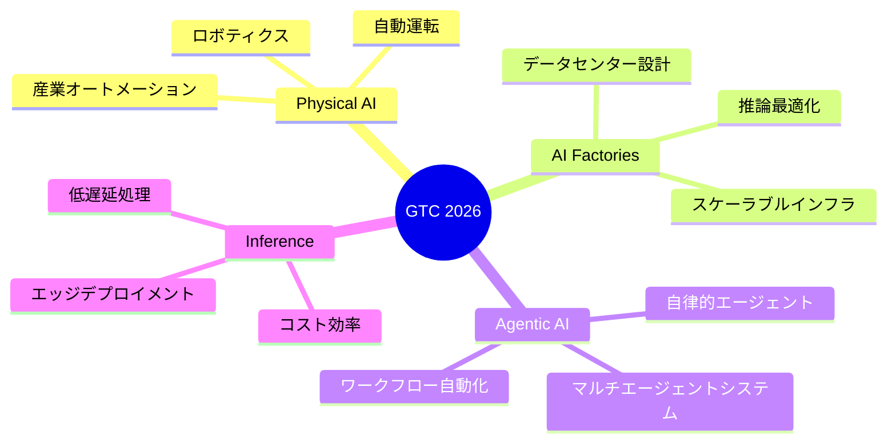
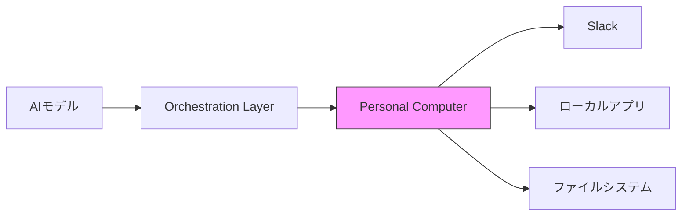

## 📌 3行でわかるこの記事

1. **Perplexityが「Personal Computer」をローンチ** - Mac mini上で動作する常時稼働のAIエージェントシステム
2. **NVIDIA GTC 2026が開催** - 次世代AIハードウェアとAgentic AIの未来を発表
3. **AIインフラの民主化が加速** - ローカル環境でのAIエージェント運用が現実に

---

## はじめに

2026年3月、AI業界は激動の週を迎えました。Perplexityが画期的な「Personal Computer」を発表し、NVIDIAはGTC 2026で次世代のAIインフラを披露。これらの動きは、AIエージェントが私たちの日常にどう組み込まれていくかを示す重要な転換点となっています。

本記事では、これら2つの重要な発表を深掘りし、開発者や企業にとって何が変わるのかを解説します。

---

## Perplexity Personal Computerとは

### 概要

Perplexityは2026年3月13日、**「Personal Computer」**という新しいサービスをローンチしました。これは、Mac mini上で動作する**常時稼働のAIエージェントシステム**です。


### 主な特徴



#### 1. 常時稼働のエージェントランタイム

- Mac miniが常に電源オンの状態で稼働
- リモートからいつでもアクセス可能
- セッションが途切れることなく継続的なタスク実行

#### 2. Cometアシスタントの機能

- ローカルファイルへのアクセス
- インストール済みアプリケーションの操作
- アクティブなセッションの管理

#### 3. セキュリティ機能

- 機密操作にはユーザー承認が必須
- 全操作がアクティビティログに記録
- 緊急停止用のキルスイッチ搭載

### 技術的な仕組み

```python
# Personal Computerの概念図
class PersonalComputer:
    def __init__(self):
        self.hardware = "Mac mini"
        self.agent = "Comet"
        self.models = ["20+ AI models"]
        self.connections = ["400+ apps"]
    
    def run_continuous(self):
        """常時稼働でタスクを実行"""
        while True:
            task = self.receive_remote_command()
            if task.requires_approval():
                self.request_user_approval(task)
            self.execute_locally(task)
            self.log_activity(task)
```

---

## NVIDIA GTC 2026のハイライト

### GTCとは

NVIDIA GTC（GPU Technology Conference）は、AI業界で最も重要なカンファレンスの一つです。2026年3月16日から開催されたGTC 2026では、次のようなトピックが取り上げられました：

### 主要な発表事項



#### 次世代チップ：Vera Rubinシステム

- 2027年初頭のデプロイを目標
- 1ギガワット以上のコンピュート能力
- Thinking Machines Labsなどと提携

#### Nemotron 3 Superの公開

NVIDIAは新しいオープンモデル**Nemotron 3 Super**をリリースしました：

- **ハイブリッドMamba Transformer MoEアーキテクチャ**
- 高品質なオープンデータセット
- 強化学習環境による最適化

---

## なぜこれが重要なのか

### 1. AIエージェントの「常時稼働」が現実に

これまで、AIエージェントは都度起動する形が主流でした。Personal Computerにより、**バックグラウンドで常時動作し続けるエージェント**が一般ユーザーにも利用可能になります。

### 2. ローカル実行の利点

| クラウド型 | ローカル型 (Personal Computer) |
|-----------|----------------------------|
| データが外部に送信される | データはローカルに留まる |
| サービス依存 | 完全なコントロール |
| 従量課金 | 固定コスト |
| ネットワーク必須 | オフライン動作可能 |

### 3. エコシステムの拡大



---

## 開発者への影響

### スキルセットの変化

AIエージェント時代に求められるスキル：

1. **エージェント設計** - タスクの自動化フロー設計
2. **オーケストレーション** - 複数モデルの連携
3. **セキュリティ** - ローカル実行時の安全性確保
4. **監視・ログ** - エージェントの活動追跡

### 実践的なユースケース

```yaml
# 例：Personal Computerでの自動化設定
agent:
  name: "research-assistant"
  triggers:
    - schedule: "0 9 * * *"
    - webhook: "/api/research"
  
  tasks:
    - action: "collect_news"
      sources: ["arxiv", "techcrunch"]
    - action: "summarize"
      model: "claude-3"
    - action: "notify"
      channel: "slack"
```

---

## 今後の展望

### 短期的な影響（2026年）

- AIエージェントの個人利用が一般化
- ローカルAIのコストパフォーマンス向上
- エンタープライズでの採用拡大

### 中長期的な展望（2027年以降）

- AIインフラの完全分散化
- 個人所有のAIエージェントが標準に
- ハイブリッド（クラウド＋ローカル）構成が主流に

---

## まとめ

2026年3月のこれらの発表は、**AIエージェントが「道具」から「パートナー」へと進化する転換点**を示しています。

- **Perplexity Personal Computer**: 常時稼働するローカルAIエージェント
- **NVIDIA GTC 2026**: 次世代AIインフラの青写真

開発者としては、これらの技術をどう活用するか、どう組み込むかを今から考えることが重要です。AIエージェントの時代は、もう始まっています。

---

## 参考リンク

1. [Perplexity Personal Computer - Waitlist](https://www.perplexity.ai/personal-computer-waitlist)
2. [NVIDIA GTC 2026 - 公式サイト](https://www.nvidia.com/gtc/)
3. [NVIDIA Nemotron 3 Super - Hugging Face](https://huggingface.co/nvidia/NVIDIA-Nemotron-3-Super-120B-A12B-FP8)
4. [AI News Briefs Bulletin Board - March 2026](https://radicaldatascience.wordpress.com/2026/03/12/ai-news-briefs-bulletin-board-for-march-2026/)
5. [Anthropic Claude Visuals](https://claude.com/blog/claude-builds-visuals)

---

*この記事は2026年3月16日時点の情報に基づいています。*
