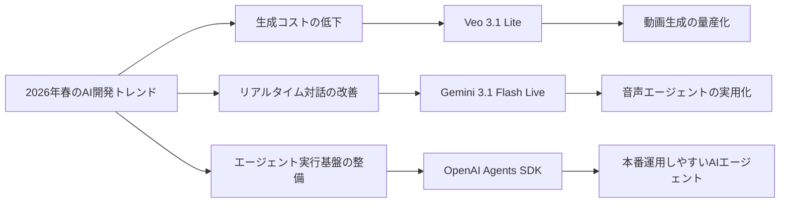
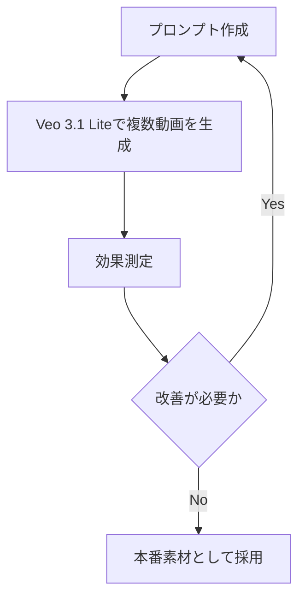
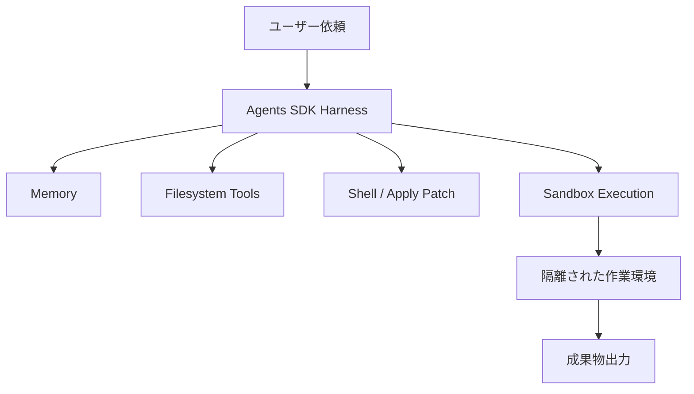

*Image source: Google Blog "Build with Veo 3.1 Lite, our most cost-effective video generation model"*

📌 **3行でわかるこの記事**
- Googleは2026年3月末、**Veo 3.1 Lite**を投入し、動画生成AIを「高品質」だけでなく**低コストで量産しやすい領域**へ広げました。
- 同じくGoogleの**Gemini 3.1 Flash Live**は、自然な音声対話だけでなく、**複雑なタスク実行を伴う音声エージェント**を意識した進化が見えます。
- OpenAIの**Agents SDK新機能**は、ファイル操作・サンドボックス実行・メモリを含む形で、AIエージェントを**本番運用の基盤**に近づけています。

---

## はじめに

2026年4月のAIニュースを眺めていると、単なるモデル性能競争だけではなくなってきたと感じます。

最近の発表は、次の3つに寄っています。

- どう安く使えるか
- どう自然に対話できるか
- どう安全に長い仕事を任せられるか

今回はその観点で、開発者に影響が大きい3本を整理します。

- Google: **Veo 3.1 Lite**（2026-03-31）
- Google: **Gemini 3.1 Flash Live**（2026-03-26）
- OpenAI: **The next evolution of the Agents SDK**（2026-04-16）



## 1. Veo 3.1 Liteは「動画生成AIの量産フェーズ」を進める


*出典: Google Blog 「Build with Veo 3.1 Lite, our most cost-effective video generation model」*

### 何が発表されたのか

Googleは2026年3月31日、**Veo 3.1 Lite**を発表しました。公式発表では、Veo 3.1 Fastより**50%以上低コスト**で、しかも**同じ速度**をうたっています。

記事内で明記されている主なポイントは次の通りです。

#### 公式情報の要点
- **Text-to-Video** と **Image-to-Video** をサポート
- アスペクト比は **16:9 / 9:16** に対応
- 解像度は **720p / 1080p** に対応
- 動画の長さは **4秒 / 6秒 / 8秒** を選択可能
- Gemini API と Google AI Studio から利用可能

### なぜ重要なのか

ここで効いてくるのは「最高性能の動画生成」ではなく、**量産しやすさ**です。

動画生成AIは魅力的でも、コストが高いと次の用途で詰まりがちでした。

- 広告クリエイティブのABテスト
- EC向けの大量素材生成
- SNS向け短尺動画の量産
- 社内説明動画やデモ素材の自動生成

Veo 3.1 Liteは、このボトルネックにかなり正面から手を入れています。

### 開発者目線の示唆

#### 高品質の一点ものより、反復生成がしやすくなる

これまでの動画生成は「すごい1本を作る」方向に注目が集まりがちでした。

ただ実務では、

- まず複数案を出す
- 反応を見る
- 直す
- もう一度回す

というループの方が重要です。

Veo 3.1 Liteは、この反復に向いたモデルだと読めます。



## 2. Gemini 3.1 Flash Liveは「しゃべれるAI」から「任せられる音声AI」へ進む


*出典: Google Blog 「Gemini 3.1 Flash Live: Making audio AI more natural and reliable」*

### 何が発表されたのか

Googleは2026年3月26日、**Gemini 3.1 Flash Live**を発表しました。公式には、Googleで最も高品質な音声モデルであり、**自然で信頼性の高いリアルタイム対話**を目指したモデルと説明されています。

### 公式発表で気になった点

#### 1. 単なる会話性能ではなく、タスク実行を重視している

Googleは、ComplexFuncBench Audio で **90.8%**、Scale AI の Audio MultiChallenge で **36.1%**（thinking on）を示し、**複雑な指示追従や長い推論**を強調しています。

つまり、雑談AIというより、**音声インターフェースを持つエージェント**に近い方向です。

#### 2. 音声の自然さだけでなく、感情や音響ニュアンスも見る

発表では、ピッチや話速のような**acoustic nuances**をより良く認識できるとされています。ユーザーの苛立ちや混乱に合わせて応答調整しやすい点も示されていました。

#### 3. Safetyも同時に押している

生成音声には **SynthID watermark** を埋め込むとされており、音声AIの普及と同時に、**偽情報対策**も基盤側へ組み込み始めています。

### なぜ重要なのか

2025年までの音声AIは、「話せること」自体が価値になりやすかったです。

でも2026年は違っていて、問われるのは次です。

- 雑音下でも使えるか
- 長い対話で破綻しないか
- 音声からタスク実行までつながるか
- 安全性の説明ができるか

Gemini 3.1 Flash Liveは、この4点をかなり意識した発表でした。

### 実装イメージ

音声エージェントを組むなら、今後はこういう構成が増えそうです。

```json
{
  "input": "voice",
  "model": "gemini-3.1-flash-live",
  "pipeline": {
    "realtime_dialogue": true,
    "tool_calling": true,
    "multilingual": true,
    "audio_watermark": "SynthID"
  }
}
```

## 3. OpenAI Agents SDKは「実験用」から「運用基盤」へ近づいた


*出典: OpenAI 「The next evolution of the Agents SDK」*

### 何が発表されたのか

OpenAIは2026年4月16日、**Agents SDK** の新機能を発表しました。中心になっているのは、モデル単体の改善ではなく、**エージェントが実際に作業するための基盤**です。

### 追加された重要ポイント

#### モデルネイティブなハーネス
エージェントがファイルやツールをまたいで作業しやすい前提を、SDK側で持つようになっています。

#### ネイティブなサンドボックス実行
ファイルの読み書き、依存関係の導入、コマンド実行などを、**制御された環境**で行える設計です。

#### メモリとワークスペース管理
記事では、**configurable memory** や workspace を定義する **Manifest abstraction** が紹介されています。長めの仕事をまたいで状態を保ちやすくなっています。

#### 標準的な周辺機能の取り込み
OpenAIは本文中で、MCP、skills、AGENTS.md、shell tool、apply patch tool など、エージェント実装でよく使われる要素を明示しています。

### なぜ重要なのか

AIエージェントが実務で止まりやすいのは、モデル性能よりもむしろ次の部分でした。

- ファイルをどう安全に触らせるか
- 失敗時にどう復旧するか
- 長時間ジョブをどう継続するか
- 認証情報や機密をどう分離するか

今回のAgents SDK更新は、この「泥くさい本番課題」に踏み込んでいます。



### 実務で見るべき点

#### 1. エージェント開発がフレームワーク競争から運用競争へ移った

今後の差分は「LLMを呼べるか」ではなく、**どこまで安全に継続実行できるか**になります。

#### 2. ハーネス設計がプロダクト品質を左右する

OpenAIも本文で、モデルに近い実行パターンへ合わせた方が、複雑な仕事で**信頼性と性能が上がる**と説明しています。

#### 3. サンドボックスは便利機能ではなく必須機能になりつつある

特に prompt injection や exfiltration を前提に設計すべきだと明言している点は重要です。

## 3本を並べると何が見えるか

### 共通テーマは「AIを実務に落とすための摩擦低減」

3つの発表は分野が違いますが、見ている方向はかなり似ています。

#### Veo 3.1 Lite
動画生成を**回せる価格帯**へ近づける

#### Gemini 3.1 Flash Live
音声AIを**自然な対話と実タスク**へ近づける

#### OpenAI Agents SDK
エージェントを**安全な本番運用**へ近づける

つまり2026年春のAI開発は、

- もっと安く
- もっと自然に
- もっと運用しやすく

の3方向で進んでいると整理できます。

## いま開発者が注目すべきポイント

### 1. モデル性能だけで選ばない

今後は、料金体系・実行基盤・安全性・運用性がセットで重要です。

### 2. 生成AIは単発APIからワークフロー部品へ移っている

動画、音声、エージェントのどれも、単発出力より**反復運用**が前提になっています。

### 3. 「使えるAI」は周辺設計で決まる

- 動画ならコストと反復性
- 音声なら遅延と安定性
- エージェントなら隔離実行と復旧性

この周辺設計が、実際の導入可否を決めます。

## まとめ

2026年4月時点のAIニュースで面白いのは、派手な性能更新そのものより、**現場投入のための条件が整ってきた**ことです。

今回の3本を一言でまとめると、こうです。

- **Veo 3.1 Lite**: 動画生成AIが“高い実験”から“回せる制作工程”へ
- **Gemini 3.1 Flash Live**: 音声AIが“しゃべるだけ”から“任せられる対話システム”へ
- **OpenAI Agents SDK**: エージェントが“デモ”から“運用基盤”へ

個人的には、2026年の競争軸は「最強モデルはどれか」より、**どの基盤が実務フローに自然に入り込めるか**に移っていると感じます。

## 参考リンク

1. [Build with Veo 3.1 Lite, our most cost-effective video generation model](https://blog.google/innovation-and-ai/technology/ai/veo-3-1-lite/)
2. [Gemini 3.1 Flash Live: Making audio AI more natural and reliable](https://blog.google/innovation-and-ai/models-and-research/gemini-models/gemini-3-1-flash-live/)
3. [The next evolution of the Agents SDK](https://openai.com/index/the-next-evolution-of-the-agents-sdk/)
4. [Gemini Live API documentation](https://ai.google.dev/gemini-api/docs/live)
5. [Veo 3.1 Lite developer documentation](https://ai.google.dev/gemini-api/docs/models/veo-3.1-lite-generate-preview)
