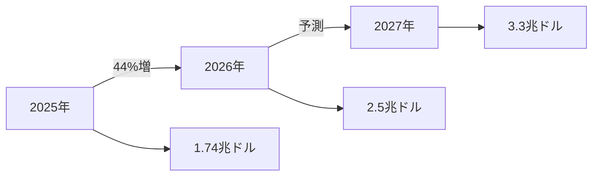
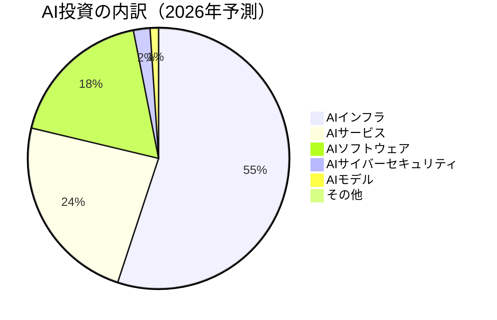
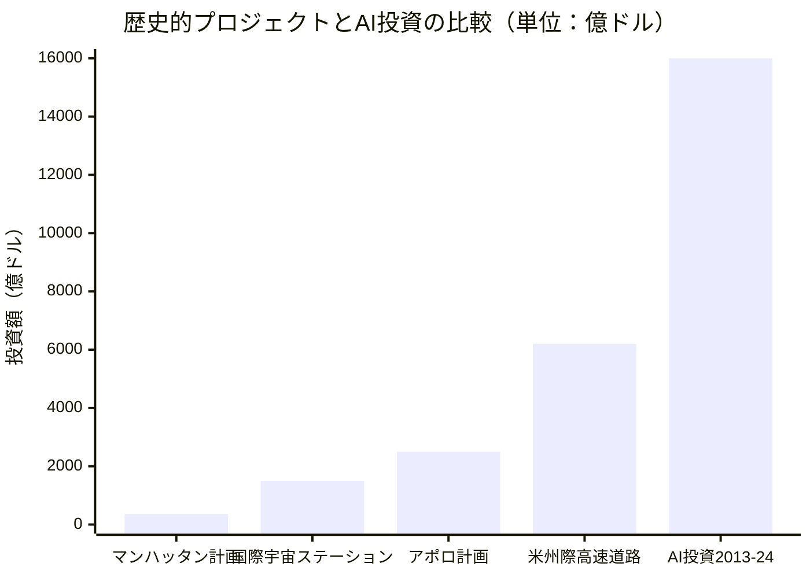
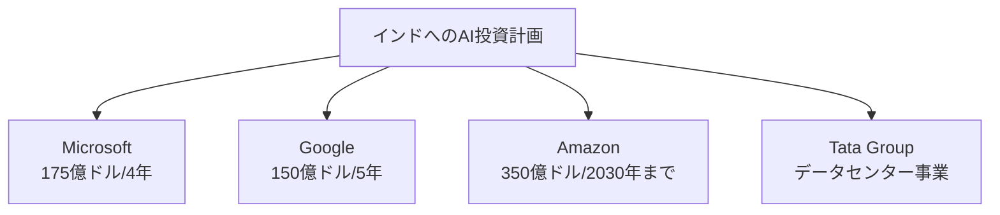

# AI Impact Summit 2026：インドが描く2兆5000億ドルのAI未来

*画像: AI技術の発展を象徴するビジュアル（Unsplash）*

📌 **3行でわかるこの記事**
- 2026年2月、ニューデリーで世界最大級のAIサミットが開催
- 世界のAI投資は2026年に2.5兆ドル（約370兆円）に達する予測
- インドは2000億ドルのAI投資を目指し、グローバルAIハブへの野心を表明

---

## はじめに

2026年2月16日から20日にかけて、インドのニューデリーで**AI Impact Summit 2026**が開催されました。国連事務総長のアントニオ・グテレス氏、フランス大統領のエマニュエル・マクロン氏、そしてインド首相のナレンドラ・モディ氏など、世界のリーダーたちが一堂に会したこのイベントは、AI技術の未来を左右する重要な議論の舞台となりました。

本記事では、この歴史的なサミットの成果と、世界的に急増するAI投資の動向について詳しく解説します。

---

## AI投資の爆発的成長：2026年は2.5兆ドルへ

### 投資規模の可視化

Gartnerの予測によると、**2026年の世界のAI関連投資は2.5兆ドル（約370兆円）** に達する見込みです。これは2025年比で44%の増加にあたります。

### 投資の内訳

2026年のAI投資2.5兆ドルの内訳は以下の通りです：

| 投資分野 | 金額（ドル） | 割合 |
|---------|-------------|------|
| AIインフラ | 1.37兆ドル | 54.8% |
| AIサービス | 5,890億ドル | 23.6% |
| AIソフトウェア | 4,520億ドル | 18.1% |
| AIサイバーセキュリティ | 510億ドル | 2.0% |
| AIモデル開発 | 260億ドル | 1.0% |

---

## 歴史的なプロジェクトとの比較

AIへの投資額を歴史的な巨大プロジェクトと比較すると、その規模の大きさが際立ちます。

過去10年間（2013-2024年）のAIへの企業投資総額は**1.6兆ドル**に達し、人類初の原爆開発（マンハッタン計画）、月面着陸（アポロ計画）、そして全米の州際高速道路網の建設をすべて合わせた額を上回ります。

---

## サミットのハイライト

### モディ首相のビジョン

インドのモディ首相は、サミットで以下のメッセージを発信しました：

> 「インドで設計・開発し、世界に届ける。人類のために届ける」
> 
> 「AI技術は共有され、コアシステムがオープンであってこそ有益となる。そうして初めて、何百万もの若い才能が、それをより良く、より安全にすることができる」

モディ首相はさらに、インドで成功したAIモデルは世界中で展開可能であると強調し、**「人間と知能システムが共に創造し、共に働き、共に進化する時代に入っている」** と述べました。

### 国連事務総長の警告

国連のグテレス事務総長は、AIの未来を「少数の億万長者の気まぐれ」に委ねるべきではないと警告し、**30億ドルのグローバル基金**の創設を呼びかけました。この基金は、発展途上国がAIの基本能力（スキル、データアクセス、手頃な計算力）を構築するためのものです。

### 技術リーダーたちの参加

サミットにはOpenAIのサム・アルトマンCEO、Googleのスンダー・ピチャイCEO、Anthropicのダリオ・アモデイCEOなど、AI業界の主要なリーダーたちが参加しました。

*画像: テクノロジーリーダーたちの会議をイメージ（Unsplash）*

---

## 各国のAI投資状況

### 国別の投資額（2013-2024年の民間投資）

| 順位 | 国名 | 投資額 | スタートアップ数 |
|-----|------|--------|-----------------|
| 1位 | アメリカ | 4,710億ドル | 6,956社 |
| 2位 | 中国 | 1,190億ドル | 1,605社 |
| 3位 | イギリス | 280億ドル | 885社 |
| 4位 | カナダ | 150億ドル | 481社 |
| 5位 | イスラエル | 150億ドル | 492社 |
| 6位 | ドイツ | 130億ドル | 394社 |
| 7位 | インド | 110億ドル | 434社 |
| 8位 | フランス | 110億ドル | 468社 |

アメリカが民間AI投資の62%を占め、圧倒的なリーダーとなっています。

---

## インドのAI戦略

### 2000億ドルの投資目標

インド政府は、今後2年間で**2,000億ドル（約30兆円）** のデータセンター投資を呼び込むことを目指しています。主な企業による投資計画は以下の通りです：

### インドの強みと課題

**強み：**
- 約10億人のインターネットユーザー
- 豊富なエンジニアリング人材
- デジタルID（Aadhaar）やオンライン決済システム（UPI）の成功体験
- 低コストでのAI展開モデル

**課題：**
- 先端半導体チップへのアクセス制限
- 大規模AIモデルの欠如（OpenAIやDeepSeekのようなモデル）
- 数百のローカル言語への対応が必要

---

## サミットを巡る話題

### 注目の瞬間

サミットでは、モディ首相が壇上の技術リーダーたちに手をつなぐよう促した際、OpenAIのアルトマンCEOとAnthropicのアモデイCEOが手をつながない場面が話題となりました。アルトマン氏は後に「混乱していた」と説明しています。

### 論争も

サミットでは以下のような論争も発生しました：

- **ビル・ゲイツ氏の欠場**: エプスタインとの関係が質問される中、基調講演を取りやめ
- **大学の除外**: 中国製のロボット犬を自社開発と主張したインドの大学がサミットから除外される
- **組織の混乱**: 長い列や遅延、盗難被害の報告など運営上の問題

---

## まとめ

AI Impact Summit 2026は、AI技術の発展と国際協力の重要性を世界中に示す重要な機会となりました。特に以下の点が印象的でした：

1. **投資規模の拡大**: 2026年のAI投資は2.5兆ドルに達し、インフラ構築が中心
2. **インドの台頭**: グローバルサウスと先進国の架け橋としての役割を追求
3. **国際協力の必要性**: AIの恩恵を広めるための30億ドル基金の提案
4. **民間投資の活発化**: Microsoft、Google、Amazonなどが大規模な投資を約束

AIの未来は、技術の進歩だけでなく、いかに公平で包括的な形で発展させるかが問われています。インドが掲げる「Design and develop in India. Deliver to the world」というビジョンが、グローバルなAIエコシステムにどのような影響を与えるか、今後が注目されます。

---

## 参考リンク

1. [World leaders discuss AI future at India's global summit - Al Jazeera](https://www.aljazeera.com/news/2026/2/19/world-leaders-discuss-ai-future-at-indias-global-summit-in-new-delhi)
2. [Visualising AI spending: How does it compare with history's mega projects? - Al Jazeera](https://www.aljazeera.com/news/2026/2/19/visualising-ai-spending-how-does-it-compare-with-historys-mega-projects)
3. [Chaos, confusion and $200 billion dreams: What I saw at India's AI summit - CNBC](https://www.cnbc.com/2026/02/21/ai-summit-india-tech.html)
4. [Modi positions India as AI leader at India AI Impact Summit - AP News](https://apnews.com/article/india-ai-summit-modi-artificial-intelligence-67c2b5a37f98e0a6ebb81136e0287969)
5. [AI Impact Summit 2026 - Google Blog](https://blog.google/innovation-and-ai/technology/ai/ai-impact-summit-2026-collection/)

---

*この記事は公開情報に基づいて作成されています。最終更新: 2026年2月22日*
