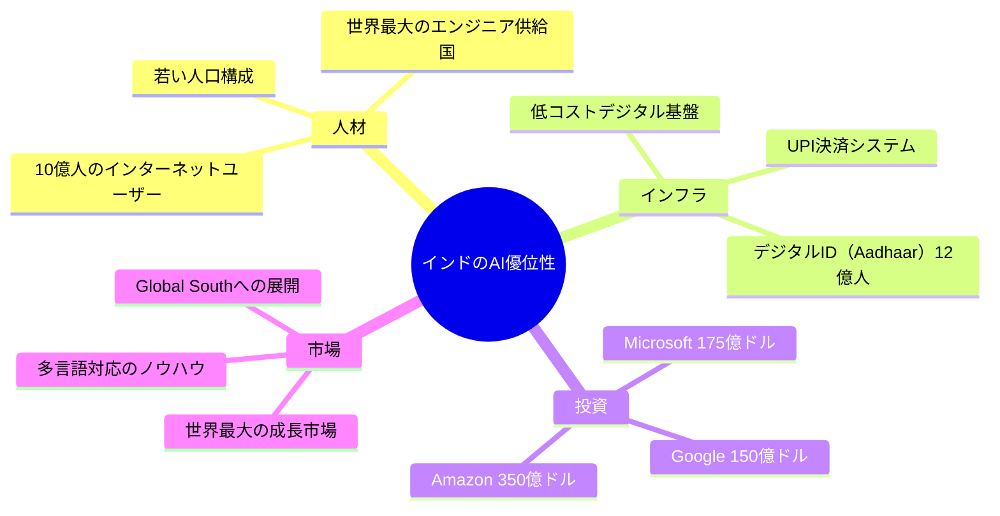
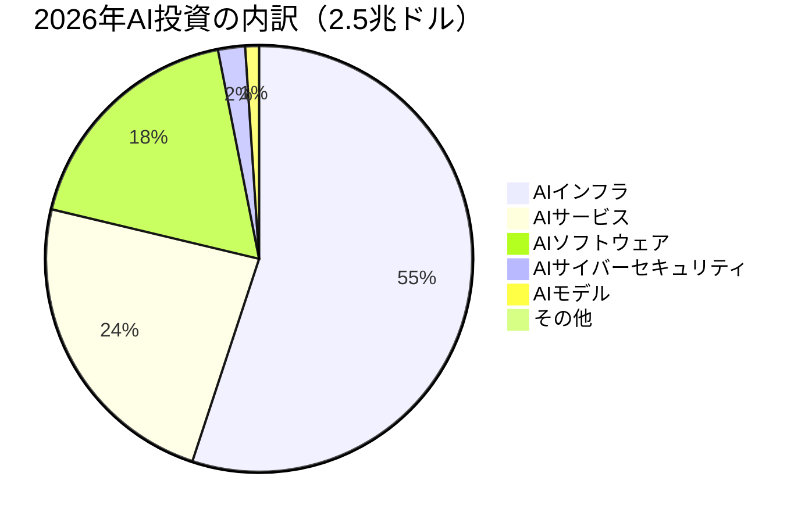
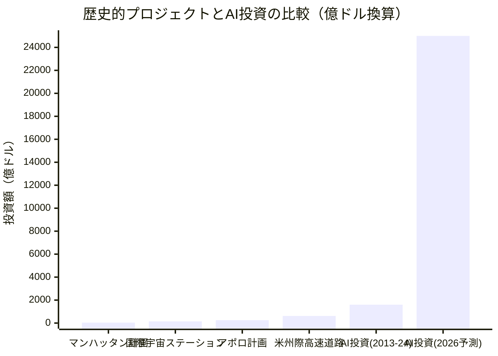
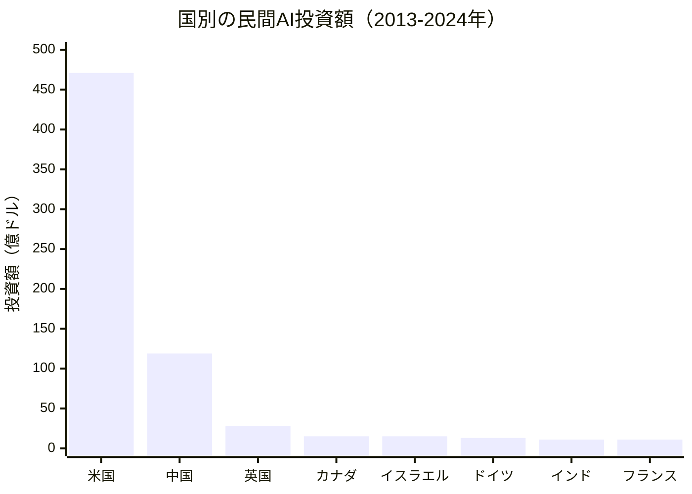
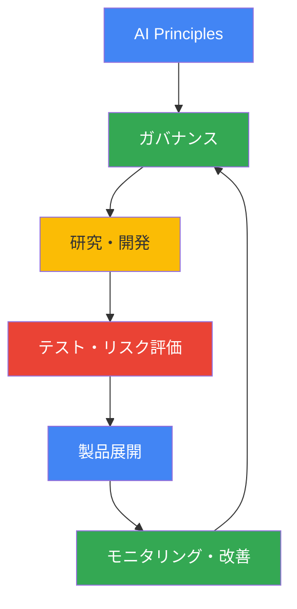

# AI Impact Summit 2026で世界が注目するインドのAI戦略と2.5兆ドルの投資波

## 📌 3行でわかるこの記事

- **インド・ニューデリーで開催されたAI Impact Summit 2026に世界のリーダーが集結**
- **2026年のAI関連投資は2.5兆ドル（約370兆円）に達する予測**
- **Google、Microsoft、Amazonがインドへの大規模投資を発表、AI民主化が主要テーマに**

---

## はじめに

2026年2月、インド・ニューデリーで開催された**AI Impact Summit 2026**は、AI技術の未来を議論する史上最大規模の国際会議となりました。ナレンドラ・モディ首相、エマニュエル・マクロン仏大統領、アントニオ・グテーレス国連事務総長をはじめ、サンダー・ピチャイGoogle CEO、サム・アルトマンOpenAI CEOなど、世界中のリーダーが一堂に会しました。

本記事では、この歴史的なサミットの主要な発表と、世界のAI投資動向について詳しく解説します。

---

## インドのAI戦略：「Design in India, Deliver to the World」

### モディ首相のビジョン

インドのナレンドラ・モディ首相は、開会演説で明確なメッセージを発信しました。

> 「Design and develop in India. Deliver to the world. Deliver to humanity.」
> （インドで設計・開発し、世界へ、そして人類へ届ける）

これは単なるスローガンではなく、インドが**AI分野におけるグローバルハブ**としての地位を確立する戦略を示しています。

### インドが持つ優位性

### 具体的な投資発表

インドへの投資は驚異的な規模に達しています：

| 企業 | 投資額 | 期間 | 主な内容 |
|------|--------|------|----------|
| Microsoft | 175億ドル | 4年間 | クラウド・AIインフラ |
| Google | 150億ドル | 5年間 | 最初のAIハブ建設 |
| Amazon | 350億ドル | 2030年まで | AI駆動のデジタル化 |
| データセンター | 2,000億ドル | 今後数年 | 政府目標 |

---

## 2.5兆ドル：歴史的規模のAI投資

### Gartnerの予測

米国の調査会社Gartnerによると、**2026年の世界のAI投資は2.5兆ドル（約370兆円）**に達する見込みです。これは2025年比で44%の増加となります。

### 投資の内訳

### 歴史的プロジェクトとの比較

この投資規模を歴史的な巨大プロジェクトと比較すると：

**過去10年間のAI投資総額1.6兆ドル**は、マンハッタン計画、アポロ計画、米州際高速道路システムをすべて合わせた額を上回ります。

---

## Googleの大規模パートナーシップ発表

### インフラ投資

Googleは以下の重要な発表を行いました：

#### America-India Connectイニシアチブ

- 米国・インド・南半球を結ぶ新しい光ファイバールート
- 接続性の拡大、信頼性・レジリエンスの向上

#### AI for Government Innovation Impact Challenge

- **3,000万ドル**を政府のAI活用支援に投資
- 公共サービスの変革を目指す

#### AI for Science Impact Challenge

- **3,000万ドル**を科学研究へのAI活用に投資
- 世界的な研究イノベーションを支援

### スキル開発プログラム

Googleはこれまでに**1億人以上**にデジタルスキルトレーニングを提供しており、さらに以下を発表：

- **AI Professional Certificate**プログラム
- Karmayogi Bharatとのパートナーシップ
  - 2,000万人以上の公務員を支援
  - 800以上の地区で展開
  - 18以上のインド語に対応

---

## 世界各国のAI投資動向

### 国別の民間AI投資（2013-2024年）

### 主要な発見

- **米国が62%**のシェアを占める（4,710億ドル）
- **中国が2位**（1,190億ドル）
- **英国が3位**（280億ドル）
- インドは7位ながら急速に成長中

---

## AI民主化と「Pax Silica宣言」

### インド・米国の共同宣言

サミットの際、インドと米国は**Pax Silica Declaration**に署名しました。これは、重要な新興技術分野での協力を深める重要な一歩です。

### 国連事務総長の訴え

アントニオ・グテーレス国連事務総長は、**30億ドルの基金**創設を呼びかけました：

> 「AIの未来は、一部の国や数人の億万長者によって決定されてはならない」

この基金は、途上国がAI能力を構築するための支援を目的としています：
- スキル開発
- データアクセス
- 手頃なコンピューティングパワー

---

## Google Responsible AI Progress Report 2026

### 主なポイント

Googleは最新の**Responsible AI Progress Report**を公開しました：

### 安全性への取り組み

- **SynthID**: 2,000万回以上の利用でAI生成コンテンツを識別
- **スキャム検出**: Circle to SearchとLensで詐欺メッセージを検知
- **多言語対応**: 70以上の言語でリアルタイム翻訳

---

## まとめ

AI Impact Summit 2026は、以下の重要なトレンドを示しました：

1. **インドの台頭**: 「Design in India, Deliver to the World」ビジョンのもと、グローバルAIハブへ
2. **空前の投資規模**: 2026年のAI投資は2.5兆ドルに達する見込み
3. **AI民主化**: 途上国を含む全世界へのAI恩恵の拡大が主要テーマに
4. **責任あるAI**: 安全性と倫理的配慮が開発プロセスに組み込まれている

---

## 参考リンク

1. [AI Impact Summit 2026: How we're partnering to make AI work for everyone - Google Blog](https://blog.google/innovation-and-ai/technology/ai/ai-impact-summit-2026-india/)
2. [Visualising AI spending: How does it compare with history's mega projects? - Al Jazeera](https://www.aljazeera.com/news/2026/2/19/visualising-ai-spending-how-does-it-compare-with-historys-mega-projects)
3. [Our 2026 Responsible AI Progress Report - Google Blog](https://blog.google/innovation-and-ai/products/responsible-ai-2026-report-ongoing-work/)
4. [Modi positions India as AI leader at India AI Impact Summit - AP News](https://apnews.com/article/india-ai-summit-modi-artificial-intelligence-67c2b5a37f98e0a6ebb81136e0287969)
5. [AI Impact Summit 2026 Collection - Google Blog](https://blog.google/innovation-and-ai/technology/ai/ai-impact-summit-2026-collection/)
