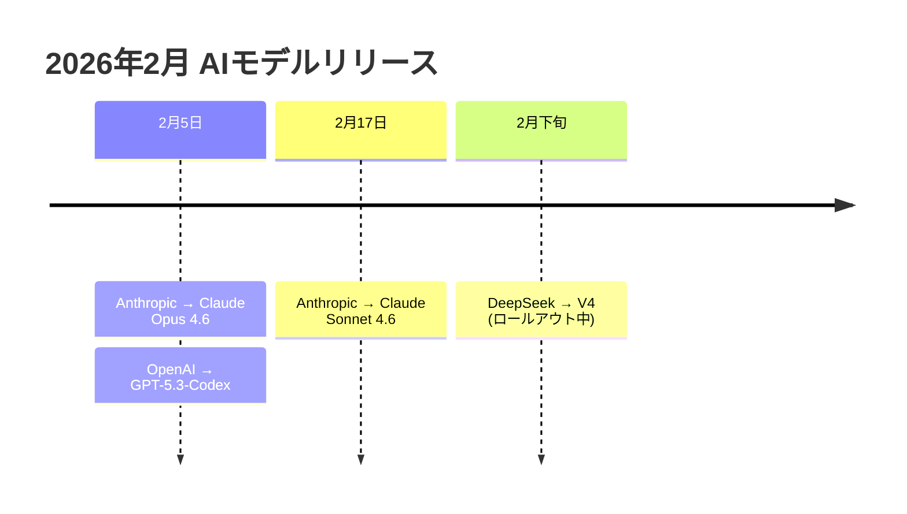
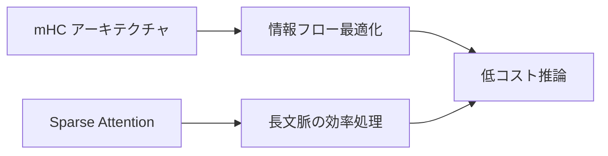

## 📌 3行でわかるこの記事

- **2026年2月**、OpenAI、Anthropic、DeepSeekが同時に新モデルをリリース
- Claude Opus 4.6の「エージェントチーム」、GPT-5.3-Codexの「自己改善ループ」、DeepSeek V4の「効率的アーキテクチャ」が競合
- エージェント機能、1Mトークンコンテキスト、実用的な自律作業能力が新標準に

---

## はじめに

2026年2月、AI業界にとって歴史的な月となりました。調整されたわけでもないのに、主要な3つのAIラボが次々と新モデルをリリースしたのです。

この記事では、**Claude Opus 4.6**、**GPT-5.3-Codex**、**DeepSeek V4**の特徴を比較し、それぞれがどのような用途に適しているかを解説します。

## 2026年2月に何が起きたのか



この「偶然の一致」は、実は偶然ではありません。3社とも同じ市場動向に反応しています：

- **エージェント機能**の実用化
- **ベンチマーク**から**実務評価**へのシフト
- **自律的な作業能力**への需要増大

## 各モデルの特徴

### Claude Opus 4.6（Anthropic）

#### エージェントチーム機能

Opus 4.6の最大の革新は「**エージェントチーム**」アーキテクチャです。

従来のモデルは複雑なタスクを**逐次処理**していましたが、Opus 4.6は**並列処理**が可能です。

```python
# 従来の逐次処理
result = model.process(task_step_1)
result = model.process(task_step_2, previous=result)
result = model.process(task_step_3, previous=result)

# Opus 4.6の並列処理
team = AgentTeam(num_agents=4)
results = team.coordinate([
    research_agent.analyze_sources(),
    data_agent.extract_metrics(),
    writer_agent.draft_sections(),
    reviewer_agent.check_quality()
])
```

#### 主なスペック

| 項目 | 内容 |
|------|------|
| コンテキストウィンドウ | 1Mトークン（β版） |
| Excel/PowerPoint統合 | 標準対応 |
| GDPval-AAスコア | GPT-5.2より+144 Elo |

### GPT-5.3-Codex（OpenAI）

#### 自己改善ループ

GPT-5.3-Codexの特筆すべき点は、**モデルが自分自身の開発に使われた**ことです。

> 「Codexチームは早期バージョンを使用して、自身のトレーニングをデバッグし、デプロイメントを管理し、テスト結果を診断した」

これは単なるマーケティングではなく、**再帰的な能力改善**の実践です。

#### 主なスペック

| 項目 | 内容 |
|------|------|
| 処理速度 | 前世代より25%高速 |
| SWE-Bench Pro | コーディング分野で最高スコア |
| おべっか削減 | 14.5% → 6%未満 |

### DeepSeek V4

#### 効率的なアーキテクチャ

DeepSeekは「より少ないリソースでより多くを達成する」哲学を貫いています。



#### 主な特徴

- **1Mトークン**コンテキストに対応
- **オープンウェイト**で自己ホスト可能
- 米国クラウドに依存しない**データ主権**の確保

## 比較まとめ

| 観点 | Claude Opus 4.6 | GPT-5.3-Codex | DeepSeek V4 |
|------|-----------------|---------------|-------------|
| **最適用途** | 知識業務・事務作業 | ソフトウェア開発 | コスト重視・データ主権 |
| **強み** | エージェントチーム | GitHub統合 | 自己ホスト可能 |
| **コンテキスト** | 1Mトークン | 複数ウィンドウ対応 | 1Mトークン |
| **価格帯** | 上位 | 上位 | 低価格 |

## どのモデルを選ぶべきか

### 知識労働者・事務職の方

**Claude Opus 4.6** または **Sonnet 4.6** がおすすめです。

- Excel/PowerPoint連携
- 長文書の分析（1Mトークン）
- 複雑な調査タスクの並列処理

### 開発者の方

**GPT-5.3-Codex** が最適です。

- VS Code/GitHub統合
- 自律的なコーディングセッション
- 長時間の開発タスク

### 企業・組織の方

要件によります：

- **コスト重視** → DeepSeek V3.2/V4
- **データ主権** → DeepSeek（自己ホスト）
- **信頼性重視** → Claude（安全性評価が充実）

## これからの展望

エージェント機能の競争は**加速する一方**です。

> 「最も経済的な価値があるのは、よりスマートなテキスト生成ではなく、**持続的な自律作業**である」

この点で、どのシステムが「信頼できる同僚」として振る舞えるかが、今後の勝敗を分けるでしょう。

---

## 参考リンク

1. [The February 2026 AI Model War - Humai.blog](https://www.humai.blog/the-february-2026-ai-model-war-nobody-saw-coming-gpt-5-claude-and-deepseek-are-all-moving-at-once/)
2. [U.S. launches Tech Corps - CNBC](https://www.cnbc.com/2026/02/23/us-launch-peace-corps-tech-corps-india-export-ai-stack-sovereignty-counter-china.html)
3. [AI Boom Backlash - The New York Times](https://www.nytimes.com/2026/02/21/technology/ai-boom-backlash.html)
