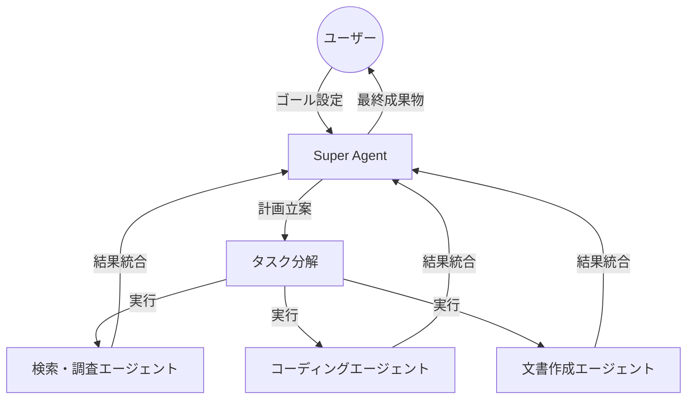

📌 **3行でわかるこの記事**
- IBMが2026年に量子コンピュータによる「量子超越」達成を宣言し、創薬や材料科学への応用が加速
- Microsoftの医療AIが専門医を大きく上回る診断精度を記録し、AIは「ツール」から「パートナー」へ進化
- エージェントAIの自律性が向上し、複数のエージェントが連携して複雑なタスクをこなす「Super Agents」時代へ

## はじめに
2026年に入り、AI技術は新たなフェーズ「実用と統合」の時代へと突入しました。これまでの「何ができるか」という実験的な段階から、「どう社会を変えるか」という具体的な実装段階へと移行しています。本記事では、2026年2月時点での最新技術トレンドと、それがもたらすインパクトについて解説します。

## 1. 量子コンピューティングの到達点 (IBM)
IBMは、2026年が量子コンピュータにとって歴史的な転換点になると宣言しました。ついに、古典コンピュータの能力を超える**「量子超越 (Quantum Advantage)」**が達成される見込みです。

*出典: IBM Think News*

### 量子超越がもたらすもの
これまでの量子コンピュータは理論的な実証にとどまっていましたが、2026年モデルでは以下の分野で実用的なブレークスルーが期待されています。

- **創薬プロセス**: 新薬候補の分子シミュレーションを数時間で完了
- **新素材開発**: 太陽光パネルやバッテリーの効率を劇的に向上させる素材の発見
- **金融最適化**: 複雑な市場リスク計算のリアルタイム化

IBMのJamie Garcia氏によれば、「理論を超え、実際のユースケースで業界最高峰の量子コンピュータを活用する段階に入った」とのことです。

## 2. 医療AIの飛躍的進歩 (Microsoft)
MicrosoftのAI部門は、医療診断におけるAIの精度が人間の専門医を大きく上回る成果を発表しました。

*出典: Microsoft News*

### MAI-DxO (Diagnostic Orchestrator)
最新の医療AIモデルは、複雑な症例において**85.5%の診断精度**を記録しました。これは経験豊富な医師の平均（約20%〜60%とされる難症例における精度）を大きく上回る数値です。
AIは単なる診断支援ツールではなく、医師と対等に議論し、見落としを防ぐ「セカンドオピニオン・パートナー」としての地位を確立しつつあります。

## 3. エージェントAIと「Super Agents」
AIエージェントは単一のタスクをこなす存在から、複数のツールや環境を横断して自律的に動作する「Super Agents」へと進化しています。

### チームとしてのAI
MicrosoftやIBMが提唱するように、AIは個人の生産性を上げるだけでなく、チーム全体のワークフローを自動化する存在になりました。
- **Agentic Parsing**: 文書処理において、テキスト、画像、表などをそれぞれ得意なモデルに振り分けて処理させる技術。
- **自律的な協働**: エージェント同士が通信し（Agent-to-Agent Communication）、人間が介在しなくてもタスクを完遂する仕組みが標準化されつつあります。

## 4. 2026年の技術トレンド俯瞰
最後に、2026年の主要なAIトレンドを俯瞰します。

- **物理AI (Physical AI)**: ロボティクスとAIの融合が進み、物理世界での作業自動化が加速。
- **ハードウェアの効率化**: 巨大なGPUクラスターだけでなく、エッジデバイスで動作する高効率な小規模モデル（SLM）の重要性が増大。
- **AI主権 (AI Sovereignty)**: データやインフラを自国・自社で管理し、外部依存リスクを減らす動きが活発化。

## おわりに
2026年は、AIが「魔法」から「インフラ」へと変わる年と言えるでしょう。量子コンピューティングとAIの融合、そして医療やビジネス現場での深化した活用は、私たちの生活を根本から変えようとしています。

### 参考文献
- [IBM: The trends that will shape AI and tech in 2026](https://www.ibm.com/think/news/ai-tech-trends-predictions-2026)
- [Microsoft: What’s next in AI: 7 trends to watch in 2026](https://news.microsoft.com/source/features/ai/whats-next-in-ai-7-trends-to-watch-in-2026)
- [MIT Technology Review: What’s next for AI in 2026](https://www.technologyreview.com/2026/01/05/1130662/whats-next-for-ai-in-2026/)
