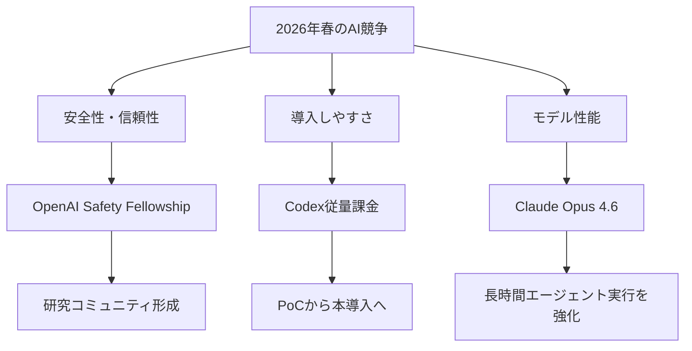
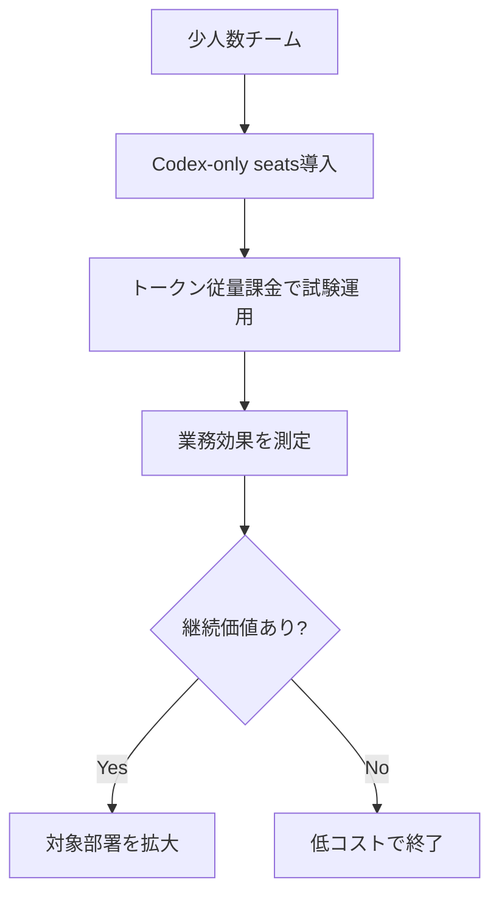

*Image source: Anthropic 「Introducing Claude Opus 4.6」*

📌 **3行でわかるこの記事**
- 2026年4月時点のAI業界では、**モデル性能競争**に加えて**安全性投資**と**導入しやすさの設計**が一段と重要になっています。
- OpenAIは**Safety Fellowship**で安全研究コミュニティへの投資を打ち出し、**Codex従量課金**で企業導入の摩擦を下げました。
- Anthropicの**Claude Opus 4.6**は、長文コンテキスト・エージェント実行・開発支援の強化を前面に出しており、2026年の競争軸をよく表しています。

---

## この記事で扱うニュース

今回扱うのは、2026年2月〜4月に公開された以下の一次ソースです。

### 対象ニュース

- **OpenAI: Introducing the OpenAI Safety Fellowship**（2026-04-06）
- **OpenAI: Codex now offers pay-as-you-go pricing for teams**（2026-04-02）
- **Anthropic: Introducing Claude Opus 4.6**（2026-02-05）

単なるニュースの羅列ではなく、3本をまとめて読むことで、いまのAI企業がどこで差を作ろうとしているかが見えます。

## なぜ今この3本を一緒に見るべきか

2023〜2025年までは、どのモデルが賢いかが主戦場でした。もちろん2026年もその競争は続いています。

ただし、いまはそれだけでは足りません。AIを社会や企業に浸透させるには、次の3点が同時に必要です。

### 競争軸は3つある

#### 1. 性能
どこまで複雑なタスクを任せられるか。

#### 2. 安全性
その性能を、どれだけ信頼できる形で運用できるか。

#### 3. 導入設計
現場や組織が、どれだけ低摩擦で試して広げられるか。

今回の3本は、ちょうどこの3軸をそれぞれ代表しています。

## OpenAI Safety Fellowshipの意味

### 発表内容の要点

OpenAIは2026年4月6日、**OpenAI Safety Fellowship**を発表しました。これは、外部研究者・エンジニア・実務家を対象に、AI安全性とアライメント研究を支援するパイロットプログラムです。

一次ソースで明記されている主なポイントは以下の通りです。

#### 公式発表から読み取れること
- プログラム期間は**2026年9月14日〜2027年2月5日**
- 優先分野は**safety evaluation / ethics / robustness / scalable mitigations / privacy-preserving safety methods / agentic oversight / high-severity misuse domains**
- 参加者には**monthly stipend、compute support、mentorship**が提供される
- 成果物として**paper、benchmark、dataset**のような研究アウトプットが期待されている

ここで重要なのは、OpenAIが単に「安全性を重視しています」と言うだけでなく、**外部研究者が動ける仕組み**に予算と場を投じている点です。

### なぜこの発表が重要なのか

フロンティアモデルの能力が上がるほど、安全性は社内だけで閉じた問題ではなくなります。

#### 背景にある現実
- エージェント的な振る舞いが強くなるほど評価が難しくなる
- 安全性の検証は、企業内だけでは観点が偏りやすい
- 社会実装が進むほど、プライバシー・悪用・監督可能性の議論が重要になる

OpenAIの発表は、この課題に対して**研究コミュニティを巻き込む方向へ舵を切った**と読めます。

### 実務目線での示唆

このニュースは一見すると研究寄りですが、プロダクト導入側にも意味があります。

#### 現場に関係するポイント
- 今後は**安全性評価の透明性**が、採用判断の材料になりやすい
- モデル選定で「性能だけでなく、どんな安全研究基盤を持つか」も見られる
- エージェント利用が増えるほど、**agentic oversight**の重要度が上がる

## Claude Opus 4.6は何を示したか

*Image source: Anthropic 「Introducing Claude Opus 4.6」*

### 発表内容の要点

Anthropicは2026年2月5日、**Claude Opus 4.6**を発表しました。一次ソースでは、agentic coding、computer use、tool use、search、financeなどでの高い性能を強く打ち出しています。

特に注目すべき点は以下です。

#### 公式発表の主なポイント
- **1M token context window**をベータ提供
- コーディング、コードレビュー、デバッグ能力の改善
- 長時間のエージェント的タスクをより安定して継続
- API側で**adaptive thinking**、**effort controls**、**context compaction**を提供
- Claude Codeで**agent teams**を研究プレビューとして提供

この発表が示しているのは、単なる「少し賢くなった」ではありません。**長い文脈を保ちつつ、複数段階の作業を継続実行する方向**への最適化です。

### なぜこの進化が実務に効くのか

ソフトウェア開発や調査業務では、単発の回答精度だけでなく、途中で文脈が崩れないことが重要です。

#### 従来つまずきやすかった点
- 長い会話でコンテキストが劣化する
- 複数ファイル・複数工程の作業で一貫性が落ちる
- ツール利用を含む長手順タスクで失敗しやすい

Opus 4.6の訴求は、この弱点をかなり直接的に突いています。

#### 期待されるユースケース
- 大規模コードベースの調査と修正
- 長い資料やログをまたぐ分析
- 複数ツールを使うエージェント実行
- 継続的なレビューやデバッグ支援

## Codex従量課金は導入設計のアップデート

*Image source: OpenAI 「Codex now offers pay-as-you-go pricing for teams」*

### 発表内容の要点

OpenAIは2026年4月2日、**ChatGPT Business / Enterprise向けにCodex-only seatsを固定席料金なしの従量課金で提供する**と発表しました。

一次ソースに明記されているポイントは以下です。

#### 公式に記載された内容
- **Codex-only seats**は固定シート料金なし
- 利用料金は**token consumptionベース**
- Codex-only seatsには**rate limitsがない**
- ChatGPT Businessの年額料金を**$25から$20/seatへ引き下げ**
- **2 million builders use Codex every week**
- Business / Enterprise内のCodex利用者数は**1月以降6倍**

### なぜこれが大きいのか

AI開発支援ツールは、性能が高くても導入コストの説明が難しいと広がりにくいです。特に企業では、全社分の固定費を先に抱える判断がネックになりがちです。

#### 従量課金で変わること
- 小さなチームからPoCを始めやすい
- 利用量とコストを結びつけて説明しやすい
- 効果が出た後に段階的に拡大しやすい
- 部門別の予算管理と相性が良い

### これは単なる値下げではない

OpenAIは一次ソース内で、small groups can begin pilots, prove value in a few critical workflows, and easily expand from there と述べています。

つまり今回の本質は、価格そのものよりも**導入プロセスの最適化**です。2026年のAI市場では、こうした設計が普及速度を左右します。

## 3本をまとめて読むと何が見えるか

ここまでの3本は、別々のニュースに見えて実はかなりつながっています。

### 共通しているテーマ

#### 1. AI企業は「性能」以外で差を作り始めた
- OpenAIは安全研究コミュニティへの投資を強化
- OpenAIは価格設計で導入障壁を下げた
- Anthropicは長時間・長文脈の実務性能を前面に出した

#### 2. エージェント時代を前提にした競争が進んでいる
- Safety Fellowshipでは**agentic oversight**が優先領域に入っている
- Opus 4.6は長時間エージェント実行を訴求
- Codex従量課金は、実務での常時利用を後押しする

#### 3. 企業導入の判断基準が変わっている
今後は「一番賢いモデルはどれか」だけでなく、次の観点も重要です。

##### 導入時のチェック項目
- 安全性の検証姿勢があるか
- 小さく試して広げられるか
- 長い文脈や複数工程に耐えられるか
- 現場の運用コストを説明しやすいか

## 現場のエンジニアはどう見るべきか

### 実務で注目したいポイント

ニュースとして追うだけなら派手なベンチマークに目が行きますが、現場ではそれ以上に大事なことがあります。

#### 見るべき観点
- **安全性**: 利用ポリシーや評価体制がどこまで整っているか
- **コスト**: PoCしやすい課金形態か
- **継続性能**: 長手順タスクで破綻しないか
- **組織適合**: 既存の開発フローに組み込みやすいか

2026年のAI活用は、単発の生成精度だけでなく、**安全・価格・運用の三点セット**で見るほうが実態に近いです。

## まとめ

2026年4月の最新AIニュースを見ると、競争はもう単純なモデル比較だけではありません。

### まとめると
- **OpenAI Safety Fellowship**は、安全性を外部研究コミュニティと一緒に厚くする動き
- **Claude Opus 4.6**は、長文脈・長時間エージェント作業での実務性能競争を象徴する発表
- **Codex従量課金**は、AI開発支援の導入障壁を下げる現実的な一手

いまのAI業界は、**性能を伸ばすだけでなく、それを安全に、安く、継続的に使える形にする競争**へ移っています。今回の3本は、その流れをかなりわかりやすく示していました。

## 参考リンク

- OpenAI: Introducing the OpenAI Safety Fellowship  
  <https://openai.com/index/introducing-openai-safety-fellowship/>
- OpenAI: Codex now offers pay-as-you-go pricing for teams  
  <https://openai.com/index/codex-flexible-pricing-for-teams/>
- Anthropic: Introducing Claude Opus 4.6  
  <https://www.anthropic.com/news/claude-opus-4-6>
- Anthropic: Claude Opus 4.6 system card  
  <https://www.anthropic.com/claude-opus-4-6-system-card>
