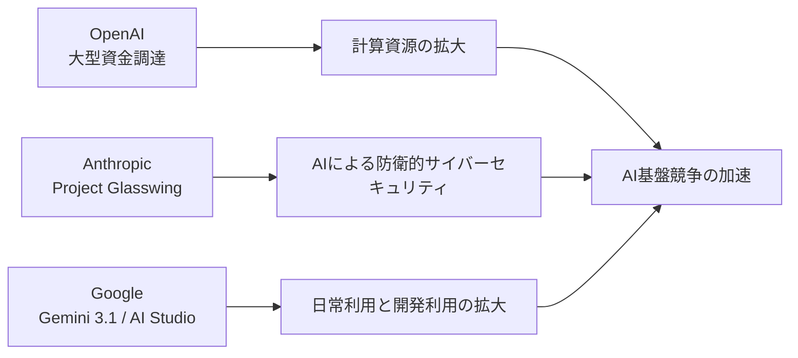
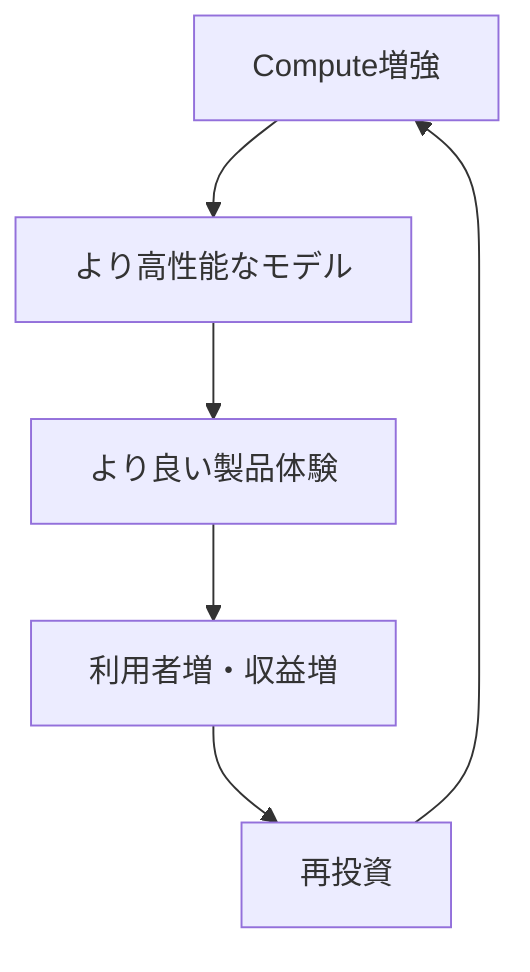

## 📌 3行でわかるこの記事

- OpenAIは**1220億ドル**の大型調達を発表し、AIインフラ・エージェント・開発基盤への投資を一段と加速させました。
- Anthropicは**Project Glasswing**を公開し、AIの脆弱性発見能力を「攻撃側」ではなく「防御側」に振り向ける枠組みを打ち出しました。
- Googleは**Gemini 3.1 Flash-Lite / Flash Live**やAI Studio強化を進め、AIを「日常利用」と「開発利用」の両面で押し広げています。

## はじめに

2026年4月上旬のAI業界は、単なるモデル性能競争ではなく、**「資本」「防御」「実装」**の3方向で一気に進みました。

今回の記事では、一次情報を中心に、直近で特に重要度が高い3つの動きを整理します。単なるニュース紹介ではなく、**いま何が変わりつつあるのか**まで掘っていきます。

## 全体像

## 1. OpenAIが1220億ドルを調達、AI基盤の主導権争いが次の段階へ

### 何が起きたのか

OpenAIは2026年3月31日、**1220億ドルの資金調達完了**を発表しました。発表文では、ポストマネー評価額は**8520億ドル**、戦略パートナーとしてAmazon、NVIDIA、SoftBank、Microsoftなどが名を連ねています。出典はOpenAI公式の発表です。

> Today, we closed our latest funding round with $122 billion in committed capital at a post money valuation of $852 billion.
> — OpenAI, 2026-03-31

さらにOpenAIは、単なる資金調達ニュースにとどまらず、次の論点を同時に示しました。

### 注目ポイント

#### 1-1. 「モデル企業」から「AIインフラ企業」への自己定義が明確になった

OpenAIは発表内で、収益、利用者数、API利用量、企業導入、計算資源の増強をひとつのフライホイールとして説明しています。

この構図は重要です。AI企業の競争軸が「新モデルを出す速さ」だけでなく、**どれだけ継続的に計算資源へ投資し、製品と収益に接続できるか**へ移っていることを意味します。

#### 1-2. Codexやエージェント体験を中心に据えている

OpenAIは同じ発表の中で、GPT-5.4やCodex、メモリ、検索、パーソナライズ、マルチモーダル、さらには「AI superapp」という表現まで用いています。

つまり、単体モデルのAPI提供よりも、**ユーザーの意図を理解し、実行まで担うエージェント型体験**を主戦場にしているわけです。

#### 1-3. マルチクラウド・マルチチップ戦略が鮮明

OpenAIはインフラ戦略として、Microsoft、Oracle、AWS、CoreWeave、Google Cloudに加え、NVIDIA、AMD、AWS Trainium、Cerebras、Broadcom連携の自社チップまで言及しています。

これは、AIの覇権がアルゴリズムだけでなく、**供給網・半導体・クラウド・データセンター設計**まで含む総力戦になったことを示しています。

### 画像

※ OpenAI公式発表ページでは取得しやすい公開OG画像を確認できなかったため、同時期のAI基盤競争を扱うGoogle公式記事の関連画像を補助図として掲載しています。OpenAIの数値・事実関係は公式発表に基づきます。

## 2. AnthropicのProject Glasswing、防衛的サイバーAIの本命になるか

### 何が起きたのか

Anthropicは2026年4月7日、**Project Glasswing**を発表しました。Amazon Web Services、Apple、Broadcom、Cisco、CrowdStrike、Google、Microsoft、NVIDIA、Palo Alto Networksなどが参加する大型イニシアチブです。

Anthropicの説明で特に強いのは、AIのコード理解・脆弱性発見能力が、すでに**「ごく一部の熟練者を除く人間を上回りうる段階」**に入ったという認識です。

### 画像

### 注目ポイント

#### 2-1. 攻撃能力の向上そのものを隠していない

Anthropicは、未公開フロンティアモデル「Claude Mythos Preview」が、主要OSや主要ブラウザ、Linux kernel、FFmpegなどに関する**高深刻度の脆弱性を多数見つけた**と説明しています。

記事中では以下のような例が挙げられています。

- OpenBSDの27年越しの脆弱性
- FFmpegの16年越しの脆弱性
- Linux kernelの権限昇格につながる脆弱性の連鎖

この書き方はかなり踏み込んでいます。AIの危険性を一般論で語るのではなく、**実運用上の防御課題として扱っている**からです。

#### 2-2. 重要なのは「モデル公開」ではなく「用途制御」

Anthropicは、こうした能力が今後広く拡散する前に、防御側へ先に投入する必要があると主張しています。加えて、最大1億ドル分の利用クレジットと、オープンソースセキュリティ組織への400万ドル寄付も表明しました。

これは、AIの安全性議論が「規制するか・しないか」だけではなく、**高リスク能力を誰に、どの条件で、どの目的に使わせるか**へ移っていることを示します。

#### 2-3. AIは“生成”だけでなく“防衛”のインフラになり始めた

生成AIの話題は文章・画像・動画に偏りがちですが、今後の社会実装でより重いのは、むしろこちらかもしれません。

- 電力
- 医療
- 金融
- 行政
- OSS基盤

こうした領域では、便利な要約機能よりも、**脆弱性を見つけて塞ぐ能力**のほうが社会的インパクトは大きいです。

## 3. GoogleはGemini 3.1とAI Studioで「使うAI」と「作るAI」を同時に拡張

### 何が起きたのか

Googleは2026年4月1日公開の月次まとめ記事で、3月のAIアップデートを総括しました。中でも重要なのは、**Gemini 3.1 Flash-Lite / Flash Live**と、**Google AI Studioの強化**です。

### 注目ポイント

#### 3-1. Flash-Liteは低コスト・低遅延の実装向けモデル

GoogleはGemini 3.1 Flash-Liteを「最速かつ最も低コストなモデル」と位置づけています。これは派手さは薄いですが、実際の導入では非常に重要です。

なぜなら企業導入では、最高性能モデルよりもむしろ、

- レイテンシ
- 単価
- 安定運用
- スケーラビリティ

のほうが意思決定に直結するからです。

#### 3-2. Flash Liveは音声インタラクションを本気で取りにきている

GoogleはFlash Liveを「best audio model to date」と表現し、Search LiveやGemini Liveで200以上の国と地域に展開していると述べています。

ここで見えるのは、テキスト中心のチャットUIから、**音声・映像を含むリアルタイム対話UI**への移行です。

#### 3-3. AI Studioは“プロトタイプ置き場”ではなくなった

GoogleはAI Studioについて、プロンプトから本番向けアプリを作る「vibe coding」体験や、新しいコーディングエージェントに言及しています。

つまりGoogleは、検索・Workspace・Mapsのような消費者向け接点だけでなく、**開発者がAIを使ってアプリを作る導線**も同時に強化しています。

## この3つのニュースをどう読むべきか

### 共通点

今回の3件には共通項があります。

1. **AIが単機能ツールから基盤へ移行している**
2. **モデル性能だけでなく、運用・配布・安全性が差別化要因になっている**
3. **開発者向けと一般利用者向けが、ひとつの製品戦略に統合されつつある**

### いま起きている変化

#### 以前

- ベンチマーク勝負
- モデル名の派手さ
- 単発デモ中心

#### いま

- 計算資源の確保
- 安全な実運用
- エージェント化
- 既存サービスとの接続
- 開発体験の囲い込み

この違いは大きいです。2026年のAI競争は、**「賢いモデルを作れるか」ではなく、「賢さを継続的に社会へ実装できるか」**の局面に入りました。

## 開発者・プロダクト担当者が見るべきポイント

### 開発者向け

- OpenAI: インフラとCodex系ワークフローの伸び
- Anthropic: セキュリティ用途でのAI活用の現実味
- Google: 低遅延・低コストモデルとAI Studioの進化

### 事業責任者向け

- モデル性能差だけでベンダー選定しない
- セキュリティ・監査・運用コストまで含めて比較する
- 既存プロダクトに統合しやすい導線を優先する

## まとめ

2026年4月時点のAIニュースを一言でまとめるなら、**AIは「すごい技術」から「社会を動かす基盤」へ完全に踏み込み始めた**、です。

OpenAIは資本と計算資源で基盤を固め、Anthropicは高リスク能力を防御へ転換し、Googleは日常利用と開発利用の両面からAIの接触面を増やしています。

次に注目すべきは、各社が新モデルを出すことそのものより、**それをどこまで安全に・安く・広く使える形へ落とし込めるか**でしょう。

## 参考リンク

- OpenAI: <https://openai.com/index/accelerating-the-next-phase-ai/>
- Anthropic: <https://www.anthropic.com/glasswing>
- Google: <https://blog.google/innovation-and-ai/technology/ai/google-ai-updates-march-2026/>
- Search Live global expansion: <https://blog.google/products-and-platforms/products/search/search-live-global-expansion/>
- Gemini 3.1 Flash-Lite: <https://blog.google/innovation-and-ai/models-and-research/gemini-models/gemini-3-1-flash-lite/>
