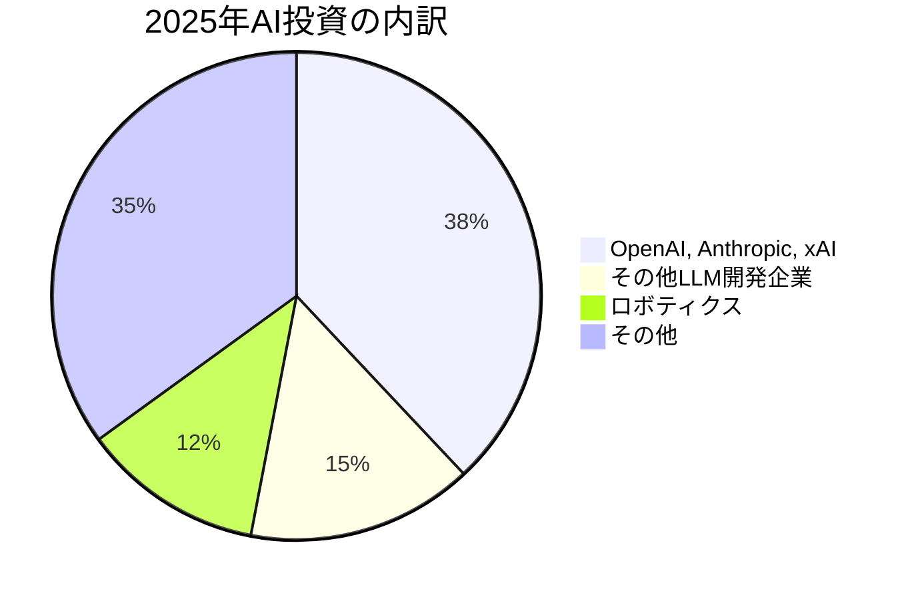
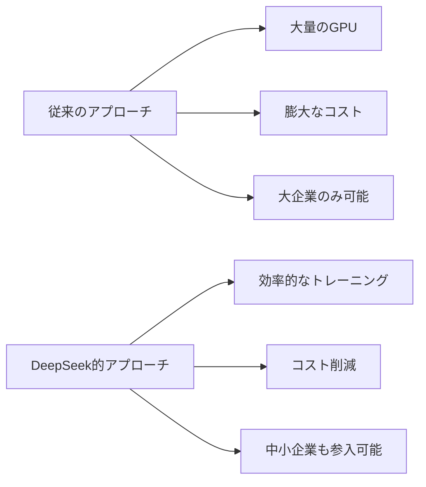

📌 **3行でわかるこの記事**
- 2025年のAI投資額は過去最高の2250億ドル（約34兆円）に到達
- OpenAI、Anthropic、xAIの3社だけで全体の38%（863億ドル）を調達
- ロボティクス分野がAI投資で最大シェアを獲得、M&Aも過去最高を記録

---

## はじめに

CB Insightsが発表した「State of AI 2025 Report」によると、2025年はAI業界にとって記録的な年となりました。投資額は前年比ほぼ2倍の**2258億ドル**に達し、一方で投資案件数は減少するという「勝者総取り」の傾向が鮮明になっています。

本記事では、このレポートから読み取れる5つの重要トレンドを解説します。

## 1. 投資額は過去最高、しかし案件数は減少

2025年のAI投資の特徴は「少数への集中」です：

| 指標 | 2024年 | 2025年 | 変化 |
|------|--------|--------|------|
| 総投資額 | 約1200億ドル | 2258億ドル | **+88%** |
| メガラウンド（1億ドル+）の割合 | 65% | 79% | +14pt |
| Q4投資額 | 280億ドル | 832億ドル | **+197%** |

## 2. ビッグ3（OpenAI, Anthropic, xAI）の圧倒的存在感

2025年、LLM開発のトップ3社が調達した資金：

- **OpenAI**: 約400億ドル
- **Anthropic**: 約260億ドル  
- **xAI**: 約200億ドル（2026年1月にさらに200億ドルのシリーズE調達）

これら3社だけでAI投資全体の**38%**を占めています。フロンティアモデル競争は「持てる者」と「持たざる者」に二極化しつつあります。

## 3. ロボティクス分野がAI投資をリード

2025年のAI投資で最大シェアを獲得したのは**ロボティクス（11.4%）**でした：

### 注目の大型調達案件

| 企業 | 分野 | 調達額 |
|------|------|--------|
| Figure | ヒューマノイドロボット | 非公開（大型） |
| Physical Intelligence | ロボットAIモデル | 大型ラウンド |
| Helsing | 防衛ロボティクス | 数十億ドル規模 |
| Anduril | 自律型防衛システム | 大型ラウンド |

AIの進歩により、ロボットは製造現場から戦場まで、より複雑なタスクを実行できるようになっています。

## 4. M&A件数が過去最高を記録

2025年のAI企業買収は**782件**で、2024年の1.5倍以上に急増しました。

### 主要なAIエージェント関連M&A

| 被買収企業 | 買収企業 | 買収額 |
|-----------|---------|--------|
| Manus | Meta | 約30億ドル |
| Moveworks | ServiceNow | 28.5億ドル |
| Sana Labs | Workday | 11億ドル |
| Cognigy | NiCE | 9.55億ドル |
| The Browser Company | Atlassian | 6.1億ドル |

特筆すべきは、**AIエージェント関連の買収が全体の約10%**を占めたことです。大手テック企業がAIエージェント戦略を加速させています。

## 5. DeepSeekの衝撃 - 効率化への転換点

中国発のDeepSeekは、モデルトレーニングに新たな効率性をもたらし、業界に衝撃を与えました。これにより：

- トレーニングコストの削減可能性が示された
- 小規模プレイヤーにも希望の光
- オープンソースモデルの競争力向上

## 2026年の展望

State of AI 2025レポートから見える2026年の展望：

1. **AIエージェントの実用化加速** - 企業のM&A戦略からも明らか
2. **ロボティクス×AIの融合** - 物理世界への応用拡大
3. **効率化競争** - DeepSeekの影響でコスト競争が激化
4. **二極化の深化** - 大手と中小の格差拡大

## まとめ

2025年はAI業界にとって「集中と選択」の年でした。投資額は過去最高を記録しながらも、その大部分は少数の巨大プレイヤーに集中。一方で、DeepSeekのような効率化イノベーションや、ロボティクス分野の急成長など、新たな潮流も生まれています。

2026年は、これらのトレンドがさらに加速し、AIが物理世界により深く浸透していく年になりそうです。

---

## 参考リンク

- [State of AI 2025 Report - CB Insights](https://www.cbinsights.com/research/report/ai-trends-2025/)
- [The Future of Foundation Models - CB Insights](https://www.cbinsights.com/research/report/future-of-foundation-models-open-source-closed-source/)
- [DeepSeek's Impact on AI - CB Insights Analysis](https://www.cbinsights.com/research/deepseek-china-models-future-of-ai/)
- [State of Venture 2025 Report](https://www.cbinsights.com/research/report/venture-trends-2025/)
