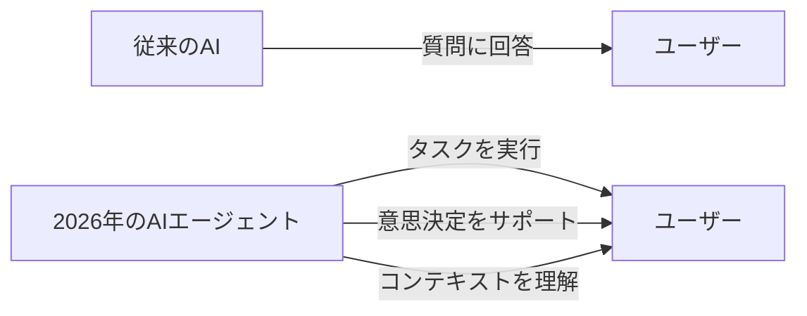
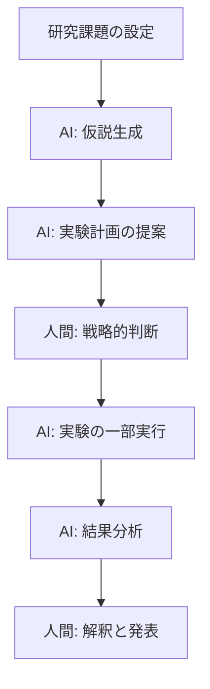
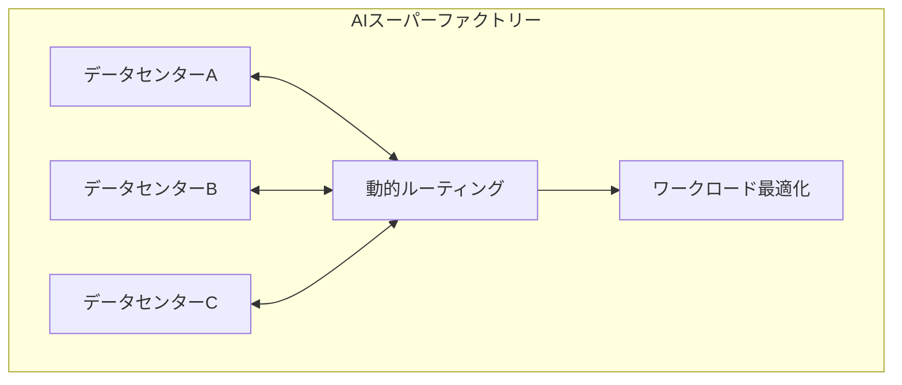
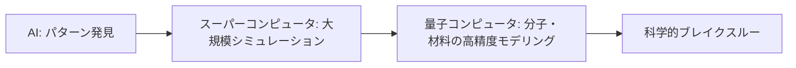

# 2026年のAIトレンド：エージェントが「デジタル同僚」になる時代が到来

## 📌 3行でわかるこの記事

- **AIは「道具」から「パートナー」へ**：2026年、AIエージェントが自律的にタスクを実行する「デジタル同僚」として進化
- **科学発見の加速**：AIが仮説生成から実験実行まで研究プロセスに深く関与し、ブレイクスルーを加速
- **セキュリティの新パラダイム**：エージェントには人間と同等のセキュリティ保護が必要、「信頼がイノベーションの通貨」に

---

## はじめに

2026年、AIは新たな段階に入っています。数年にわたる実験期を経て、AIは「道具」から「パートナー」へと進化し、私たちの働き方、創造方法、問題解決のアプローチを根本から変えようとしています。

Microsoft、MIT Technology Review、IBMなど各社の最新レポートから、2026年の重要なAIトレンドを紐解いていきます。

---

## 1. AIエージェント：デジタル同僚の台頭

### 1.1 「道具」から「チームメイト」へ

MicrosoftのAIエクスペリエンス担当チーフプロダクトオフィサー、Aparna Chennapragada氏は次のように述べています：

> 「未来は人間を置き換えることではなく、**人間を増幅すること**にある」

2026年、AIエージェントは単なるツールではなく、デジタル同僚として機能し始めています。小規模なチームでも、AIがデータ処理、コンテンツ生成、パーソナライゼーションを担当し、人間は戦略と創造性を指揮するという分業が可能になっています。

### 1.2 具体的な変化

### 1.3 セキュリティの新しい考え方

Microsoft Securityのコーポレートバイスプレジデント、Vasu Jakkal氏は警告しています：

> 「すべてのエージェントは、人間と同様のセキュリティ保護を受けるべきです。エージェントが『二重スパイ』にならないようにするためです」

具体的には：
- 明確なアイデンティティの付与
- アクセス権限の制限
- データ管理の徹底
- 脅威からの保護

---

## 2. 科学研究におけるAI革命

### 2.1 「発見プロセス」への参画

Microsoft Researchのプレジデント、Peter Lee氏は次のように予測しています：

> 2026年、AIは論文を要約したり質問に答えたりするだけでなく、**物理学、化学、生物学の発見プロセスに積極的に参加する**ようになります。

### 2.2 AIラボアシスタントの誕生

これは、GitHubでAIが「ペアプログラミング」を行うのと同様に、研究においても「ペアリサーチ」が可能になることを意味しています。

---

## 3. ヘルスケアへの変革

### 3.1 診断から治療計画へ

Microsoft AIのヘルス担当バイスプレジデント、Dr. Dominic King氏は次のように述べています：

> 「AIが診断の専門知識を超え、症状のトリアージや治療計画の領域に拡大する証拠を見るでしょう」

### 3.2 具体的な成果

- **MAI-DxO（Diagnostic Orchestrator）**: 複雑な医療症例を85.5%の精度で解決（経験豊富な医師の平均20%と比較）
- **Copilot & Bing**: 毎日5,000万以上の健康関連質問に回答

### 3.3 グローバルな課題への対応

WHOは2030年までに1,100万人の医療従事者不足を予測しており、45億人が基本的な医療サービスを受けられない状況です。AIはこの格差を埋める重要な役割を担いつつあります。

---

## 4. インフラの効率化：AIスーパーファクトリー

### 4.1 新しいアプローチ

AzureのCTO、Mark Russinovich氏は次のように説明しています：

> 「最も効果的なAIインフラは、分散ネットワーク全体で計算能力をより密にパッキングします」

### 4.2 概念図

「航空管制」のように、AIワークロードを動的にルーティングし、アイドル状態を排除。すべてのサイクルとワットを有効活用する仕組みが構築されています。

---

## 5. リポジトリインテリジェンス：コード理解の深化

### 5.1 GitHubの進化

GitHubのチーフプロダクトオフィサー、Mario Rodriguez氏は「リポジトリインテリジェンス」を提唱しています：

> 「AIはコードの行だけでなく、その背後にある関係性と履歴を理解するようになります」

### 5.2 具体的な機能

- 変更履歴の分析
- コード間の関係性の把握
- スマートな提案の生成
- エラーの早期発見
- 定型修正の自動化

---

## 6. 量子コンピューティングとの融合

### 6.1 ハイブリッドコンピューティング

Microsoft Discovery & Quantumのエグゼクティブバイスプレジデント、Jason Zander氏は次のように述べています：

> 「量子アドバンテージは、材料、医薬品などの分野でブレイクスルーをもたらします」

### 6.2 Majorana 1の登場

Microsoftの**Majorana 1**は、トポロジカルキュービットを使用した初の量子チップです：

---

## 7. 中国モデルの台頭

MIT Technology Reviewの分析によると、2026年はシリコンバレーの製品が中国のオープンソースモデル上で構築される年になるとしています。

### 7.1 主な中国モデル

| モデル | 開発元 | 特徴 |
|--------|--------|------|
| Qwen | Alibaba | 多様なサイズと専門特化版 |
| DeepSeek R1 | DeepSeek | 推論モデル、オープンウェイト |
| GLM | Zhipu | 多言語対応 |
| Kimi | Moonshot | 長文コンテキスト |

### 7.2 なぜ中国モデルが選ばれるのか

- **オープンウェイト**: 独自ハードウェアで実行可能
- **カスタマイズ**: 蒸留やプルーニングで調整可能
- **コスト**: 米国のプロプライエタリモデルより安価

---

## まとめ

2026年のAIトレンドを表で整理します：

| 分野 | トレンド | 影響 |
|------|----------|------|
| エージェント | デジタル同僚化 | ワークフローの自動化 |
| 科学研究 | 発見プロセスへの参加 | 研究スピードの向上 |
| ヘルスケア | 診断から治療計画へ | 医療アクセスの拡大 |
| インフラ | スーパーファクトリー | コスト・効率の最適化 |
| 開発 | リポジトリインテリジェンス | コード品質の向上 |
| 量子 | ハイブリッドコンピューティング | 科学計算の革新 |

**重要なのは、AIは人間を置き換えるのではなく、人間を増幅する存在になるという点です。** 2026年は、AIとの協働を学ぶ人々にとって、最大のチャンスの時代となるでしょう。

---

## 📚 参考リンク

1. [What's next in AI: 7 trends to watch in 2026 - Microsoft](https://news.microsoft.com/source/features/ai/whats-next-in-ai-7-trends-to-watch-in-2026/)
2. [What's next for AI in 2026 - MIT Technology Review](https://www.technologyreview.com/2026/01/05/1130662/whats-next-for-ai-in-2026/)
3. [The trends that will shape AI and tech in 2026 - IBM](https://www.ibm.com/think/news/ai-tech-trends-predictions-2026)
4. [How AI will transform the workplace in 2026 - Cisco](https://newsroom.cisco.com/c/r/newsroom/en/us/a/y2025/m12/how-ai-will-transform-the-workplace-in-2026.html)
5. [OpenAI unveils AI agent service - Reuters](https://www.reuters.com/business/finance/openai-unveils-ai-agent-service-part-push-attract-businesses-2026-02-05/)
