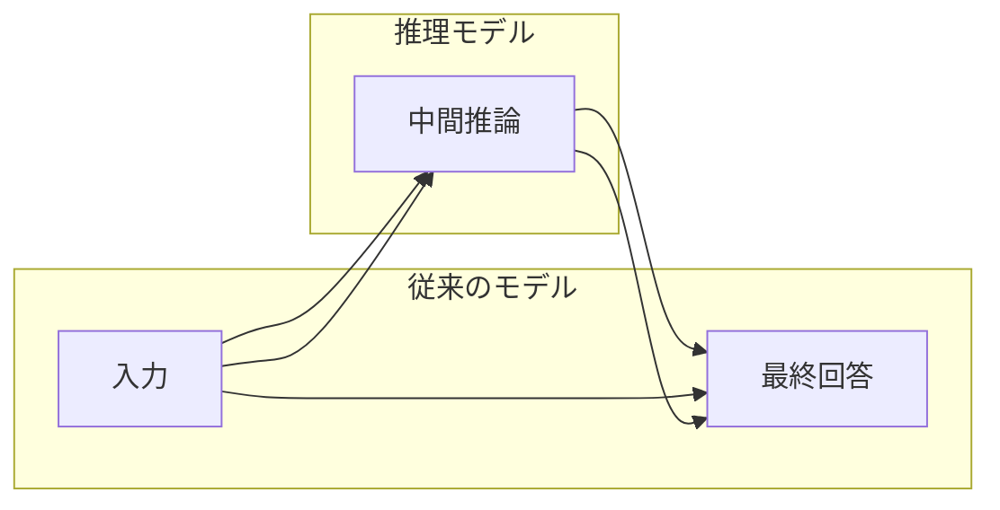
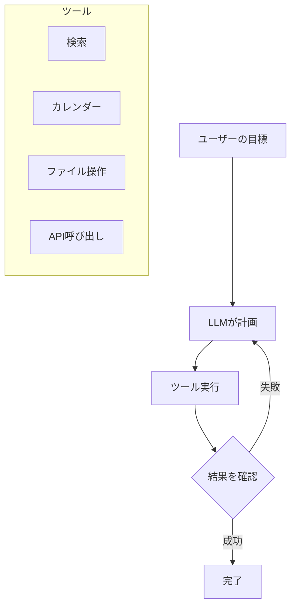
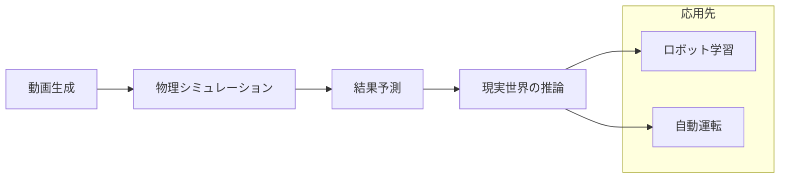

# 2026年のAI5大トレンド：推理モデル、エージェント、そして物理AIへ

## 📌 3行でわかるこの記事

1. **推理モデルの進化**：「考える」AIが標準化し、RLVRによる学習手法が省コスト化を実現
2. **エージェントの実用化**：ツール連携と永続的エージェントが、長期タスクの自動処理を可能に
3. **物理AIの到来**：世界モデルとロボティクスが融合し、現実世界を理解するAIが登場

---

## はじめに

2026年はAIにとって重要な転換点となります。単なるテキスト生成から、「考え、行動し、物理世界を理解する」AIへのシフトが進んでいます。

本記事では、ByteByteGoが発表した「What's Next in AI: Five Trends to Watch in 2026」を基に、今年注目すべき5つのトレンドを詳しく解説します。


---

## トレンド1：推理モデルの標準化と効率化

### 「考える」AIの台頭

初期の言語モデル（GPT-4など）は、質問に対して即座に回答を生成していました。しかし、これは複雑な数学や多段階の論理推論で失敗することが多々ありました。

OpenAIの**o1**は、この常識を覆しました。回答前に「思考」する時間を持ち、中間ステップを生成してから最終回答を出力するのです。



### RLVR：学習のブレイクスルー

推理モデルの実用化を支えたのが、**Reinforcement Learning with Verifiable Rewards (RLVR)**です。

従来のRLHF（人間からのフィードバックによる強化学習）は、人間がデータにラベル付けする必要があり、スケーラビリティに課題がありました。

RLVRは異なります：

- 数学やコードなど、**正解が自動検証可能**な領域で報酬を与える
- 人間のラベル付け不要
- DeepSeek-R1がこの手法を大規模に適用し、フロンティアレベルの推理能力を実現


### 適応的推理：効率化の次のステップ

2026年の焦点は「効率化」に移っています。**Gemini 3**は`thinking_level`制御をサポートし、プロンプトの難易度に応じて推理の深さを動的に調整します。

> シンプルな挨拶に大量のトークンを費やすのは無駄。本当に必要な問題にだけ深い思考を。

---

## トレンド2：AIエージェントの実用化

### エージェントとは何か

初期のLLMは「テキスト生成」はできても、「アクション」はできませんでした。「フライトを予約して」と言われても、手順を説明するだけで、実際に予約システムを使うことは不可能でした。

**エージェント**は、LLMにツールを組み合わせ、ループで実行する仕組みです：



### エージェント実用化を支える3つの要素

#### 1. 推理能力の向上

多段階の計画を立て、中間結果を追跡し、次のアクションを選択する能力が向上しました。

#### 2. ツール連携の簡素化

**Model Context Protocol (MCP)** の登場により、モデルと外部システムの接続が劇的に簡単になりました。


#### 3. フレームワークの成熟

**LangChain**や**LlamaIndex**が成熟し、ツール利用や多段階フローを簡単に構築できるようになりました。

### 永続的エージェントへの移行

2026年のトレンドは**永続的エージェント**です：

- 常時起動し、長期間のワークフローを処理
- ローカル実行で、ファイル・アプリ・システム設定へのアクセスが容易
- データを自分で管理できる（OpenClawなど）

---

## トレンド3：コーディングエージェントの進化

### オートコンプリートからリポジトリ理解へ

かつてのAIコーディング支援は、カーソル周辺の数行しか見えませんでした。プロジェクト構造や依存関係を理解していなかったのです。

**コーディングエージェント**は異なります：

```python
# コーディングエージェントが使用するツール例
tools = [
    "read_file",          # ファイル読み込み
    "search_codebase",    # コードベース検索
    "edit_file",          # ファイル編集
    "run_terminal_command", # ターミナル実行
    "execute_tests"       # テスト実行
]
```


### 主要なコーディングエージェント

| エージェント | 特徴 |
|------------|------|
| Claude Code (Anthropic) | リポジトリ全体を理解、複雑なプロジェクト構造に対応 |
| Codex (OpenAI) | 強力なプロプライエタリモデル |
| Qwen3-Coder-Next | 80Bパラメータ、ローカル実行可能、クローズドモデルに近い性能 |

### 今後の課題

1. **リポジトリレベルの理解強化**：大規模コードベースでの依存関係追跡
2. **セキュリティ対応コーディング**：脆弱性スキャンをワークフローに統合
3. **高速化**：複雑タスクでの処理時間短縮

---

## トレンド4：オープンウェイトモデルの台頭

### DeepSeekモーメント

2025年1月、DeepSeekは**DeepSeek-R1**をオープンソース化しました。ウェイト、コード、学習手法すべてを公開し、クローズドモデルに匹敵する性能を実現。

これ以降、同様のブレイクスルーは「DeepSeekモーメント」と呼ばれるように。


### オープンウェイトモデルの主要プレイヤー

- **Qwen (Alibaba)**：オープン開発の主要ベース
- **GLM (Z.ai)**：多言語・マルチモーダル対応
- **Kimi (Moonshot)**：エージェント・ツール利用に強み
- **gpt-oss (OpenAI)**：2025年8月リリース、Apache 2.0ライセンス

### 2026年のトレンド

オープンウェイトモデルは当たり前の時代に。次の焦点は：

1. **アーキテクチャ効率化**：Sparse MoE + 長コンテキスト
2. **エージェント対応**：ツール利用、構造化出力を最初から設計
3. **デプロイ簡素化**：新しい推論フォーマットと圧縮技術

---

## トレンド5：マルチモーダルと物理AI

### ネイティブマルチモーダルへ

テキストのみのモデル時代は終わりました。**Gemini 3**や**ChatGPT-5**は、単一システムでテキストと画像を処理します。


### 生成モデルの進化

| モデル | 特徴 |
|--------|------|
| Sora 2 (OpenAI) | 業界を驚かせた動画生成品質 |
| Veo 3.1 (Google) | リッチなオーディオ、オブジェクト挿入編集 |
| Nano Banana Pro | テキストレンダリングと制御性向上 |

### 物理AI：ロボティクスへの応用

CES 2026で、人型ロボットのデモが相次ぎました：

- **Boston Dynamics × Google DeepMind**：電動Atlas + Gemini Robotics
- **Tesla Optimus**：大量生産を目指す

> 「ロボティクスのChatGPTモーメントが来た」— Jensen Huang (NVIDIA CEO)

### 世界モデル：物理世界を理解する

動画生成システムは、単にピクセルを生成するだけでなく、**物理世界がどう機能するか**を学習しています。




主要な世界モデル：
- **Genie 3 (DeepMind)**：リアルタイム対話型3D環境生成
- **Cosmos Predict 2.5 (NVIDIA)**：2億クリップで学習、ロボット・自動運転向け

---

## まとめ

2026年のAIトレンドをまとめると：

| トレンド | キーポイント |
|---------|------------|
| 推理モデル | RLVRによる効率学習、適応的推理 |
| エージェント | MCPによるツール連携、永続的エージェント |
| コーディングエージェント | リポジトリ理解、セキュリティ統合 |
| オープンウェイト | DeepSeekモーメント以降の加速、効率化へ |
| 物理AI | 世界モデル、ロボティクス統合 |

これら5つのトレンドは単独ではなく、相互に強化し合っています。推理モデルがエージェントを賢くし、エージェントがコーディングを自動化し、世界モデルがロボットを訓練する。2026年は、これらの収束が加速する年になるでしょう。

---

## 参考リンク

1. [What's Next in AI: Five Trends to Watch in 2026 - ByteByteGo](https://blog.bytebytego.com/p/whats-next-in-ai-five-trends-to-watch)
2. [DeepMind Genie 2 - A Large-Scale Foundation World Model](https://deepmind.google/blog/genie-2-a-large-scale-foundation-world-model/)
3. [lmarea.ai - Open Weight Models Leaderboard](http://lmarea.ai)
