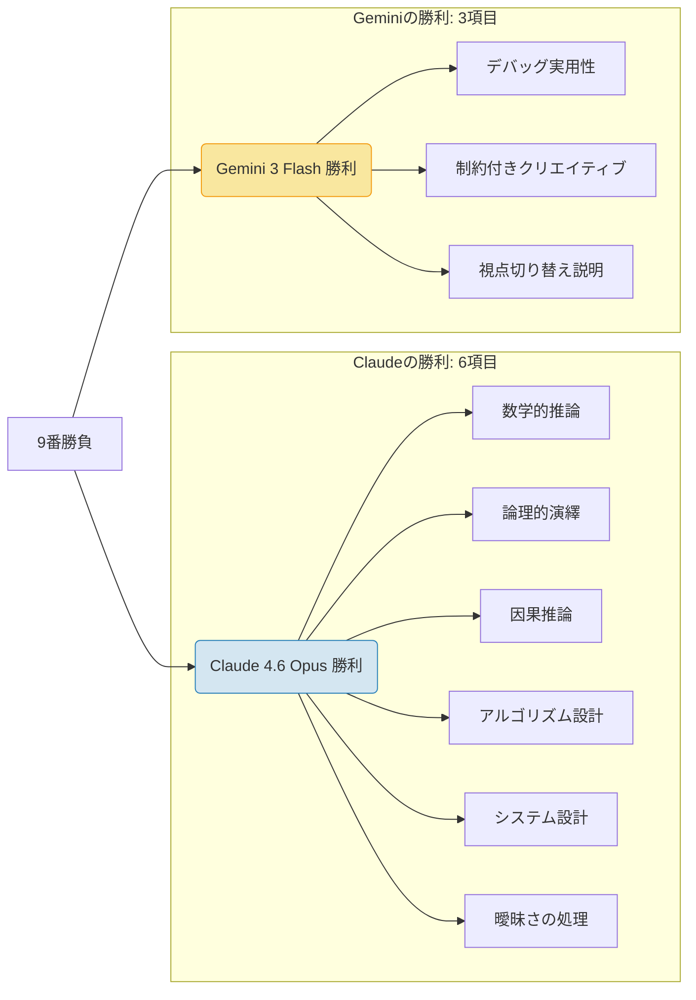

## 📌 3行でわかるこの記事

1. **2026年2月、OpenAI・Google・Anthropicが同時に主力モデルをリリースし、AI開発競争が激化**
2. **Tom's Guideの比較テストではClaude 4.6 Opusが9項目中6項目で勝利し、推論力でリード**
3. **汎用AGIよりも専門特化型AI（OpenScholar, BrainIAC）の実用化が進むトレンドが鮮明に**

---

## 🚀 空前のリリースラッシュ：2026年2月のAI業界動向

2026年2月、AI業界はかつてないほどの激動の週を迎えました。Google、Anthropic、OpenAIという「ビッグ3」が、示し合わせたかのように同週に主力モデルのアップデートを発表しました。

- **Google**: エージェント操作に最適化された **Gemini 3** シリーズを発表
- **Anthropic**: 推論能力を極限まで高めた **Claude 4.6 Opus** をリリース
- **OpenAI**: 自己改善機能を備えたコーディング特化モデル **GPT-5.3 Codex** を投入

これらは単なる性能向上にとどまらず、それぞれの企業が目指す「AIの未来」の違いを鮮明に映し出しています。本記事では、特に注目を集めている **Claude 4.6 Opus** と **Gemini 3 Flash** の直接対決の結果を中心に、最新のトレンドを解説します。

## ⚔️ Claude 4.6 Opus vs Gemini 3 Flash：徹底比較

Tom's Guideが実施した「9つの過酷なチャレンジ」において、両モデルの性能差が明らかになりました。

### テスト結果の概要

以下のMermaid図は、9つのテスト項目における勝敗を示したものです。

### Claudeの強み：圧倒的な「深さ」と「論理性」

Claude 4.6 Opusは、**複雑な推論**や**システム設計**といった、高度な思考能力を要するタスクで圧倒的な強さを見せました。

例えば「1億URLを処理する短縮URLサービスのシステム設計」という課題に対し、Claudeは以下のようなアウトプットを出しました：

*   完全なデータベーススキーマ定義
*   実装可能なAPIコード
*   ハッシュ衝突の回避戦略の詳細な議論
*   マルチサービスアーキテクチャ図

「とりあえず動くもの」ではなく、**「本番運用に耐えうる設計」** を提示できる点が、プロフェッショナルから高い評価を受けています。

### Geminiの強み：実用性と簡潔さ

一方、Gemini 3 Flashは **「実用性（Practicality）」** で勝利を収めました。

「Webスクレイピングのデバッグ」という課題では、ClaudeがSeleniumを使った重厚長大な解決策を提示したのに対し、Geminiは **Playwrightを使ったモダンで簡潔なコード** を提案しました。現場のエンジニアが「今すぐ使える」コードとしては、Geminiの方に軍配が上がることがあります。

## 🤖 OpenAIの逆襲：GPT-5.3 Codex

この戦いに割って入ったのが、OpenAIの **GPT-5.3 Codex** です。
最大の特徴は **「自己改善（Self-Improving）」** の要素を取り入れた点です。

*   **自律的なデバッグ**: 自身のトレーニングプロセスの一部をデバッグするために初期バージョンが使用された
*   **コンテキスト保持**: 複数のエージェントと連携しながら、複雑な開発ワークフロー全体を管理可能

これは「AIがAIを作る」という再帰的な進化の第一歩とも言える動きであり、ソフトウェアエンジニアの役割を「コーダー」から「アーキテクト」へと変える可能性を秘めています。

## 🌍 「汎用」から「特化」へ：新たなAIの潮流

大手各社が汎用モデル（AGI）を目指す一方で、2026年のもう一つの大きなトレンドは **「専門特化型AI」** の台頭です。

| モデル名 | 開発元 | 特化領域 | 特徴 |
| :--- | :--- | :--- | :--- |
| **OpenScholar** | ワシントン大学など | 学術研究 | 科学文献レビューに特化。GPT-5よりも正確な引用を実現 |
| **BrainIAC** | Mass General Brigham | 医療画像 | 脳MRI分析に特化。年齢予測から腫瘍検出までを1モデルで実行 |
| **PaperBanana** | Google AI | 論文執筆 | 科学論文用の図表作成・統計プロットを自動化 |

これらは「何でもできるが、たまに嘘をつく神様」ではなく、**「特定の仕事だけは人間以上に正確にこなす職人」** です。特に医療や学術分野では、ハルシネーション（嘘）が許されないため、こうした特化型モデルの需要が急増しています。

## 🎯 まとめ

2026年2月のAIニュースは、単なるスペック競争を超え、**「どのようなタスクに、どのAIを使うべきか」** という適材適所の時代に入ったことを示唆しています。

*   **深い思考・設計が必要なら**: Claude 4.6 Opus
*   **クイックな実装・実用性なら**: Gemini 3 Flash
*   **大規模な開発・コーディングなら**: GPT-5.3 Codex
*   **専門的な研究・医療なら**: 各種特化型モデル

私たちエンジニアは、一つのモデルに固執するのではなく、これらのツールをオーケストレーション（指揮）する能力が求められるでしょう。

---

### 参考リンク

*   [I tested Gemini 3 Flash vs Claude 4.6 Opus in 9 tough challenges — here’s the winner | Tom's Guide](https://www.tomsguide.com/ai/i-tested-gemini-3-flash-vs-claude-4-6-opus-in-9-tough-challenges-heres-the-winner)
*   [AI News & Trends February 2026: Complete Monthly Digest | Humai.blog](https://www.humai.blog/ai-news-trends-february-2026-complete-monthly-digest/)
*   [Anthropic Opus 4.6 Update | CNN](https://www.cnn.com/2026/02/05/tech/anthropic-opus-update-software-stocks)
