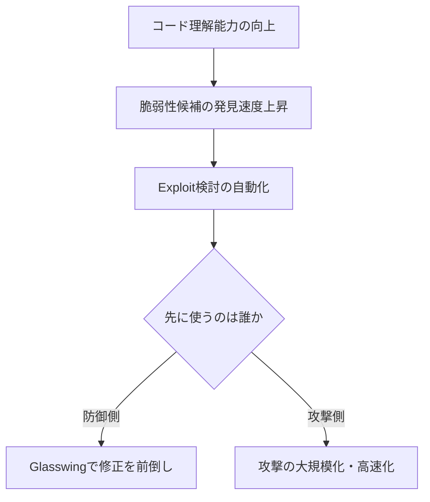
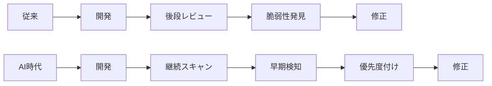

*Image source: Anthropic 「Project Glasswing: Securing critical software for the AI era」*

📌 **3行でわかるこの記事**
- Anthropicは2026年4月7日、重要ソフトウェアを守るための共同防衛イニシアチブ **Project Glasswing** を発表しました。
- 発表の中核にあるのは、未公開モデル **Claude Mythos Preview** が、主要OSやブラウザを含む広範なソフトウェアで高深刻度の脆弱性を大量に見つけられる、という強い主張です。
- 重要なのは「AIが危険になった」という話だけではなく、**攻撃側より先に防御側へ配備する競争**が始まったことです。

---

## はじめに

最近のAIニュースは、つい新モデルの性能比較に目が行きがちです。

ただ、Anthropicが今回出した **Project Glasswing** は少し性質が違います。これはチャット体験の改善でも、画像生成の強化でもありません。**AIがサイバー防御の現場でどこまで使えるか**、そしてその能力がすでに無視できない段階に入ったことを示す発表です。

しかも今回は、Anthropic単独の実験ではありません。Amazon Web Services、Apple、Cisco、Google、Microsoft、NVIDIA などを含む複数の大手企業・団体が名を連ねています。

## Project Glasswingの要点

### 何が発表されたのか

Anthropicは公式発表で、Project Glasswingを**世界の重要ソフトウェアを防御するための新しい取り組み**と位置づけています。

#### 公式発表で押さえるべきポイント

- AWS、Apple、Broadcom、Cisco、CrowdStrike、Google、JPMorganChase、Linux Foundation、Microsoft、NVIDIA、Palo Alto Networks などが参加
- Anthropicの未公開フロンティアモデル **Claude Mythos Preview** を防御用途で利用
- 40以上の追加組織にもアクセスを拡大
- Anthropicは最大 **1億ドル相当の利用クレジット** と **400万ドルの寄付** を表明

単なる研究発表ではなく、**大規模な防御運用を前提にした初動**として出てきたのがポイントです。

### なぜここまで大きな話になるのか

Anthropicは、Mythos Preview についてかなり踏み込んだ表現を使っています。発表では、AIモデルがソフトウェア脆弱性の発見と悪用において、**最上位の人間研究者を除けば上回りうる水準**に達した、と読める内容になっています。

これは誇張抜きに重い話です。なぜなら、従来は高度な脆弱性の発見や exploit 開発には、少数の専門家と長い時間が必要だったからです。

## 何が変わったのか

### 「脆弱性を見つけるコスト」が下がり始めた

AnthropicのProject Glasswing本文では、Mythos Preview がすでに**主要なOSやWebブラウザを含む領域で高深刻度の脆弱性を大量に発見した**と説明されています。

さらに Red Team 側の技術ブログでは、次のような記述があります。

#### 技術ブログで確認できる事実

- OpenBSD の27年前の脆弱性を発見
- FFmpeg の16年前の脆弱性を発見
- Linux kernel に対して権限昇格につながる複数の脆弱性連鎖を見つけた
- 一部では人間の細かな誘導なしに exploit 開発まで進められた

もちろん、これらはAnthropic自身の主張なので、外部検証は今後も必要です。

ただし重要なのは、**AIがコードを読んで危険な挙動を見つける速度と幅が、明らかに新しい段階に入っている**と複数の一次ソースが示している点です。

## なぜ「防御側への先行配備」が重要なのか

### 問題はモデル能力そのものではなく、配備順序

この話を「危険なAIが出てきた」で終わらせると、半分しか見えていません。

Anthropicのメッセージはむしろ逆で、**危険だからこそ先に防御側へ回す**というものです。

#### ここでの論点

- AIの攻撃能力は今後さらに一般化する可能性が高い
- ならば重要インフラやOSS保守側が先に使い始める必要がある
- 防御オペレーションも、人手前提の速度では間に合わなくなる

この発想はかなり現実的です。攻撃者にだけ高性能ツールが渡る状態より、防御側が継続的にコードを監査・修正できる状態のほうがまだマシだからです。

### Microsoft側の反応も示唆的

Microsoft Security Response Center の記事でも、AIによって**発見・検証・修正の速度を上げる必要性**が強調されています。MSRCは、AIによる vulnerability discovery が今後の現実になる前提で、既存の対応フローをAI時代向けに拡張しようとしています。

つまりこれは、Anthropic一社の問題提起ではありません。大手プレイヤー側でも、**人間だけで回す脆弱性対応は限界に近い**という認識が共有され始めています。

## 開発現場にどう効いてくるか

### セキュリティレビューの前提が変わる

Project Glasswingは巨大インフラ向けの話に見えますが、実際には一般的な開発現場にも影響があります。

#### 変わりそうなポイント

- 年数回の監査より、継続的なAIスキャンの重要度が上がる
- コードレビューで「動くか」だけでなく「悪用されるか」を早期に見る必要がある
- OSS依存の棚卸しと優先度付けが今まで以上に重要になる
- 修正そのものだけでなく、**検証・再現・優先順位付け**まで自動化の対象になる

#### 従来フローとの違い

特に、脆弱性が「見つからないこと」を前提にしていた設計や運用は、これから厳しくなるはずです。見つかる前提で、どれだけ早く直せるかが勝負になります。

## 期待と注意点

### 明るい面

Project Glasswingには、かなり前向きな側面があります。

#### 期待できること

- 重要OSSの未発見バグ修正が前倒しされる
- 防御側のレビュー能力を底上げできる
- 人材不足のセキュリティ現場でAIを補助戦力にできる
- 単発の研究ではなく、産業横断で知見共有が進む可能性がある

### ただし、そのまま楽観はできない

一方で、注意点もあります。

#### 注意して見るべき点

- 発見件数や性能評価の多くは現時点で提供元発の情報
- 高性能な攻撃補助能力は、将来的に悪用側にも広がりうる
- 防御用途で閉じた運用をどこまで維持できるかは未確定
- OSS保守側に、AIが見つけた大量の課題を処理する体力があるとは限らない

要するに、**AIが守ってくれる未来**が自動的に来るわけではありません。むしろ、AIで見つかる問題量が増えるほど、組織側の修正能力・運用能力が問われます。

## まとめ

AnthropicのProject Glasswingは、単なる新機能ニュースではありません。

### この記事の結論

- AIはすでに、脆弱性発見と exploit 検討の領域で無視できない能力を見せ始めている
- 本質的な争点は「危険かどうか」より、**その能力を先に誰が使うか**
- Project Glasswingは、防御側がAIを本格利用するための最初の大きな枠組みとして重要
- 今後はモデル性能比較だけでなく、**防御運用・修正速度・組織実装**がAI競争の重要軸になる

個人的には、このニュースの重さは「すごいモデルが出た」ことより、**AI時代のセキュリティ運用がもう始まってしまった**ことにあります。

開発者にとっても運用者にとっても、今後は「AIを使うかどうか」ではなく、**AI込みでどう守るか**を考えるフェーズに入ったと見てよさそうです。

## 参考リンク

1. [Anthropic: Project Glasswing](https://www.anthropic.com/glasswing)
2. [Anthropic Frontier Red Team: Claude Mythos Preview](https://red.anthropic.com/2026/mythos-preview/)
3. [Microsoft MSRC: Strengthening secure software at global scale: How MSRC is evolving with AI](https://www.microsoft.com/en-us/msrc/blog/2026/04/strengthening-secure-software-global-scale-how-msrc-is-evolving-with-ai)
4. [Anthropic Newsroom announcement](https://www.anthropic.com/news)
