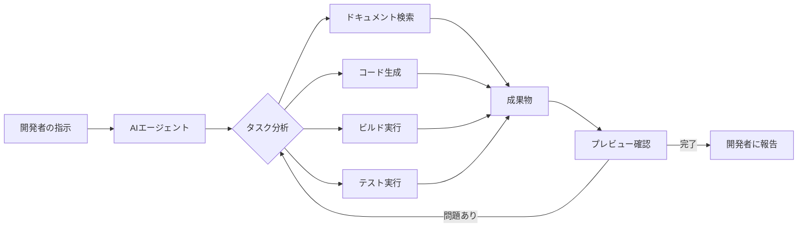

## 📌 3行でわかるこの記事

1. **Apple Xcode 26.3がエージェントコーディングに正式対応** — AnthropicのClaude AgentとOpenAIのCodexをネイティブ統合
2. **AIエージェントがXcodeの全機能にアクセス可能** — ドキュメント検索、ビルド、テスト、プレビュー確認まで自律的に実行
3. **Model Context Protocol (MCP)をサポート** — サードパーティのAIツールとも連携できるオープンな設計

---

## はじめに

2026年2月3日、AppleはXcode 26.3のリリース候補版を発表しました。この新バージョンには、開発者コミュニティが待ち望んでいた**エージェントコーディング（Agentic Coding）**機能が搭載されています。

これにより、iOSやmacOSアプリ開発の風景が大きく変わることになります。


## エージェントコーディングとは？

従来のAIアシスタントは「質問に答える」「コードを補完する」といった受動的な役割でした。しかし**エージェントコーディング**は根本的に異なります。



エージェントは開発者の「目標」を理解し、以下を**自律的に**実行します：

- タスクを小さなステップに分解
- プロジェクト構造の分析
- 必要なドキュメントの検索
- コードの生成・修正
- ビルドとテストの実行
- Xcode Previewsでの視覚的確認
- 問題があれば自動で修正を繰り返す

## 対応AIエージェント

### Anthropic Claude Agent

Anthropic社が提供するClaude Agentは、高度な推論能力と長文コンテキストの理解に優れています。

**特徴：**
- 大規模なコードベースの全体像を把握
- 複雑なリファクタリングタスクに強い
- 丁寧な説明と段階的なアプローチ

### OpenAI Codex

OpenAI社のCodexは、コード生成に特化した実績あるモデルです。2026年2月2日にMac版アプリもリリースされました。

**特徴：**
- 高速なコード生成
- 多言語対応
- 豊富なトレーニングデータに基づく実践的な提案

## 技術的な詳細

### Model Context Protocol (MCP) 対応

Xcode 26.3は**Model Context Protocol**というオープンスタンダードを採用しています。これにより：

```
┌─────────────────────────────────────────────────────────┐
│                    Xcode 26.3                           │
├─────────────────────────────────────────────────────────┤
│  ┌─────────────┐  ┌─────────────┐  ┌─────────────────┐ │
│  │ Claude Agent│  │ OpenAI     │  │ サードパーティ   │ │
│  │             │  │ Codex      │  │ AIツール         │ │
│  └──────┬──────┘  └──────┬──────┘  └────────┬────────┘ │
│         │                │                   │          │
│         └────────────────┼───────────────────┘          │
│                          │                              │
│                   ┌──────┴──────┐                       │
│                   │     MCP     │                       │
│                   │  Protocol   │                       │
│                   └─────────────┘                       │
└─────────────────────────────────────────────────────────┘
```

- AnthropicやOpenAI以外のAIツールも連携可能
- 将来的な拡張性を確保
- 開発者が自分に最適なモデルを選択できる

### Xcodeの機能へのアクセス

エージェントは以下のXcode機能にアクセスできます：

| 機能 | 説明 |
|------|------|
| ドキュメント検索 | Apple公式ドキュメントを検索・参照 |
| ファイル構造探索 | プロジェクトのディレクトリ構造を理解 |
| プロジェクト設定 | Build Settings等を更新 |
| ビルド実行 | プロジェクトのビルドを実行 |
| Xcode Previews | SwiftUIプレビューをキャプチャして確認 |
| イテレーション | ビルドエラーを検出し自動修正 |

## 使い方

### 1. APIキーの設定

Claude AgentまたはCodexを使用するには、各社のAPIキーをXcodeに設定します。

```bash
# Anthropic API Key
export ANTHROPIC_API_KEY="sk-ant-..."

# OpenAI API Key  
export OPENAI_API_KEY="sk-..."
```

### 2. エージェントの起動

Xcode内で新しい「Agent」パネルを開き、使用するエージェントを選択します。

### 3. タスクの指示

自然言語でタスクを指示します：

```
「このアプリにダークモード対応を追加して。
設定画面でトグルできるようにして、
UserDefaultsで設定を保存してほしい。」
```

エージェントが自律的に作業を開始し、完了後に結果を報告します。

## 業界への影響

### "Vibe Coding" の台頭

CNBCの報道によると、開発者や企業は**"Vibe Coding"**（バイブコーディング）と呼ばれる新しい開発スタイルを採用し始めています。これは：

- 人間がAIにプロンプトを与える
- AIがコードを生成する
- 人間が結果をレビューする

というサイクルで、従来よりも高速にソフトウェアを開発する手法です。

### Apple Intelligence との関係

Apple Intelligenceは消費者向けAI機能で遅延や管理職の交代などの課題を抱えていますが、開発者向けのAI統合は着実に進んでいます。2024年夏にはChatGPTとClaudeの基本的な統合を開始し、今回のエージェントコーディングはその発展形です。

## まとめ

Xcode 26.3のエージェントコーディング対応は、Apple開発者にとって大きな転換点です。

**ポイント：**
- ✅ Claude AgentとOpenAI Codexをネイティブ統合
- ✅ MCPによるオープンな設計
- ✅ 自律的なビルド・テスト・修正サイクル
- ✅ 現在RC版、正式版は近日App Storeで公開

開発者の皆さんは、Apple Developer Programメンバーであれば今すぐRC版をダウンロードして試すことができます。

---

## 参考リンク

- [Apple Newsroom - Xcode 26.3 unlocks the power of agentic coding](https://www.apple.com/newsroom/2026/02/xcode-26-point-3-unlocks-the-power-of-agentic-coding/)
- [CNBC - Apple adds agents from Anthropic and OpenAI to its coding tool](https://www.cnbc.com/2026/02/03/apple-adds-agentic-coding-from-anthropic-and-openai-to-xcode.html)
- [CNBC - OpenAI Codex app for Apple computers](https://www.cnbc.com/2026/02/02/openai-codex-app-apple-computers.html)
- [Medium - Last Week in AI (February 2, 2026)](https://medium.com/last-week-in-ai/last-week-in-ai-february-2-2026-fe43afefc73b)
