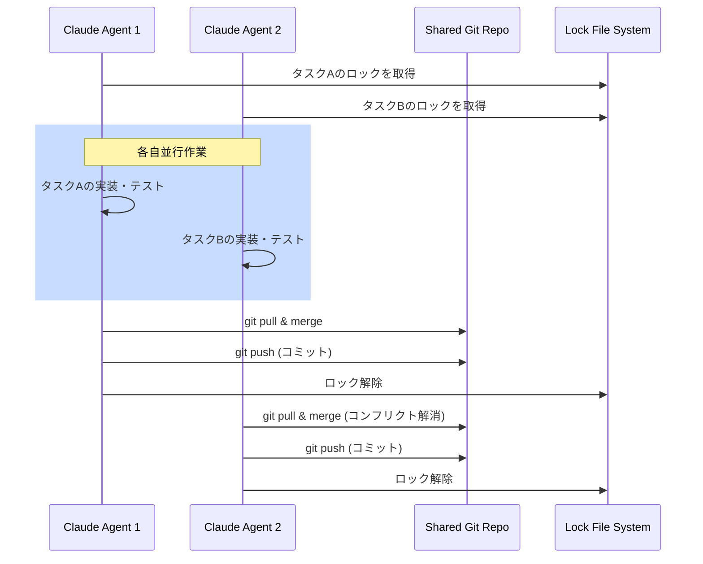

📌 **3行でわかるこの記事**
- Anthropicが「Claude Opus 4.6」と新機能「Agent Teams」を発表し、16体のAIエージェントが連携してCコンパイラをゼロから開発することに成功しました。
- 開発されたコンパイラはLinuxカーネルのビルドが可能で、開発期間はわずか2週間、APIコストは約2万ドルでした。
- 同時に発表されたデスクトップアプリ「Claude Cowork」は、ローカルファイルを直接操作できる「Agentic AI」として、ホワイトカラー業務の自動化を加速させます。

*(出典: Anthropic Blog)*

## はじめに
2026年2月、AI企業Anthropicはソフトウェア開発の未来を変える驚くべき発表を行いました。
彼らの最新モデル「Claude Opus 4.6」を用いた実験において、**16体のAIエージェントが自律的に協力し、ゼロからC言語のコンパイラを開発することに成功**したのです。

このニュースは、SaaS企業やソフトウェア関連株価に大きな影響を与えた「Claude Cowork」と共に、AIが「補助ツール」から「実行者」へと進化したことを象徴しています。

## 1. 16体のAIによる「Agent Teams」の衝撃

今回の実験でAnthropicが採用したのは、「Agent Teams」と呼ばれる新しいアプローチです。
これは、複数のClaudeインスタンスが同じGitリポジトリを共有し、互いに干渉することなく並行作業を行う仕組みです。

### 並行開発の仕組み
各エージェントは独立したDockerコンテナ内で動作し、以下のようなフローで開発を進めました。

このアプローチにより、AIは単なるコード補完ではなく、**アーキテクチャ設計から実装、テスト、デバッグ、さらにはドキュメント作成まで**を自律的に分担して行いました。

## 2. 成果物の実力：Linuxカーネルがビルド可能

2週間の開発期間と約2万ドル（約300万円）のAPIコストを投じて完成したコンパイラは、単なるプロトタイプではありませんでした。

- **行数**: 10万行以上のRustコード
- **機能**: x86, ARM, RISC-Vアーキテクチャに対応
- **実績**: Linuxカーネル 6.9のビルドに成功し、実際にブート可能

さらに、開発者の究極のテストとも言える**「Doom」のコンパイルと実行**にも成功しています。

### 技術的な課題と限界
一方で、完璧ではありません。
- **効率**: 生成されたコードの実行効率は、GCC（最適化なし）よりも劣る場合があります。
- **x86 16-bit**: Linuxのブートに必要な16-bitリアルモードのコード生成ができず、一部GCCに頼る部分がありました。

しかし、インターネット接続なし（Clean-room implementation）で、Rustの標準ライブラリのみを使用してここまで到達したことは驚異的です。

## 3. 「Claude Cowork」による実務への応用

この技術は実験室の中だけに留まりません。Anthropicは同時に、実務向けのデスクトップアプリ**「Claude Cowork」**を発表しました。

これは、従来のチャットインターフェースを超え、ユーザーのPC上のファイルを直接読み書きできる**Agentic AI（エージェント型AI）**です。
- 📂 ローカルファイルの直接編集・整理
- 🔄 複数ステップにわたる業務フローの実行
- 🧩 11種類のオープンソースプラグイン（法務、財務、マーケティングなど）

このツールの登場により、定型的なホワイトカラー業務の多くがAIによって代替・効率化される可能性が高まり、市場に大きなインパクトを与えています。

## まとめ

Claude Opus 4.6とAgent Teamsの実験は、AIがもはや「ペアプログラミングの相手」を超え、「自律的な開発チーム」として機能しうることを示しました。
私たち開発者は、AIを使いこなすだけでなく、AIとどのように協調し、より高次の設計や創造的な問題解決に注力していくかが問われています。

### 参考リンク
- [Building a C compiler with a team of parallel Claudes (Anthropic Blog)](https://www.anthropic.com/engineering/building-c-compiler)
- [GitHub - anthropics/claudes-c-compiler](https://github.com/anthropics/claudes-c-compiler)
- [Sixteen Claude AI agents working together created a new C compiler (Ars Technica)](https://arstechnica.com/ai/2026/02/sixteen-claude-ai-agents-working-together-created-a-new-c-compiler/)
