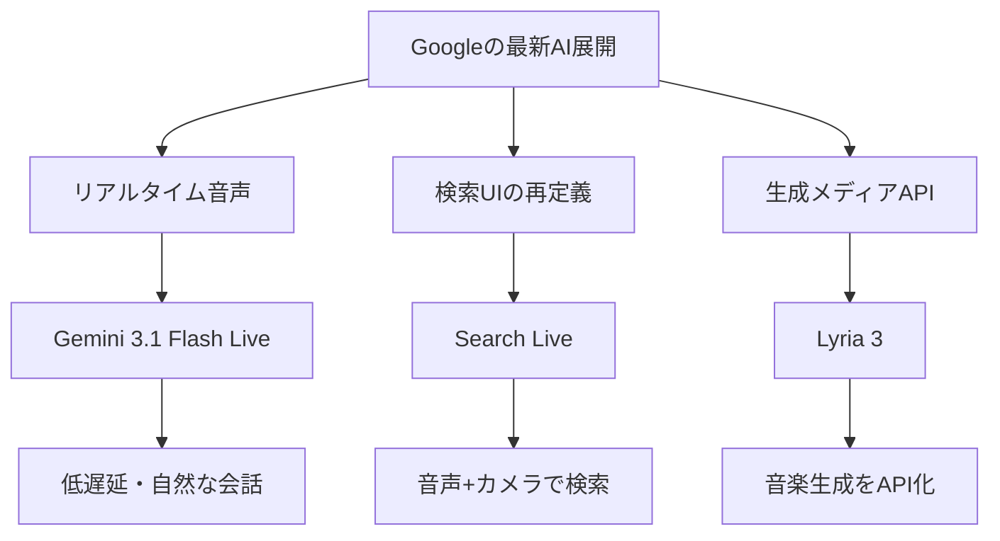
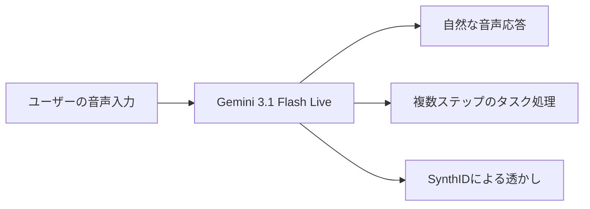
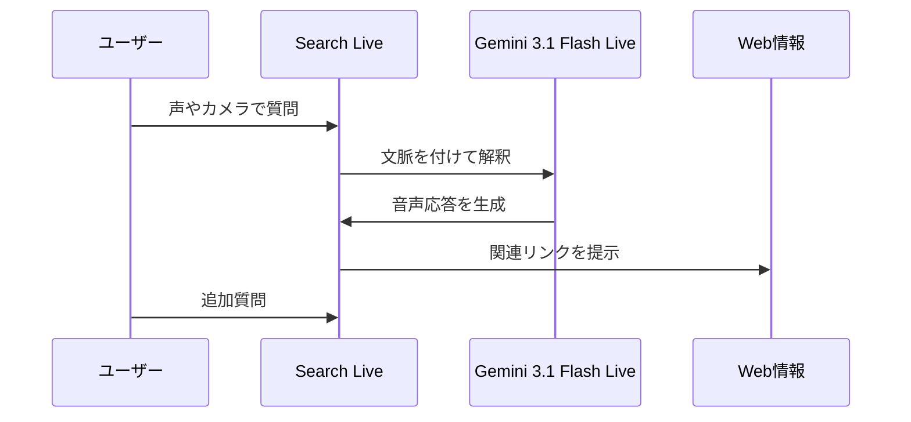
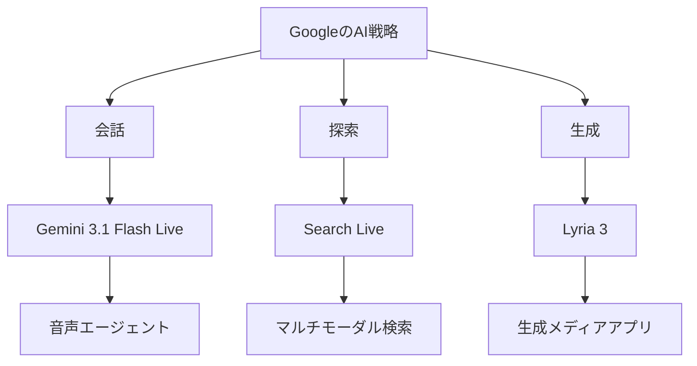

*Image source: Google 「Gemini 3.1 Flash Live: Making audio AI more natural and reliable」*

📌 **3行でわかるこの記事**
- Googleは2026年3月25日〜26日に、**Gemini 3.1 Flash Live**、**Search Liveのグローバル展開**、**Lyria 3の開発者向け公開**を相次いで発表しました。
- 3本に共通するのは、AIを「チャット」から一歩進めて、**リアルタイム音声・カメラ連携検索・音楽生成API**へ広げている点です。
- 開発者目線では、**音声エージェント / マルチモーダル検索 / 生成メディア**が同じタイミングで実装しやすくなったのが大きな変化です。

---

## この記事で扱うニュース

今回取り上げるのは、Google公式ブログで3月25日〜26日に公開された以下の3本です。

### 対象ニュース

- **Gemini 3.1 Flash Live**：自然で低遅延なリアルタイム音声対話モデル
- **Search Liveのグローバル展開**：AI Mode対応地域で200以上の国・地域へ拡大
- **Lyria 3**：Gemini API / Google AI Studioで使える音楽生成モデル

この3本を並べると、Googleが今どこに力を入れているのかが見えやすくなります。



## Googleの今回の動きは何が重要か

AIの新発表は毎日のように出ていますが、今回の3本は単なるモデル更新ではありません。

### ポイントは「使われ方」まで一気に押さえたこと

Googleは今回、次の3レイヤーを同時に強化しています。

#### 1. 入力インターフェース
音声で自然に会話できるようにする。

#### 2. 情報アクセス
検索を、キーワード入力ではなく会話ベースへ寄せる。

#### 3. 生成出力
テキストや画像だけでなく、音楽そのものをAPIで生成可能にする。

モデル単体の賢さだけではなく、**ユーザーが触る体験**と**開発者が組み込む手段**を同時に更新している点が今回の本質です。

## Gemini 3.1 Flash Liveとは何か

### 公式発表の要点

Googleは2026年3月26日、**Gemini 3.1 Flash Live**を発表しました。公式記事では、これをGoogleの「highest-quality audio and voice model yet」と位置付けています。

提供先は次の通りです。

#### 提供先
- 開発者向け：**Gemini Live API**（Google AI Studio）
- 企業向け：**Gemini Enterprise for Customer Experience**
- 一般向け：**Search Live** / **Gemini Live**

### 何が良くなったのか

#### 低遅延で自然な会話
Googleによれば、Gemini 3.1 Flash Liveは速度と会話の自然なリズムを強化しており、より流れるような音声対話を実現するとされています。

#### 複雑なタスクの実行性能
公式記事では、以下のベンチマーク値が紹介されています。

- **ComplexFuncBench Audio：90.8%**
- **Scale AI Audio MultiChallenge：36.1%（thinking on）**

数字そのもの以上に重要なのは、**会話しながら複数ステップの処理を進める用途**を意識している点です。

#### 安全性への配慮
Googleは、Gemini 3.1 Flash Liveが生成した音声に**SynthIDウォーターマーク**を埋め込むと説明しています。音声AIの普及で課題になりやすい偽装や誤認への対策を、最初から設計に含めている形です。



### 開発者にとっての意味

音声AIは、精度だけ高くても実運用では使われません。実際には次の3点がボトルネックになりがちです。

#### 音声AI実装の壁
- 応答が遅い
- 会話の文脈が切れる
- ユーザーのトーンや感情変化を拾いにくい

Gemini 3.1 Flash Liveは、この部分をかなり真正面から改善しに来た印象です。特に、コールセンター、音声アシスタント、現場支援のような**会話継続が前提の用途**では効きます。

## Search Liveのグローバル展開で何が変わるか


*Image source: Google 「Search Live is expanding globally」*

### 発表内容

Googleは2026年3月26日、**Search LiveをAI Modeが使える全言語・全地域へ拡大**すると発表しました。公式記事では、対象は**200以上の国と地域**とされています。

Search Liveは、Googleアプリ上で**音声**と**カメラ**を使ってSearchと対話できる機能です。

### 従来検索との違い

これまでの検索体験は、基本的に次の流れでした。

#### これまで
- キーワードを入力する
- 検索結果一覧を見る
- 必要なページを開く

Search Liveはこれを次の形に変えます。

#### Search Live以後
- 声で質問する
- カメラで状況を見せる
- そのまま会話を続ける
- 必要に応じてWebリンクへ降りる

つまり、検索の入口が**検索窓**から**会話 + 視覚コンテキスト**へ広がっています。

### Gemini 3.1 Flash Liveとの関係

Search Liveのグローバル展開は、Gemini 3.1 Flash Liveの多言語・低遅延な音声性能に支えられているとGoogleは説明しています。別ニュースに見えて、実際はかなり連動しています。



### 実用面でのインパクト

これは単に「音声検索が便利になった」では終わりません。

#### 実際に効きそうな場面
- 家電や家具の設置トラブルをその場で見せて質問する
- 旅行中に現地のものを見せながら質問する
- 学習時に図や物体を見せながら会話する

検索とアシスタントの境界が薄くなっていく流れとして、かなり重要です。

## Lyria 3は音楽生成をどこまで実用化するか


*Image source: Google 「Build with Lyria 3, our newest music generation model」*

### 発表内容

Googleは2026年3月25日、**Lyria 3 / Lyria 3 Pro**をGemini APIとGoogle AI Studioで開発者向けに公開しました。

公式記事で示されている主な特徴は次の通りです。

#### 主な仕様
- **Lyria 3 Pro**：最大およそ3分のフル楽曲生成
- **Lyria 3 Clip**：30秒クリップ向けの高速生成
- ボーカル対応
- 複数言語・複数ジャンル対応
- **画像を入力にして音楽の雰囲気を制御**可能

### 面白いのは「制御できる音楽生成」になっていること

Lyria 3は、単にそれっぽいBGMを出すだけではなく、記事中で次のような制御が可能だと説明されています。

#### 制御できる要素
- テンポ指定
- 歌詞の開始・終了位置
- セクション単位の構成
- 画像ベースのムード指定

ここが重要です。音楽生成はこれまで「面白いがプロダクトに入れにくい」ことが多かったのですが、Lyria 3はかなり**アプリに組み込みやすい仕様**へ寄せてきています。

### 想定ユースケース

Googleは公式記事で、動画BGM生成やアラーム音楽のデモを紹介しています。実務的には、次の用途がかなり現実的です。

#### 現実的な用途
- ショート動画向けBGMの自動生成
- ゲームやアプリの短尺ループ音源生成
- 広告クリエイティブ向け音素材の試作
- 多言語ボーカルを使ったプロトタイプ制作

#### API利用イメージ

```bash
curl "https://generativelanguage.googleapis.com/v1beta/models/lyria-3-pro-preview:generateContent" \
  -H "Content-Type: application/json" \
  -H "x-goog-api-key: $GEMINI_API_KEY" \
  -d '{
    "input": "uplifting synth-pop song, 120 BPM, female vocal, chorus after 20 seconds"
  }'
```

※ 上記は記事理解のための概念例です。実際のパラメータやエンドポイント詳細は公式ドキュメントを確認してください。

## 3本をまとめて見るとGoogleの狙いが見える

### 共通テーマは「マルチモーダルAIの実装段階」

3本のニュースを並べると、かなり一貫した方向性が見えます。

#### 共通点
- **Gemini 3.1 Flash Live**：音声対話を実用レベルへ
- **Search Live**：音声 + カメラ + Web検索の統合
- **Lyria 3**：音楽生成を開発者向けAPIへ

要するにGoogleは、マルチモーダルAIを研究デモではなく、**一般ユーザーが使うUI**と**開発者が組み込むAPI**の両方で前進させています。

### ざっくり整理するとこうなる



## 気になる点もある

今回の発表はかなり強いですが、実用面で確認したい点もあります。

### まだ見極めたいポイント

#### 1. Search Liveの精度と継続利用率
体験としては面白い一方で、ユーザーが本当に日常の検索を音声中心へ移すのかはまだ別問題です。

#### 2. Lyria 3の著作権・商用運用の整理
技術的には前進ですが、生成音楽を商用プロダクトにどう載せるかは、利用規約や権利整理も含めて確認が必要です。

#### 3. 音声AIの安全性と誤作動
SynthIDのような対策は前進ですが、リアルタイム音声は誤認識や意図しない応答がそのまま体験劣化に直結します。

## まとめ

Googleの今回の発表は、単なる「また新しいモデルが出た」という話ではありません。

### 重要な変化
- 音声対話がより自然になった
- 検索が会話 + カメラ前提に近づいた
- 音楽生成がAPIとして扱いやすくなった

この3つが同じタイミングで揃ったことで、2026年のAI実装はさらに**マルチモーダル前提**へ寄っていくはずです。

個人的には、いちばん面白いのはSearch Liveです。理由は単純で、モデル性能の改善がそのまま**検索体験の再定義**につながるからです。音声AIも音楽生成も重要ですが、検索が変わるインパクトはやはり大きいです。

## 参考リンク

- <https://blog.google/innovation-and-ai/models-and-research/gemini-models/gemini-3-1-flash-live/>
- <https://blog.google/products-and-platforms/products/search/search-live-global-expansion/>
- <https://blog.google/innovation-and-ai/technology/developers-tools/lyria-3-developers/>
- <https://ai.google.dev/gemini-api/docs/live>
- <https://ai.google.dev/gemini-api/docs/music-generation>
