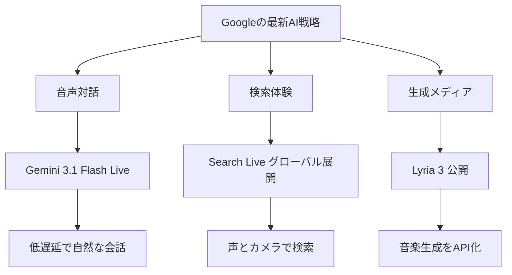
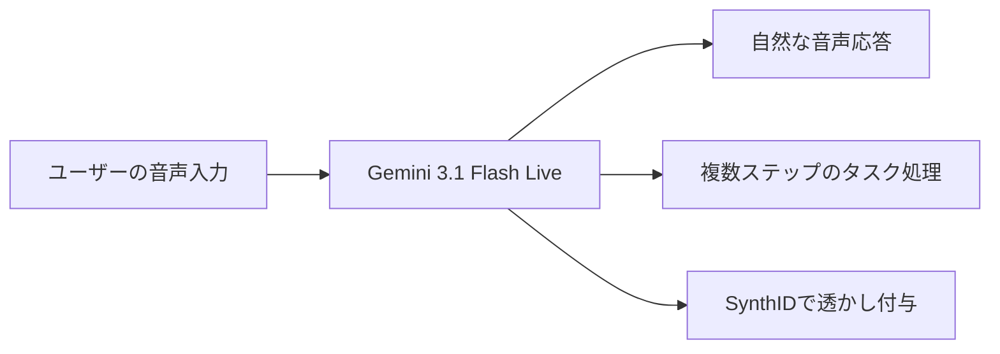
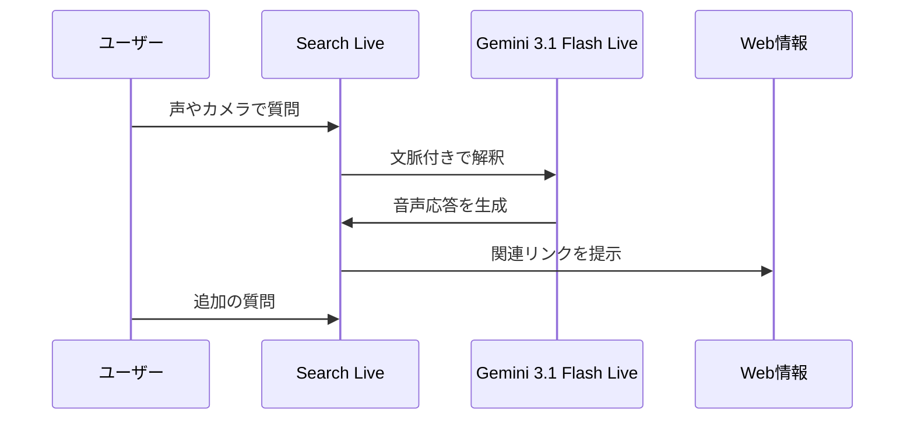

*Image source: Google 「Gemini 3.1 Flash Live: Making audio AI more natural and reliable」*

📌 **3行でわかるこの記事**
- Googleは2026年3月後半、**Gemini 3.1 Flash Live**、**Search Liveのグローバル展開**、**Lyria 3の開発者向け公開**を相次いで発表しました。
- 共通するテーマは、AIを「文章生成」から一歩進めて、**音声対話・リアルタイム検索・音楽生成**まで実用化する流れです。
- とくに開発者視点では、**低遅延の音声AI + マルチモーダル検索 + 生成メディアAPI**が同時に揃ってきたのが大きな変化です。

---

## 今回のニュースが重要な理由

2026年3月末のAIニュースを眺めると、Googleの動きがかなりはっきりしています。ポイントは、単一モデルの性能競争だけではなく、**実際に使われるインターフェースを押さえにきている**ことです。

今回取り上げるのは、次の3本です。

### 3つの発表

- **Gemini 3.1 Flash Live**：リアルタイム音声対話の品質向上
- **Search Live のグローバル展開**：200以上の国と地域へ拡大
- **Lyria 3**：音楽生成モデルをGemini API / AI Studioで公開

この3本を並べて見ると、Googleが狙っているのは次の構図だと分かります。



要するに、Googleは「賢いモデル」だけでなく、**ユーザーがそのまま触る体験**と**開発者が組み込めるAPI**を同時に強化しています。

## Gemini 3.1 Flash Liveとは何か

### 発表内容の要点

Googleは2026年3月26日、**Gemini 3.1 Flash Live**を発表しました。公式発表によれば、これはGoogleの「最高品質の音声・音声対話モデル」であり、リアルタイム会話の自然さと信頼性を重視したモデルです。

記事では、提供先が次のように整理されています。

- 開発者向け：**Gemini Live API**（Google AI Studio）
- エンタープライズ向け：**Gemini Enterprise for Customer Experience**
- 一般ユーザー向け：**Search Live** / **Gemini Live**

### 何が改善されたのか

Googleの説明では、改善点は大きく3つあります。

#### 1. 低遅延で自然な会話

従来より速く、会話のテンポが自然になり、長めの対話でも文脈を保ちやすくなったとされています。これは単なる音声入出力ではなく、**対話の間やリズムまで含めて改善**している点が重要です。

#### 2. 複雑なタスク実行への強化

公式記事では、ComplexFuncBench Audioで**90.8%**、Scale AIのAudio MultiChallengeで**36.1%（thinking on）**という数値が紹介されています。ベンチマーク名だけ見ると地味ですが、意味としては明快で、**会話しながら複数ステップの処理を進める能力**を押し上げたという話です。

#### 3. 音声安全性の明示

Googleは、3.1 Flash Liveが生成する音声に**SynthIDによる電子透かし**を入れると説明しています。音声AIが広がるほど、自然さだけでなく「これはAI生成音声だと検出できるか」が重要になるので、この点は地味に大きいです。

### 開発者にとっての意味

音声AIで一番つらいのは、賢さよりも**会話がぎこちないこと**です。応答が遅い、文脈が飛ぶ、相手のトーンを拾えない。この3つがあると、実装できても使われません。

Gemini 3.1 Flash Liveは、そのボトルネックをかなり正面から潰しにきています。



## Search Liveのグローバル展開


*Image source: Google 「Search Live is expanding globally」*

### 何が発表されたのか

Googleは同じく3月26日、**Search LiveをAI Mode対応の全言語・全地域へ拡大**すると発表しました。記事によれば、対象は**200以上の国と地域**です。

Search Liveは、Googleアプリ上で**声**や**カメラ**を使って検索と会話を続けられる機能です。単発の検索キーワードではなく、「その場で見ているもの」「今困っている作業」に対して対話的に助ける設計になっています。

### ここで重要なのは“検索UIの再定義”

従来の検索は、

- キーワードを打つ
- リンク一覧を見る
- 必要ならページを開く

という流れでした。

Search Liveはこれを、

- 声で聞く
- カメラで状況を見せる
- 追加質問する
- 必要に応じてWebリンクへ降りる

という形に変えています。

#### つまり何が変わるのか

検索の入り口が「検索ボックス」から、**会話 + 視覚コンテキスト**へ移るということです。

### Gemini 3.1 Flash Liveとの関係

Search Liveのグローバル展開は、Gemini 3.1 Flash Liveの多言語・低遅延な音声能力に支えられているとGoogleは説明しています。つまり、この2本の発表は別々ではなく、実質的にはセットです。

#### ユーザー体験の流れ



これが定着すると、「検索する」と「AIに相談する」の境界がかなり薄くなります。

## Lyria 3は何がすごいのか


*Image source: Google 「Build with Lyria 3, our newest music generation model」*

### 発表内容の要点

Googleは3月25日、**Lyria 3 / Lyria 3 Pro**をGemini APIとGoogle AI Studioで開発者向けに公開したと発表しました。

公式記事によると、主な特徴は次の通りです。

- **Lyria 3 Pro**：最大およそ3分のフル楽曲生成
- **Lyria 3 Clip**：30秒クリップ向けの高速生成
- ボーカル対応
- 複数言語・複数ジャンル対応
- テキストだけでなく**画像から音楽生成**も可能

### 面白いのは“プロンプトで曲構成を触れる”こと

Lyria 3は、単に雰囲気の音を出すだけではなく、以下のような制御ができるとされています。

#### できること

- テンポ指定
- 歌詞の開始・終了位置の制御
- セクションごとの構成指定
- 画像を入力にしたムード制御

これは開発者にとってかなり扱いやすい進化です。なぜなら、音楽生成が「偶然いいものが出るか」から、**アプリに埋め込める程度に制御可能か**へ軸足を移しているからです。

### どんなユースケースが現実的か

Googleは公式記事内で、動画用BGM生成やアラーム音楽生成のデモを紹介しています。個人的には、次の用途がかなり現実的だと思います。

#### 実装しやすい用途

- 動画自動編集のBGM生成
- ゲーム / アプリ内の短尺ループ音源生成
- 広告やSNS向けの短い音素材生成
- 多言語ボーカルを使ったプロトタイプ制作

#### API利用イメージ

```bash
# 概念例: 音楽生成APIにプロンプトを渡すイメージ
curl https://generativelanguage.googleapis.com/v1beta/models/lyria-3-pro-preview:generateContent \
  -H "Content-Type: application/json" \
  -H "x-goog-api-key: $GEMINI_API_KEY" \
  -d '{
    "input": "uplifting synth-pop song, 120 BPM, female vocal, short chorus after 20 seconds"
  }'
```

※ 上記は記事理解のための概念例です。実際の最新パラメータはGoogleの公式ドキュメントを確認してください。

## 3本をまとめて見ると何が見えるか

### 共通テーマは「マルチモーダルの実装段階」

今回の3本はバラバラに見えて、実はかなり一貫しています。

#### 共通点

- **Gemini 3.1 Flash Live**：音声インターフェース
- **Search Live**：音声 + カメラ + Web
- **Lyria 3**：テキスト + 画像 + 音楽

つまりGoogleは、マルチモーダルAIを研究デモではなく、**製品とAPIとして使える形に落とし込む段階**に入っています。

### 開発者目線での整理

今後のアプリ設計は、次のように変わりそうです。

#### これから増えそうな構成

- 入力：テキストだけでなく音声・画像・映像
- 推論：対話継続と文脈保持が前提
- 出力：文章だけでなく音声・音楽・UIアクション

従来の「チャットUIにLLMをつなぐ」だけでは差別化しにくくなり、**音声対話・視覚理解・生成メディア**をどう組み合わせるかが勝負になりそうです。

## まとめ

Googleの2026年3月後半の発表は、派手な“万能モデル”の話というより、**AIを現実のUIに埋め込むための部品が揃ってきた**ニュースでした。

### ポイントを振り返ると

- Gemini 3.1 Flash Liveは、自然さ・低遅延・タスク実行を重視した音声モデル
- Search Liveは、音声とカメラを使う検索体験を200以上の国と地域へ展開
- Lyria 3は、音楽生成をGemini API / AI Studioで扱える開発者向け基盤
- 3本を通じて、GoogleはマルチモーダルAIを**研究から実装へ**押し進めている

2026年のAI競争は、モデル単体のIQ比較だけではなく、**どれだけ自然な入出力で、どれだけそのまま使える製品体験に落とせるか**に移ってきました。今回のGoogleの発表は、その流れをかなり分かりやすく示しています。

## 参考リンク

1. [Gemini 3.1 Flash Live: Making audio AI more natural and reliable | Google](https://blog.google/innovation-and-ai/models-and-research/gemini-models/gemini-3-1-flash-live/)
2. [Search Live is expanding globally | Google](https://blog.google/products-and-platforms/products/search/search-live-global-expansion/)
3. [Build with Lyria 3, our newest music generation model | Google](https://blog.google/innovation-and-ai/technology/developers-tools/lyria-3-developers/)
4. [Music generation guide | Gemini API docs](https://ai.google.dev/gemini-api/docs/music-generation)
