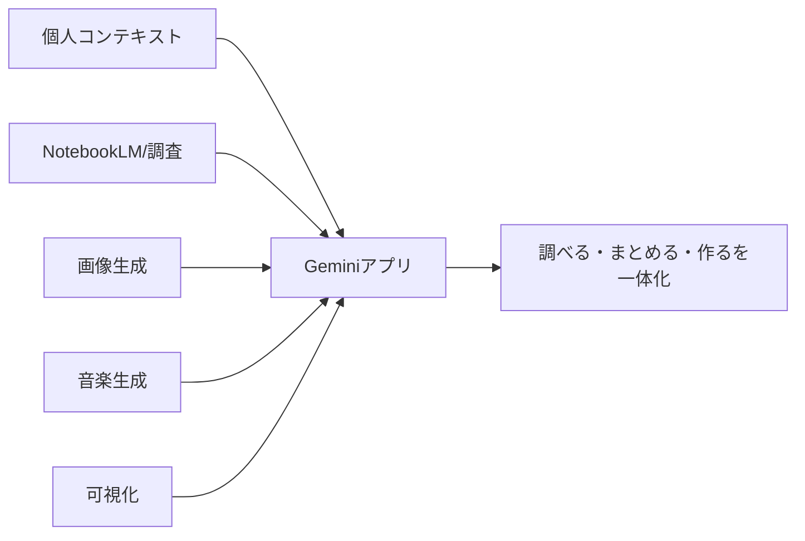
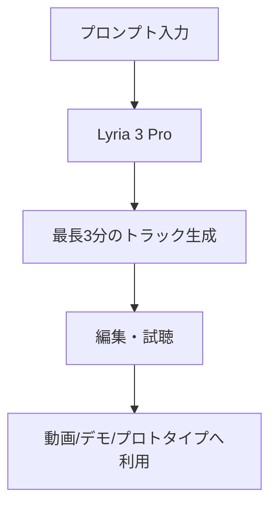

*出典: Google "Gemini Drops: New updates to the Gemini app, April 2026"*

## 📌 3行でわかるこの記事

- Googleは2026年4月24日、Geminiアプリの月例アップデート「Gemini Drop」を公開しました。
- 今回の目玉は、**Mac向けネイティブアプリ**、**NotebookLM連携のNotebooks**、**Lyria 3 Proによる最長3分の音楽生成**です。
- 方向性としては、単体チャットの強化よりも、**個人コンテキスト・制作・調査を1つのワークスペースに寄せる**動きがはっきりしています。

## はじめに

Googleが公開した2026年4月版のGemini Dropは、いわゆる「新機能まとめ」に見えて、実際にはかなり重要です。

理由はシンプルで、Geminiを単なる会話AIではなく、**調べる・まとめる・作る**を横断する作業環境として育てようとしているのが見えるからです。

今回の更新では、Google公式記事で次の6点が案内されました。

### 今回の主要アップデート

- **Personal Intelligence + Nano Banana** により、個人コンテキストやGoogle Photosを活用した画像生成
- **Personal Intelligenceのグローバル展開**
- **Notebooks** によるNotebookLM連携
- **Mac向けGeminiアプリ** の提供開始
- **Lyria 3 Pro** による最長3分の音楽生成
- **3Dモデルやチャートの可視化機能** の強化



## 何が新しいのか

### Mac向けネイティブアプリが加わった

今回かなり大きいのが、**GeminiアプリのMac対応**です。Googleは「より高速で、ネイティブなmacOS体験」と説明しています。

ブラウザ中心だった利用から、デスクトップ常駐型に近い使い方へ寄せることで、検索や執筆、調査メモとの距離を縮めたい意図が見えます。

#### 実務で効きそうなポイント

- ブラウザタブに埋もれにくい
- ちょっとした確認をAIに投げやすい
- デスクトップ作業の導線にGeminiを置きやすい

### NotebookLMとつながる「Notebooks」

Google公式記事では、**Notebooks** によって「チャットとリサーチをアプリ内でシームレスに管理できる」としています。

ここで重要なのは、Gemini単体の回答精度より、**情報の置き場を持てること**です。

NotebookLMはもともと、資料を読み込ませて要約・整理・対話する用途に強い製品です。これがGeminiアプリ側に近づくと、AIとの会話がその場限りで終わらず、**プロジェクト単位の知識整理**に寄っていきます。

#### 変化をひとことで言うと

- 「その場の質問AI」から
- **「資料と会話を束ねるAI」へ**

### Lyria 3 Proで最長3分の音楽生成

Googleは今回、**Lyria 3 Proを使った最長3分のトラック生成**を無料で提供すると案内しています。

音楽生成は派手に見えますが、本質はクリエイティブAIの実用幅が広がっている点です。短尺の効果音やBGMを超えて、もう少しまとまった素材を作れるなら、動画、デモ、アプリ試作、プロトタイピングとの相性がかなり良くなります。



### 可視化機能の強化も地味に大事

公式記事では、Geminiが**複雑な概念をインタラクティブなビジュアルで表現**できる点も紹介されています。

これは教育や学習だけでなく、仕事でも効きます。説明が難しい構造や比較を、チャットの延長で可視化できるなら、AIは「答える道具」よりも**理解を補助する道具**に近づきます。

## 今回のアップデートをどう見るか

### 1. Geminiは“個人用OS”っぽくなってきた

今回の更新を並べてみると、Googleが目指しているのは単発のモデル競争ではなく、**個人コンテキストを持った作業基盤**です。

#### そう見える理由

- Google Photosやアプリ連携で個人データに近づく
- NotebookLM連携で知識の蓄積先を持つ
- Macアプリ化で日常導線に入る
- 画像・音楽・可視化まで同じ体験に寄せる

### 2. “なんでもできるAI”より“使い続けるAI”へ

機能の粒だけ見るとバラバラですが、方向性は一貫しています。

#### Googleが強めている層

- 日々の調査
- 資料整理
- 個人化された生成
- 軽い制作
- 画面上での継続利用

つまり、Geminiは単発の高性能デモではなく、**日常の作業時間を奪いにきている**感じがあります。

## 開発者・制作者目線の実用ポイント

### すぐ試しやすい使い方

#### 1. リサーチ整理

NotebookLM連携を前提に、資料を読み込んで論点整理 → 要約 → 草案作成まで流せそうです。

#### 2. デモ素材作成

Lyria 3 Proの3分生成が安定すれば、アプリ紹介動画やPoCのBGMづくりがかなり楽になります。

#### 3. 説明資料の補助

インタラクティブ可視化は、学習コンテンツや社内説明用の図解づくりと相性が良さそうです。

```ts
const workflow = {
  research: ["collect sources", "summarize", "store in notebook"],
  create: ["generate image", "generate music", "visualize concept"],
  deliver: ["draft article", "build slides", "share result"]
};
```

## 私の見立て

### 今回の本質は“モデル性能”ではない

正直、2026年のAIニュースで「モデルが少し賢くなった」だけでは驚きにくくなっています。

それより大事なのは、GoogleがGeminiを**検索代替でもチャット代替でもなく、個人作業ハブとして完成させようとしている**ことです。

特にMacアプリ、NotebookLM連携、個人コンテキスト活用は、全部この方向につながっています。

### 気になる点もある

もちろん、良い話ばかりではありません。

#### 注意したい論点

- 個人コンテキスト利用が増えるほど、プライバシー設計は重要になる
- 機能が増えるほど、逆にUIが散らかるリスクもある
- 国・地域ごとの提供差が大きく、使える機能にばらつきが出やすい

とはいえ、今回のGemini Dropは「機能追加」以上に、**GoogleがAIを日常作業の中心に押し込む設計図**として見るとかなり面白いです。

## まとめ

### 要点の整理

- Googleは4月24日にGemini Drop 2026年4月版を公開
- Macアプリ、Notebooks、Lyria 3 Pro、可視化、個人化生成が主な更新
- 方向性は、単体チャット強化ではなく**作業環境としてのGemini統合**

ここ数カ月のAI競争は「どのモデルが強いか」から、「どの体験が毎日使われるか」に移っています。

今回のGemini Dropは、その勝負がかなりはっきり見えた更新でした。

## 参考リンク

1. [Gemini Drops: New updates to the Gemini app, April 2026 | Google](https://blog.google/innovation-and-ai/products/gemini-app/gemini-drop-april-2026/)
2. [The Gemini app is now on Mac | Google](https://blog.google/innovation-and-ai/products/gemini-app/gemini-app-now-on-mac-os/)
3. [Try notebooks in Gemini to easily keep track of projects | Google](https://blog.google/innovation-and-ai/products/gemini-app/notebooks-gemini-notebooklm/)
4. [Visualize complex concepts with 3D models and interactive charts in Gemini | Google](https://blog.google/innovation-and-ai/products/gemini-app/3d-models-charts/)
5. [New ways to create personalized images in the Gemini app | Google](https://blog.google/innovation-and-ai/products/gemini-app/personal-intelligence-nano-banana/)
