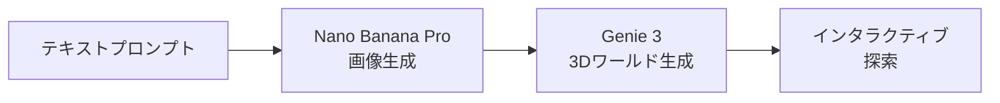

## 📌 3行でわかるこの記事

- 🚀 Google DeepMindが「Project Genie」を一般公開、テキストから3Dワールドを生成可能に
- 🎮 ゲームエンジンではないが、探索・インタラクション可能な仮想世界をリアルタイム生成
- 💰 Google AI Ultra（月額$250）の米国ユーザー限定で利用可能

## はじめに

2026年1月、Google DeepMindは「**Project Genie**」を一般公開しました。これは2025年夏に発表された「Genie 3」モデルをベースに、誰でも（条件付きで）3Dインタラクティブワールドを生成できるようにしたサービスです。

## Project Genieとは？

Project Genieは、いわゆる「ワールドモデル」と呼ばれるAIシステムです。ユーザーが入力したテキストプロンプトから画像を生成し、その画像をベースにした3D空間をリアルタイムで構築します。

## 3つの操作モード

### 1. World Sketching（ワールドスケッチ）
- キャラクターの外見を指定
- カメラ視点の選択（一人称/三人称/アイソメトリック）
- 探索方法の定義

### 2. Exploration（探索）
生成された3D空間を自由に移動・探索できます。

### 3. Remixing（リミックス）
他のユーザーが作成したワールドに自分のプロンプトを適用して、新しいバリエーションを作成可能です。

## 現時点での制限

| 項目 | 制限 |
|------|------|
| 生成時間 | 最大60秒 |
| フレームレート | 24fps |
| 解像度 | 720p |
| 対象地域 | 米国のみ |
| 年齢制限 | 18歳以上 |
| 料金 | Google AI Ultra（$250/月） |

**重要な注意点**: Genie 3はゲームエンジンではありません。物理的なインタラクションのシミュレーションは可能ですが、従来のゲームメカニクス（スコア、ゴール、ルールなど）は含まれていません。

## 技術的な背景

Genie 3は当初、AIエージェントのトレーニング用ツールとして開発されました。エージェントが様々な環境でタスクを学習するためのシミュレーション環境を動的に生成する目的でした。

今回の一般公開により、研究者やクリエイターがこの最先端技術を試せるようになりました。

## 今後の展望

現時点では米国限定かつ高額なサブスクリプションが必要ですが、Google DeepMindの他のプロジェクト（AlphaFold、Geminiなど）と同様に、将来的にはより広いアクセスが期待されます。

ゲーム開発、建築ビジュアライゼーション、教育、メタバースなど、多くの分野での応用が考えられます。

## まとめ

Project Genieは、テキストから3Dインタラクティブワールドを生成するという、SF的なコンセプトを現実にした技術です。まだ制限は多いですが、この技術の進化によって「想像したものをそのまま体験できる」未来が近づいています。

## 参考リンク

- [Google DeepMind公式ブログ - Project Genie](https://blog.google/innovation-and-ai/models-and-research/google-deepmind/project-genie/)
- [Engadget - Google's Project Genie lets you create your own 3D interactive worlds](https://www.engadget.com/ai/googles-project-genie-lets-you-create-your-own-3d-interactive-worlds-183646428.html)
- [Google DeepMind - Genie 3発表時の記事](https://www.engadget.com/ai/google-deepminds-genie-3-can-dynamically-alter-the-state-of-its-simulated-worlds-140052124.html)
