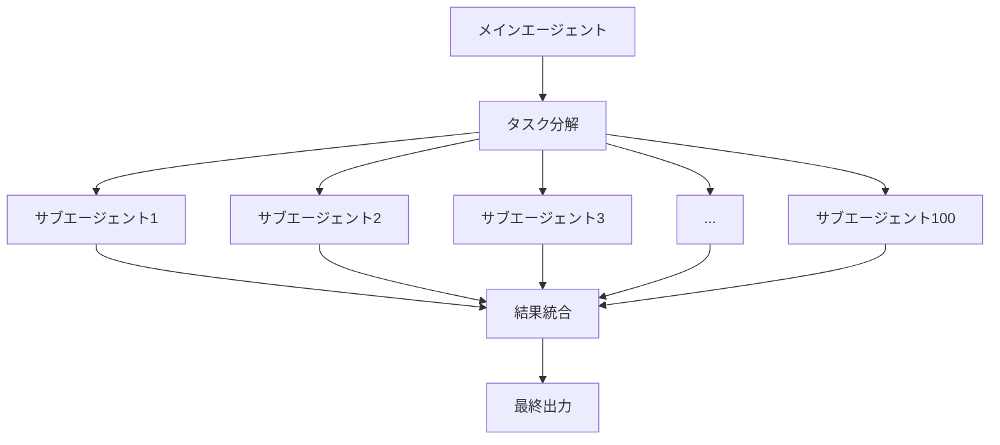

## 📌 3行でわかるこの記事

- 🚀 Moonshot AIが1兆パラメータのマルチモーダルモデル「Kimi K2.5」を発表
- 🐝 最大100体のサブエージェントが並列動作する「Agent Swarm」機能を搭載
- 📦 Modified MIT Licenseでオープンソース公開、商用利用可能

## はじめに

2025年1月27日、中国のAIスタートアップ **Moonshot AI** が新モデル **Kimi K2.5** を発表しました。このモデルの最大の特徴は、最大100体のサブエージェントを同時に動かす「Agent Swarm」機能です。

本記事では、Kimi K2.5の技術的特徴と実践的な使い方を解説します。

## Kimi K2.5とは

Kimi K2.5は、Kimi K2をベースに約15兆個の視覚・テキストトークンで継続学習された**ネイティブマルチモーダルモデル**です。

### 基本スペック

| 項目 | 値 |
|------|------|
| アーキテクチャ | Mixture-of-Experts (MoE) |
| 総パラメータ数 | 1T（1兆） |
| アクティブパラメータ | 32B |
| コンテキスト長 | 256K |
| エキスパート数 | 384 |
| Vision Encoder | MoonViT (400M) |

## 3つの主要機能

### 1. Agent Swarm（エージェント群）

最大の目玉機能です。複雑なタスクを並列サブタスクに分解し、**最大100体のサブエージェント**が同時に実行します。

- 最大1,500回のツールコールを並列実行
- 従来比で処理時間を**4.5倍短縮**
- BrowseCompベンチマークで78.4%を達成



### 2. ネイティブマルチモーダル

画像・動画を直接理解し、コード生成に活用できます。

- UIデザイン画像からWebサイトを生成
- 動画からワークフローを理解してコード化
- VideoMMMUで86.6%、LongVideoBenchで79.8%

### 3. コーディング能力

フロントエンド開発で特に強力です。

- SWE-Bench Verified: 76.8%
- SWE-Bench Multilingual: 73.0%
- 専用CLI「Kimi Code」でCursor/VSCode/Zedから利用可能

## ベンチマーク結果（抜粋）

| ベンチマーク | Kimi K2.5 | GPT-5.2 | Claude 4.5 Opus |
|-------------|-----------|---------|------------------|
| AIME 2025 | 96.1 | 100 | 92.8 |
| GPQA-Diamond | 87.6 | 92.4 | 87.0 |
| SWE-Bench Verified | 76.8 | 80.0 | 80.9 |
| VideoMMMU | 86.6 | 85.9 | 84.4 |
| BrowseComp (Swarm) | 78.4 | - | - |

## 使い方

### API利用

OpenAI互換APIとして提供されています。

```python
import openai

client = openai.OpenAI(
    base_url="https://platform.moonshot.ai/v1",
    api_key="YOUR_API_KEY"
)

# Thinkingモード（推論あり）
response = client.chat.completions.create(
    model="kimi-k2.5",
    messages=[{"role": "user", "content": "9.11と9.9はどちらが大きい？"}],
    max_tokens=4096
)

# Instantモード（推論なし）
response = client.chat.completions.create(
    model="kimi-k2.5",
    messages=[{"role": "user", "content": "Hello"}],
    extra_body={"thinking": {"type": "disabled"}}
)
```

### 画像入力

```python
import base64
import requests

image_base64 = base64.b64encode(requests.get(url).content).decode()

response = client.chat.completions.create(
    model="kimi-k2.5",
    messages=[{
        "role": "user",
        "content": [
            {"type": "text", "text": "この画像を説明して"},
            {"type": "image_url", "image_url": {"url": f"data:image/png;base64,{image_base64}"}}
        ]
    }]
)
```

### セルフホスティング

Hugging Faceでウェイトが公開されています。

- **vLLM / SGLang / KTransformers** で動作
- INT4量子化に対応
- transformers >= 4.57.1 が必要

## ライセンス

**Modified MIT License** で公開されており、商用利用も可能です。

## まとめ

Kimi K2.5の特徴をまとめると：

- ✅ 100体のエージェントが並列動作する「Agent Swarm」
- ✅ 画像・動画からコードを生成するマルチモーダル能力
- ✅ オープンソース（Modified MIT License）
- ✅ OpenAI互換API

特にAgent Swarm機能は、複雑な調査タスクやマルチステップのワークフローで威力を発揮しそうです。

## 参考リンク

- [Hugging Face モデルカード](https://huggingface.co/moonshotai/Kimi-K2.5)
- [Kimi Code CLI](https://www.kimi.com/code)
- [公式テックブログ](https://www.kimi.com/blog/kimi-k2-5.html)
- [Moonshot AI Platform](https://platform.moonshot.ai)
