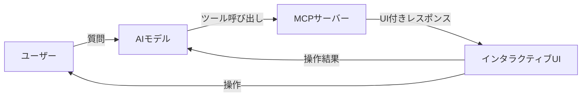

> **📌 3行でわかるこの記事**
> - AIチャット内でグラフやフォームなど**インタラクティブなUI**が使えるようになった
> - AnthropicとOpenAIが共同策定、**Claude・ChatGPT・VS Code**で利用可能
> - 1つのコードで複数AIクライアント対応、開発効率が大幅アップ

---

2026年1月26日、Model Context Protocol (MCP) の公式拡張として **MCP Apps** がリリースされました。AnthropicとOpenAIが協力して策定したこの仕様により、AIとの会話内でダッシュボード、フォーム、グラフなどの**インタラクティブなUI**が直接操作できるようになります。

本記事では、MCP Appsの仕組みと実用例を解説します。

## MCP Appsとは？

従来のAIチャットでは、ツールの実行結果はテキストで返されていました。MCP Appsでは、ツールが**リッチなUI**を返せるようになります。



### 従来との比較

| 項目 | 従来のMCP | MCP Apps |
|------|-----------|----------|
| 出力形式 | テキストのみ | UI + テキスト |
| データ閲覧 | 「次の10件を表示」と再度プロンプト | UIで直接スクロール・フィルタ |
| フォーム入力 | 1項目ずつ対話 | まとめて入力・送信 |
| リアルタイム更新 | 再実行が必要 | 自動更新 |

## 実用例

### 1. データ分析ダッシュボード

売上データを可視化するツールを呼び出すと、グラフやテーブルが表示され、**地域でフィルタ**したり**ドリルダウン**したりできます。いちいち「○○地域だけ見せて」と言わなくてOK。

### 2. 設定ウィザード

デプロイツールで「本番環境」を選ぶとセキュリティ設定が、「ステージング」を選ぶとデバッグ設定が自動で表示される、といった動的フォームが実現可能。

### 3. ドキュメントレビュー

契約書PDFをAIに渡すと、注目箇所がハイライトされた状態でインラインプレビュー。「承認」「要修正」ボタンをクリックするだけで判断を伝えられます。

### 4. リアルタイム監視

サーバー監視ツールがライブメトリクスを表示。状態が変わると**自動更新**されるので、再度ツールを呼び出す必要なし。

## 対応クライアント

MCP Appsは以下のクライアントで利用可能です（2026年1月時点）：

- ✅ **Claude** (Web/デスクトップ)
- ✅ **ChatGPT** (今週より順次対応)
- ✅ **Visual Studio Code** (Insiders版、来週Stable版に展開予定)
- ✅ **Goose** (Block社の参照実装)

**同じMCPサーバーを書けば、上記すべてのクライアントで動作**するのがポイントです。

## セキュリティ

外部サーバーのコードを実行するため、複数の安全対策が施されています：

1. **iframe sandbox**: UI は制限付きサンドボックス内で実行
2. **テンプレート事前審査**: ホストがレンダリング前にHTMLを検証可能
3. **JSON-RPCログ**: 全通信が監査可能
4. **ユーザー同意**: ツール呼び出し時に明示的な承認を要求可能

## 開発者向け：始め方

```bash
npm install @modelcontextprotocol/ext-apps
```

```typescript
import { App } from "@modelcontextprotocol/ext-apps";

const app = new App();
await app.connect();

// ツール結果を受け取ってUIに反映
app.ontoolresult = (result) => {
  renderChart(result.data);
};

// UIからサーバーツールを呼び出し
const response = await app.callServerTool({
  name: "fetch_details",
  arguments: { id: "123" },
});

// モデルのコンテキストを更新
await app.updateModelContext({
  content: [{ type: "text", text: "ユーザーがオプションBを選択" }],
});
```

## なぜ重要か

MCP Appsは「AIとUI」の関係を根本から変えます。

**従来**: 各アプリにAIを埋め込む → 体験が分断される  
**MCP Apps**: AIエージェントにアプリをプラグイン → 統合された体験

Block社のGoose開発チームはこうコメントしています：

> 「ユーザーはアプリを渡り歩くのではなく、信頼できる1つのエージェントを通じてナビゲートする未来を信じている」

## まとめ

MCP Appsにより、AIチャットは単なる「テキストのやり取り」から「インタラクティブなアプリケーション実行環境」へ進化しました。

- Claude、ChatGPT、VS Codeで今すぐ使える
- 1つのMCPサーバーで複数クライアント対応
- セキュリティも考慮済み

今後、ゲーム、カレンダー、地図、決済フローなど、様々なMCP Appsが登場することが期待されます。

---

**参考リンク:**
- [MCP Apps公式発表](http://blog.modelcontextprotocol.io/posts/2026-01-26-mcp-apps/)
- [MCP Apps SDKドキュメント](https://modelcontextprotocol.github.io/ext-apps/api/documents/Quickstart.html)
- [MCP公式サイト](https://modelcontextprotocol.io/)
