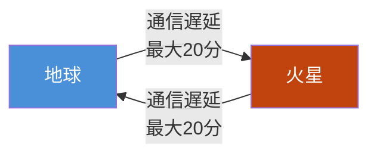
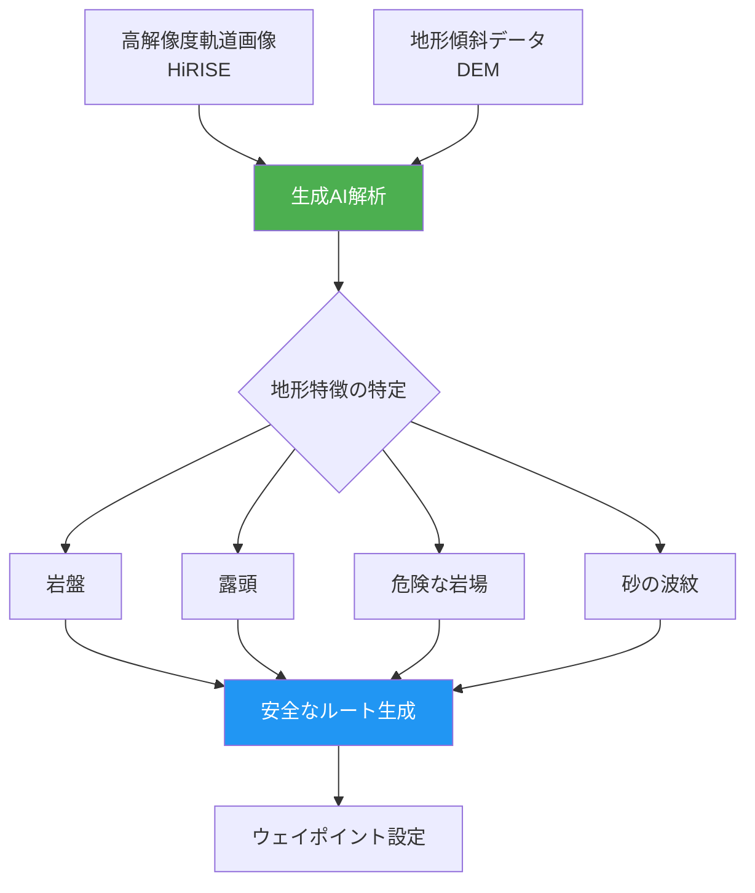
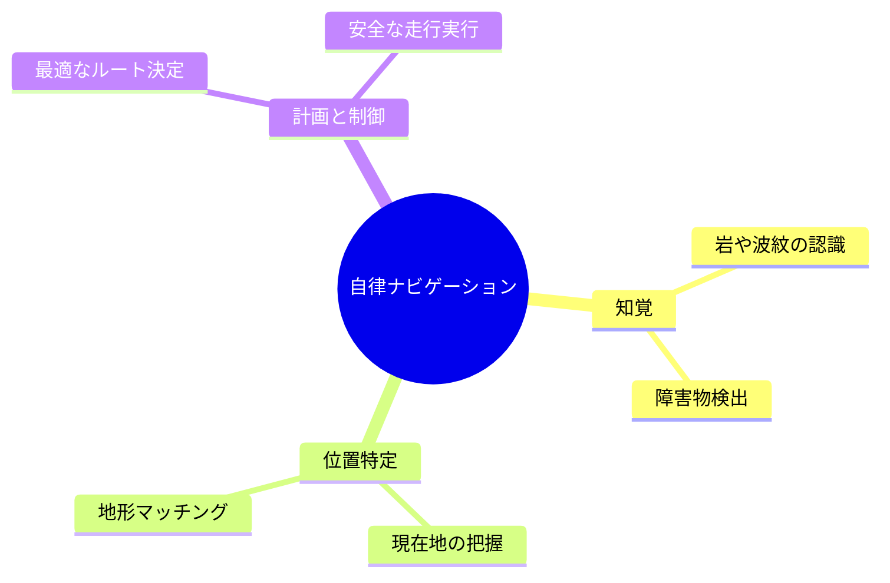

# NASAのPerserverance roverが火星で初のAI自律走行を達成

## 📌 3行でわかるこの記事

- NASAのPerserverance roverが火星で**世界初のAI計画による走行**を完了
- 生成AIが高解像度画像を分析し、**危険な地形を回避するルート**を自動生成
- 将来の**月・火星探査における自律システム**の基盤技術を実証

---

## はじめに

2026年1月、NASAは歴史的な発表を行いました。火星探査車「Perserverance」が、**人工知能（AI）によって計画されたルートで走行**することに初めて成功したのです。

これは、これまで人間のオペレーターが行っていた複雑な経路計画を、生成AIが自動化した画期的な成果です。本記事では、この技術がどのように実現されたのか、そして宇宙探査の未来にどのような影響を与えるのかを解説します。

*Image Credit: NASA/JPL-Caltech*

---

## 背景と課題

### 火星と地球の距離が生む課題

火星は地球から平均して**約1億4000万マイル（2億2500万キロメートル）** 離れています。この莫大な距離により、地球から火星への通信には**大きな遅延**が発生します。

リアルタイムでの遠隔操作（いわゆる「ジョイスティック操作」）は不可能であり、これまでの火星探査車は以下の手順で運用されてきました：

1. 人間のオペレーターが地形データを分析
2. 安全なルートを特定し、ウェイポイント（中継地点）を設定
3. 指令を火星に送信
4. 探査車が指令を実行

### 従来の運用の限界

従来の方法では、以下のような課題がありました：

- **時間のかかるプロセス**：ルート計画には数時間〜数日を要する
- **人員の負担**：専門の「ローバー・プランナー」チームが必要
- **ウェイポイントの制約**：通常100メートル以下の間隔で設定が必要

---

## 技術的ブレイクスルー

### 生成AIによる自動ルート計画

今回のデモンストレーションでは、**生成AI**が以下の処理を自動化しました：

AIが分析したデータソース：

| データソース | 機能 | 搭載機 |
|------------|------|--------|
| HiRISE画像 | 高解像度軌道画像 | Mars Reconnaissance Orbiter |
| DEMデータ | 地形の傾斜情報 | デジタル標高モデル |

### 実行結果

2025年12月8日と10日（火星の太陽日でsol 1707と1709）、PerseveranceはAIが計画したルートで走行を実行しました：

| 日付 | 走行距離 | 内容 |
|-----|---------|------|
| 2025年12月8日 | 689フィート (210m) | 初のAI計画走行 |
| 2025年12月10日 | 807フィート (246m) | 2回目のAI計画走行 |

### デジタルツインによる検証

実際の走行の前に、JPLの**デジタルツイン**（探査車の仮想レプリカ）を使用して、**50万以上のテレメトリ変数**を検証しました。これにより、AIが生成した指令が探査車のフライトソフトウェアと完全に互換性があることを確認しています。

---

## 技術の意義と展望

### 自律ナビゲーションの3つの柱

JPLの宇宙ロボット工学者Vandi Verma氏は、生成AIが以下の3つの要素を効率化すると説明しています：

### 将来への応用

この技術は、以下のような将来的な探査に不可欠な基盤となります：

1. **キロメートル規模の走行**：オペレーターの作業負担を最小限に
2. **科学的発見の支援**：膨大な画像データから興味深い表面特徴を自動検出
3. **月・火星の有人拠点**：恒久的な人間の存在を支えるインフラ

> "Imagine intelligent systems not only on the ground at Earth, but also in edge applications in our rovers, helicopters, drones, and other surface elements trained with the collective wisdom of our NASA engineers, scientists, and astronauts."
> 
> — Matt Wallace, JPL Exploration Systems Office

---

## 2026年のAIトレンドとの関連

### エッジAIの進化

この成果は、MIT Technology Reviewが予測した**「2026年のAIトレンド」**とも関連しています。特に：

- **推論モデルの実用化**：リアルタイムでの意思決定が可能に
- **科学分野でのAI活用拡大**：宇宙探査での自律システム実装

NASAの取り組みは、**「推論モデルがベストインクラスの問題解決の新パラダイムになった」**という予測を裏付ける事例と言えるでしょう。

---

## まとめ

NASAのPerseverance roverによる初のAI自律走行は、宇宙探査における**新時代の幕開け**を告げるものです。

主なポイント：

| 項目 | 内容 |
|-----|------|
| **成果** | 世界初のAI計画による他天体での走行 |
| **技術** | 生成AIによる高解像度画像解析とルート生成 |
| **検証** | デジタルツインで50万以上の変数をチェック |
| **意義** | 月・火星の有人探査に向けた自律技術の実証 |

地球からの通信遅延がある環境でも、AIが自律的に判断・行動できることを実証したこの成果は、将来の**月面基地や火星有人探査**において重要な基盤技術となるでしょう。

---

## 参考リンク

1. [NASA's Perseverance Rover Completes First AI-Planned Drive on Mars - NASA JPL](https://www.jpl.nasa.gov/news/nasas-perseverance-rover-completes-first-ai-planned-drive-on-mars/)
2. [Visualizing Perseverance's AI-Planned Drive on Mars - NASA Science](https://science.nasa.gov/photojournal/visualizing-perseverances-ai-planned-drive-on-mars/)
3. [What's next for AI in 2026 - MIT Technology Review](https://www.technologyreview.com/2026/01/05/1130662/whats-next-for-ai-in-2026/)
