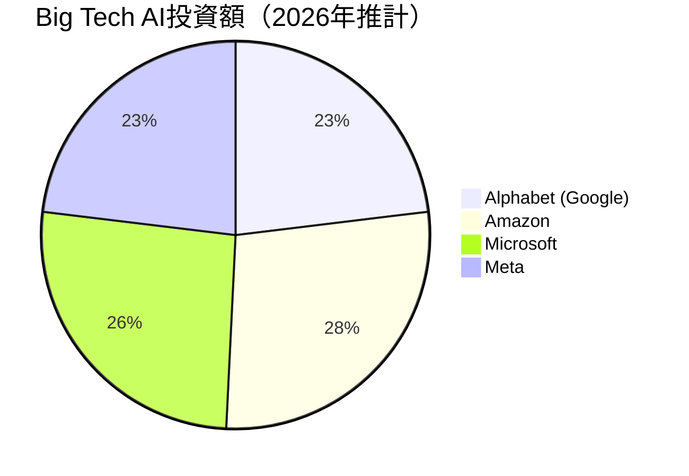
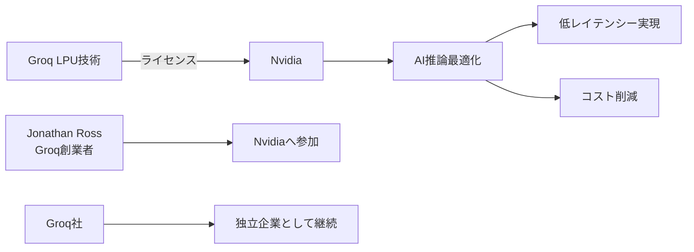
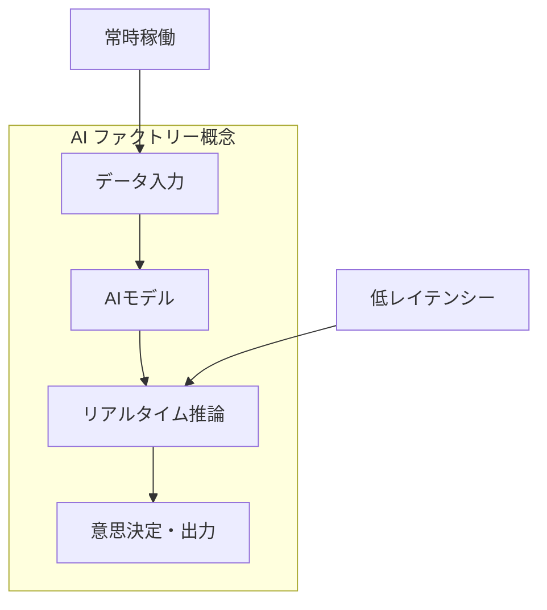

# 📌 3行でわかるこの記事

1. **Nvidiaが四半期利益430億ドルを達成** — 3年前の44億ドルから驚異的な成長
2. **Big Techが2026年に6,500億ドルをAI投資** — Google、Amazon、Microsoft、Metaがデータセンター建設へ
3. **Nvidia-Groq間で200億ドルの提携** — 低レイテンシーAI推論技術の獲得で覇権を強化

---

## はじめに

2026年2月、AI業界に衝撃的なニュースが駆け巡りました。Nvidiaが四半期で**430億ドル（約6.4兆円）の利益**を計上したのです。これは、AppleやMicrosoftといった巨大テック企業の利益を初めて上回る歴史的な記録です。


本記事では、Nvidiaの驚異的な成長、Big Techの巨額投資、そしてGroqとの提携が意味するAI市場の未来を解説します。

---

## Nvidiaの決算：数字で見る圧倒的成長

### 四半期決算のハイライト

| 項目 | 数値 | 前年比 |
|------|------|--------|
| 四半期売上 | 681億ドル | - |
| 四半期利益 | 430億ドル | 約2倍 |
| AIデータセンター売上 | 617億ドル | +71% |
| 年間利益 | 1,200億ドル | - |

3年前、Nvidiaの年間利益はわずか44億ドルでした。それが今や1,200億ドル。**約27倍の成長**です。

### AIチップ市場シェア

Nvidiaは現在、AI向け半導体市場の**約90%**を支配しています。この圧倒的シェアは、以下の要因によるものです：

- **CUDAエコシステム**の成熟
- **データセンター向けGPU**の圧倒的性能
- **ソフトウェアスタック**の充実

```python
# Nvidia成長の可視化（概念コード）
nvidia_profit = {
    2023: 4.4,   # 44億ドル
    2024: 30.0,  # 急増
    2025: 80.0,  # 加速
    2026: 120.0  # 1,200億ドル到達
}

growth_rate = nvidia_profit[2026] / nvidia_profit[2023]
print(f"3年間の成長率: {growth_rate}倍")  # 約27倍
```

---

## Big TechのAI投資ラッシュ

### 2026年の投資額

Bridgewater Associatesの調査によると、Big Tech4社は2026年に**合計6,500億ドル（約97兆円）**をAI関連インフラに投資する計画です。



### なぜこれほどの投資なのか

各社が巨額投資を行う理由は明確です：

1. **生成AIサービス競争** — ChatGPT、Gemini、Claudeなどの競合
2. **クラウド推論需要** — 企業のAI利用が本格化
3. **自社AIモデル開発** — 独自の大規模言語モデル構築

> 💡 **Key Insight**: この投資は単なるキャピタルゲインではなく、AI時代の「電力・道路」を独占する戦略的投資です。

---

## Nvidia-Groq提携：200億ドルの戦略的意味

### 提携の概要

2025年12月、NvidiaはGroqとの間で**200億ドルのライセンス契約**を締結しました。



### GroqのLPUとは何か

Groqの**Language Processing Unit (LPU)** は、従来のGPUとは異なるアーキテクチャを採用しています：

| 特徴 | GPU | LPU |
|------|-----|-----|
| 設計思想 | 汎用並列処理 | AI推論専用 |
| レイテンシー | 高め | 超低遅延 |
| メモリ帯域 | ボトルネックあり | 最適化済み |
| コスト効率 | 普通 | 高効率 |

```python
# LPUとGPUの比較（概念）
class GPU:
    purpose = "汎用並列処理"
    latency = "高め"
    flexibility = "高い"

class LPU:
    purpose = "AI推論専用"
    latency = "超低遅延"
    flexibility = "推論特化"
```

### なぜ「非独占」なのか

この契約が「非独占的（non-exclusive）」である点は重要です：

- **規制リスクの回避** — 独占禁止法への配慮
- **Groqの独立性維持** — 同社は引き続き単独で事業継続
- **競争の錯覚** — 市場には「競争が存在する」印象を維持

---

## AI市場の未来：2026年のトレンド

### 「AIファクトリー」の時代

2026年は**「AIファクトリー」**の年になると予測されています：



AIファクトリーとは：

- **24/7稼働**のAI推論インフラ
- **常時推論**（continuous inference）が基本
- 従来の「学習中心」から「推論中心」へのシフト

### 推論市場の2極化

VentureBeatの分析によると、AI推論市場は2つに分かれています：

1. **バッチ推論** — 大量データの一括処理
2. **リアルタイム推論** — 即時レスポンスが必要な用途

Nvidia-Groq提携は、この**リアルタイム推論市場**を狙ったものです。

---

## 日本への影響

### なぜ日本に関係するのか

- **データセンター投資** — 日本でもAIインフラ需要が急増
- **クラウドコスト** — AIチップ価格がクラウド料金に直結
- **技術者需要** — GPU/LPUプログラミングスキルが必須に

### 今後注目すべきポイント

1. **AIチップの国産化** — 日本でも開発が進行中
2. **クラウド料金の変動** — 競争激化で下落の可能性
3. **新技術の登場** — LPUに続く新アーキテクチャ

---

## まとめ

Nvidiaの四半期利益430億ドル達成は、AI時代の幕開けを象徴する数字です。Big Tech6,500億ドルの投資、Groqとの200億ドル提携は、この流れを加速させるでしょう。

### 今後の予測

- **短期（1年以内）**: Nvidiaのシェア維持、価格競争激化
- **中期（2-3年）**: LPU等の新技術台頭、市場分散化
- **長期（5年）**: AIインフラの公共財化

AIチップ戦争はまだ始まったばかりです。

---

## 参考リンク

1. [Nvidia Quarterly Profit Hits $43 Billion — The New York Times](https://www.nytimes.com/2026/02/25/technology/nvidia-earnings.html)
2. [Big Tech to invest about $650 billion in AI — Reuters](https://www.reuters.com/business/big-tech-invest-about-650-billion-ai-2026-bridgewater-says-2026-02-23/)
3. [Groq and Nvidia Enter Non-Exclusive Licensing Agreement — Groq Official](https://groq.com/newsroom/groq-and-nvidia-enter-non-exclusive-inference-technology-licensing-agreement-to-accelerate-ai-inference-at-global-scale)
4. [Nvidia's $20 billion Groq play is a blueprint for 2026 — TheStreet](https://www.thestreet.com/investing/nvidias-20-billion-groq-play-is-a-blueprint-for-2026)
