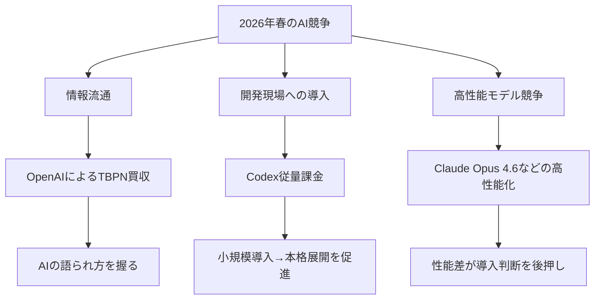
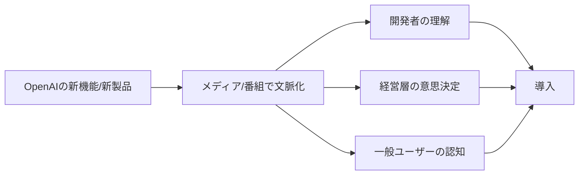
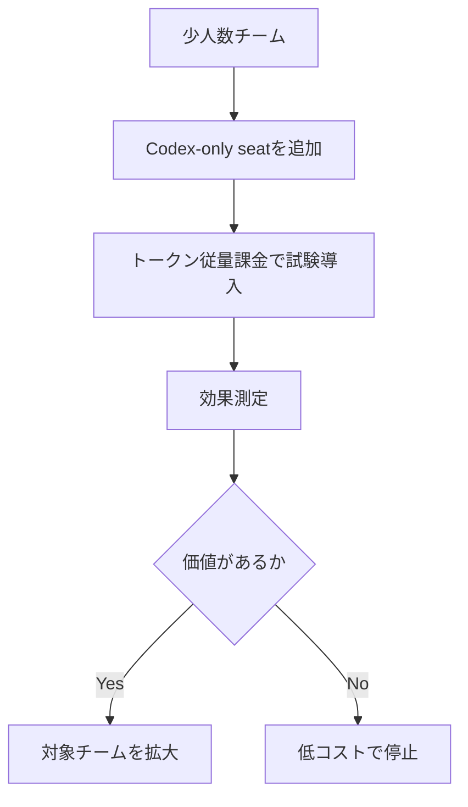

*Image source: OpenAI 「OpenAI acquires TBPN」*

📌 **3行でわかるこの記事**
- OpenAIは2026年4月、**TBPN買収**と**Codexの従量課金拡大**を相次いで発表しました。
- この2本を並べると、OpenAIが強化しているのは単なるモデル性能ではなく、**AIの流通経路**と**開発チームへの浸透経路**だと見えてきます。
- 技術者目線では、今後は「どのモデルが強いか」だけでなく、**どう配るか・どう組織に定着させるか**が競争軸になります。

---

## この記事で扱うニュース

今回扱うのは、OpenAIが2026年3月末〜4月初旬に公開した以下の発表です。

### 対象ニュース

- **OpenAI acquires TBPN**（2026-04-02）
- **Codex now offers pay-as-you-go pricing for teams**（2026-04-02）
- **Introducing Claude Opus 4.6**（2026-02-05, 比較用の周辺動向）

OpenAIの2本は一見すると別の話ですが、合わせて読むと「AIプロダクトをどう広げるか」という一つの戦略に収束しています。

## なぜこの2本をまとめて見るべきか

AIニュースは新モデル発表に目が行きがちですが、事業として伸びるかどうかは別の要素で決まります。

### OpenAIが今やっているのは「性能」以外の最適化

今回の2本から見えるのは、OpenAIが次の2レイヤーを同時に押さえにきていることです。

#### 1. AIをめぐる会話のハブ
TBPN買収により、業界の議論や発信チャネルとの接点を強化する。

#### 2. 導入コストの摩擦低減
Codexの従量課金化により、企業が小さく試して広げやすい導線を作る。

モデルの性能改善は当然続きますが、それだけでは普及しません。**認知を作る仕組み**と**予算承認を通しやすくする仕組み**まで整え始めた、というのが今回の重要点です。

## TBPN買収は何を意味するのか

### 発表内容の要点

OpenAIは2026年4月2日、テック系ライブ番組ネットワークの**TBPN**を買収したと発表しました。OpenAIによれば、TBPNは「strong editorial instincts」「deep audience understanding」「a proven ability to convene influential voices across tech, business, and culture」を持つチームだとされています。

記事内で特に重要だったのは、次の2点です。

#### OpenAIが明示したこと
- TBPNはAIとビルダーの会話が日常的に起きる場所の一つである
- OpenAIはTBPNの**editorial independence**を守ると明言している

この時点で、単なる広報チームの強化というより、**AI時代のメディア接点そのものを取り込みにいく動き**と読めます。

### なぜメディア取得がAI企業に効くのか

AI企業は、製品の複雑さと社会的インパクトの大きさの両方を抱えています。そのため、単発のプレスリリースだけでは認知も理解も追いつきません。

#### 背景にある課題
- 新機能の数が多く、一般ユーザーが追い切れない
- 技術の社会的影響が大きく、説明責任が重い
- 開発者・経営層・一般利用者で関心ポイントが違う

TBPNのような日次で議論が回るメディアを持つことで、OpenAIは**発表する場**だけでなく**文脈を作る場**にも関与しやすくなります。

### 注意して見るべき点

もちろん、メディア企業の買収には緊張感もあります。OpenAIは公式発表で編集上の独立性を守るとしていますが、外部から見ると次の論点は残ります。

#### 観測ポイント
- 本当に批判的報道の余地が維持されるか
- OpenAI以外のAI企業も公平に扱われるか
- 「業界の会話の中心」が特定企業に寄りすぎないか

ここは今後の運用を見ないと評価が定まりません。ただし、**AI企業が配信・文脈設計まで取りに来た**という事実自体はかなり大きいです。

## Codexの従量課金化はなぜ重要か

*Image source: OpenAI 「Codex now offers pay-as-you-go pricing for teams」*

### 発表内容の要点

OpenAIは同じく2026年4月2日、**ChatGPT Business / Enterprise向けにCodex-only seatsを追加し、固定席料金なしの従量課金で提供する**と発表しました。

公式発表で示された主なポイントは以下です。

#### 公式に明記された内容
- Codex-only seatsは**固定シート料金なし**
- 課金は**token consumptionベース**
- Codex-only seatsには**rate limitsがない**
- ChatGPT Businessの年額価格は**$25→$20/seat**へ引き下げ
- 2 million builders use Codex every week
- ChatGPT Business / Enterprise内のCodex利用者数は**1月以降6倍**

### 技術者・マネージャー両方に刺さる理由

AIコーディング支援は、性能が良くても導入プロセスで詰まりがちです。とくに企業では、全員分の固定席を最初から買う判断が重いことが多いです。

#### 従来の壁
- まず全社導入前提になりやすい
- 利用量とコストの対応が見えにくい
- 実験段階で稟議を通しづらい

従量課金のCodex-only seatsは、この壁をかなり直接的に崩します。

#### 何が変わるか
- 小さなチームでPoCを始めやすい
- 部署単位で予算管理しやすい
- 使った分だけ払うため費用対効果を説明しやすい
- 価値が確認できた後に拡張しやすい

### これは価格改定ではなく「導入設計」の更新

ここで重要なのは、単なる値下げではないことです。OpenAIは公式に「small groups can begin pilots, prove value in a few critical workflows, and easily expand from there」と書いています。

つまり、製品販売ではなく、**組織導入のプロセス設計**まで含めて最適化しているわけです。

#### 現場で想定されるユースケース
- リポジトリ横断の実装修正
- 定型的なコード生成・移行作業
- テスト追加やレビュー補助
- ドキュメント整備や運用スクリプト生成

特に2026年は、AIコーディング支援が「個人の便利ツール」から「チーム標準の作業基盤」へ移る節目です。今回の価格設計は、その転換を後押しします。

## 周辺動向としてのClaude Opus 4.6

### なぜ比較対象として見るのか

Anthropicは2026年2月5日に**Claude Opus 4.6**を発表し、agentic coding、computer use、tool use、search、financeなどで強い性能を打ち出しました。

ここで重要なのは、競争がまだ**性能面でも激しい**ことです。つまり市場では次の2軸が同時進行しています。

#### 競争の2軸
- **モデル性能の競争**
- **流通・価格・導入体験の競争**

どれだけ高性能でも現場に入りにくければ伸びませんし、逆に導入しやすくても性能が足りなければ定着しません。2026年春のAI競争は、この両輪で動いています。

## 2026年春のAI競争をどう見るべきか

### ポイントは「配る力」が差別化要因になってきたこと

2023〜2025年は、どのモデルが賢いかが中心テーマでした。2026年はそこに加えて、次の問いが急速に重要になっています。

#### いま問われていること
- 誰がAIの文脈を作るのか
- 誰が開発チームに最も入り込みやすいのか
- 誰が予算化しやすい料金体系を出せるのか

TBPN買収とCodex従量課金は、それぞれ別方向からこの問いに答えています。

### 現場視点での示唆

エンジニアやテックリードが今見るべきなのは、モデルのベンチマークだけではありません。

#### チェックすべき観点
- 小さく試せるか
- 既存ワークフローに接続しやすいか
- 社内説明がしやすい価格体系か
- ベンダーがユーザー教育や情報流通まで設計しているか

この観点で見ると、OpenAIの今回の2本はかなり実務的です。派手なモデル発表ではない一方で、**導入率や定着率に効く施策**としてはむしろ本命に近いかもしれません。

## まとめ

OpenAIの2026年4月初旬の2本の発表は、単独で見ると「メディア買収」と「価格改定」に見えます。

ただ、合わせると見えてくるのはかなり明確です。

### まとめると
- **TBPN買収**は、AIの語られ方・届き方を強化する施策
- **Codex従量課金**は、開発組織への入りやすさを高める施策
- どちらも共通して、AIの性能そのものではなく**普及のボトルネック**に手を打っている

2026年のAI競争は、モデルの頭脳戦だけではありません。**認知、導入、運用、拡張**まで含めた総力戦になっています。

## 参考リンク

- OpenAI: OpenAI acquires TBPN  
  <https://openai.com/index/openai-acquires-tbpn/>
- OpenAI: Codex now offers pay-as-you-go pricing for teams  
  <https://openai.com/index/codex-flexible-pricing-for-teams/>
- Anthropic: News - Introducing Claude Opus 4.6  
  <https://www.anthropic.com/news>

